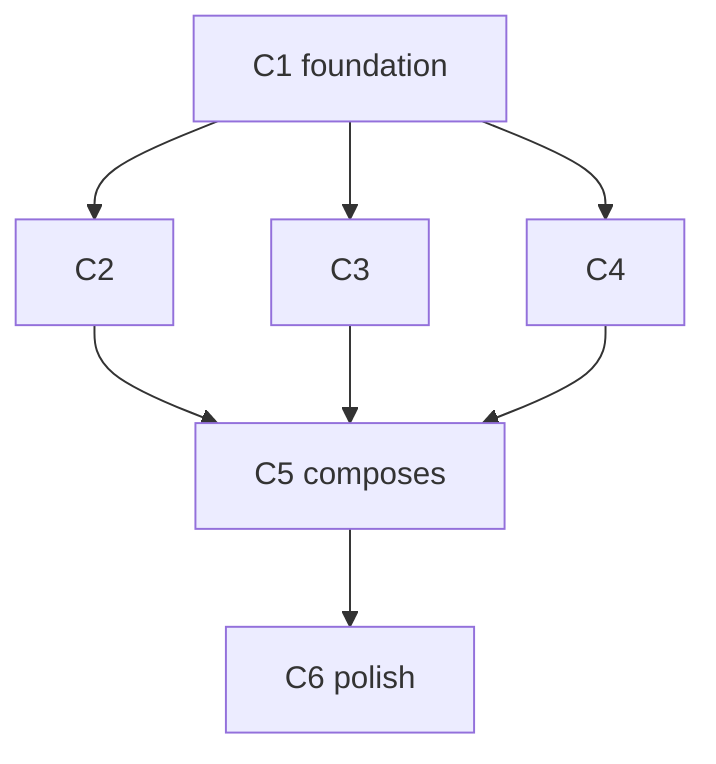

# /do — idea to shipped (v2, lifecycle-first)

**One command.** Type `/do "<an idea>"` and it walks the whole build lifecycle from wherever the idea is: it agrees a goal, then walks the artifact spine — promise → spec → todo → code → tests → proof → docs → release — **writing whatever is missing, skipping whatever exists.** Point it at a bare idea and it writes everything. Point it at code with no tests or docs and it backfills just those.

The human owns one thing: the goal sentence. `/do` owns everything below it.

> Narrative for humans: `text/000-do.md`. Per-stage template/skill/agent routing: `plans/templates.md`. This file is what `/do` executes.

---

## Two principles, underneath every phase

**Progressive disclosure.** Each phase loads only what it needs. Recon reads the last few turns + the most relevant files, never the whole history. A reference doc loads only when the work touches it. Skills are invoked, not inlined. Widen context only on a miss.

**Parallel agents at the right model · effort.** Reach for the cheapest tool that can answer, then run as many as the work allows in one message. Two dials:

```
bash    none              bit-equal checks, greps, schema validation, test exit codes
Haiku   low | medium      recon (low) · binary judgment / rubric (medium)
Sonnet  low | medium      mechanical edit (low) · genuine restructure / prose (medium)
Opus    high | xhigh      architecture (high) · substrate / schema reconciliation (xhigh)
```

Fan-out: independent agents in ONE message, capped by the plan's `parallel_budget`. Recon + verify fan wide (Haiku × N). Edits run one-per-file (Sonnet × N). Only the design decision (Opus) stays single — understanding is not delegable.

### Fast & lean — the token economy (automatic, never a flag)

Comprehensive and fast are not in tension: the **tier decides which gates run**, so a typo never pays for a feature's pipeline.

| Lever | Fires at | Saves by |
|---|---|---|
| Tier prune | Step 1 | PATCH walks `code` only; a gate never runs above the phases it guards |
| Tool ladder | every decision | bash → Haiku → Sonnet → Opus; stop at the first that decides |
| **Context reset** | cycle boundary | multi-cycle plans run each cycle in a fresh subprocess (`do-auto.sh`) — prior-cycle chatter (~15–25k/cycle) never accumulates; ~90–150k saved on a 6-cycle plan |
| **TRIVIAL fast-path** | BUILD | **0 agent spawns** — read ≤3 files inline, edit, bash verify, inline rubric, 1 learnings line |
| Recon cache | W1 | `do-recon-cache.sh check` — sha-keyed local store, <14d → **0 tokens**, skip all spawns (saves ~12k/recon) |
| W1 prefix cache | W1 miss | `w1-recon.ts` caches the ~5,400-token rules+agent prefix across Haiku calls (~4,900 saved/repeat) |
| W4 rubric cache | W4 | `w4-rubric.ts` caches the ~10,900-token rubric+spec block across 6 Haiku calls — 1 write + 5 reads (~46k saved/run) |
| Verify-only-changed | W3→W4 | dependency cone from `git diff`; full verify only at cycle close |
| Cross-cycle pre-warm | W4 close | one fire-and-forget Haiku pre-reads the next cycle's W1 targets |
| Recon cap | W1 | 400-word receipt; high-signal slices → `.w2-spec.json`, not the raw dump |
| Write-once state | per cycle | `.w2-spec`/`.w3-receipts` read by path, never re-derived after compaction |
| `cost:cycle` gradient | close | spend → pheromone; future SELECT routes toward cheap-and-effective paths |

A cycle that runs **zero LLM calls** is a *good* cycle. The comprehensiveness lives in the gates (DoD, rubric, doc-sync, ANALYZE, PROVE); the tier decides how many of them you pay for.

### Maximize parallelism — read the graph, reject imaginary blockers

Every multi-cycle plan carries a **Mermaid dependency graph**. `/do` reads it to fire the **maximum safe fan-out**: cycles with no edge between them run their waves *at the same time*, and their independent edits merge into ONE spawn message. The default is parallel — serial is the exception you must justify.



C2·C3·C4 are siblings → their W1/W2 run concurrently and their W3a edits merge into one message. C5 waits *only* because it reads files C2–C4 write.

**The only valid arrow.** `C_n → C_m` exists **only** when C_m reads a file C_n writes. Before drawing one, fill the blank or delete it:
> `C_n → C_m because C_m imports/reads {exact file path} that C_n creates.`

**Imaginary blockers — reject on sight** (full list in `plans/template-todo.md`): "same feature area" · "same folder" · "both touch the DB" (unless the *same* entity) · "logical/reading order" · "don't want too many agents at once" (`parallel_budget` already caps it) · "want to review C_n first" (policy, not a dependency) · "C_m depends on what we *learn* in C_n" (W2 learning ≠ a file dependency).

**Cross-cycle W3 batch (the big win).** A batch of 3 cycles with 8 + 6 + 4 independent edits = **18 `w3-edit` agents in ONE message**, not 3 sequential rounds. Only a named same-file collision serializes (→ W3b). Same rule for waves: W1 recon across all cycles in a batch is one Haiku spawn; W4 rubric is 5 Haiku × N cycles in one message — all capped by `parallel_budget`.

---

## Step 0 — Classify the input

| Input | Treat as | Entry |
|---|---|---|
| bare text (`"add usage billing"`) | **IDEA** (default) | walk the spine from the top |
| `<slug>` or a `plans/*.md` path | existing work | resolve its slug; ≥2 incomplete cycles → auto context-isolated loop, else walk from the first gap inline |
| `--wave N` | force one wave of a todo | BUILD engine |
| `--next-cycle` | *(internal)* run one batch then exit — the loop's recursion guard, set by `do-auto.sh`; never typed by a human | BUILD engine |
| `--auto` | *(legacy alias)* same as a bare multi-cycle `/do <slug>` — the loop is automatic now | BUILD engine, trust-aware |

Derive the **slug** from the idea: kebab-case, 2–4 words (`"add usage billing"` → `usage-billing`). Every artifact on the spine is keyed by this slug.

---

## Step 1 — Goal + tier (the one human gate)

1. **Restate as a goal**, one sentence: *"a {persona} can {outcome} they couldn't before."* Not "ship X" — "user can do Y" / "system enforces Z".
2. **Size the tier** (the token economy — automatic, never a human choice):
   ```bash
   .claude/scripts/do-tier.sh --intent "<idea>" $(git diff --name-only 2>/dev/null)
   ```
   Emits **tier** (PATCH | FIX | FEATURE | SCHEMA), the **pruned spine** (which stops run), the **inner classifier** (TRIVIAL | SIMPLE | COMPLEX for BUILD), and a **token ceiling**. Default down when unsure — an under-built FIX reopens cheaply at PROVE; an over-built PATCH is tokens you can't refund.
3. **Confirm once** — goal sentence + tier, in a single `AskUserQuestion`. Never interrogate. A pre-agreed backlog item auto-skips this gate.

The pruned spine by tier:

```
PATCH     code                                                                  (edit + W4 verify gate; 0 spawns)
FIX       survey → [investigate if legacy] → code → tests → prove
FEATURE   promise → survey → spec ▸clarify → todo ▸analyze → code → tests → proof → docs → release
SCHEMA    = FEATURE + substrate reconcile at max
```

`investigate` rides any tier when the work touches code we didn't just write — it's the "understand before you change" step, not a separate tier.

---

## Step 2 — Walk the artifact spine (presence-check · backfill · skip)

For each **enabled** stop (per the pruned spine), in order: check if its artifact exists. **Exists → skip. Missing → write it with the owner below.** A stop whose artifact is present is a phase already done; resume is free, no `--from` flag.

| Stop | Presence check | Missing → write with | Owner · model · effort |
|---|---|---|---|
| **promise** | `test -f text/<slug>.md` | `writer` skill + `text/template-frame.md` | sonnet · medium |
| **survey** | `do-survey.sh` (4 surfaces) | reuse verdict (expose / extend / build / drop) → the gap list, not the whole idea, feeds the spec | `w1-recon`, `Explore` · haiku · low |
| **investigate** *(fix / legacy only)* | code we didn't just write | forensic recon → root cause (not symptom) + blast radius + the `must_not_break` line | `w1-recon` · haiku→sonnet · medium |
| **spec** | `test -f plans/<slug>.md` | Opus + `plans/template-spec.md` (designs the gap list; pre-mortem + decisions live in the template), then `do-reconcile.sh` | opus · high |
| ↳ *CLARIFY* | spec has `## Clarifications` (FEATURE/SCHEMA) | ≤5 `AskUserQuestion`, written back into the spec | opus · high |
| **todo** | `test -f plans/<slug>-todo.md` | `/create todo` + `plans/template-todo.md` | sonnet · medium |
| ↳ *ANALYZE* | — | `do-analyze.sh plans/<slug>-todo.md` — CRITICAL exit 1 blocks BUILD | bash · none |
| **code** | survey verdict = `build` (≥70% match → `expose`/`extend` instead) | the BUILD engine (Step 3) | sonnet · low–medium |
| **tests** | test file in the repo folder | test-first, one assertion per deliverable | sonnet · low |
| **proof** | proof artifact captured | `do-prove.sh` (browser / curl / contract / sync) + `accessibility`; **promise-check** the shipped thing against `text/<slug>.md`. A multi-cycle plan already built on its own `do/<slug>` branch (worktree isolation — see Step 2); PROVE is the gate that branch must clear before a human merges it to trunk | sonnet · low |
| **docs** | feature doc + runbook exist | `tutorial` + `writer` — written against the *proven* behavior | sonnet · medium |
| **release** | changelog / README row | `/release` + adoption signal | sonnet · low |

**Proof before docs.** PROVE can fail and loop back to BUILD; docs written first would describe behavior that isn't final. Document what's proven, then ship.

The two `↳` rows are **gates, not artifacts**: CLARIFY edits the spec in place (FEATURE/SCHEMA only); ANALYZE is read-only and blocks only on CRITICAL. Each real stop closes by leaving **one durable artifact on disk** — that artifact is the skip-check next time.

**FRAME first (for FEATURE/SCHEMA).** The promise (`text/<slug>.md`) is what PROVE later checks the shipped feature against. If you can't state what the user gets, halt — the idea isn't ready to build. PATCH/FIX have no promise to keep, so they skip it.

**Before BUILD — EQUIP (skill-check).** Infer skills from the task tags → `ls .claude/skills/{name}/` → **ready** (proceed) / **stale** (warn, proceed) / **missing** (offer to add). Block only if a required skill is missing.

**Checkboxes — the file is the progress bar.** Every actionable item is a `[ ]`, and `/do` flips it to `[x]` the **moment** that action finishes — never batched at the end, never "I'll tick them next time." A user reading the todo mid-run sees exactly where the fan-out is.

| When | Ticked by |
|---|---|
| a W1 recon agent returns findings for a file | `/do` after the agent settles |
| a W2 verdict / diff spec / doc-plan resolves | `/do` inline |
| a W3 edit agent reports success on a file | `/do` after the agent settles |
| a W4 check passes (verify · demo · doc-sync · rubric · ratchet) | `/do` after the bash exits 0 |
| all of a wave's items are `[x]` | the wave header (derived) |
| all 4 waves `[x]` | the cycle header (derived) |
| all cycles in a batch `[x]` | the batch header (derived) |

Forward-only — a `[x]` is never un-ticked except by `/do --wave N --redo`. If an action has no checkbox, it isn't tracked, and untracked work is the loudest smell. Full granularity table in `plans/template-todo.md`.

After the spine: **LEARN / close** — write one `learnings.md` entry (slug, tier, composite, deliverable, proof line), emit `signal("cost:cycle", {tokens, model, composite})`, delete `.w3-receipts.json`, write `.do-trust.json {level, consecutive, composite}`, and append `.w4-improvements.json` (an open item recurring in 3+ consecutive cycles = systemic gap → emit `substrate:systemic-gap`; next W1 reads it as a mandatory recon target).

**Plan-outcome kill-switch (zero LLM).** Re-run the plan's `outcome:` command every cycle close. Exit 0 → the goal is met: remaining cycles enter justify-or-drop (default drop), `--auto` halts. Over the tier ceiling → `warn` + justify. Weak rubric 3× → halt, the *plan* is wrong, not the code. Goal-drift (outcome fails 3× with green rubrics) → force a re-plan.

**One command, complexity-sized.** `/do <anything>` is the only thing a human types — an idea, a slug, or a `plans/<slug>-todo.md` path. The tier sizes the work and the spine prunes itself: a typo is edited and verified inline (one cycle, no loop); a feature writes its promise, spec, todo, tests, and docs and then runs every cycle. The human never picks the mode, never types a flag, never runs a second command.

**Context isolation is automatic for multi-cycle plans.** When `/do` resolves to a todo with **≥2 incomplete cycles**, it does not run them inline — it hands the loop to the internal engine so every cycle gets a **fresh context**:

```bash
# /do runs this itself — the user never types it
bun .claude/scripts/do-auto.sh <slug>
```

`do-auto.sh` loops: each iteration spawns a clean `/do <slug> --next-cycle` that runs exactly one batch (W1→W4), ticks its boxes, writes state, and exits. Because each cycle starts from near-zero context, prior-cycle recon/edit/verify chatter never accumulates. The main session just kicks off the loop and reports the close.

**Worktree isolation comes free with the loop.** The loop's existence *is* the trigger — `do-auto.sh` only runs for multi-cycle plans, which is exactly the FEATURE/SCHEMA work that must not land half-built on trunk. So before the first cycle it cuts a worktree `.do-worktrees/<slug>` on branch `do/<slug>` (reusing it on resume), syncs the plan's spine artifacts into it, and runs **every cycle inside it** — each cycle's edits and box-ticks commit to that branch. Trunk never moves while the loop runs; a halt (trust `cautious` / stall / max-cycles) leaves a clean, inspectable WIP branch, and re-running `/do <slug>` resumes in the same worktree. On plan-complete the loop **reports** the merge (`git merge --no-ff do/<slug>`) rather than running it — landing to trunk is a human decision (commit only when asked), and PROVE is the gate that branch cleared to earn the merge. PATCH/FIX never reach the loop, so they run inline with no worktree.

A **single** incomplete cycle (or a PATCH/FIX) runs inline — there's nothing to isolate from, and spawning a subprocess would cost more than it saves.

**`--next-cycle` is internal.** It means "run one batch, tick boxes, exit — do **not** loop." Only `do-auto.sh` passes it; it is the recursion guard that keeps a fresh `/do` from re-entering the loop. A human never types it.

State that survives the reset (all on disk — the loop is stateless in memory):
- `plans/<slug>-todo.md` — checked boxes are the progress bar; the next `/do --next-cycle` reads them and skips completed cycles automatically
- `.do-trust.json` — trust level and consecutive score history (drives auto-continue vs halt)
- `.w4-improvements.json` — open items that become mandatory W1 targets next cycle
- `.w2-spec.json` / `.w3-receipts.json` — write-once state for soft-resume within a cycle

What is intentionally discarded each reset: prior-cycle conversation and agent output prose. The checkboxes captured everything that matters; the prose was scaffolding.

**Trust gates the loop (reads `.do-trust.json`).** `trusted` (composite ≥ 0.85 × 3+) → next cycle fires immediately. `standard` (0.65–0.85) → continue. `cautious` (< 0.65 × 2) → `do-auto.sh` halts and tells the human to re-run `/do <slug>` once the issue is fixed. Absent file → `standard`.

**Token math for a 6-cycle COMPLEX plan:**

| Mode | Context per cycle | Cumulative context |
|---|---|---|
| inline (everything in one session) | +15–25k per cycle | ~90–150k by cycle 6 |
| context-isolated (the default) | ~1–2k (fresh invocation) | ~1–2k every cycle |
| **Saving** | — | **~90–150k tokens** |

This compounds with the W1 cache and W4 rubric cache: a cycle 6 run with context isolation + both SDK caches costs roughly **1/10th** of the same cycle run inline in a long session.

---

## Step 3 — The BUILD engine (W0 → W4)

Runs only when the spine reaches `code`. Folder-aware: there is **no root `package.json`** — resolve the target repo folder from the touched files.

**W0 — Baseline.**
```bash
RESOLVED=$(printf '%s\n' $CYCLE_TARGET_PATHS | .claude/scripts/do-folder.sh)
echo "$RESOLVED" | jq -se 'all(.doc_only)' >/dev/null \
  && echo "doc-only — skip bun verify" \
  || echo "$RESOLVED" | jq -r 'select(.verify).folder' | while read -r f; do ( cd "$f" && bun run verify ) || exit 1; done
TSC=$(bunx tsc --noEmit 2>&1 | grep -c "error TS" || echo 0)   # write .w0-baseline.json {tscErrors, loc, tests}
```

**W1 — Recon.** Read `.w4-improvements.json` open items first — they're mandatory recon targets.

**Cache check (zero tokens):**
```bash
.claude/scripts/do-recon-cache.sh check $CYCLE_TARGET_PATHS 2>/dev/null && RECON_CACHE_HIT=true || true
```
Hit → load findings from stdout, skip all agent spawns. Also run `do-recon-cache.sh prune` once per session to evict entries older than 14 days.

Miss → ≤5 files → read inline. ≥6 → run the SDK script (prompt-cached rules + agent-prompt block, writes result to `.w1-cache/`):
```bash
bun .claude/scripts/w1-recon.ts --targets "$FILES" --mode RECON
```
Script exits 2 if `ANTHROPIC_API_KEY` is absent → fall back to spawning `w1-recon` agent (Haiku · low) for ALL files in ONE message. Either path: skip `relevance_score < 0.4`; all-filtered → halt and broaden (zero-findings guard). Receipt capped at 400 words; persist high-signal slices into `.w2-spec.json`. *(The `w1-recon` agent carries the two-track existing-code + primitive-inventory contract.)*

**W2 — Decide (never delegated — Opus · high).** Write the goal/deliverable/UX gate (3 sentences) first. Then: reconcile names against `dictionary.md`; run the **compress check** before any new primitive (name 3 existing primitives that compose it → `compose` removes it from the diff, `new` needs a one-line justification + same-diff doc edit). The pre-mortem + trade-offs were already captured at the `spec` stop (`template-spec.md`) — carry the failure modes forward as test cases, don't redo them. Classify each W1 finding Act / Keep / Defer. Output diff specs + write `.w2-spec.json` (+ `.w2-doc-plan.json` if a doc trigger fires). *(The `w2-decide` agent carries the compose-target table — which canonical doc to check per primitive type — plus context-triggers for surgical doc injection.)*

**W3 — Edit (Sonnet × N parallel).** Soft-resume first: if `.w3-receipts.json` has fewer receipts than `.w2-spec.json` diff specs, a prior W3 was interrupted — skip W0–W2 and resume from the first unapplied spec. Pre-validate every anchor with `grep -qF` in parallel. No file overlap → spawn all `w3-edit` agents in ONE message (W3a). Overlap → W3a (independent) then W3b (same-file, sequential). Append a receipt per edit; anchor miss twice → halt, ask user. Build every UI state (empty / loading / error / edge), not just the happy path.

**W4 — Verify (bash first, zero tokens).**
```bash
( cd $folder && bun run verify )            # biome + tsc + vitest
$(cycle.demo.command)                       # the goal gate — exit 0 = pass
# doc-sync gate (reads .w2-doc-plan.json): stale-name=0, links ok, contract mtime current
DELTA_TSC=$((TSC_NOW - TSC_BASELINE))       # hard gate: ≤ 0, no new type errors ever
```
Rubric (inline for TRIVIAL/SIMPLE; for COMPLEX — run the SDK script first (6 Haiku in parallel, rubric + spec block cached across all calls):
```bash
bun .claude/scripts/w4-rubric.ts --files "$(git diff HEAD --name-only | tr '\n' ',')"
```
Script exits 2 if key absent → fall back to spawning 6 Haiku agents · medium. Either path runs alongside `pr-review-toolkit` (code-reviewer, silent-failure-hunter, type-design-analyzer) + `find-bugs` + `accessibility` on UI):
```
composite = 0.35·goal-fit + 0.20·security + 0.20·stability + 0.15·simplicity + 0.10·speed
gate: composite ≥ 0.65  AND  goal-fit ≥ 0.50 (hard)  AND  no adversarial > 0.5  AND  delta_tsc ≤ 0
```
Verify scope is the **dependency cone** of `git diff` (full verify only at cycle close — speed). Then compress sweep (ts-prune + noUnusedLocals → delete orphans/dead code), write `.w4-improvements.json`, and fire one pre-warm Haiku at the next cycle's W1 targets. Verify or demo failure on touched files → W3.5 (one Sonnet per dirty file), max 3 W4 loops then halt.

**Testing policy** (full detail in `plans/template-todo.md`): Vitest-first; Playwright only when the cycle declares `requires_playwright: true`; one goal-based `expect()` per deliverable (assert the destination, not the path); ≤1 test file per cycle; a cycle needing >5 tasks splits unless `mode: lean`; N-variant split-test → winner `mark()`, losers `warn(0.5)`.

---

## Definition of done (tier-scaled — `/do` ticks these automatically)

1. The agreed goal is met (goal-fit gate). 2. Every shippable deliverable has a test asserting it. 3. No regression — tests green, `delta_tsc ≤ 0`, `must_not_break` preserved. 4. Proven live, matches the promise. 5. Docs in sync. 6. Full coverage, no orphan tasks. 7. Rubric clears the bar. 8. Closed loop — recorded result + one learnings entry.

PATCH clears {1,2,3,8}. FEATURE clears all eight.

---

## Non-negotiable rules

- **Never skip W2.** Understanding is not delegable.
- **Default to parallel.** Spawn W1, W3, and W4-rubric agents in a **single message** — across cycles in a batch, not just within one. An arrow exists only when you can name the file one cycle writes and the next reads; reject every imaginary blocker.
- **Tick the moment it lands.** Flip `[ ]`→`[x]` as each agent/check settles — never batch at the end. The file is the progress bar.
- **FRAME before code (FEATURE/SCHEMA)** — no *feature* ships without a stated promise. PATCH/FIX skip FRAME by design.
- **Closed loop** — every cycle ends in `mark`/`warn`, never a silent return.
- **Cheapest tool that decides wins** — a phase that needs no LLM call is the best kind.
- **W4 max 3 loops**, then halt and report.
- **One command.** A human types `/do <anything>` and nothing else. Complexity sizing, spine pruning, and (for multi-cycle plans) the context-isolated loop are all automatic — never a flag, never a second command.
- **Every cycle gets a fresh context.** A multi-cycle `/do` runs each cycle in a clean subprocess via the internal loop. Prior-cycle conversation is noise; the todo checkboxes are the only state that carries forward.

---

## Available to /do — the toolbox

**Scripts** (`.claude/scripts/`): `do-auto.sh` (*internal* — the context-isolated, worktree-isolated loop `/do` drives for multi-cycle plans; builds on branch `do/<slug>`, merges to trunk only on a human's say-so) · `do-tier.sh` (tier + pruned spine + classifier + ceiling) · `do-folder.sh` (folder-aware verify/build) · `do-survey.sh` (reuse verdict) · `do-reconcile.sh` (substrate dim/verb/dead-name gate) · `do-analyze.sh` (deliverable↔cycle coverage gate) · `do-prove.sh` (surface-detect proof) · `do-smoke.sh` (deterministic outcome) · `w1-recon.ts` (prompt-cached recon) · `w4-rubric.ts` (cached parallel rubric).

**Templates**: `text/template-frame.md` (promise) · `plans/template-spec.md` (design + pre-mortem + decisions) · `plans/template-todo.md` (plan + parallel budget + testing policy) · `plans/agent-template.md` (agent definition).

**Agents**: `w1-recon` · `w2-decide` · `w3-edit` · `w4-verify` · `Explore` · `Plan` · `pr-review-toolkit:*` (code-reviewer, silent-failure-hunter, type-design-analyzer, pr-test-analyzer, code-simplifier) · `find-bugs`.

**Skills** (per-stage routing in `plans/templates.md`): FRAME → `writer`, `copywriting` · SPEC → `typedb`, `signal` · BUILD → `astro`, `react19`, `shadcn`, `ai-ui`, `ai-sdk`, `reactflow`, `hono`, `cloudflare`, `wrangler`, `durable-objects` · TEST → `vitest`, `playwright-best-practices`, `webapp-testing` · VERIFY → `accessibility`, `find-bugs`, `perf`, `typecheck` · TEACH → `tutorial`, `writer`.

**State files** (write-once, read-by-path — compaction-proof): `.w0-baseline.json` · `.w2-spec.json` · `.w2-doc-plan.json` · `.w3-receipts.json` · `.do-trust.json` · `.w4-improvements.json`.

---

*`/do` is `select()` made human-readable: idea in, shipped-and-proven feature out. The path remembers every execution.*
