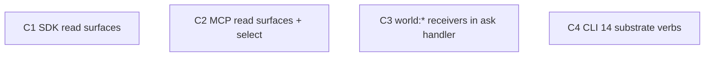

C1, C2, C3, C4 are fully independent — each touches a different file. All run in batch 1.

---

## C1 — SDK read surfaces

**Goal:** `client.groups()`, `client.actors()`, `client.things()`, `client.paths()`, `client.events()`, `client.learning()` return async iterables with a `.get(id)` method. Rename `subscribe()` → `sub()` with a deprecated alias.

**File:** `packages/sdk/src/client.ts`

**What exists:** `signal`, `ask`, `mark`, `warn`, `fade`, `follow`, `select`, `highways()`, `recall()`, `subscribe()`. HTTP endpoints exist at `/api/export/groups`, `/api/export/actors` (via `/api/actors/index.ts`), `/api/things/index.ts`, `/api/export/paths`, `/api/events`, `/api/learning/index.ts`.

**What to add:**

Each read method follows the same pattern:
```ts
async *groups(filters?: GroupFilters): AsyncIterable<GroupItem> {
  const q = new URLSearchParams()
  if (filters?.type)  q.set('type',  filters.type)
  if (filters?.limit) q.set('limit', String(filters.limit))
  if (filters?.after) q.set('after', filters.after)
  const data = await this.r<ListGroupsResponse>(`/api/export/groups?${q}`)
  yield* data.groups
}
// plus:
groups.get = (gid: string) => this.r<GroupItem>(`/api/actors/${gid}`)
```

Add per dimension:
- `groups(filters?)` → `/api/export/groups`
- `actors(filters?)` → `/api/export/actors` (or `/api/actors`)
- `things(filters?)` → `/api/things`
- `paths(filters?)` → `/api/export/paths`
- `events(filters?)` → `/api/events`
- `learning(filters?)` → `/api/learning` (replaces `recall()` which stays as deprecated alias)

Rename `subscribe()` → `sub()`. Keep `subscribe` as `/** @deprecated */ subscribe = this.sub`.

Add filter types to `types.ts`:
```ts
export interface GroupFilters  { type?: string; after?: string; limit?: number }
export interface ActorFilters  { type?: string; tag?: string; after?: string; limit?: number }
export interface ThingFilters  { type?: string; tag?: string; after?: string; limit?: number }
export interface PathFilters   { source?: string; target?: string; minStrength?: number; after?: string; limit?: number }
export interface EventFilters  { actor?: string; tag?: string; from?: string; to?: string; limit?: number }
export interface LearningFilters { status?: string; actor?: string; tag?: string; limit?: number }
```

**W4 verify:**
```bash
cd packages/sdk && bun run build && grep -c "async \*groups\|async \*actors\|async \*things\|async \*paths\|async \*events\|async \*learning" src/client.ts | grep -E "^[6-9]|^[1-9][0-9]"
```

### W1 — Recon
- [ ] Read `packages/sdk/src/client.ts` lines 430-649 (select, subscribe, end of class)
- [ ] Read `packages/sdk/src/types.ts` — confirm GroupItem, GroupResponse shapes

### W2 — Decide
- [ ] Confirm HTTP endpoint paths for each dimension (groups→/api/export/groups, actors→/api/actors, things→/api/things, paths→/api/export/paths, events→/api/events, learning→/api/learning)
- [ ] Confirm filter types don't duplicate existing types
- [ ] Note: async generator pattern (yield*) vs returning array — use generator so iterables compose

### W3 — Edit
- [ ] Add GroupFilters/ActorFilters/ThingFilters/PathFilters/EventFilters/LearningFilters to `packages/sdk/src/types.ts`
- [ ] Add groups()/actors()/things()/paths()/events()/learning() to `packages/sdk/src/client.ts`
- [ ] Rename subscribe→sub, add deprecated alias in `packages/sdk/src/client.ts`
- [ ] Export new filter types from `packages/sdk/src/index.ts`

### W4 — Verify
- [ ] `cd packages/sdk && bun run build` exits 0
- [ ] New methods present: `grep -c "async \*" src/client.ts` ≥ 6
- [ ] `sub` present, `subscribe` deprecated alias present
- [ ] Rubric ≥ 0.65

**demo:** `cd packages/sdk && node -e "const {SubstrateClient}=require('./dist/index.js'); const c=new SubstrateClient({apiKey:'x',baseUrl:'http://localhost:4321'}); console.log(typeof c.groups, typeof c.actors, typeof c.things, typeof c.paths, typeof c.events, typeof c.learning, typeof c.sub)"` prints 7x `function`

---

## C2 — MCP read surfaces + select

**Goal:** `substrateTools()` exports 14 tools: add `select`, `groups`, `actors`, `things`, `paths`, `events`, `learning`.

**File:** `packages/mcp/src/tools/substrate.ts`

**What exists:** signal, ask, mark, warn, fade, follow, recall, reveal, forget, frontier, know, highways (12 tools). Missing: `select` and 6 dimension reads.

**What to add:**

```ts
// select — matches the pattern of follow
{
  name: "select",
  description: "Probabilistic path selection (pheromone-weighted, exploration bias).",
  inputSchema: { type: "object", properties: { type: { type: "string" }, exploration: { type: "number" } } },
  handler: async (args, env) => {
    const q = new URLSearchParams()
    if (args.type) q.set("type", String(args.type))
    if (args.exploration != null) q.set("exploration", String(args.exploration))
    return apiCall(env.baseUrl, env.apiKey, `/api/select${q.toString() ? `?${q}` : ""}`)
  }
}

// dimension reads — each follows recall's pattern
{
  name: "groups",
  description: "List or get groups (dimension 1 — containers: worlds, teams, orgs).",
  inputSchema: { type: "object", properties: { gid: { type: "string" }, type: { type: "string" }, limit: { type: "number" } } },
  handler: async (args, env) => {
    if (args.gid) return apiCall(env.baseUrl, env.apiKey, `/api/export/groups/${args.gid}`)
    const q = new URLSearchParams()
    if (args.type)  q.set("type",  String(args.type))
    if (args.limit) q.set("limit", String(args.limit))
    return apiCall(env.baseUrl, env.apiKey, `/api/export/groups${q.toString() ? `?${q}` : ""}`)
  }
}
// actors → /api/actors  (or /api/export/actors)
// things → /api/things
// paths  → /api/export/paths
// events → /api/events
// learning already exists as `recall` — add `learning` as canonical name, keep recall
```

**W4 verify:**
```bash
cd packages/mcp && bun run build && node -e "const {substrateTools}=require('./dist/tools/substrate.js'); console.log(substrateTools().map(t=>t.name).sort().join(','))" 2>/dev/null | grep -o "select\|groups\|actors\|things\|paths\|events\|learning" | wc -l | grep -E "^7$"
```

### W1 — Recon
- [ ] Read full `packages/mcp/src/tools/substrate.ts` (187 lines — already read)
- [ ] Confirm `/api/select` query param name (`type` vs `tag`)

### W2 — Decide
- [ ] 7 new tools: select + 6 dimension reads
- [ ] `learning` is a new canonical name tool; `recall` stays (deprecated but not removed — LLMs know it)
- [ ] Confirm select uses `type` query param to match HTTP route

### W3 — Edit
- [ ] Add select tool to `packages/mcp/src/tools/substrate.ts`
- [ ] Add groups, actors, things, paths, events, learning tools to `packages/mcp/src/tools/substrate.ts`

### W4 — Verify
- [ ] `cd packages/mcp && bun run build` exits 0
- [ ] Tool count: `substrateTools().length` === 19 (12 existing + 7 new)
- [ ] Rubric ≥ 0.65

**demo:** `cd packages/mcp && node -e "const {substrateTools}=require('./dist/tools/substrate.js'); const names=substrateTools().map(t=>t.name); console.log(['select','groups','actors','things','paths','events','learning'].every(n=>names.includes(n)))"` prints `true`

---

## C3 — world:* receiver dispatch in ask handler

**Goal:** `POST /api/ask/world:create-workspace` etc. return `{ wsid }` / `{ aid }` / `{ gid }` / `{ tid }` / `{ key, keyId }` synchronously without nanoclaw.

**File:** `one.ie/web/src/pages/api/ask/[...receiver].ts`

**Strategy:** The ask handler currently forwards all signals to nanoclaw (deprecated). For `world:*` receivers, intercept before the nanoclaw forward and handle in-process. Nanoclaw path remains for non-world receivers.

**Dispatch table to implement:**

| receiver | handler | returns |
|---|---|---|
| `world:create-workspace` | createWorkspace(data, env) | `{ wsid, slug }` |
| `world:create-group`     | createGroup(data, env)     | `{ gid }` |
| `world:update-group`     | updateGroup(data, env)     | `{ ok: true }` |
| `world:remove-group`     | removeGroup(data, env)     | `{ ok: true }` |
| `world:create-actor`     | createActor(data, env)     | `{ aid }` |
| `world:update-actor`     | updateActor(data, env)     | `{ ok: true }` |
| `world:remove-actor`     | removeActor(data, env)     | `{ ok: true }` |
| `world:create-key`       | createKey(data, env)       | `{ key, keyId }` |
| `world:revoke-key`       | revokeKey(data, env)       | `{ ok: true }` |
| `world:create-thing`     | createThing(data, env)     | `{ tid }` |
| `world:update-thing`     | updateThing(data, env)     | `{ ok: true }` |
| `world:remove-thing`     | removeThing(data, env)     | `{ ok: true }` |
| `world:create-hypothesis`| createHypothesis(data,env) | `{ hid }` |
| `world:promote-hypothesis`| promoteHypothesis(data,env)| `{ ok: true }` |
| `world:reject-hypothesis` | rejectHypothesis(data,env) | `{ ok: true }` |
| `world:freeze-path`      | freezePath(data, env)      | `{ ok: true }` |
| `world:unfreeze-path`    | unfreezePath(data, env)    | `{ ok: true }` |

The handlers call existing `lib/substrate` utilities (writeSignal, TypeDB, D1). IDs use `generateTraceId()` (already imported). Keys use `crypto.randomUUID()` prefixed `osk_`.

**New file:** `one.ie/web/src/lib/world-receivers.ts` — handler functions, imported by ask route.

**Pattern for each handler:**
```ts
// world-receivers.ts
export async function createActor(
  data: unknown,
  env: { DB?: D1Database }
): Promise<{ aid: string }> {
  const { name, type, group, tags } = data as { name: string; type: string; group?: string; tags?: string[] }
  const aid = generateTraceId()
  await env.DB?.prepare(
    'INSERT INTO actors (aid, name, type, group_id, tags, created_at) VALUES (?, ?, ?, ?, ?, ?)'
  ).bind(aid, name, type, group ?? null, JSON.stringify(tags ?? []), Date.now()).run()
  return { aid }
}
```

**Ask route change (minimal):**
```ts
// Before nanoclaw forward — intercept world:* receivers
if (receiver.startsWith('world:')) {
  const result = await dispatchWorldReceiver(receiver, body.data, env)
  if (result !== null) {
    return Response.json({ outcome: 'result', result, signalId, receiver }, { status: 200 })
  }
}
// ... existing nanoclaw forward
```

**W4 verify:**
```bash
curl -s -X POST http://localhost:4321/api/ask/world:create-actor \
  -H "Content-Type: application/json" \
  -d '{"data":{"name":"test-actor","type":"agent"}}' | jq -e '.outcome == "result" and .result.aid != null'
```

### W1 — Recon
- [ ] Read full `one.ie/web/src/pages/api/ask/[...receiver].ts`
- [ ] Read `one.ie/web/src/lib/substrate.ts` — confirm writeSignal, generateTraceId patterns
- [ ] Check if D1 schema has actors/groups/things tables (check migration files)

### W2 — Decide
- [ ] Confirm D1 tables available for actors/groups/things (if not: write to KV + TypeDB signal pattern instead)
- [ ] ID format: use `generateTraceId()` (ulid) for all entity IDs
- [ ] Key format: `osk_` prefix + 32 hex chars via `crypto.getRandomValues`
- [ ] Dispatch: single `dispatchWorldReceiver(receiver, data, env)` function, returns `unknown | null` (null = not a world receiver)

### W3 — Edit
- [ ] Create `one.ie/web/src/lib/world-receivers.ts` with all 17 handler functions
- [ ] Edit `one.ie/web/src/pages/api/ask/[...receiver].ts` to add world:* intercept before nanoclaw forward
- [ ] Signal route `[...receiver].ts` — add world:* signal handlers (update-*, remove-*, freeze-*, promote-*, reject-*) that fire-and-forget

### W4 — Verify
- [ ] `cd one.ie/web && bun run build` exits 0 (tsc clean)
- [ ] Grep confirms dispatch: `grep -c "world:create" src/pages/api/ask/\[...receiver\].ts` > 0
- [ ] 17 handlers in world-receivers.ts: `grep -c "^export async function" src/lib/world-receivers.ts | grep -E "^1[7-9]|^[2-9][0-9]"`
- [ ] Rubric ≥ 0.65

**demo:** `grep -c "^export async function" one.ie/web/src/lib/world-receivers.ts` prints 17 or more

---

## C4 — CLI 14 substrate verbs

**Goal:** `oneie signal <receiver>`, `oneie ask <receiver>`, `oneie mark <edge>`, `oneie warn <edge>`, `oneie fade`, `oneie sub <tag> <actor>`, `oneie follow <type>`, `oneie select <type>`, `oneie groups`, `oneie actors`, `oneie things`, `oneie paths`, `oneie events`, `oneie learning` — all 14 substrate verbs available in the CLI.

**Files:**
- New: `packages/cli/src/substrate.ts` — 14 commands, reads `ONEIE_API_KEY` + `ONEIE_BASE_URL` env vars
- Edit: `packages/cli/src/index.ts` — add `substrateCmd()`

**Pattern — each verb is a Commander command:**
```ts
// substrate.ts
import { Command } from 'commander'
import { SubstrateClient } from '@oneie/sdk'

function client() {
  return new SubstrateClient({
    apiKey: process.env.ONEIE_API_KEY ?? '',
    baseUrl: process.env.ONEIE_BASE_URL ?? 'https://one.ie',
  })
}

function out(data: unknown) {
  process.stdout.write(JSON.stringify(data, null, 2) + '\n')
}

export function substrateCmd() {
  const cmd = new Command('substrate').description('Raw substrate operations')

  cmd.command('signal <receiver>')
    .option('--data <json>', 'Signal data as JSON string')
    .action(async (receiver, opts) => {
      const data = opts.data ? JSON.parse(opts.data) : undefined
      out(await client().signal(receiver, data))
    })

  cmd.command('ask <receiver>')
    .option('--data <json>')
    .option('--timeout <ms>', 'Timeout in ms', '10000')
    .action(async (receiver, opts) => {
      const data = opts.data ? JSON.parse(opts.data) : undefined
      out(await client().ask(receiver, data, Number(opts.timeout)))
    })

  cmd.command('mark <edge>')
    .option('--strength <n>', 'Strength value', '1')
    .action(async (edge, opts) => out(await client().mark(edge, Number(opts.strength))))

  cmd.command('warn <edge>')
    .option('--strength <n>', 'Strength value', '1')
    .action(async (edge, opts) => out(await client().warn(edge, Number(opts.strength))))

  cmd.command('fade')
    .option('--rate <n>', 'Decay rate (0-1)')
    .action(async (opts) => out(await client().fade(opts.rate ? Number(opts.rate) : undefined)))

  cmd.command('sub <tag> <actor>')
    .option('--scope <scope>', 'private|public', 'private')
    .action(async (tag, actor, opts) => out(await client().sub({ receiver: actor, tags: [tag], scope: opts.scope })))

  cmd.command('follow <type>')
    .action(async (type) => out(await client().follow(type)))

  cmd.command('select <type>')
    .option('--exploration <n>', 'Exploration factor 0-1')
    .action(async (type, opts) => out(await client().select(type)))

  // Read surfaces — iterate and collect
  cmd.command('groups')
    .option('--type <t>').option('--limit <n>').option('--after <cursor>')
    .action(async (opts) => {
      const items = []; for await (const g of client().groups(opts)) items.push(g); out(items)
    })

  // actors, things, paths, events, learning follow same pattern
  // ...

  return cmd
}
```

Note: `sub` depends on C1 (`sub()` rename). Since C1 and C4 run in parallel, C4 should call `client().subscribe()` if `sub()` doesn't exist yet — or simply reference `sub` knowing C1 lands first in the same deploy. W4 verifies both.

**W4 verify:**
```bash
cd packages/cli && bun run build && node dist/index.js substrate --help 2>&1 | grep -E "signal|ask|mark|warn|fade|sub|follow|select|groups|actors|things|paths|events|learning" | wc -l | grep -E "^1[4-9]|^[2-9][0-9]"
```

### W1 — Recon
- [ ] Read `packages/cli/src/index.ts` (30 lines — already read)
- [ ] Read `packages/cli/src/agent.ts` — confirm Commander command pattern used in project

### W2 — Decide
- [ ] Group verbs under `oneie substrate <verb>` subcommand (keeps existing `agent`, `skill` etc. at top level)
- [ ] Or expose at top level: `oneie signal`, `oneie ask` (flatter, matches plan)
- [ ] Decision: top-level (flatter). Add each command directly to program, not under `substrate` parent.
- [ ] stdin pipe: `oneie signal world:review < draft.md` — `--data -` reads stdin as JSON

### W3 — Edit
- [ ] Create `packages/cli/src/substrate.ts` with all 14 commands
- [ ] Edit `packages/cli/src/index.ts` to import and add substrate commands
- [ ] Confirm `@oneie/sdk` is in `packages/cli/package.json` deps (likely is via workspace:*)

### W4 — Verify
- [ ] `cd packages/cli && bun run build` exits 0
- [ ] `node dist/index.js --help` lists signal, ask, mark, warn, fade, sub, follow, select, groups, actors, things, paths, events, learning (14 commands)
- [ ] `node dist/index.js signal --help` shows `<receiver>` argument
- [ ] Rubric ≥ 0.65

**demo:** `cd packages/cli && node dist/index.js --help 2>&1 | grep -cE "signal|ask|mark|warn|fade|sub|follow|select|groups|actors|things|paths|events|learning"` prints 14
