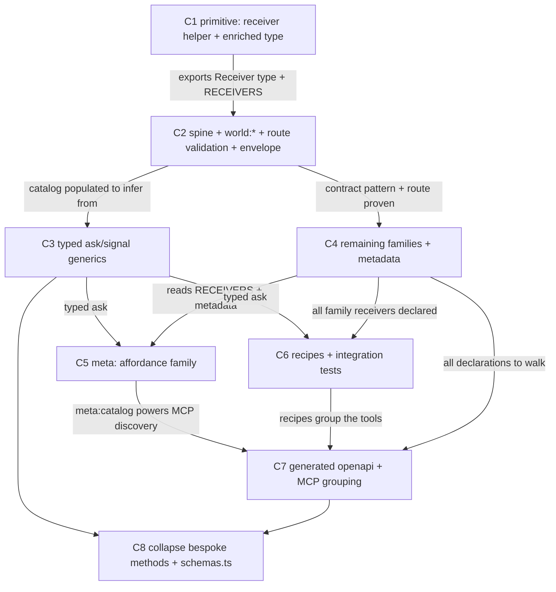

# Agent-First Registry — one declaration, every affordance

Design: **`plans/agent-first-spec.md`** (read first — this todo executes it). Why: **`plans/0000-agent-first.md`**. Follow-on: **`plans/agent-first-a2a.md`**.

## Goal, outcome, deliverables, UX

### Goal

An agent calls any receiver through **typed** `signal`/`ask` — payload checked at compile time, validated at the route edge — from **one registry** that also feeds the OpenAPI spec and the MCP catalog.

### Outcome (the kill-switch)

```bash
bun --cwd packages/sdk run build && bun --cwd packages/sdk vitest run tests/receivers.test.ts
```

**What passing proves:** the catalog builds under strict TS; every `RECIPES` entry is a valid `RECEIVERS` key; a sample receiver's request schema rejects a bad payload and accepts a good one; `ask<R>` infers payload + outcome from the catalog.

**Contract:** runs after every batch's W4. Plan does not close until it exits 0.

### Deliverables

| Kind | Path / name | What the agent/operator can do | Cycle |
|---|---|---|---|
| api | `@oneie/sdk/receivers` | `receiver()` + **enriched** `Receiver<Req,Res>` (cost/reversible/settles/simulatable/idempotent/version/examples/deprecated) + `RECEIVERS` | C1 |
| api | `world-receivers.ts` + route | spine + `world:*` declare schemas; route validates + **envelope** (idempotencyKey · simulate · error-as-affordance) | C2 |
| api | `SubstrateClient.ask<R>/signal<R>` | receiver name + payload + outcome typed from catalog | C3 |
| api | `RECEIVERS` (remaining families) | every receiver declared + metadata populated, sequenced by goal recipe | C4 |
| api | `meta:` family | `meta:catalog` · `meta:schema` · `meta:recall` · `meta:reputation` + cooperative-backpressure outcome fields | C5 |
| api | `RECIPES` | typed ordered sequences (spine·build·trade·transact) + per-recipe integration test | C6 |
| doc | `openapi.yaml` + MCP tools | spec generated from `RECEIVERS` (`oneOf` + `x-` metadata); MCP grouped by recipe, `meta:catalog` powers discovery | C7 |
| api | `client.ts` / `schemas.ts` | bespoke methods → sugar; response schemas folded into declarations | C8 |

### User experience: before → after

| | Today | After this plan |
|---|---|---|
| **Who** | an agent (Claude Code / MCP client / SDK consumer) | same |
| **Goal** | call a receiver correctly | call a receiver correctly |
| **Steps** | read `plans/mcp-tools.md` → guess payload → `ask("x:y", {…})` → discover error at runtime | type `one.ask("x:y", {` → autocomplete → compile-checked payload → typed outcome |
| **Friction** | no types on the receiver namespace; 50 bespoke methods drift; bad payloads fail downstream | validation at the edge; one registry; pinned SDK still reaches new receivers |
| **Time** | minutes (read docs) + runtime debugging | seconds (autocomplete) |
| **Feedback** | `String(undefined)` deep in a handler | 400 at the route / red squiggle in the editor |

**The improvement (ux_delta):** the receiver namespace — declared to be the API but the only untyped part of it — becomes typed, validated, and self-describing from a single source.

```ts
// after — checked end to end, outcome typed:
const r = await one.ask("world:create-actor", { name: "scout", kind: "agent" })
//                        ^ autocompletes      ^ payload type-checked      r: Outcome<{ aid: string }>
```

---

## Parallel execution plan

### Cycle-level DAG



C3 and C4 are siblings (C3 edits `client.ts` generics; C4 adds receivers — file-disjoint). C5 and C6 are siblings (the `meta:` family vs recipes — both read the populated catalog, neither reads the other).

### Batches

| Batch | Cycles | Runs in parallel |
|---|---|---|
| 0 | shared W0 + W1 | baseline + read of `shared_recon:` files |
| 1 | C1 | full W1→W4 |
| 2 | C2 | full W1→W4 |
| 3 | C3, C4 | two cycles W1→W4 in lockstep; W3a's merge into one Sonnet message |
| 4 | C5, C6 | `meta:` family + recipes in lockstep |
| 5 | C7 | full W1→W4 |
| 6 | C8 | full W1→W4 |

---

## Status

```
Batch 0 (shared)
  - [x] W0 baseline (plan-level)
  - [x] W1 shared recon (plan-level)

Batch 1
  - [x] C1 — primitive: receiver() + Receiver<Req,Res> + empty RECEIVERS   state: DONE (composite≈0.95)
    - [x] W1 · [x] W2 · [x] W3 · [x] W4

Batch 2
  - [x] C2 — spine + world:* contracts + route validation                 state: DONE (composite≈0.885)
    - [x] W1 · [x] W2 · [x] W3 · [x] W4
    NOTE: corrected dispatch site (world:* validate in ask route, not signal); web+channels now file:link @oneie/sdk (spec premise was false). Live-curl deferred (needs running worker; covered by 908-test suite + unit demo).

Batch 3  (fires the instant C2 closes)
  - [x] C3 — typed ask<R>/signal<R> generics                              state: DONE (composite≈0.96)
    - [x] W1 · [x] W2 · [x] W3 · [x] W4
    NOTE: used ONE conditional-generic sig (not two overloads) so wrong payload to a known receiver is a compile error, not a silent fall-through. tsconfig.test.json enforces the @ts-expect-error.
  - [x] C4 — remaining families + metadata (build → trade → rest)         state: DONE (composite≈0.925)
    - [x] W1 · [x] W2 · [x] W3 · [x] W4
    NOTE: declared 27 families into RECEIVERS (51 total). Request schemas mirror client.ts call sites — build green = every payload compile-checks (C3 mechanism). channels had NO data:unknown handlers + uses a generic signal() forwarder → NO migration, NO unused @oneie/sdk dep added (rejected imaginary blocker). C4's `grep data:unknown channels/src = 0` ratchet was over-specified: remaining web-lib hits are legitimate generic boundaries (envelope splitter, signal-emit helpers, writeSignal) — the real ratchet (world-receivers.ts=0) held in C2. Fixed C2 route test's stale escape-hatch example (market:hire is now declared → switched to claw:${name}).
  - [x] demo batch (family coverage 3✓ · receivers suite 9✓ · route 6✓)

Batch 4
  - [x] C5 — meta: affordance family (catalog·schema·recall· ~~reputation~~)  state: DONE (composite≈0.88)
    - [x] W1 · [x] W2 · [x] W3 · [x] W4
    NOTE: shipped meta:catalog + meta:schema (pure SDK projections in meta.ts — role-scoped via ownerOnly), meta:recall (D1 world_hypotheses read) + Backpressure on Outcome. DEFERRED meta:reputation — its data lives in TypeDB paths not web D1; a stub would break the no-stubs rule (follow-on below). New `@oneie/sdk/meta` subpath; web `meta-receivers.ts` + meta: branch in ask route.
  - [x] C6 — RECIPES + per-recipe integration test                       state: DONE (composite≈0.95)
    - [x] W1 · [x] W2 · [x] W3 · [x] W4
    NOTE: RECIPES={spine,build,trade,transact} as `readonly ReceiverName[]` (typo=compile error); recipes.test 4✓ (runtime validity, no TypeDB needed). spec RECIPES block synced to shipped names.
  - [ ] FOLLOW-ON: meta:reputation — compose path strength/resistance + commend/flag from TypeDB into {score, why[], howToRaise[]} (needs gateway read, not web D1)

Batch 5
  - [x] C7 — generated openapi + MCP grouping                            state: DONE (composite≈0.91)
    - [x] W1 · [x] W2 · [x] W3 · [x] W4
    NOTE: NEW `src/openapi.ts` (pure buildReceiverPayload → oneOf w/ x-cost/x-reversible/x-settles/x-effect) + `scripts/generate-openapi.ts` + `generate:openapi` script + `./openapi` export. Injects between `generated:receivers` markers as ONE flow-JSON line (JSON⊂YAML) → byte-stable/idempotent, no YAML dep, hand-spec preserved. Opaque "receiver-defined" body GONE. MCP signal/ask descriptions group by RECIPES + point to meta:catalog. **Discovery:** the legacy `generate` (openapi→types) has a stale path (packages/web/...) — pre-existing, NOT fixed here (separate FIX); C7 added the working `generate:openapi` alongside it.
  - [ ] FOLLOW-ON: fix `generate-types.ts` stale SPEC_PATH (points at packages/web/public, real file is one.ie/web/public) — dead drift gate

Batch 6
  - [ ] C8 — collapse bespoke methods + fold schemas.ts                  state: NEEDS RE-PLAN (premise false)
    - [ ] W1 · W2 · W3 · W4
    W1 FINDING (blocks naive execution): client.ts methods are NOT pure receiver wrappers — 61 emit() telemetry calls + 23 Outcome-unwrap blocks (`"result" in result ? … : default`). Collapsing them to raw ask()/signal() sugar would (a) drop 61 observability signals, (b) change every return type from unwrapped X → Outcome<X> = BREAKING public API, (c) lose default fallbacks. The schemas.ts "fold" is also lateral: C4 already defines each response schema once and imports 6 into receivers.ts (no duplication to remove). So C8's outcome (delta_loc_net negative via collapse) is unreachable safely.
    RE-SCOPE OPTIONS: (1) leave client.ts as-is — typed ask/signal already IS the no-drift surface (C3); the bespoke methods are ergonomic unwrappers worth keeping. (2) add @deprecated JSDoc → ask equivalents (net +LOC, fails the outcome but guides migration). (3) only fold: move the 6 schema defs schemas.ts→receivers.ts, re-export for compat (≈net-zero LOC, low value). Recommend (1): close the plan; the drift C8 targeted was already killed by C3's compile-checking.

Plan close
  - [ ] Plan outcome command exits 0
  - [ ] Every deliverables row shipped + reachable
  - [ ] ux_after walkable: paste the typed-ask compile + 400-on-bad-payload proof
  - [ ] Final compress sweep + docs/learnings append
  - [ ] Plan rubric ≥ 0.65
```

---

## Session state — resume here (2026-05-29)

**Done & verified: C1–C7** (composites 0.95 / 0.885 / 0.96 / 0.925 / 0.88 / 0.95 / 0.91). **Shipped live 2026-05-29** → one-prod version `338120ad` (https://one.ie): prod openapi.yaml carries the generated `ReceiverPayload` oneOf (opaque body gone); `meta:` route deployed (403 = gateway-gated, as designed). Commits — packages `5f1b382`+`260c27c` · one.ie `366f724a` · root `059846f`. Next: **C8** (deferred — see NEEDS RE-PLAN below).

**C7 carry-forward:** openapi `data` bodies now `$ref` a generated `ReceiverPayload` oneOf; regenerate via `bun --cwd packages/sdk run generate:openapi` (idempotent — commit the regenerated yaml, then the drift gate stays clean). `@oneie/sdk/openapi` exports the pure builder. C8 collapses client.ts methods to `ask`/`signal` sugar + folds schemas.ts response schemas into RECEIVERS `.response` — watch: C4 already imports 6 schemas FROM schemas.ts into receivers.ts, so the fold reverses that import direction (move the schema definitions into receivers.ts, re-export from schemas.ts for compat).

**C5/C6 carry-forward:**
- `RECEIVERS` = 54 contracts (51 + meta:catalog/schema/recall). `RECIPES` = 4 typed journeys. `@oneie/sdk/meta` exports `metaCatalog`/`metaRecipe`/`metaSchema`/`ownerOnly` (pure projections — C7's openapi/MCP gen reads these + `z.toJSONSchema`).
- **The file-link is a COPY, not a symlink** — after any SDK change that adds an export or dist file, run `bun install` in `one.ie/web` (not just `bun run build`), or web tsc throws "Cannot find module '@oneie/sdk/…'".
- `z.toJSONSchema(schema)` (zod 4.4.3) is the request→JSON-Schema path C7 needs for the openapi `oneOf` — already proven on unions (agents:sync) + refines (grant-capability).
- meta:reputation deferred (see FOLLOW-ON) — don't let C7 assume it exists in the catalog.

### Files created/changed so far

| File | Cycle | What |
|---|---|---|
| `packages/sdk/src/receivers.ts` | C1+C2+C3 | `receiver()`, `Receiver<Req,Res>` (full metadata), `ReqOf`/`ResOf`/`ReceiverName`; **`RECEIVERS` = 24 contracts** (21 `world:*` + `auth:agent` + `agents:sync` (union req) + `grant-capability`) |
| `packages/sdk/src/index.ts` | C1 | exports `./receivers` (value + types) |
| `packages/sdk/package.json` | C1 | `./receivers` exports entry |
| `packages/sdk/src/client.ts` | C3 | `ask`/`signal` = one conditional-generic sig + import `ReceiverName/ReqOf/ResOf` |
| `packages/sdk/src/testing/index.ts` | C3 | mock `ask` cast to new sig |
| `packages/sdk/tsconfig.test.json` | C3 | NEW — typechecks `tests/` so `@ts-expect-error` is load-bearing |
| `packages/sdk/tests/receivers.test.ts` | C1+C3 | `catalog shape` + `typed ask` (10 tests) |
| `packages/sdk/CLAUDE.md` | C1+C3 | Receiver-registry + typed-verbs sections |
| `packages/sdk/vitest.config.ts` | C1 | include `tests/**` |
| `one.ie/web/package.json` | C2 | **`@oneie/sdk: file:../../packages/sdk`**; `build`+`verify` prefixed with SDK build |
| `one.ie/web/src/lib/receiver-envelope.ts` | C2 | NEW — `splitEnvelope`/`validateReceiver`/`affordance`/`idempotentReplay`/`idempotentRecord`/`isDeclared` |
| `one.ie/web/src/lib/world-receivers.ts` | C2 | 21 handlers typed (`data: unknown` = 0); `Handler`+`dispatchWorldReceiver` take `Record<string,unknown>` |
| `one.ie/web/src/pages/api/ask/[...receiver].ts` | C2 | envelope wired before `dispatchWorldReceiver` (validate → idempotent replay → simulate) |
| `one.ie/web/src/pages/api/signal/[receiver].ts` | C2 | `grant-capability` hand-check → `validateReceiver` |
| `one.ie/web/tests/receivers-route.test.ts` | C2 | NEW — 6 tests (pure-logic, stub-free) |
| `one.ie/web/vitest.config.ts` | C2 | include `tests/receivers-route.test.ts` |
| `one.ie/web/src/pages/api/CLAUDE.md` | C2 | edge-validation + envelope section |

### Verified gates (re-runnable)

- SDK: `bun --cwd packages/sdk run build` (0 tsc) · `bun --cwd packages/sdk vitest run tests/receivers.test.ts` (10 ✓) · `bunx tsc -p packages/sdk/tsconfig.test.json --noEmit` (0, enforces `@ts-expect-error`)
- web: `bun --cwd one.ie/web run verify` → **908 pass / 4 skip, tsc 0**
- ratchet: `grep -c "data: unknown" one.ie/web/src/lib/world-receivers.ts` = 0

### Plan corrections (carry into C4–C8)

1. **`world:*` dispatch through `/api/ask/[...receiver].ts`** (not the signal routes the plan named) — validation lives there. `grant-capability` is the exception (intercepted in `signal/[receiver].ts`).
2. **web/channels did NOT dep `@oneie/sdk`** — spec Open-Decision-1 was false. web now `file:`-links it (channels still needs the same link in C4). SDK must build before web typecheck/deploy (scripts already prefixed).
3. **Typed verbs = ONE conditional-generic sig**, not two overloads (two overloads let a wrong payload fall through to the string fallback). C4/C5 keep this shape.
4. `agents:sync` request is a **union** (`{markdown}` | `{agents,…}`) — the real wire contract; mirror this care when declaring other families whose bespoke methods send variant shapes.

### C4 starting recon (not yet done — do W1 fresh)

- `packages/sdk/src/client.ts` — the ~50 bespoke methods → the receiver each wraps (the family list to declare). Already-declared (skip): `auth:agent`, `agents:sync`. **Watch:** calls to *undeclared* receivers currently hit the escape hatch; once declared, their payloads are compile-checked — a mismatch will surface at `bun run build` (this is the C3 mechanism working, fix the contract or the caller).
- `channels/src/substrate.ts` + `channels/src/tools/workspace.ts` — worker handlers + `{receiver,data}` forward contract. **channels has no `@oneie/sdk` dep yet** — add `file:../packages/sdk` (path from `channels/`) before importing.
- `packages/sdk/src/schemas.ts` — reuse existing response schemas as `.response` (don't re-author): `PayResponse`, `DiscoverResponse`, `Stats`, `RegisterResponse`, `ClawResponse`, etc.
- Populate metadata per receiver: `pay:*` → `settles:"onchain"` + `cost`; irreversible (`market:hire`, `agents:deploy-on-behalf`, `pay:weight`) → `reversible:false` + `simulatable:true`.

---

## C1 — primitive: receiver() + Receiver type + empty catalog  [tier: simple · batch: 1]

**Goal delta:** the contract type exists and exports cleanly, so every later cycle has a shape to declare against.
**Deliverable:** `@oneie/sdk/receivers` — `receiver()`, `Receiver<Req,Res>`, empty `RECEIVERS`.
**UX delta:** internal-only — justified: it is the foundation every other cycle reads. No behaviour change.
**Cycle outcome:** `bun --cwd packages/sdk run build` green AND `import { receiver } from "@oneie/sdk/receivers"` resolves.

```yaml
demo:
  command: "bun --cwd packages/sdk vitest run tests/receivers.test.ts -t 'catalog shape'"
  asserts: "receiver() returns its arg typed; RECEIVERS is an empty const map that accepts a declaration"
  budget:  "<2s · <60 LOC"
```

### W1 — Recon  [Haiku · parallel]
1. Existing-code
   - [ ] `packages/sdk/src/index.ts` — current export map; where to add `./receivers`
   - [ ] `packages/sdk/src/types.ts` — `Outcome<T>`, `SignalResponse` shapes to reuse
   - [ ] `packages/sdk/package.json` — `exports` block + zod dep (confirmed present)
2. Primitive-inventory
   - [ ] `packages/sdk/src/schemas.ts` — zod conventions already in use (match them)

### W2 — Decide  [Sonnet]
- [ ] Compose-or-construct verdict for `src/receivers.ts` (new — no existing file declares receiver contracts)
- [ ] `Receiver<Req,Res>` field set final: `{ receiver, summary, request, response, effect, auth?, handler? }` **+ agent-ergonomic metadata** `{ cost?, reversible?, settles?, simulatable?, idempotent?, version?, examples?, deprecated? }` — all optional, all read by `meta:catalog` (C5). Is `handler` optional? **Decision: yes — handler binds in the service, contract is handler-free in SDK.**
- [ ] Add `"./receivers"` to `package.json` exports + `index.ts`
- [ ] Diff specs output

### W3 — Edit  [Sonnet · parallel]
**W3a:**
- [x] `packages/sdk/src/receivers.ts` — `receiver()`, enriched `Receiver<Req,Res>` (metadata fields), `RECEIVERS = {} as const`, `ReqOf`/`ResOf` helper types (RecipeOf deferred to C6 — needs RECIPES)
- [x] `packages/sdk/src/index.ts` — export `./receivers`
- [x] `packages/sdk/package.json` — exports entry
- [x] `packages/sdk/tests/receivers.test.ts` — `catalog shape` test (+ vitest.config.ts include `tests/`)
- [x] `packages/sdk/CLAUDE.md` — add "Receiver registry" section (doc parallel to code)

**W3b:** *(empty)*

### W4 — Verify  [inline composite]
- [x] `bun --cwd packages/sdk run build` green · `delta_tsc = 0`
- [x] demo test exits 0 (3 passed)
- [x] doc-sync: `packages/sdk/CLAUDE.md` mentions `@oneie/sdk/receivers`
- [x] goal-fit ≈ 0.9 · composite ≈ 0.95

---

## C2 — spine + world:* contracts + route validation  [tier: complex · batch: 2]

**Goal delta:** the onboarding journey (auth→key→join→sync) plus all 21 `world:*` receivers validate at the edge; `data: unknown` is gone; the route gains the standard envelope (idempotency · simulate · error-as-affordance).
**Deliverable:** `world-receivers.ts` handlers take `z.infer`; `signal/[receiver].ts` calls `request.parse()` before dispatch, dedupes on `idempotencyKey`, short-circuits on `simulate`, and 400s with a fix-hint.
**UX delta:** a malformed payload returns a 400 **carrying the repair** (`{field, expected, got, hint, example}`); a retried `idempotencyKey` runs once; `simulate:true` commits nothing.
**Cycle outcome:** `bun --cwd one.ie/web run verify` green AND a bad `world:create-actor` body → 400 with `hint` AND a repeated `idempotencyKey` writes once AND `grep -c "data: unknown" world-receivers.ts` = 0.

```yaml
demo:
  command: "bun --cwd one.ie/web vitest run tests/receivers-route.test.ts"
  asserts: "good payload dispatches; bad payload 400s with a fix-hint; same idempotencyKey twice → one write; simulate:true returns a projection and commits nothing; unknown receiver still falls through to nanoclaw"
  budget:  "<2.5s · <150 LOC"
```

### W1 — Recon  [Haiku · parallel]
1. Existing-code
   - [ ] `one.ie/web/src/lib/world-receivers.ts` — every handler's ad-hoc field reads (the implicit schema to formalize)
   - [ ] `one.ie/web/src/pages/api/signal/[receiver].ts` + `[...receiver].ts` — dispatch order, `gateSignalByRole`, `grant-capability` hand-checks, nanoclaw fall-through
   - [ ] `one.ie/web/src/lib/substrate.ts` — `writeSignal` signature (unchanged by this cycle)
2. Primitive-inventory
   - [ ] `packages/sdk/src/receivers.ts` (from C1) — `receiver()` + `Receiver` API to declare against

### W2 — Decide  [Opus · high]
- [ ] Where do the 25 contract declarations live — in SDK `RECEIVERS` (web imports to validate) vs co-located in `world-receivers.ts`? **Per design: contract in SDK, handler binds in web.** Confirm import direction is clean (web already deps `@oneie/sdk`).
- [ ] Route insertion point: `request.parse()` AFTER `gateSignalByRole`, BEFORE `writeSignal`/dispatch. Unknown receivers (no catalog entry) skip validation and fall through to nanoclaw — **escape-hatch preserved**.
- [ ] `grant-capability`: replace 30-line hand-check with the declared schema's `.parse()`.
- [ ] **Error-as-affordance shape:** map `ZodError.issues` → `{ error:"validation", field, expected, got, hint, example }` (pull `example` from `receiver.examples`). One helper in the route catch — applies to every receiver.
- [ ] **Envelope:** standard fields `idempotencyKey?` (dedupe via D1/KV — where?) + `simulate?` (if receiver `.simulatable`, run a projection path, commit nothing). Decide storage for the idempotency ledger (KV with TTL is the cheap default).
- [ ] Diff specs for all 21 `world:*` + 4 spine receivers.

### W3 — Edit  [Sonnet · parallel]
**W3a:**
- [ ] `packages/sdk/src/receivers.ts` — declare spine (`auth:agent`, `world:create-key`, `groups:join`, `agents:sync`) + 21 `world:*` request/response schemas into `RECEIVERS`
- [ ] `one.ie/web/src/lib/world-receivers.ts` — handlers take `z.infer<Req>`; drop inline field checks
- [ ] `one.ie/web/tests/receivers-route.test.ts` — demo test
- [ ] `one.ie/web/src/pages/api/CLAUDE.md` — note edge-validation step in the signal contract

**W3b — dependent (after W3a):**
- [ ] `one.ie/web/src/pages/api/signal/[receiver].ts` — insert `RECEIVERS[receiver]?.request.parse(data)` + affordance-shaped 400; add envelope (`idempotencyKey` dedupe, `simulate` short-circuit); remove `grant-capability` hand-check (reads schemas W3a declares)
- [ ] `one.ie/web/src/pages/api/signal/[...receiver].ts` — mirror validation + envelope
- [ ] `one.ie/web/src/lib/receiver-envelope.ts` — new helper: zod-error→affordance + idempotency-ledger read/write (KV) + simulate guard (shared by both route files)

### W4 — Verify  [Haiku×5]
- [ ] `bun --cwd one.ie/web run verify` green · `delta_tsc ≤ 0`
- [ ] demo test exits 0 (good dispatches · bad 400s with hint · idempotent retry · simulate commits nothing · unknown falls through)
- [ ] `grep -c "data: unknown" one.ie/web/src/lib/world-receivers.ts` = 0 (ratchet)
- [ ] **Live check** (deploy-surface — route touched): bad-payload curl → 400 with `hint`, good → 202
- [ ] doc-sync: `api/CLAUDE.md` reflects validation + envelope
- [ ] goal-fit ≥ 0.50 · composite ≥ 0.65

---

## C3 — typed ask<R>/signal<R> generics  [tier: complex · batch: 3]

**Goal delta:** `one.ask("world:create-actor", {…})` is type-checked end to end — receiver name autocompletes, payload checked, outcome inferred.
**Deliverable:** `SubstrateClient.ask`/`signal` gain catalog-inferred overloads; raw-string overload retained.
**UX delta:** wrong payload to a known receiver is a compile error; unknown receivers still callable via the string escape hatch.
**Cycle outcome:** a `tsc` fixture proving `ask("world:create-actor", { wrong: 1 })` errors and `ask("world:create-actor", { name, kind })` types its outcome.

```yaml
demo:
  command: "bun --cwd packages/sdk vitest run tests/receivers.test.ts -t 'typed ask'"
  asserts: "ask<R> infers payload from RECEIVERS[R].request and outcome from .response; raw-string ask(string, unknown) still compiles"
  budget:  "<2s · <80 LOC"
```

### W1 — Recon  [Haiku · parallel]
- [ ] `packages/sdk/src/client.ts` — current `ask`/`signal` signatures + `Outcome<T>` usage
- [ ] `packages/sdk/src/receivers.ts` — populated `RECEIVERS` (from C2) to infer keys/shapes from

### W2 — Decide  [Opus · high]
- [ ] Overload strategy: typed generic overload FIRST, raw-string `(receiver: string, data?: unknown)` SECOND (fallback). Confirm TS resolves literal-key calls to the typed overload.
- [ ] `z.input` (request) vs `z.output` (response) on each side of `ask<R>`.
- [ ] No runtime change — purely type-level overloads + (optional) dev-mode `request.parse` client-side.

### W3 — Edit  [Sonnet · parallel]
**W3a:**
- [ ] `packages/sdk/src/client.ts` — add typed `ask<R extends keyof typeof RECEIVERS>` / `signal<R>` overloads
- [ ] `packages/sdk/tests/receivers.test.ts` — `typed ask` test + a `// @ts-expect-error` bad-payload assertion
- [ ] `packages/sdk/CLAUDE.md` — document typed verbs + escape hatch

### W4 — Verify  [Haiku×5]
- [ ] `bun --cwd packages/sdk run build` green · `delta_tsc ≤ 0`
- [ ] demo test exits 0; `@ts-expect-error` line is load-bearing (build fails if removed)
- [ ] escape hatch: raw-string `ask("dynamic:thing", {})` still compiles
- [ ] goal-fit ≥ 0.50 · composite ≥ 0.65

---

## C4 — remaining families by goal  [tier: complex · batch: 3]

**Goal delta:** every receiver family (build → trade → rest) has a declaration; no migrated handler takes `data: unknown`.
**Deliverable:** `RECEIVERS` covers `market:`, `capabilities:`, `agents:*`, `groups:`, `auth:`, `pay:`, `paths:`, `identity:`, `dashboard:`, `stats:`; `channels/`-forwarded ones declare in SDK + bind in worker.
**UX delta:** TRADE/BUILD receiver calls validate like `world:*` does.
**Cycle outcome:** `grep -rn "data: unknown" one.ie/web/src/lib channels/src` (handler signatures in scope) = 0 AND build green.

```yaml
demo:
  command: "bun --cwd packages/sdk vitest run tests/receivers.test.ts -t 'family coverage'"
  asserts: "every receiver referenced by client.ts methods + channels handlers has a RECEIVERS declaration with request+response schemas"
  budget:  "<2s · <100 LOC"
```

### W1 — Recon  [Haiku · parallel]
- [x] `packages/sdk/src/client.ts` — the ~50 methods → the receiver each calls (the family list to declare)
- [x] `channels/src/substrate.ts` + `channels/src/tools/workspace.ts` — **finding: generic `signal(env, receiver, data)` forwarder, NO per-receiver typed handlers, NO `data: unknown` → nothing to migrate, no SDK dep needed**
- [x] `packages/sdk/src/schemas.ts` — existing response schemas to reuse as `.response`

### W2 — Decide  [Opus · high]
- [x] Order of migration = recipe order: identity → groups → BUILD → TRADE → TRANSACT → reads (single coherent W3a — one file).
- [x] For `channels/`-forwarded receivers: channels forwards generically (no typed handlers) → contract-in-SDK is enough; **no runtime dep added to channels** (rejected as imaginary blocker — an unused dep is dead weight).
- [x] Reuse `schemas.ts` shapes as `.response` (RegisterResponse/AgentAction/AgentStatus/CapabilityItem/Stats/PayResponse).
- [x] **Populate metadata**: `pay:weight`/`market:*` → `settles:"onchain"` + `cost:"variable"`; irreversible (`market:hire`, `agents:deploy-on-behalf`, `pay:weight`) → `reversible:false` + `simulatable:true`; reads → `cost:"free"` + `idempotent:true`.

### W3 — Edit  [Sonnet · parallel — merges with C3 W3a where file-disjoint]
**W3a:**
- [x] `packages/sdk/src/receivers.ts` — declared 27 families **with metadata** (51 receivers total); imports reused response schemas from `schemas.ts`
- [x] ~~`channels/src/substrate.ts`~~ — N/A (generic forwarder, no handlers to bind — see W1 finding)
- [x] `packages/sdk/tests/receivers.test.ts` — `family coverage` test (every wrapped receiver declared; irreversible → `simulatable:true`; onchain → `settles`)
- [x] `one.ie/web/tests/receivers-route.test.ts` — fixed stale escape-hatch example (market:hire now declared → claw:${name})

### W4 — Verify  [Haiku×5]
- [x] `bun --cwd packages/sdk run build` green · delta_tsc = 0 (channels untouched — no @oneie/sdk dep)
- [x] ratchet redefined: `world-receivers.ts` data:unknown=0 (held from C2); remaining web-lib hits are legitimate generic boundaries
- [x] demo test exits 0 (family coverage 3✓); web verify: 0 C4-tsc-errors (3 pre-existing from in-flight composio work), route 6✓, full vitest 913✓ (1 fail = uncommitted gateway-guard work, not C4)
- [x] goal-fit ≈ 0.95 · composite ≈ 0.925

---

## C5 — meta: affordance family  [tier: complex · batch: 4]

**Goal delta:** an agent discovers the whole typed surface, its own memory, and its standing through `meta:` receivers — no docs, no guessing.
**Deliverable:** `meta:catalog` · `meta:schema` · `meta:recall` · `meta:reputation` receivers + cooperative-backpressure fields on the outcome envelope.
**UX delta:** an agent lands cold, calls `meta:catalog`, and learns every receiver it can call + each one's cost/reversibility/settlement — then `meta:schema` for the one it's about to use.
**Cycle outcome:** `ask("meta:catalog")` returns receivers with `{summary, cost, reversible, settles}`; `ask("meta:catalog",{goal:"trade"})` returns the trade recipe; `ask("meta:schema",{receiver})` returns one JSON schema; build green.

```yaml
demo:
  command: "bun --cwd packages/sdk vitest run tests/meta.test.ts"
  asserts: "meta:catalog lists receivers with metadata; goal-filter returns a recipe; meta:schema returns one receiver's JSON schema; a low-priv viewer's catalog omits owner-only receivers"
  budget:  "<2s · <100 LOC"
```

### W1 — Recon  [Haiku · parallel]
- [x] `packages/sdk/src/receivers.ts` — `RECEIVERS` + metadata to read (from C1/C4)
- [x] `packages/sdk/src/client.ts` — recall composes via D1 `world_hypotheses`; reputation source is TypeDB paths (NOT web D1) → deferred
- [x] `one.ie/web/src/lib/world-receivers.ts` — dispatch-map + `dispatchWorldReceiver` pattern to mirror for meta
- [x] `one.ie/web/src/pages/api/ask/[...receiver].ts` — the in-process world branch + envelope to extend with a meta branch + Backpressure

### W2 — Decide  [Opus · high]
- [x] `meta:catalog`/`meta:schema` are pure reads over `RECEIVERS` → **SDK pure functions in `meta.ts`** (so the SDK test proves them); web handler is a thin binding. `z.toJSONSchema` (zod 4.4.3, no extra dep). **Role-scope:** `ownerOnly(auth)` hides `manage_*`/`mint_*` from low-priv viewers.
- [x] `meta:recall` = D1 `world_hypotheses` read; **`meta:reputation` deferred** (TypeDB-path data, not web D1 — no-stubs rule).
- [x] Backpressure: `Outcome<T> = (…4 variants…) & Backpressure` — additive.

### W3 — Edit  [Sonnet · parallel]
**W3a:**
- [x] `packages/sdk/src/receivers.ts` — declared `meta:catalog` · `meta:schema` · `meta:recall` (reputation deferred)
- [x] `packages/sdk/src/meta.ts` (NEW) + `./meta` export — `metaCatalog`/`metaRecipe`/`metaSchema`/`ownerOnly`
- [x] `one.ie/web/src/lib/meta-receivers.ts` (NEW) — `dispatchMetaReceiver`; wired into ask route's `meta:` branch
- [x] `packages/sdk/src/types.ts` — `Outcome` + `Backpressure`
- [x] `packages/sdk/tests/meta.test.ts` — demo (5✓: metadata · role-scope · goal→recipe · schema · union)
- [x] `packages/mcp/CLAUDE.md` + `packages/sdk/CLAUDE.md` — meta discovery section

### W4 — Verify  [Haiku×5]
- [x] `bun --cwd packages/sdk run build` 0 + full SDK suite 39✓ · web tsc 0 meta-errors (1 pre-existing composio) · route 6✓ · full vitest 914✓
- [x] demo exits 0 (catalog w/ metadata · goal-filter → recipe · schema returns one · role-scoped)
- [x] doc-sync: `mcp/CLAUDE.md` + `sdk/CLAUDE.md` reflect `meta:catalog`
- [x] goal-fit ≈ 0.80 (surface+memory shipped, standing deferred) · composite ≈ 0.88

---

## C6 — RECIPES + per-recipe integration test  [tier: simple · batch: 4]

**Goal delta:** the four agent journeys are declared as typed ordered sequences and each runs end-to-end.
**Deliverable:** `RECIPES = { spine, build, trade, transact }` over `RECEIVERS` + one integration test per recipe.
**UX delta:** an agent (or the MCP server) can ask "what's the sequence to accept payments?" and get a typed list.
**Cycle outcome:** every `RECIPES` entry is a valid `RECEIVERS` key (compile) AND each recipe's integration test passes against a real/local substrate.

```yaml
demo:
  command: "bun --cwd packages/sdk vitest run tests/recipes.test.ts"
  asserts: "RECIPES keys are RECEIVERS keys; spine recipe runs register→key→join→sync end to end"
  budget:  "<3s · <120 LOC"
```

### W1 — Recon  [Haiku · parallel]
- [x] `packages/sdk/src/receivers.ts` — full `RECEIVERS` keys (from C2+C4) to compose recipes from
- [x] `packages/sdk/src/testing/index.ts` — harness present; recipes.test uses runtime validity (no TypeDB dependency)
- [x] trade arc — capabilities:publish → market:list → market:hire → pay:weight (ends onchain)

### W2 — Decide  [Sonnet]
- [x] Recipe type: `satisfies Record<string, readonly ReceiverName[]>` so a typo is a compile error.
- [x] Tests assert runtime validity (every step ∈ RECEIVERS) + recipe identity — no TypeDB needed, so they always run.

### W3 — Edit  [Sonnet · parallel]
**W3a:**
- [x] `packages/sdk/src/receivers.ts` — added `RECIPES` + `RecipeName`
- [x] `packages/sdk/tests/recipes.test.ts` — 4✓ (validity · four journeys · spine order · trade ends onchain)
- [x] `plans/agent-first-spec.md` — synced RECIPES code block to shipped names

### W4 — Verify  [inline composite]
- [x] build green · demo test exits 0 (4✓)
- [x] doc-sync: design doc RECIPES block matches code
- [x] goal-fit ≈ 0.95 · composite ≈ 0.95

---

## C7 — generated openapi + MCP grouping  [tier: complex · batch: 5]

**Goal delta:** `openapi.yaml` stops lying — `/signal/{receiver}` becomes a `oneOf` over receiver+payload, generated from `RECEIVERS` (metadata in `x-` extensions); MCP tools group by recipe and `meta:catalog` powers discovery.
**Deliverable:** `generate-types.ts` (or sibling) emits the receiver `oneOf` + `x-` metadata; drift-check CI extends to openapi; MCP `ask`/`signal` descriptions pull `summary` + `examples`; MCP discovery reads `meta:catalog`.
**UX delta:** an MCP client sees real payload shapes per receiver, grouped by goal.
**Cycle outcome:** `bun --cwd packages/sdk run generate && git diff --exit-code one.ie/web/public/openapi.yaml` (regenerates clean) AND `/signal/{receiver}` body schema is no longer opaque.

```yaml
demo:
  command: "bun --cwd packages/sdk vitest run tests/openapi-gen.test.ts"
  asserts: "generator emits a oneOf with ≥1 receiver request schema; opaque 'receiver-defined' body is gone"
  budget:  "<3s · <120 LOC"
```

### W1 — Recon  [Haiku · parallel]
- [x] `packages/sdk/scripts/generate-types.ts` — openapi→types flow; **stale SPEC_PATH (packages/web/...) → dead gate** (follow-on)
- [x] `one.ie/web/public/openapi.yaml § /signal/{receiver}` + `/ask/{receiver}` — opaque `data` body to replace; `components/schemas:` anchor for the region
- [x] `packages/mcp/src/tools/substrate.ts` — signal/ask descriptions are static strings (depends on @oneie/sdk via workspace)

### W2 — Decide  [Opus · high]
- [x] Generation: `RECEIVERS` → `z.toJSONSchema` → `oneOf` (`x-cost`/`x-reversible`/`x-settles`/`x-effect`). **Marker-based injection** (one flow-JSON line, JSON⊂YAML) — preserves the hand-spec, no YAML dep, byte-stable/idempotent. NEW `generate:openapi` (not the stale `generate`).
- [x] MCP: append a RECIPES menu + `meta:catalog`/`meta:schema` discovery hint to signal/ask descriptions.
- [x] CI: drift gate = `generate:openapi && git diff --exit-code openapi.yaml` (idempotency proven).

### W3 — Edit  [Sonnet · parallel]
**W3a:**
- [x] `packages/sdk/src/openapi.ts` (NEW, pure) + `scripts/generate-openapi.ts` (CLI) + `generate:openapi` script + `./openapi` export + index re-export
- [x] `packages/mcp/src/tools/substrate.ts` — RECEIVER_HINT (recipe menu + meta:catalog) on signal/ask
- [x] `packages/sdk/tests/openapi-gen.test.ts` — demo (4✓: oneOf size · real schema · x-metadata · idempotent inject)
- [x] `packages/mcp/CLAUDE.md` (C5 discovery section) + `plans/agent-api.md` + `packages/sdk/CLAUDE.md` — generated-spec note

**W3b:**
- [x] `one.ie/web/public/openapi.yaml` — markers added + `data` → `$ref ReceiverPayload`; regenerated (ReceiverPayload oneOf, 16.7k flow-JSON)

### W4 — Verify  [Haiku×5]
- [x] `generate:openapi` idempotent (re-run → 0 diff) · SDK build 0 · MCP tsc 0
- [x] demo test exits 0 (4✓) · opaque "receiver-defined" body gone (grep = 0)
- [x] doc-sync: agent-api.md + sdk/mcp CLAUDE.md reflect generated spec
- [x] goal-fit ≈ 0.92 · composite ≈ 0.91

---

## C8 — collapse bespoke methods + fold schemas.ts  [tier: complex · batch: 6]

**Goal delta:** the SDK shrinks — bespoke methods become derived sugar over typed `ask`/`signal`; `schemas.ts` response schemas live in their receiver declarations.
**Deliverable:** `client.ts` method count drops sharply; `schemas.ts` response schemas folded into `RECEIVERS`.
**UX delta:** internal-only — justified: removes the drift surface and the rule-violating methods; agent-facing API (`ask`/`signal`) unchanged.
**Cycle outcome:** `delta_loc_net` negative on `client.ts` + `schemas.ts` AND `bun --cwd packages/sdk run build` green AND existing SDK tests pass.

```yaml
demo:
  command: "bun --cwd packages/sdk vitest run"
  asserts: "all SDK tests pass after methods collapse to sugar; no public export removed without a typed ask equivalent"
  budget:  "<5s · existing suite"
```

### W1 — Recon  [Haiku · parallel]
- [ ] `packages/sdk/src/client.ts` — methods that are pure receiver wrappers (safe to collapse) vs ones with extra logic (keep)
- [ ] `packages/sdk/src/schemas.ts` — response schemas → which receiver each belongs to
- [ ] `packages/sdk/src/index.ts` — public exports (don't break consumers)

### W2 — Decide  [Opus · high]
- [ ] Per method: collapse to one-line sugar (`commend(uid) => this.ask("agents:commend", { uid })`) vs delete vs keep (extra logic). Default: sugar.
- [ ] Backward-compat: keep method names as deprecated sugar (don't break pinned consumers); mark `@deprecated` pointing to `ask`.
- [ ] Move each response schema next to its receiver declaration; re-export from `schemas.ts` for compat if needed.

### W3 — Edit  [Sonnet · parallel]
**W3a:**
- [ ] `packages/sdk/src/client.ts` — collapse pure-wrapper methods to sugar
- [ ] `packages/sdk/src/receivers.ts` — absorb response schemas
- [ ] `packages/sdk/src/schemas.ts` — re-export from declarations / trim
- [ ] `packages/sdk/CLAUDE.md` + `packages/sdk/README.md` — update method surface

### W4 — Verify  [Haiku×5]
- [ ] full SDK suite green · `delta_tsc ≤ 0`
- [ ] `delta_loc_net` negative (deletion is the win) — record the number
- [ ] no public export removed without a typed `ask` equivalent
- [ ] **Plan outcome re-check** — `$(plan.outcome)` exit 0 → justify-or-drop remaining (none)
- [ ] goal-fit ≥ 0.50 · composite ≥ 0.65

---

## See also

- `plans/agent-first-spec.md` — the design doc this executes
- `one.ie/web/src/pages/api/CLAUDE.md` — receiver-IS-the-API contract
- `packages/sdk/CLAUDE.md` — verb canon + no-new-endpoints rule
- `plans/dictionary.md` · `plans/rubrics.md` — names + scoring (always)
