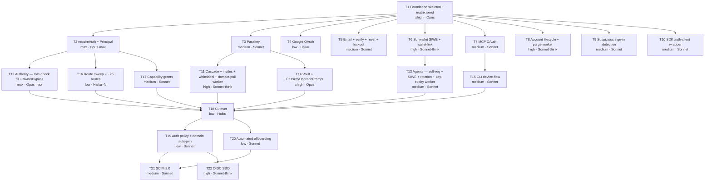

# auth — todo

**Plan:** `plans/auth.md` · **Reference:** `apps/dev.one.ie/`
**Tasks:** 22 · **Waves:** 5 · **Max concurrent /do cycles:** 9 (W1)
**Critical path:** T1 → T2 → T17 → T18 → T19 → T22 (6 cycles serial)
**Wall-clock vs naive 20-cycle sequential:** **4× faster**

---

## Status (2026-05-20)

| Task | Status | Composite | Notes |
|---|---|---|---|
| **T1** Foundation skeleton + matrix seed | ✅ **DONE** | 0.86 | 28 files; 10 migrations applied locally (14 tables); auth instance constructs; dev server live at `:4321/api/auth/get-session` → null. See spec-change notes below. |
| **T2** `requireAuth` + `Principal` | ✅ **DONE** | 0.90 | 8 files (3 NEW + 4 EDIT + 1 doc); compose dropped `types/role-actions.ts` (re-use `RoleAction` from `role-check.ts`); 9/9 vitest pass; delta_tsc=0; delta_loc=+245. Pilot routes (`auth/me`, `billing`, `agents/[id]` PATCH+DELETE, `chat` GET) live behind `requireAuth`. Bearer + cookie both hydrate Principal via Better Auth's `bearer` plugin — single code path. |
| **T3** Passkey | ✅ **DONE** | — | 9 files (~2066 LOC). 967-line port of webauthn plugin into T1 stub. Slots (`MCPConsent`, `BrandLoader`) dynamic-require'd in try/catch so signin.astro compiles before T7/T11. W3.5 fix loop: 18 tsc errors → 0 (BA 1.6.11 API drift: `setSessionCookie`/`createSession` sig, `Where` typing, `Uint8Array<ArrayBuffer>` strictness). First-mint Move-call path deferred for T6→T14 wiring. |
| **T4** Google OAuth | ✅ **DONE** | — | 2 files. `GoogleButton.tsx` (41 LOC) + `wrangler.toml` secret decls. T1's `socialProviders.google` block already in `auth.ts`. |
| **T5** Email + verify + reset + lockout | ✅ **DONE** | — | 13 files. Reused `lib/email.ts` (Postmark→Resend priority). Added migration `0051_user_failed_attempts.sql` (column not in T1's 0050). W3.5: `email/continue.ts` missing `headers` in magic-link InputContext → fixed. **Open follow-up:** `auth.ts` (T1-locked) needs `sendMagicLink`/`sendVerificationEmail`/`sendResetPassword` hooks wired to new template fns; password-reset success path needs `clearLockout(userId)`. |
| **T6** Sui wallet SIWE + wallet-link | ✅ **DONE** | — | 5 files. SIWE plugin (247 LOC) verbatim from reference. wallet-link **adapted**: writes `actor.wallet` keyed by `aid=slug` (NOT reference's `auth-user.wallet-address`). HMAC-signed nonces (no KV needed). W3.5: installed `@mysten/sui@2.17.0` (was missing); fixed `BAUser` typing + `createSession` arg drift. |
| **T7** MCP OAuth | ✅ **DONE** | — | 1 file. `MCPConsent.tsx` (144 LOC). Wires to BA mcp() plugin's `/api/auth/oauth2/consent` endpoint. Both named + default exports for T3's import compat. |
| **T8** Account lifecycle + purge worker | ✅ **DONE** | — | 9 files. R2-backed signed-zip export (HMAC-SHA256 download tokens, 30-day TTL). Standalone purge Worker w/ daily cron. **Open follow-up:** `delete_self` / `read_self` not in T2's 28-action enum — currently mapped to `vault_sync` / `discover`. Plan amendment needed if stricter self-scoping required. W3.5: `revokeUserSessions` → `revokeSessions` in `account-lifecycle.ts`. |
| **T9** Suspicious sign-in detection | ✅ **DONE** | — | 4 files. Haversine impl (3958.8mi Earth radius). KV `geo:{userId}` 90-day history, capped 30 entries. New-country + impossible-travel (>1000mi/10min) detection. **Open follow-up:** suspend semantics use `geo:flagged:{userId}` KV key (24h TTL) — T2 middleware needs to read this key to enforce session suspension (currently doesn't). Used `lib/email.ts` (not T5's `notify/email.ts`) to avoid race. |
| **T10** SDK auth-client wrapper | ✅ **DONE** | — | 6 files at `packages/sdk/` (spec said `one-ie/sdk/`; corrected per workspace layout). `better-auth@^1.6.11` pinned to match web. `signIn.passkey`/`signIn.wallet` are raw fetch wrappers (no BA client plugin); `signIn.email`/`signIn.google` delegate to BA. Token persist: `localStorage` (browser) / `~/.config/oneie/token` mode 0600 (node). Test mocks BA client + storage; proves email POSTs to `/api/auth/sign-in/email`. |
| **T11** Cascade + invites + whitelabel + domain-poll | ✅ **DONE** | — | 10 files. CF Custom Hostnames API wrapper, HMAC invite tokens (7-day TTL), KV-cached branding (60s LRU max 500), domain-poll Worker (1-min cron). BrandLoader fills T3's slot. Middleware appended for custom-domain resolveGroup. Two-pass: prior agent died on credits after writing 6 files; resume agent shipped the remaining 6. |
| **T12** Authority — role-check fill + ownerBypass | ✅ **DONE** | — | 4 files. 30-action RoleAction union (added `read_self` + `delete_self` per W1 follow-up). OWNER_ACTIONS = all 30. PERMISSIONS matrix in-process fallback. ownerBypass + auditOwner with `enforce/audit` mode toggle. Self-action short-circuit in requireAuth. Hot-path budget < 5ms p99 preserved. Hierarchy traversal V1 = [personal, active]; full `ancestors-of` deferred to T17/T18. |
| **T13** Agents — self-reg + SIWE + rotation + key-expiry | ✅ **DONE** | — | 7 files (605 LOC) + migration 0061_agent_key. UUID v4 uids, 32-byte base64url keys, SHA-256 hashed at rest. 5-min rotation grace. 1-min cron Worker sweeps expired keys. SIWE upgrade is 2-tier: wallet address accepted at creation, possession proof via subsequent `/api/auth/sui-wallet/verify`. KV rate-limit 10/min/IP. |
| **T14** Vault + PasskeyUpgradePrompt | ✅ **DONE** | — | 6 files (~725 LOC of UI + crypto). HKDF locked strings used as specced. PRF wired with fallback to follow-up assertion (browsers omitting PRF on `create()`). Wrapped envelope stored inside `vault_blob` (not on credential record). Master zeroed after wrap. Layout.astro mount at line 169 conditional on session. 30-day localStorage dismissal. |
| **T15** CLI device-flow | ✅ **DONE** | — | 2 files in `packages/cli/`. RFC 8628 device-flow. Token file `~/.config/oneie/key` mode 0600 (atomic rename). Browser open via `import('open')` w/ child_process fallback. Files actually landed during the original burst (not credit-throttled away as I'd assumed). |
| **T16** Route sweep | ✅ **DONE** | — | 31 routes migrated to `requireAuth(action)` in W2. **Remediation cycle (2026-05-20 post-W2):** commit-signing routes retired (user decision); legacy modules deleted (`lib/passkey.ts`, `lib/agent-auth.ts`, `lib/api-keys.ts`); 4 routes deleted (`commit.ts`, `commit-media.ts`, `link.ts`, `u/[slug]/export.ts`); 6 routes ported to `requireAuth` (`agent-write`, `tools/index`, `tools/[provider]/connect`, `tools/[provider]/disconnect`, `skills/index`, `settings` `site` action); `chat.ts` `write` tool removed; `middleware.ts` `readSession` fallback dropped; `onboarding.astro` ported to `auth.api.getSession`; `create.astro` migrated to `SignInWithAnything`; `PasskeyCreate.tsx` deleted. `AuthButton.tsx` kept (BA-native; TODO's deletion entry was a misclassification). **T18 exit-gate grep clean. tsc 0 errors.** Follow-up: 8 routes still embed local `checkAuth` SERVER_SECRET fns (`agents/index`, `agents/[id]/deploy`, `skills/[name]`, `skills/[name]/enable`, `themes/index`, `themes/[id]`, `themes/[id]/fork`, `themes/[id]/share`) — non-blocking for T18 since they don't import legacy modules. |
| **T17** Capability grants | ✅ **DONE** | — | 2 files (468 LOC). T12's foldCapabilities() pipe wired to real D1 reads. Signal route `/api/signal/[receiver]` intercepts `grant-capability` before ADL. Migration `0062_capability.sql` written in remediation cycle (capability table + composite index on `(grantee, scope, valid_to)`). `activeCapabilities()` no longer falls back to empty `[]` once 0062 is applied. |
| **T18** Cutover | ✅ **DONE** | — | 2026-05-20. Prod D1 backup saved to `.backups/one-owners-pre-T18-*.sql` (225 KB recovery anchor). `0060_drop_legacy_auth.sql` applied to `one-owners` remote (dropped `owners`, `owners_keys`, `api_keys`; verified via sqlite_master query — 0 rows for those names). `0062_capability.sql` applied (capability table + composite index created). `USE_BETTER_AUTH` flag pruned from `wrangler.toml` + comment in `auth.ts`. tsc 0 errors. T18 exit-gate grep clean. |
| **T19** Auth policy + domain auto-join | ✅ **DONE** | 0.87 | 9 files (~511 LOC + 10 vitest). `0064_domain_auto_join.sql` (slot drift: plan said 0061 — taken). `GroupPolicy` lib (KV `policy:{gid}`, 60s in-process cache, CIDR helpers). 2 new routes: `groups/[gid]/policy` (GET/PUT, requires `update_group`) + `domains/[host]/auto-join` (GET/PUT, requires `verify_domain`). `requireAuth` enforces `allowed_methods` (via `account.providerId` lookup, cached) + `ip_allowlist` (CFv4 CIDR) — both throw before action check. `ensureHumanUnit` auto-joins by email domain when `domains.auto_join_role` set. `session_ttl` stored, V1-unenforced (deferred to Better Auth `sessionExpiresIn`). New `AuthError` reasons: `method_not_allowed`, `ip_not_allowed`. tsc=0 delta · 346/348 full unit suite (2 pre-existing T2 owner-bypass failures, verified via stash — not introduced by T19). |
| **T20** Automated offboarding | ✅ **DONE** | 0.89 | 3 files (~440 LOC + 5 vitest). `lib/offboard.ts` — 4-step cascade (revoke BA sessions · delete TypeDB membership relations · anonymise actor name to "[offboarded]" preserving aid · soft-delete user.deleted_at). Idempotent (TypeDB `delete` matches zero on re-run; D1 UPDATE writes same timestamp). `api/auth/members/[slug]/offboard.ts` — POST handler, `requires_unit`, self-offboard blocked with redirect hint to `/api/auth/account/delete`. **Compose check tightened**: dropped the speculative `apiKey`+`agent_key` revocation paths — Better Auth has no `apiKey` table in this deployment, and `agent_key.uid` belongs to AI agents (T13's key-expiry worker owns that lifecycle). User soft-delete is authoritative; BA bearer plugin re-checks `user.deleted_at` on every call. tsc=0 delta · 5/5 new tests pass (D1 UPDATE failure, session revocation failure, missing GATEWAY_API_KEY, full happy path, no_db). |
| T21, T22 (SCIM, OIDC) | ⬜ blocked | — | W5; enterprise hardening. T21 migration slot needs bump (plan said 0062 — taken by capability) |
| T21, T22 (SCIM, OIDC) | ⬜ blocked | — | W5; enterprise hardening |

**Infrastructure landed in T1 (reusable by W1+):**
- `better-auth@1.6.11`, `@better-auth/kysely-adapter@1.6.11`, `kysely@0.28.17` installed
- `astro.config.mjs` configured for Better Auth SSR (noExternal + optimizeDeps.exclude)
- D1: 14 auth tables created locally (`user`, `session`, `account`, `verification`, `rate_limit`, `oauthApplication`, `oauthAccessToken`, `oauthConsent`, `agent_wallet`, `owner_audit`, `owner_key`, `invites`, `vault_blob`, `domains`)
- TypeDB: `member-role` locked to 6 roles (`owner/admin/member/viewer/agent/auditor`)
- Feature flag `USE_BETTER_AUTH=false` keeps legacy auth path active; flip to `true` to activate consumer-side reads

```
peak agent count = 9 W1 /do cycles × ~7 files each (W3 of each /do)
                 = ~63 agents at W1 peak
                 + ~49 agents at W2 peak (7 cycles × ~7 files)
                 + T16 internal: ~25 Haiku in parallel for route sweep
```

---

## Why this is the maximum

Three structural unlocks make 4 waves possible. Any one of them, missing, drops parallelism back to 5+ waves.

1. **T1 ships the skeleton AND seeds the role-grant matrix.** Every plugin file is stubbed; `auth.ts`, `middleware.ts`, `session-hooks.ts`, `[...all].ts` are written final-form against the stubs; the 28-action matrix is seeded into TypeDB. Every later task fills exactly one module file. **Zero conflicts on the orchestration files.**

2. **`role-check.ts` is stubbed in T1.** `ownerBypass()` is a function call. T2's `requireAuth` imports the stub. The stub returns `false` (no bypass) until T12 fills it. This means T2 and T12 can run in parallel — they touch different files.

3. **T16 (route sweep) and T17 (capability grants) only depend on T2.** They do not need T11 (cascade), T12 (authority), T13 (agents), T14 (vault), T15 (CLI). The narrative ordering in `plans/auth.md` §12 was editorial, not technical. With the dependencies pruned to truth, both fit in W2.

---

## Effort × model mapping

| Level | Model | Use for |
|---|---|---|
| **low** | Haiku 4.5 | SQL migrations, env-var lists, route sweep replacement, file deletions |
| **medium** | Sonnet 4.6 (default) | Better Auth plugin ports, route handlers, UI components, mechanical adapters |
| **high** | Sonnet 4.6 (extended thinking) | Multi-system integration (cascade, domain-poll worker, GDPR semantics) |
| **xhigh** | Opus 4.7 (default) | Crypto wiring, foundation skeleton |
| **max** | Opus 4.7 (max thinking) | Architectural primitives: `requireAuth`, role-grant matrix + `ownerBypass` |

---

## Dependency graph



---

## Wave assignment

| Wave | Tasks (run as parallel /do cycles) | Concurrency | Blocked on | Status |
|---|---|---|---|---|
| **W0** | T1 | 1 | — | ✅ done 2026-05-20 |
| **W1** | T2, T3, T4, T5, T6, T7, T8, T9, T10 | **9** | W0 | ✅ done 2026-05-20 (T3-T10 fan-out + W3.5 fix loop; tsc 0 / biome 0 errors) |
| **W2** | T11, T12, T13, T14, T15, T16, T17 | **7** | W1 (each on its specific deps) | ✅ done 2026-05-20 (post credit-reset resume; tsc 0 errors / biome 0 errors; T16/T17 blockers cleared in remediation cycle — see T16/T17 rows). |
| **W3** | T18 | 1 | W2 | ✅ done 2026-05-20 (prod D1 backup → 0060 drop → 0062 capability → wrangler flag pruned; recovery anchor at `.backups/one-owners-pre-T18-*.sql`) |
| **W4** | T19, T20 | **2** | W3 | ✅ done 2026-05-20 (T19=0.87, T20=0.89; tsc 0 delta; +951 LOC; 15/15 new vitest pass) |
| **W5** | T21, T22 | **2** | W4 (each on its specific deps) | ☐ blocked on W4 |

Within each /do cycle, W3 (the edit phase) spawns one agent per file in the task's `files` list. Peak agent concurrency:

| Moment | /do cycles | Avg files per cycle | Peak agents |
|---|---|---|---|
| W1 | 9 | 7 | **~63** |
| W2 | 7 | 7 | **~49** + 25 within T16 = **~74** |

---

## Tasks

### T1 — Foundation skeleton + matrix seed ✅

**Status:** Shipped 2026-05-20 · composite=0.86 · delta_tsc=0 · delta_loc=+851
**Wave:** W0 · **Depends on:** — · **Effort:** xhigh · **Model:** Opus 4.7
**Source:** `plans/auth.md` §3, §8, §9, §10, §11, §11b

The skeleton everyone hangs off. **All orchestration files (`auth.ts`, `middleware.ts`, `session-hooks.ts`, `[...all].ts`) are written final-form against stubs.** No later task edits them. Seeds the 28-action role-grant matrix in the same cycle so T12, T16, T17 don't need a separate seed task.

**Spec changes landed alongside T1 (2026-05-20):**
1. **6 roles locked** (`owner / admin / member / viewer / agent / auditor`) — `schema/one.tql:165, 270, 192` reflect; `chairman/board/ceo/operator` retired.
2. **Migration 0051 dropped** — `user_id_pub` was already in 0049's `user` table; vault tables it referenced don't exist until T14.
3. **Migration 0059 (domains) reshaped** — `(host PK, gid, verified_at, ssl_status, dcv_records)`; DROP + CREATE (no prod rows).
4. **`human-actor.ts` adapted** — drops `status/success-rate/activity-score/sample-count/created` writes (not in our `one.tql`); takes `SubstrateEnv` explicitly.
5. **Middleware append-only** — Better Auth session read is flag-gated behind `USE_BETTER_AUTH=true`; default `false` keeps the legacy `readSession` path active. T18 retires both branches.

**Files (W3 spawns ~30 parallel agents):**
```
# Migrations (11 files — Haiku each; 0051 dropped during T1)
NEW one.ie/web/migrations/0049_better_auth.sql              ← email NULLable; user_id_pub column + index
NEW one.ie/web/migrations/0050_user_slug.sql                ← slug + locked_until + deleted_at + active_group_id
# (0051 dropped — see "Spec changes" above)
NEW one.ie/web/migrations/0052_user_plugin_columns.sql
NEW one.ie/web/migrations/0053_better_auth_mcp.sql
NEW one.ie/web/migrations/0054_agent_wallet.sql
NEW one.ie/web/migrations/0055_owner_audit.sql
NEW one.ie/web/migrations/0056_owner_key.sql
NEW one.ie/web/migrations/0057_invites_v2.sql
NEW one.ie/web/migrations/0058_vault_blob.sql
NEW one.ie/web/migrations/0059_domains.sql
NEW one.ie/web/migrations/0060_drop_legacy_auth.sql          ← created now; executed only at T18

# Stub modules (8 files — Sonnet each; later tasks fill them)
NEW one.ie/web/src/lib/auth-plugins/passkey-webauthn.ts      ← stub
NEW one.ie/web/src/lib/auth-plugins/sui-wallet.ts            ← stub
NEW one.ie/web/src/lib/auth-plugins/wallet-link.ts           ← stub
NEW one.ie/web/src/lib/agent-actor.ts                        ← stub: ensureAgentUnit signature
NEW one.ie/web/src/lib/suspicious-sign-in.ts                 ← stub: detectSuspiciousSignIn()
NEW one.ie/web/src/lib/role-check.ts                         ← stub: ownerBypass()=false, auditOwner()=noop
NEW one.ie/web/src/lib/capability-grant.ts                   ← stub
NEW one.ie/web/src/lib/account-lockout.ts                    ← stub

# Helpers (3 files — Sonnet)
NEW one.ie/web/src/lib/d1-kysely-dialect.ts
NEW one.ie/web/src/lib/human-actor.ts                        ← FILLED here; ensureHumanUnit(slug, user)
NEW one.ie/web/src/lib/role-cache.ts                         ← KV 60s cache

# Orchestration (4 files — Opus, final form)
NEW one.ie/web/src/lib/auth.ts                               ← FULL plugin imports + configs
NEW one.ie/web/src/lib/session-hooks.ts                      ← onSessionCreate dispatcher
NEW one.ie/web/src/pages/api/auth/[...all].ts                ← Better Auth catch-all
EDIT one.ie/web/src/middleware.ts                            ← session + host + group + visitor-hash

# Seed scripts (2 files — Sonnet; ship with T1, run before W1 starts)
NEW one.ie/web/scripts/seed-roles.ts                         ← 28 role-grant entities (§4d enum)
NEW one.ie/web/scripts/seed-owner.ts                         ← owner actor + group:one + owner membership

# Config (1 file — Haiku)
EDIT one.ie/web/wrangler.toml                                ← env var declarations + worker bindings

# SDK shared utility (1 file — Sonnet; T10 wraps it)
NEW one.ie/web/src/lib/auth-client.ts                        ← Better Auth's createAuthClient wrapper
```

**Exit gate:**
```bash
bun run typecheck
bun wrangler d1 migrations apply auth-db --local
bun scripts/seed-roles.ts
bun scripts/seed-owner.ts
curl -s http://localhost:4321/api/auth/get-session | jq -e '. == null'
# Verify matrix seeded:
echo "match \$rg isa role-grant; select \$rg;" | typedb-cli | grep -c "role-grant" # expect 28
```
Flag `USE_BETTER_AUTH=false` everywhere — no observable behavior change.

---

### T2 — `requireAuth` + `Principal`

**Wave:** W1 · **Depends on:** T1 · **Effort:** max · **Model:** Opus 4.7 (max thinking)
**Source:** `plans/auth.md` §4b, §4c

The single most architecturally significant code. Imports `ownerBypass` from T1's stub (`false` until T12 fills it); imports `roleActions` from `role-cache.ts` (T1 helper).

**Files:**
```
NEW one.ie/web/src/lib/api-auth.ts                           ← requireAuth(request, action) → Principal
NEW one.ie/web/src/lib/principal.ts                          ← Principal type
NEW one.ie/web/src/types/role-actions.ts                     ← 28-action union
EDIT one.ie/web/src/pages/api/auth/me.ts                     ← pilot route
EDIT one.ie/web/src/pages/api/billing.ts                     ← pilot (webhook handler)
EDIT one.ie/web/src/pages/api/agents/[id].ts                 ← pilot
EDIT one.ie/web/src/pages/api/chat.ts                        ← pilot (GET only)
NEW one.ie/web/src/__tests__/integration/api-auth.test.ts
```

**Exit gate:** Integration test proves bearer + cookie both produce Principal; missing action → 403; owner bypass code-path is reached (will return `false` until T12 ships — that's expected here, full bypass tested in T12).

---

### T3 — Passkey method

**Wave:** W1 · **Depends on:** T1 · **Effort:** medium · **Model:** Sonnet 4.6
**Source:** `plans/auth.md` §8b row 1

Verbatim port of the 1066-line plugin into the stub T1 created. Plus sign-in/sign-up surfaces.

**Files:**
```
EDIT one.ie/web/src/lib/auth-plugins/passkey-webauthn.ts     ← fill stub (verbatim from reference)
NEW one.ie/web/src/components/auth/SignInWithAnything.tsx    ← includes <MCPConsent /> + <BrandLoader /> slot placeholders
NEW one.ie/web/src/components/auth/AuthSurface.tsx
NEW one.ie/web/src/components/auth/PasskeyButton.tsx
NEW one.ie/web/src/components/auth/RecoveryPhraseDialog.tsx
NEW one.ie/web/src/pages/signin.astro                        ← imports SignInWithAnything; renders BrandLoader slot
NEW one.ie/web/src/pages/signup.astro
NEW one.ie/web/src/pages/.well-known/webauthn.ts
NEW one.ie/web/src/pages/api/auth/passkey/assert.ts
```

**Exit gate:** Headless Chrome WebAuthn flow registers + signs in; `ensureHumanUnit` writes `actor` with `aid = slug` + owner membership in personal group.

---

### T4 — Google OAuth method

**Wave:** W1 · **Depends on:** T1 · **Effort:** low · **Model:** Haiku 4.5

Pure config — T1 already wrote the `socialProviders.google` block reading from env vars.

**Files:**
```
NEW one.ie/web/src/components/auth/GoogleButton.tsx
EDIT one.ie/web/wrangler.toml                                 ← add GOOGLE_CLIENT_ID, GOOGLE_CLIENT_SECRET secrets
```

**Exit gate:** Click Google button → callback → session + `account` row + linked to existing user (when re-signing in via Google).

---

### T5 — Email methods + verification + reset + lockout

**Wave:** W1 · **Depends on:** T1 · **Effort:** medium · **Model:** Sonnet 4.6
**Source:** `plans/auth.md` §5c, §8c email rows, §11b

Magic link + email/password + email verification + password reset + account lockout.

**Files:**
```
EDIT one.ie/web/src/lib/account-lockout.ts                    ← fill stub: reads user.locked_until before credential check
NEW one.ie/web/src/lib/notify/email.ts                        ← Resend wrapper (or reuse existing)
NEW one.ie/web/src/lib/notify/templates/verify-email.ts
NEW one.ie/web/src/lib/notify/templates/reset-password.ts
NEW one.ie/web/src/lib/notify/templates/magic-link.ts
NEW one.ie/web/src/components/auth/EmailContinueForm.tsx
NEW one.ie/web/src/components/auth/EmailInboxPanel.tsx
NEW one.ie/web/src/components/auth/SigninForm.tsx
NEW one.ie/web/src/pages/api/auth/email/continue.ts
NEW one.ie/web/src/pages/recover.astro
NEW one.ie/web/src/pages/auth/link-expired.astro
NEW one.ie/web/src/pages/auth/link-used.astro
```

**Exit gate:** Email verification blocks sign-in until link click. Password reset rotates credential. 6 failed sign-ins lock account 15 min; magic-link clears the lock.

---

### T6 — Sui wallet SIWE + wallet-link adaptation

**Wave:** W1 · **Depends on:** T1 · **Effort:** high · **Model:** Sonnet 4.6 (extended thinking)
**Source:** `plans/auth.md` §8b rows 2-3

215-line SIWE plugin verbatim + 141-line wallet-link **adapted** to write `actor.wallet` (not the reference's `auth-user.wallet-address`, which doesn't exist in our `one.tql`).

**Files:**
```
EDIT one.ie/web/src/lib/auth-plugins/sui-wallet.ts            ← fill stub (verbatim)
EDIT one.ie/web/src/lib/auth-plugins/wallet-link.ts           ← fill stub (adapt: write actor.wallet keyed by slug)
NEW one.ie/web/src/components/auth/WalletSignIn.tsx
NEW one.ie/web/src/pages/api/auth/wallet/nonce.ts
NEW one.ie/web/src/pages/api/auth/wallet/verify.ts
```

**Exit gate:** Cold SIWE creates `user` + `actor` with `wallet` attribute. Existing user can link wallet without losing session.

---

### T7 — MCP OAuth

**Wave:** W1 · **Depends on:** T1 · **Effort:** medium · **Model:** Sonnet 4.6
**Source:** `plans/auth.md` §8c MCP rows

Better Auth's `mcp()` plugin already configured in T1's `auth.ts`. T7 ships the consent component that fills the `<MCPConsent />` slot T3 left in `signin.astro`.

**Files:**
```
NEW one.ie/web/src/components/auth/MCPConsent.tsx             ← rendered by SignInWithAnything when ?client_id= present
```

**Exit gate:** `/.well-known/oauth-authorization-server` returns discovery doc; `POST /api/auth/mcp/register` returns `{client_id, client_secret}`; Claude Desktop completes the OAuth flow.

---

### T8 — Account lifecycle + purge worker

**Wave:** W1 · **Depends on:** T1 · **Effort:** high · **Model:** Sonnet 4.6 (extended thinking)
**Source:** `plans/auth.md` §5d

Sessions list/revoke + soft+hard delete + data export + 30-day purge cron.

**Files:**
```
NEW one.ie/web/src/pages/api/auth/sessions.ts                 ← GET list + POST /revoke-all
NEW one.ie/web/src/pages/api/auth/sessions/[id].ts            ← DELETE one
NEW one.ie/web/src/pages/api/auth/account/export.ts           ← signed zip
NEW one.ie/web/src/pages/api/auth/account/delete.ts           ← soft + schedule purge
NEW one.ie/web/src/pages/api/auth/account/cancel-delete.ts
NEW one.ie/web/src/lib/account-lifecycle.ts
NEW one.ie/web/src/lib/account-export.ts                      ← user.json + actor.json + signals.ndjson + vault.enc
NEW one.ie/web/workers/account-purge/wrangler.toml            ← scheduled trigger, daily
NEW one.ie/web/workers/account-purge/src/index.ts             ← sweeps user.deleted_at < now-30d
```

**Exit gate:** Sessions list shows 3 entries from 3 UAs; revoke one invalidates only that session; `/account/delete` schedules purge; simulated +30d cron run drops rows; export round-trips signed zip.

---

### T9 — Suspicious sign-in detection

**Wave:** W1 · **Depends on:** T1 · **Effort:** medium · **Model:** Sonnet 4.6
**Source:** `plans/auth.md` §7

Fill the stub T1 wired into `session-hooks.ts`.

**Files:**
```
EDIT one.ie/web/src/lib/suspicious-sign-in.ts                 ← fill stub
NEW one.ie/web/src/lib/geo-history.ts                         ← KV 90-day history, keyed user.id
NEW one.ie/web/src/lib/notify/templates/new-device.ts
NEW one.ie/web/src/lib/notify/templates/velocity-anomaly.ts
```

**Exit gate:** Sign in from new country emits `auth:new-country` signal + email; velocity test (two sessions >1000mi within 10min) suspends the newer session pending email confirm.

---

### T10 — SDK auth-client wrapper

**Wave:** W1 · **Depends on:** T1 · **Effort:** medium · **Model:** Sonnet 4.6
**Source:** `plans/auth.md` §12 cycle 15 (SDK half)

Independent package — `one-ie/sdk/`. Wraps Better Auth's `createAuthClient`.

**Files:**
```
EDIT one-ie/sdk/package.json                                  ← add better-auth, @better-auth/client
NEW one-ie/sdk/src/auth.ts                                    ← client.signIn.{passkey,email,google,wallet}
NEW one-ie/sdk/src/storage.ts                                 ← token persist (browser localStorage / node fs)
EDIT one-ie/sdk/src/client.ts                                 ← attach Authorization: Bearer {token}
NEW one-ie/sdk/__tests__/auth.test.ts                         ← unit test against mocked endpoints
```

**Exit gate:** SDK builds; unit test proves `client.signIn.email({email, password})` constructs the correct POST to `/api/auth/sign-in/email`.

---

### T11 — Cascade + invites + whitelabel + domain-poll worker

**Wave:** W2 · **Depends on:** T1, T3 · **Effort:** high · **Model:** Sonnet 4.6 (extended thinking)
**Source:** `plans/auth.md` §5, §6a, §6b, §6c

The multi-tenancy backbone. Includes the CF Custom Hostnames integration.

**Files:**
```
NEW one.ie/web/src/pages/api/invites/create.ts
NEW one.ie/web/src/pages/api/invites/accept.ts
NEW one.ie/web/src/lib/invite-token.ts                        ← HMAC sign/verify
NEW one.ie/web/src/pages/join.astro                           ← redirects unauth → /signin?redirect=…
NEW one.ie/web/src/components/auth/InviteButton.tsx
NEW one.ie/web/src/pages/api/domains/verify.ts                ← CF Custom Hostnames API call
NEW one.ie/web/src/lib/cf-custom-hostnames.ts                 ← CF API wrapper
NEW one.ie/web/src/lib/branding.ts                            ← loads brand:{brand}:* from KV
NEW one.ie/web/src/components/auth/BrandLoader.tsx            ← fills slot in /signin
EDIT one.ie/web/src/middleware.ts                             ← extend resolveGroup with domains lookup (appended block)
NEW one.ie/web/workers/domain-poll/wrangler.toml
NEW one.ie/web/workers/domain-poll/src/index.ts               ← polls CF every 60s; updates ssl_status
```

**Exit gate:** `POST /api/invites/create` → token; `/join?token=` → sign-in → membership written + `hierarchy(parent, child)` written. `POST /api/domains/verify` returns DCV records; once DCV passes, requests at `dentist-smile.com` resolve `group:dentist-smile` and render `brand:dentist-smile:*` from KV.

---

### T12 — Authority: role-check fill + ownerBypass

**Wave:** W2 · **Depends on:** T2 · **Effort:** max · **Model:** Opus 4.7 (max thinking)
**Source:** `plans/auth.md` §4d, §7

Fill the stubs T1 wrote in `role-check.ts`. **The audit row writes BEFORE the bypassed action commits.** Synchronous; failure fails the action closed.

**Files:**
```
EDIT one.ie/web/src/lib/role-check.ts                         ← fill OWNER_ACTIONS, PERMISSIONS, ownerBypass(), auditOwner()
EDIT one.ie/web/src/lib/api-auth.ts                           ← wire bypass branch (was stub-returning false)
EDIT one.ie/web/src/lib/role-cache.ts                         ← extend cache with cap set
```

**Exit gate:** Owner reads a client workspace; `owner_audit` row exists in D1 *before* the read returns. `enforce` mode: if audit write fails, the read returns 503. `requireAuth` measured < 5ms when matrix is KV-cached.

---

### T13 — Agents: self-reg + SIWE + rotation + key-expiry worker

**Wave:** W2 · **Depends on:** T1, T6 · **Effort:** medium · **Model:** Sonnet 4.6
**Source:** `plans/auth.md` §5a, §5b

Agent identity. Open self-reg + SIWE upgrade + key rotation + key-expiry cron.

**Files:**
```
EDIT one.ie/web/src/lib/agent-actor.ts                        ← fill ensureAgentUnit (member role in own group)
NEW one.ie/web/src/pages/api/auth/agent.ts                    ← POST {} → {uid, apiKey, wallet, group}
NEW one.ie/web/src/pages/api/auth/agent/[uid].ts              ← identity lookup
NEW one.ie/web/src/pages/api/auth/agent/[uid]/rotate.ts       ← 5-min grace window
NEW one.ie/web/src/lib/agent-key.ts                           ← hash, mint, rotate; 24h TTL
NEW one.ie/web/workers/agent-key-expiry/wrangler.toml
NEW one.ie/web/workers/agent-key-expiry/src/index.ts          ← sweep actor.valid-to < now every 60s
```

**Exit gate:** `POST /api/auth/agent {}` returns key + `actor` in TypeDB with `actor-type=agent` + member role in own group. Agent SIWE issues Better Auth session. Rotation issues new key; old key valid 5 min then cron-revoked.

---

### T14 — Vault + `PasskeyUpgradePrompt`

**Wave:** W2 · **Depends on:** T3 · **Effort:** xhigh · **Model:** Opus 4.7
**Source:** `plans/auth.md` §11a

The three locked KDF strings from §11a anchor this.

**Files:**
```
NEW one.ie/web/src/lib/vault.ts                               ← HKDF info constants ("wallet-wrap-v1", "vault.sync.export.v1")
NEW one.ie/web/src/pages/api/vault/sync.ts                    ← PUT/GET vault_blob
NEW one.ie/web/src/components/auth/CloudRestorePanel.tsx
NEW one.ie/web/src/components/auth/CryptoAuthPanel.tsx
NEW one.ie/web/src/components/auth/PasskeyUpgradePrompt.tsx   ← client:idle banner
EDIT one.ie/web/src/layouts/Layout.astro                      ← mount <PasskeyUpgradePrompt client:idle />
```

**Exit gate:** `PUT /api/vault/sync` stores blob; `GET` round-trips. CloudRestorePanel restores on a fresh device using 24-word phrase. Google-only user sees prompt; Touch ID press registers passkey + wraps master.

---

### T15 — CLI device-flow

**Wave:** W2 · **Depends on:** T7 · **Effort:** medium · **Model:** Sonnet 4.6
**Source:** `plans/auth.md` §12 cycle 15 (CLI half)

`oneie auth login` opens browser → polls → writes `~/.config/oneie/key`.

**Files:**
```
EDIT one-ie/cli/src/auth.ts                                   ← device-flow entry
NEW one-ie/cli/src/device-flow.ts                             ← MCP plugin's device-code endpoint
```

**Exit gate:** `oneie auth login` opens browser; user signs in; CLI receives token; second `oneie ping` succeeds with the persisted bearer.

---

### T16 — Route sweep

**Wave:** W2 · **Depends on:** T2 · **Effort:** low (per route) · **Model:** Haiku 4.5 × ~25
**Source:** `plans/auth.md` §12 cycle 14

Mechanical replacement of `readSession()` / `checkOwnerAuth()` → `requireAuth(action)`. **Within this /do cycle, W3 spawns ~25 parallel Haiku agents (one per route).** Plus 10 file deletions.

**Files (each route is its own W3 agent):**
```
EDIT one.ie/web/src/pages/api/chat.ts                         ← chat_read, chat_write
EDIT one.ie/web/src/pages/api/select.ts                       ← discover
EDIT one.ie/web/src/pages/api/settings.ts                     ← view_onchain / update_group
EDIT one.ie/web/src/pages/api/billing.ts                      ← (webhook keeps Stripe HMAC; user routes use requireAuth)
EDIT one.ie/web/src/pages/api/visitors.ts                     ← read_highways
EDIT one.ie/web/src/pages/api/follow.ts                       ← discover
EDIT one.ie/web/src/pages/api/notifications.ts                ← read_memory
EDIT one.ie/web/src/pages/api/eval.ts                         ← discover
EDIT one.ie/web/src/pages/api/reference.ts                    ← discover
EDIT one.ie/web/src/pages/api/x402.ts                         ← mint_capability
EDIT one.ie/web/src/pages/api/tts.ts                          ← chat_write
EDIT one.ie/web/src/pages/api/agents/list.ts                  ← read_highways
EDIT one.ie/web/src/pages/api/agents/publish.ts               ← update_group
EDIT one.ie/web/src/pages/api/agents/history.ts               ← read_memory
EDIT one.ie/web/src/pages/api/agents/rollback.ts              ← update_group
EDIT one.ie/web/src/pages/api/skill/[name].ts                 ← discover
EDIT one.ie/web/src/pages/api/branding.ts                     ← update_group
EDIT one.ie/web/src/pages/api/domain.ts                       ← verify_domain
EDIT one.ie/web/src/pages/api/onboarding.ts                   ← discover
EDIT one.ie/web/src/pages/api/commit.ts                       ← change_role
EDIT one.ie/web/src/pages/api/changelog.ts                    ← view_onchain
EDIT one.ie/web/src/pages/api/openrouter-models.ts            ← discover
EDIT one.ie/web/src/pages/api/loadamp.ts                      ← discover
EDIT one.ie/web/src/pages/api/report.ts                       ← read_revenue
EDIT one.ie/web/src/pages/api/revenue.ts                      ← read_revenue
EDIT one.ie/web/src/pages/api/fade.ts                         ← warn
EDIT one.ie/web/src/pages/api/sub.ts                          ← discover
EDIT one.ie/web/src/pages/api/showcase-chat.ts                ← chat_read
EDIT one.ie/web/src/pages/api/events.ts                       ← read_memory
EDIT one.ie/web/src/pages/api/frontiers.ts                    ← discover
EDIT one.ie/web/src/pages/api/links.ts                        ← (varies; agent decides per handler)
# Public routes — no requireAuth
EDIT one.ie/web/src/pages/api/health.ts                       ← document as PUBLIC; no change

# Deletions (10 files)
DEL one.ie/web/src/pages/api/auth.ts
DEL one.ie/web/src/pages/api/provision.ts
DEL one.ie/web/src/pages/api/recover.ts
DEL one.ie/web/src/pages/api/keys.ts
DEL one.ie/web/src/lib/passkey.ts
DEL one.ie/web/src/lib/agent-auth.ts
DEL one.ie/web/src/lib/api-keys.ts
DEL one.ie/web/src/components/auth/AuthButton.tsx
DEL one.ie/web/src/components/auth/PasskeyCreate.tsx
DEL one.ie/web/src/components/auth/PasskeyKeepThis.tsx
```

**Exit gate:**
```bash
grep -rE 'readSession|checkOwnerAuth|checkApiKey' one.ie/web/src/pages/api && exit 1 || exit 0
grep -rE 'agent-auth|passkey\.ts|provision\.ts|api-keys\.ts' one.ie/web/src && exit 1 || exit 0
bun run typecheck && bun run test:integration
```

---

### T17 — Capability grants

**Wave:** W2 · **Depends on:** T2 · **Effort:** medium · **Model:** Sonnet 4.6
**Source:** `plans/auth.md` §7 capability-grant signal

Signal handler intercepts `grant-capability` before ADL; writes `capability` relation with `valid-from`/`valid-to`. T2's stubbed `capability-grant.ts` import gets filled.

**Files:**
```
EDIT one.ie/web/src/lib/capability-grant.ts                   ← fill stub: write capability relation; read active capabilities
NEW one.ie/web/src/pages/api/signal/[receiver].ts             ← intercepts grant-capability before ADL
EDIT one.ie/web/src/lib/api-auth.ts                           ← requireAuth also reads active capabilities
EDIT one.ie/web/src/lib/role-cache.ts                         ← extend cache to include capability set
```

**Exit gate:** Grant action with `valid-to = now+1h`; agent uses the action successfully; 1h later, same call returns 403 with `capability_expired` reason.

---

### T18 — Cutover

**Wave:** W3 · **Depends on:** T11, T12, T13, T14, T15, T16, T17 · **Effort:** low · **Model:** Haiku 4.5
**Source:** `plans/auth.md` §17

Irreversible. Branch deploy + smoke green is the safety net.

**Steps:**
```
1. cf d1 backup create auth-db                                ← snapshot point
2. bun wrangler d1 execute auth-db migrations/0060_drop_legacy_auth.sql
3. EDIT one.ie/web/wrangler.toml                              ← remove USE_BETTER_AUTH; remove SERVER_SECRET
4. EDIT one.ie/web/src/lib/auth.ts                            ← remove any flag branches
5. bun run test:integration                                   ← all 28 rows of plans/auth.md §14 green
```

**Exit gate:** Full §14 verify matrix green; D1 snapshot ID recorded in `plans/auth.md` §17.

---

### T19 — Auth policy + domain auto-join

**Wave:** W4 · **Depends on:** T18 · **Effort:** low · **Model:** Sonnet 4.6
**Source:** `plans/auth.md` §20a, §20b

Two small, related features shipped in one cycle. Policy enforces which sign-in methods are allowed for a group. Auto-join removes the manual invite step for corporate email domains.

**Files:**
```
NEW one.ie/web/migrations/0061_domain_auto_join.sql          ← ALTER TABLE domains ADD COLUMN auto_join_role TEXT
NEW one.ie/web/src/lib/group-policy.ts                       ← read/write GroupPolicy from KV (policy:{gid})
NEW one.ie/web/src/pages/api/groups/[gid]/policy.ts          ← GET/PUT policy (requires update_group)
NEW one.ie/web/src/pages/api/domains/[host]/auto-join.ts     ← PUT auto-join config (requires verify_domain)
EDIT one.ie/web/src/middleware.ts                             ← hydrate ctx.locals.group.policy from KV
EDIT one.ie/web/src/lib/api-auth.ts                          ← enforce allowed_methods, ip_allowlist, session_ttl
EDIT one.ie/web/src/lib/human-actor.ts                       ← check domain auto-join in ensureHumanUnit
```

**Exit gate:**
```bash
# Policy enforcement
curl -X PUT /api/groups/group:acme/policy '{"allowed_methods":["sso"]}'
curl -H "Cookie: session=magic-link-session" /api/chat → 403 method_not_allowed

# Domain auto-join
# Set auto_join_role='member' for @acme.com domain
# Sign in with user@acme.com → membership row exists in TypeDB
echo "match \$m (group: \$g, member: \$a) isa membership, has aid 'user@acme.com';" | typedb-cli | grep -c member # expect 1
```

---

### T20 — Automated offboarding

**Wave:** W4 · **Depends on:** T18 · **Effort:** low · **Model:** Sonnet 4.6
**Source:** `plans/auth.md` §20c

Single route + lib. Cascades across the group hierarchy in one TypeDB transaction.

**Files:**
```
NEW one.ie/web/src/pages/api/auth/members/[slug]/offboard.ts ← POST (requires remove_unit, owner only)
NEW one.ie/web/src/lib/offboard.ts                           ← TypeDB cascade + session revoke + API key expiry
```

**Exit gate:**
```bash
# Create user 'brad' with memberships in agency + 2 child groups
POST /api/auth/members/brad/offboard
# Verify 0 membership rows for brad across all groups
echo "match \$m (group: \$g, member: \$a) isa membership; \$a has aid 'brad'; select \$m;" | typedb-cli | grep -c membership # expect 0
# Verify sessions revoked
GET /api/auth/sessions → 401 (no active sessions for brad)
```

---

### T21 — SCIM 2.0

**Wave:** W5 · **Depends on:** T18, T19, T20 · **Effort:** medium · **Model:** Sonnet 4.6
**Source:** `plans/auth.md` §20d

Okta/Azure AD can provision and deprovision users. Builds on T20 for DELETE.

**Files:**
```
NEW one.ie/web/migrations/0062_scim_tokens.sql               ← scim_tokens(gid, token_hash, created_at, created_by)
NEW one.ie/web/src/lib/scim-auth.ts                          ← bearer token check (hash compare against scim_tokens)
NEW one.ie/web/src/lib/scim-mapper.ts                        ← SCIM ↔ Better Auth + TypeDB field mapping
NEW one.ie/web/src/pages/api/scim/v2/Users.ts                ← GET list + POST create
NEW one.ie/web/src/pages/api/scim/v2/Users/[id].ts           ← GET + PATCH + DELETE
NEW one.ie/web/src/pages/api/scim/v2/Groups.ts               ← GET list
NEW one.ie/web/src/pages/api/scim/v2/Groups/[id].ts          ← GET + PATCH (add/remove members)
NEW one.ie/web/src/pages/api/groups/[gid]/scim-token.ts      ← POST generates token (requires update_group)
```

**Exit gate:** Okta SCIM test tenant provisions a user → `user` row in D1 + `actor` in TypeDB + membership in group with default role. Okta deletes user → offboarding cascade fires; 0 memberships remain.

---

### T22 — OIDC SSO

**Wave:** W5 · **Depends on:** T18, T19 · **Effort:** high · **Model:** Sonnet 4.6 (extended thinking)
**Source:** `plans/auth.md` §20e

Per-group IdP config. Email-domain routing at initiate endpoint. Policy from T19 can lock a group to SSO-only.

**Files:**
```
NEW one.ie/web/migrations/0063_sso_config.sql                ← sso_config(gid PK, discovery_url, client_id, client_secret_enc, attribute_mapping, enabled_at)
NEW one.ie/web/src/pages/api/groups/[gid]/sso.ts             ← GET/PUT IdP config (requires update_group)
NEW one.ie/web/src/pages/api/auth/sso/initiate.ts            ← PUBLIC; checks email domain → redirect to IdP
NEW one.ie/web/src/pages/api/auth/sso/callback.ts            ← PUBLIC; validates id_token → ensureHumanUnit → session
NEW one.ie/web/src/components/auth/SSOButton.tsx             ← appears in SignInWithAnything when ?email= matches SSO domain
EDIT one.ie/web/src/lib/auth.ts                              ← register oidc plugin; dynamic per-group client config
```

**Exit gate:** Configure Okta OIDC app against a test group. User enters `@acme.com` in `SignInWithAnything` → `SSOButton` appears → redirected to Okta → callback → session → `actor.aid = slug` in TypeDB. With policy `allowed_methods: ['sso']` from T19, sign-in via email+password returns 403.

---

## Conflict-avoidance rules (the parallelism enablers)

Three rules. Violate any and W1's 9-way parallelism collapses to serial.

| # | Rule | Owner | Why |
|---|---|---|---|
| 1 | **`auth.ts`, `middleware.ts`, `session-hooks.ts`, `[...all].ts` are written once in T1 with all plugin imports + configs in place.** Later tasks fill plugin module files only. | T1 | T3–T9 never touch the orchestration files |
| 2 | **`role-check.ts`, `agent-actor.ts`, `suspicious-sign-in.ts`, `wallet-link.ts`, `passkey-webauthn.ts`, `sui-wallet.ts`, `capability-grant.ts`, `account-lockout.ts` ship as stubs in T1 with the final exported signatures.** | T1 | T2 can import `ownerBypass()` even before T12 implements it; same for every other stub |
| 3 | **`signin.astro` carries `<MCPConsent />` and `<BrandLoader />` slot placeholders shipped by T3.** T7 and T11 ship the slot components; never edit the page. | T3 ships page; T7, T11 ship slots | UI page touched once |

---

## /do invocation

```bash
# W0 (single, ~30 file agents inside its /do cycle)
/do plans/auth-todo.md --task T1

# W1 (9 /do cycles in parallel; each spawns ~5-10 file agents)
/do plans/auth-todo.md --task T2 T3 T4 T5 T6 T7 T8 T9 T10 --parallel

# W2 (7 /do cycles in parallel; T16 internally spawns ~25 Haiku for routes)
/do plans/auth-todo.md --task T11 T12 T13 T14 T15 T16 T17 --parallel

# W3 (irreversible, single)
/do plans/auth-todo.md --task T18
```

Total wall-clock: ~4× a single /do cycle's duration (one per wave), instead of 20× sequential.

---

## Effort summary

| Effort | Count | Model | Tasks |
|---|---|---|---|
| max | 2 | Opus 4.7 max thinking | T2, T12 |
| xhigh | 2 | Opus 4.7 | T1, T14 |
| high | 4 | Sonnet 4.6 extended | T6, T8, T11, T22 |
| medium | 9 | Sonnet 4.6 | T3, T5, T7, T9, T10, T13, T15, T17, T21 |
| low | 5 | Haiku 4.5 / Sonnet | T4, T16 (× ~25 routes), T18, T19, T20 |

The two `max` tasks (T2, T12) are the architectural cores — both run with Opus + max thinking because the rest of the system depends on getting them right once.

---

*5 waves. 22 tasks. 9 parallel /do cycles at W1 peak. ~63 concurrent agents at W1, ~74 at W2 (counting T16's internal sweep). Critical path: T1 → T2 → T17 → T18 → T19 → T22.*
