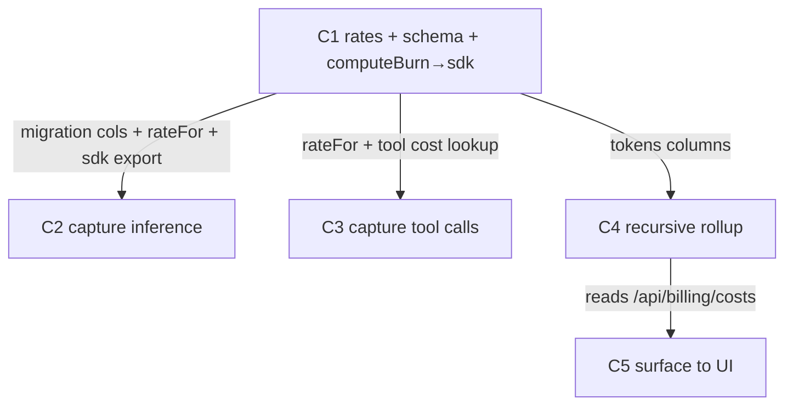

# Billing Cost Tracking — Implementation

## Goal, outcome, deliverables, UX

### Goal

Every inference and tool call lands in the `credit_burns` ledger priced at live OpenRouter rates, so each client, each agency, and the platform can read their own costs from one table.

### Outcome (the kill-switch)

```bash
cd one.ie/web && bun vitest run tests/billing/cost-attribution.test.ts
```

**What passing proves:** `rateFor()` returns the live OpenRouter price (not the stale config constant); a simulated inference and a tool call each produce one workspace-keyed burn carrying tokens; the client / agency / platform rollups all reconcile to the same ledger total.

**Contract:** runs after every batch's W4. Plan does not close until it exits 0. The moment it passes, remaining cycles enter justify-or-drop.

### Deliverables (what actually ships)

| Kind | Path / name | What the user sees or can do | Cycle |
|---|---|---|---|
| migration | `00NN_burn_usage.sql` | `credit_burns` gains `tokens_in`, `tokens_out`, `unit_count` | C1 |
| lib | `@oneie/sdk → rateFor(model, env)` | inference priced from the live OpenRouter feed, config only on KV miss | C1 |
| cron | `sync/` scheduled refresh | `openrouter:models:v1` KV stays fresh without traffic | C1 |
| capture | `channels/src/middleware.ts` | a Telegram/Discord/orchestrate turn produces one `inference` burn for its workspace | C2 |
| capture | `one.ie/web/src/pages/api/chat.ts` | web chat inference burn uses live rate + stores tokens | C2 |
| capture | `channels/src/aitools.ts` | each tool `execute` produces one `tool_call` burn | C3 |
| api | `GET /api/billing/costs?root=<slug>&since=` | recursive subtree rollup (per-descendant + own breakdown), rooted at viewer, sibling-gated | C4 |
| api | `GET /api/billing/clients` | agency drill-down: each client + team, billed + margin earned | C4 |
| component | `web/src/components/billing/CostTree.tsx` | nested agency→client→team cost table | C5 |
| route | `/u/[slug]/billing/costs` | agency + client see the cost of their subtree | C5 |
| page | `billing/platform.astro` (extended) | owner sees the whole tree, recursive (not one-level) | C5 |

### User experience: before → after

| | Today | After |
|---|---|---|
| **Who** | Owner, agency, client, team (sub-group under a client) | same four audiences |
| **Goal** | See the cost of everything beneath me + what I earn | same |
| **Steps** | No per-tenant agent cost; rollup is one level (teams invisible); no cost UI | Open billing → `<CostTree>` shows my subtree rolled up |
| **Friction** | Runtime inference never hits the ledger; Opus mispriced 30×; teams dropped | Every call captured, priced live, recursive to any depth |
| **Feedback** | Nothing for runtime usage; a flat owner-only table | Cost by descendant + by model/reason, gated to my subtree |

**The improvement (ux_delta):** accurate cost attribution that now exists for agent-runtime usage, rolls up recursively across owner→agency→client→team, and is visible in-UI per audience — with zero new tables and one composed `<CostTree>`.

**The proof a future-you points at:**

```json
// GET /api/billing/costs?root=acme-agency&since=<month-start>  (agency view; teams nest under clients)
{ "root": "acme-agency",
  "descendants": [
    { "workspace": "client-globex", "parent_slug": "acme-agency", "billed": 48800, "margin_earned": 9760 },
    { "workspace": "team-globex-support", "parent_slug": "client-globex", "billed": 12100, "margin_earned": 2420 } ],
  "own": [ { "reason": "inference", "model": "anthropic/claude-haiku-4.5", "billed": 9900 } ],
  "totals": { "billed": 181250, "margin_earned": 36250 } }
// reconciles: a team's billed is inside its client's subtree total AND the owner's tree total
```

---

## Reuse contract

**Power through simplicity — don't build a second ledger.** `credit_burns` is the ledger; `owners.parent_slug` is the rollup edge; `openrouter-models.ts` is the live feed. This plan adds capture + reads, not storage.

The compose-or-construct test applies to every new file. Net-new code budget for the whole plan: **≤ 400 LOC** (migration + rateFor + cron + two capture wrappers + two read handlers + one `<CostTree>` + one route + tests). Any cycle proposing a new aggregation table, a parallel usage log, a `teams` table, or a charting library is rejected on sight — teams are `owners` rows, the rollup is a CTE, the chart is a Tailwind table like `platform.astro`.

---

## Parallel execution plan

### Cycle-level DAG



C2·C3·C4 have no edge between them → fully parallel. C5 reads the API **C4 creates** (`/api/billing/costs`), so it follows C4. The only other arrows: C2·C3·C4 read `tokens_in/out` columns + `rateFor` that **C1 creates**.

### Batches

| Batch | Cycles | Parallel work |
|-------|--------|---------------|
| 0 | shared | W0 baseline + read of all `shared_recon:` files (one Haiku spawn) |
| 1 | C1 | full W1→W4 |
| 2 | C2, C3, C4 | three cycles W1→W4 in lockstep; W3a edits merge into one Sonnet message; demos run as one `vitest run` |
| 3 | C5 | full W1→W4 — composes `<CostTree>` into the billing pages, reads C4's API |

---

## Status

```
Batch 0 (shared)
  - [ ] W0 baseline (plan-level)
  - [ ] W1 shared recon (plan-level)

Batch 1
  - [ ] C1 — Live rates + schema + computeBurn→sdk          state: ready
    - [ ] W1 recon
    - [ ] W2 decide
    - [ ] W3 edit
    - [ ] W4 verify

Batch 2  (fires the instant C1 closes)
  - [ ] C2 — Capture inference in the agent runtime          state: blocked-on-C1
    - [ ] W1 · W2 · W3 · W4
  - [ ] C3 — Capture tool calls                              state: blocked-on-C1
    - [ ] W1 · W2 · W3 · W4
  - [ ] C4 — Recursive subtree rollup                        state: blocked-on-C1
    - [ ] W1 · W2 · W3 · W4
  - [ ] demo batch (vitest run c2 c3 c4)

Batch 3  (fires the instant C4 closes)
  - [ ] C5 — Surface costs to the UI (owner/agency/client/team)  state: blocked-on-C4
    - [ ] W1 · W2 · W3 · W4

Plan close
  - [ ] Plan outcome command exits 0
  - [ ] Every deliverables: row shipped and reachable
  - [ ] ux_after journey walkable (paste the /api/billing/clients response)
  - [ ] Justify-or-drop on unstarted cycles
  - [ ] Final compress sweep + docs/learnings append
  - [ ] Plan rubric ≥ 0.65
```

---

## C1 — Live rates + schema + computeBurn→sdk  [tier: complex · batch: 1]

**Goal delta:** after this closes, `rateFor('anthropic/claude-opus-4.6')` returns ~50cr/1k (live) not 1500cr (stale), the ledger can store tokens, and both workers can import the one pure cost function — so C2/C3 can record accurate, auditable burns.

**Deliverable:** `00NN_burn_usage.sql` + `rateFor()` in `@oneie/sdk` + `sync/` cron.

**UX delta:** internal-only — no user-visible change yet; justified because every downstream burn is mispriced until the live rate exists.

**Cycle outcome:** `bun vitest run tests/billing/rate.test.ts` passes — `rateFor` reads the KV blob and converts USD/token → cr/1k correctly, falls back to config on miss; migration applies clean to local D1.

**Contributes to plan outcome:** yes.

**Demo gate:**
```yaml
demo:
  command: "cd one.ie/web && bun vitest run tests/billing/rate.test.ts"
  asserts: "rateFor returns live OpenRouter price from KV, config only on miss; usage columns exist"
  budget:  "<2s wall · <80 LOC test"
```

### W1 — Recon  [Haiku · parallel]

1. **Existing-code recon**
   - [ ] `one.ie/web/src/lib/billing.ts` — `computeBurn` signature + purity (no I/O?), to lift into sdk
   - [ ] `one.ie/web/src/lib/billing-config.ts` — `models:` shape, conversion math (`usd_per_1m / 100`)
   - [ ] `one.ie/web/src/pages/api/openrouter-models.ts` — KV key, blob shape (`pricing.prompt/completion` units)
   - [ ] `sync/wrangler.toml` + `sync/src/` — existing cron/scheduled handler pattern + KV binding name
2. **Primitive-inventory recon**
   - [ ] `packages/sdk/src/` — where a pure `billing` helper would export from; existing exports + build setup
   - [ ] `one.ie/web/migrations/` — latest migration number for the next `00NN_`

### W2 — Decide  [Opus · high — touches schema + cross-package export]

- [ ] **Compose-or-construct verdict** — `rateFor` is new (no primitive converts the KV blob → cr/1k); `computeBurn` is **moved not rewritten** (lift from `billing.ts` into sdk, re-export from `billing.ts` for back-compat).
- [ ] Does the KV blob carry the model IDs channels actually uses (`provider/modelId` from middleware)? Resolve the ID-normalization rule (OpenRouter `anthropic/claude-...` vs AI SDK `model.provider/model.modelId`).
- [ ] Sync cron cadence + which KV binding (`CHAT_CACHE`) the sync worker writes.
- [ ] Doc-plan: `billing-costs.md` (rates now KV-sourced), `billing-taxonomy.md` (burn-row columns), `channels/CLAUDE.md` deferred to C2.

### W3 — Edit  [Sonnet · parallel]

**W3a — independent:**
- [ ] `one.ie/web/migrations/00NN_burn_usage.sql` — add `tokens_in`, `tokens_out`, `unit_count` (all nullable)
- [ ] `packages/sdk/src/billing.ts` — `computeBurn` (moved) + new `rateFor(model, kvBlob)` pure converter
- [ ] `sync/src/...` — scheduled handler: fetch `GET /api/v1/models` → write `openrouter:models:v1`
- [ ] `plans/billing-costs.md` — note rates are KV-sourced; config is fallback

**W3b — dependent (after sdk export lands):**
- [ ] `one.ie/web/src/lib/billing.ts` — re-export `computeBurn`/`rateFor` from `@oneie/sdk` (no duplicate impl)

### W4 — Verify  [Haiku×5 · complex]

- [ ] `bun run verify` green in `one.ie/web` and `packages/`
- [ ] `delta_tsc_errors ≤ 0`
- [ ] `bun run db:migrate:local` applies `00NN` clean; `PRAGMA table_info(credit_burns)` shows new columns
- [ ] `tests/billing/rate.test.ts` exits 0
- [ ] Reuse audit: `computeBurn` has exactly one implementation (grep shows web re-exports sdk, no copy)
- [ ] goal-fit ≥ 0.50 (hard) · composite ≥ 0.65

---

## C2 — Capture inference in the agent runtime  [tier: complex · batch: 2]

**Goal delta:** after this closes, a Telegram/Discord/web turn produces exactly one `inference` burn keyed to the right workspace, priced by `rateFor`, storing tokens — runtime inference stops being invisible to billing.

**Deliverable:** burn write in `channels/src/middleware.ts` + aligned `chat.ts`.

**UX delta:** agency/client cost reports (C4) now include agent-runtime usage, not just web chat.

**Cycle outcome:** `bun vitest run tests/billing/capture.test.ts` — a mocked `doGenerate` result with known tokens yields a burn whose `cost_credits == rateFor·tokens/1000`, `tokens_in/out` populated, `workspace` resolved from group.

**Contributes to plan outcome:** yes.

**Demo gate:**
```yaml
demo:
  command: "cd one.ie/web && bun vitest run tests/billing/capture.test.ts"
  asserts: "one generate → one workspace-keyed inference burn, cost == live-rate recompute from stored tokens"
  budget:  "<2s wall · <80 LOC test"
```

### W1 — Recon  [Haiku · parallel]

- [ ] `channels/src/middleware.ts` — `wrapGenerate` result.usage shape (`inputTokens.total`, `outputTokens`, `cacheRead`)
- [ ] `channels/src/substrate.ts` + `aitools.ts` — how `group` maps to a workspace/owner slug today (`selfId(group)`?)
- [ ] `channels/wrangler.toml` — confirm `ONE_DB` binding + any KV for rates
- [ ] `one.ie/web/src/pages/api/chat.ts` — current `reason:'inference'` burn call site

### W2 — Decide  [Opus · high]

- [ ] **Compose-or-construct:** reuse `computeBurn` + `debitPool` from sdk; the only new code is `workspaceForGroup(group, env)` + the burn-build glue. No new module if `substrate.ts` can host the helper.
- [ ] **Escape check (frontmatter):** is there a reliable group→workspace slug map? If null for live groups, halt per `escape:`.
- [ ] Record-vs-debit: does runtime inference **debit** the pool (enforce 402) or only **record** cost? Decide whether channels calls `debitPool` (gated) or a lighter `recordBurn` (always insert). Default: record always; gating is a later cycle.
- [ ] Streaming: `wrapStream` currently passthrough — capture usage on stream finish too, or accept stream calls uncosted for now? Name the decision.
- [ ] Doc-plan: `channels/CLAUDE.md` (middleware now records a burn).

### W3 — Edit  [Sonnet · parallel]

**W3a — independent:**
- [ ] `channels/src/middleware.ts` — after `doGenerate()`, build + insert inference burn (keep existing `mark()`)
- [ ] `channels/src/substrate.ts` — `workspaceForGroup()` + thin `recordBurn(env.ONE_DB, burn)`
- [ ] `one.ie/web/src/pages/api/chat.ts` — swap static rate for `rateFor`, pass `tokens_in/out`
- [ ] `channels/CLAUDE.md` — document the new billing side-effect

**W3b:** *(empty — file-disjoint)*

### W4 — Verify  [Haiku×5 · complex]

- [ ] `bun run verify` green in both `channels` and `one.ie/web`
- [ ] `delta_tsc_errors ≤ 0`
- [ ] `tests/billing/capture.test.ts` exits 0
- [ ] No untracked inference: test asserts every `doGenerate` mock → exactly one burn (no double, no zero)
- [ ] Reuse audit: `computeBurn` imported from sdk, not reimplemented in channels
- [ ] deliverable shipped + ux delta observable (paste a seeded burn row)
- [ ] plan outcome re-check recorded · goal-fit ≥ 0.50 (hard) · composite ≥ 0.65

---

## C3 — Capture tool calls  [tier: simple · batch: 2]

**Goal delta:** after this closes, each tool `execute` produces one `tool_call` burn (Composio = live per-call cost, substrate verbs = 0 upstream) attributed to the same workspace as its inference.

**Deliverable:** burn write wrapping tool `execute` in `channels/src/aitools.ts`.

**UX delta:** tool costs appear in the per-client/agency breakdown alongside inference.

**Cycle outcome:** `bun vitest run tests/billing/tools.test.ts` — invoking a wrapped tool yields one `tool_call` burn with `model=<tool name>`, `unit_count=1`, cost = the tool's per-call rate.

**Contributes to plan outcome:** yes.

**Demo gate:**
```yaml
demo:
  command: "cd one.ie/web && bun vitest run tests/billing/tools.test.ts"
  asserts: "one tool execute → one tool_call burn, correct per-call cost + workspace"
  budget:  "<2s wall · <80 LOC test"
```

### W1 — Recon  [Haiku · parallel]

- [ ] `channels/src/aitools.ts` — the 7 tools, `execute` signature, `ctx(options).group`
- [ ] `plans/billing-costs.md § Tool integrations — Composio` — per-call cost source (plan-tier dependent)

### W2 — Decide  [Sonnet · medium]

- [ ] **Compose-or-construct:** wrap `execute` with the same `recordBurn` from C2 — no new module. Verdict: compose.
- [ ] Per-tool cost map: which tools are Composio (cost-based) vs substrate (0 upstream)? Source the Composio per-call rate (static for now, or from a config value).
- [ ] Do tool burns share `workspaceForGroup` from C2? (yes — reuse).

### W3 — Edit  [Sonnet · parallel]

**W3a:**
- [ ] `channels/src/aitools.ts` — wrap each tool `execute` to `recordBurn({reason:'tool_call', model:<tool>, unit_count:1, ...})`

**W3b:** *(empty)*

### W4 — Verify  [inline composite · simple]

- [ ] `bun run verify` green in `channels`
- [ ] `tests/billing/tools.test.ts` exits 0
- [ ] Reuse audit: uses C2's `recordBurn`; no parallel tool-log table populated
- [ ] deliverable shipped + plan outcome re-check · goal-fit ≥ 0.50 (hard) · composite ≥ 0.65

---

## C4 — Recursive subtree rollup  [tier: complex · batch: 2]

**Goal delta:** after this closes, one recursive read rooted at the viewer's workspace returns the cost of their whole subtree — a team rolls up into its client AND its agency — and a viewer can't read a sibling. This is the data the UI (C5) renders.

**Deliverable:** `GET /api/billing/costs?root=<slug>&since=` (subtree rollup: per-descendant + own breakdown, sibling-gated) + `GET /api/billing/clients` (agency drill-down).

**UX delta:** owner/agency/client/team each get the cost of everything beneath them, at any depth — teams included (today's one-level rollup drops them).

**Cycle outcome:** `bun vitest run tests/billing/rollup.test.ts` — against seeded burns over a 3-level tree (agency → client → team), the recursive rollup reconciles (a team's `billed` is included in its client's subtree total AND its agency's), and a `root` outside the viewer's chain is rejected.

**Contributes to plan outcome:** yes.

**Demo gate:**
```yaml
demo:
  command: "cd one.ie/web && bun vitest run tests/billing/rollup.test.ts"
  asserts: "recursive subtree rollup includes teams at any depth + sibling root is rejected"
  budget:  "<2s wall · <140 LOC test"
```

### W1 — Recon  [Haiku · parallel]

- [ ] `one.ie/web/src/pages/api/billing/clients.ts` — current shape (one-level aggregate? list?)
- [ ] `one.ie/web/src/middleware.ts` — `resolveDescendants` CTE (depth cap, cycle guard) to reuse for the subtree query + `workspaceContext.descendants` for gating
- [ ] `one.ie/web/src/pages/u/[slug]/billing/platform.astro` — the existing one-level rollup queries to make recursive
- [ ] `one.ie/web/src/lib/viewer.ts` — viewer resolution (owner/agency/client) for `root`-in-chain authorization

### W2 — Decide  [Opus · high]

- [ ] **Compose-or-construct:** new `billing/costs.ts` route (the recursive subtree read — no existing endpoint does it); extend `clients.ts` for the agency drill-down. Verdict per endpoint per `api.md`.
- [ ] **Authorization rule:** `root` must be the viewer's own workspace or a descendant of it (reuse `workspaceContext.descendants`); owner (`staffRole`) may root anywhere / at all top-level. Reject otherwise (403).
- [ ] Recursive CTE: lift `resolveDescendants`' shape; confirm depth cap + cycle guard carry over; column names vs migration 0017 + C1's `tokens_in/out`.
- [ ] Owner aggregate: `:root` = `parent_slug IS NULL` set (the whole tree) — same query, no special-case code.
- [ ] Doc-plan: `README.md` billing API row + `billing-taxonomy.md` reporting section.

### W3 — Edit  [Sonnet · parallel]

**W3a:**
- [ ] `one.ie/web/src/pages/api/billing/costs.ts` — recursive subtree rollup, `root`-in-chain gated; per-descendant + own breakdown + totals
- [ ] `one.ie/web/src/pages/api/billing/clients.ts` — agency drill-down: each client + team, billed + `agency_margin`
- [ ] doc: sync `README.md` / `billing-taxonomy.md` reporting section

**W3b:** *(empty)*

### W4 — Verify  [Haiku×5 · complex]

- [ ] `bun run verify` green
- [ ] `delta_tsc_errors ≤ 0`
- [ ] `tests/billing/rollup.test.ts` exits 0 — recursive reconciliation over a 3-level tree
- [ ] Authz check: `root` = sibling/ancestor outside chain → 403; owner can root anywhere
- [ ] **Live verification** (deploy surface — `api/billing/*`): post-deploy `curl` returns 2xx/401/403 as expected
- [ ] deliverable shipped + ux delta observable (paste the nested rollup response) · plan outcome re-check
- [ ] goal-fit ≥ 0.50 (hard) · composite ≥ 0.65

---

## C5 — Surface costs to the UI  [tier: complex · batch: 3]

**Goal delta:** after this closes, each of the four audiences SEES their subtree's cost in the billing UI — owner the whole tree, agency clients→teams, client its teams, team itself — composed from the C4 API into the billing pages that already exist.

**Deliverable:** `web/src/components/billing/CostTree.tsx` + route `/u/[slug]/billing/costs` + recursive extension of `billing/platform.astro`.

**UX delta:** the cost numbers stop being API-only — they render, gated to the viewer's subtree, nested agency→client→team.

**Cycle outcome:** `bun vitest run tests/billing/costtree.test.tsx` — `<CostTree>` given a nested rollup renders one row per descendant nested by `parent_slug`, totals match the API, and a leaf (team) renders its own breakdown with no children.

**Contributes to plan outcome:** yes.

**Demo gate:**
```yaml
demo:
  command: "cd one.ie/web && bun vitest run tests/billing/costtree.test.tsx"
  asserts: "CostTree nests descendants by parent_slug, totals reconcile, leaf shows own breakdown"
  budget:  "<2s wall · <120 LOC test"
```

### W1 — Recon  [Haiku · parallel]

1. **Existing-code recon**
   - [ ] `one.ie/web/src/pages/u/[slug]/billing/platform.astro` — owner table markup to extend (recursive) + how it reads burns
   - [ ] `one.ie/web/src/pages/u/[slug]/billing.astro` + `BillingNav.astro` — pool page + nav gating to slot the new `costs` tab
   - [ ] `one.ie/web/src/components/` — `PoolCard`, `Ledger`, `org/ClientsTable.tsx` (closest existing tenant table to compose/extend)
2. **Primitive-inventory recon**
   - [ ] `one.ie/web/src/components/ui/` — `Card`, `Badge`, `Table`, `Icon`/`IconBadge` (name signatures)
   - [ ] `one.ie/web/src/components/dashboard/` — `RankedList`, `HeroNumber`, `Sparkline` for the summary cards
   - [ ] confirm no charting lib (recharts absent) — CostTree is a Tailwind table like `platform.astro`

### W2 — Decide  [Opus · high]

- [ ] **Compose-or-construct verdict:** is `<CostTree>` a new file or an extension of `org/ClientsTable.tsx`? Fill the verdict table — closest match `ClientsTable` does `{what}`, lacks nested-by-`parent_slug` + cost columns. Default: compose into / extend it; new file only if the nesting diverges materially.
- [ ] **Slot map:** which `ui/` + `dashboard/` primitives fill which slot (table rows, totals card, margin badge).
- [ ] Route shape: `billing/costs.astro` serving agency + client (viewer-driven `root`); owner stays on extended `platform.astro`. Confirm `BillingNav` gating per viewer (owner/agency/client see costs; team sees own pool).
- [ ] Doc-plan: `one.ie/web/src/components/CLAUDE.md` (new island) + any `README` route row.

### W3 — Edit  [Sonnet · parallel]

**W3a — independent:**
- [ ] `one.ie/web/src/components/billing/CostTree.tsx` — nested rollup table (compose `ui/` primitives)
- [ ] `one.ie/web/src/pages/u/[slug]/billing/costs.astro` — new route; fetches C4 API with viewer's `root`; renders `<CostTree client:load>`
- [ ] `one.ie/web/src/components/billing/BillingNav.astro` — add the `costs` tab, gated to owner/agency/client
- [ ] `one.ie/web/src/components/CLAUDE.md` — document the new island

**W3b — dependent (after CostTree lands):**
- [ ] `one.ie/web/src/pages/u/[slug]/billing/platform.astro` — swap one-level queries for recursive; reuse `<CostTree>` for the owner whole-tree view

### W4 — Verify  [Haiku×5 · complex]

- [ ] `bun run verify` green
- [ ] `delta_tsc_errors ≤ 0`
- [ ] `tests/billing/costtree.test.tsx` exits 0
- [ ] Reuse audit: `<CostTree>` imports `ui/` primitives (grep); no recharts; no new tenant-table reimplementation if `ClientsTable` was extensible
- [ ] **Live verification** (deploy surface — astro pages + `api/billing/*`): `curl` `/u/<slug>/billing/costs` returns 2xx for owner/agency/client, redirect/403 for a sibling
- [ ] deliverable shipped + ux delta observable (screenshot path of the nested tree) · plan outcome re-check
- [ ] goal-fit ≥ 0.50 (hard) · composite ≥ 0.65

---

## See also

- `plans/billing-costs-implementation.md` — the design this todo executes
- `plans/billing-costs.md` — upstream rate catalogue (Composio, voice, infra)
- `plans/billing-products.md` — what's sellable; `billing-taxonomy.md` — burn-row contract
- `one.ie/web/src/lib/billing.ts` — `computeBurn` / `debitPool` (reused, never reimplemented)
- `plans/dictionary.md` · `plans/rubrics.md` — canonical names + scoring bands
