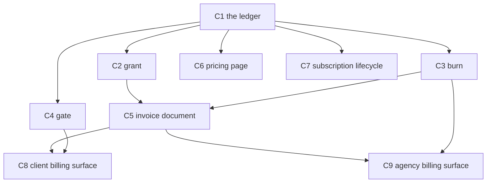

# Billing Software — Complete System

## Shape — the code mirrors the spec

`text/02-billing.md` is the contract: **one credit, three verbs, one ledger, one document, four lines of cascade.** This plan builds the code in that same shape, so a reader who knows the spec already knows the file tree.

```
The ledger          schema/migrations              — one ledger, six coherent migrations
The three verbs     src/lib/billing/grant.ts        — credits arrive
                    src/lib/billing/burn.ts         — credits leave (rate + meter)
                    src/lib/billing/gate.ts         — feature on/metered/off + limits
The document        src/lib/billing/invoice.ts      — draft → compute → finalize + coupons
The cascade         src/lib/billing.ts (existing)   — computeBurn/debitPool, never reimplemented
The surfaces        by audience: pricing · lifecycle · client · agency
```

**The cut that added elegance, not loss:** the engine collapsed from five scattered files
(`invoice` · `proration` · `tiered` · `meter` · `entitlement`) into the spec's own three verbs
plus the document. Proration and FIFO are *grant* concerns → `grant.ts`. Tiered rates and meters
are *burn* concerns → `burn.ts`. Entitlement limits are *gate* concerns → `gate.ts`. Every feature
from the 13-cycle draft survives; it just lives where the spec says it lives.

## Fastest path to live — the walking skeleton

Elegance first, but get the kill-switch green fast. The outcome command needs exactly three things:
a `/pricing` page with "Pro", invoice rows in the API, and an invoice link on `/billing`. That is a
**4-cycle spine**, not 9:

```
C1 ledger  →  C5 invoice (thin: line items from burns, credits_applied=0, no coupons)
           →  C6 pricing page
           →  C8 client surface (thin: invoice list API + PDF link)   ⟹  outcome exits 0
```

Ship that spine first — it's a live, demoable billing loop. Then the rest layers on without rework,
because every later cycle writes into files the spine already created:

| Defer until after green | Adds |
|---|---|
| C2 grant | proration credit-back + FIFO `credits_applied` (spine ships with 0) |
| C3 burn | tiered rates + meters (spine uses default `rateFor`) |
| C4 gate | entitlement limits (spine has no limits) |
| C7 lifecycle | trial / cancel / dunning (spine subscribes only) |
| C9 agency | cost tree + templates + coupon issue |
| coupons in C5/C8 | apply + redeem (spine has no discounts) |

**Why this is still elegant, not a hack:** the spine builds the same `grant.ts`/`burn.ts`/`gate.ts`/
`invoice.ts` files in their final shape — it just leaves the advanced branches as `TODO(C2)` stubs that
the deferred cycles fill in. No file gets rewritten; each cycle only *adds*. The skeleton walks on day one.

> `/do` runs the batches in order regardless — this note tells it (and you) which cycles are load-bearing
> for the proof versus which complete the surface. If time is short, close the spine and demo.

## Goal, outcome, deliverables, UX

### Goal

Every workspace has a complete billing lifecycle — subscriptions, trials, invoices with PDF download, coupons, cancel flows, entitlement limits, tiered pricing, agency revenue dashboard, and dunning — all reading the same credit ledger.

### Outcome (the kill-switch)

```bash
curl -s https://one.ie/u/test-agency/billing | grep -q 'invoice' \
  && curl -s https://one.ie/pricing | grep -q 'Pro' \
  && curl -s https://api.one.ie/api/billing/invoices \
       -H "Authorization: Bearer $TEST_TOKEN" | jq '.invoices | length > 0'
```

**What passing proves:** a workspace can subscribe from a public pricing page, see itemised invoices, and the API returns invoice records — end-to-end without a test harness.

### Deliverables

| Layer | Path / name | What the user sees or can do |
|---|---|---|
| ledger | `00NN_invoices.sql` | invoices + line items |
| ledger | `00NN_coupons.sql` | coupons + redemptions |
| ledger | `00NN_entitlements.sql` | per-feature limits + usage meters |
| ledger | `00NN_pricing_tiers.sql` | per-workspace rate overrides |
| ledger | `00NN_grants.sql` | credit expiry + priority on `credit_grants` |
| ledger | `00NN_subscriptions.sql` | trial / cancel / billing_anchor on `owners` |
| grant | `src/lib/billing/grant.ts` | proration credit-back; expiring credits burn first |
| burn | `src/lib/billing/burn.ts` | tiered per-client rates; meter aggregation |
| gate | `src/lib/billing/gate.ts` | "100 calls/mo blocks on call 101" |
| document | `src/lib/billing/invoice.ts` | real invoices, coupons applied, sequence at finalize |
| document | `GET /api/billing/invoices/:iid/pdf` | one-click PDF for the accountant |
| pricing | `/pricing` + `PlanCards.tsx` | visitor picks a plan, hits Stripe checkout |
| lifecycle | cancel / trial / portal / `DunningBanner` | trial, clean cancel, self-serve payment recovery |
| client | invoice list + `EntitlementBar` + coupon redeem | sees invoices, usage vs. limit, applies a code |
| agency | `CostTree` + plan templates + `CouponManager` | full revenue tree, custom client plans, issue codes |

### User experience: before → after

| | Today | After this plan |
|---|---|---|
| **Visitor** | No public pricing page; must sign up to see plans | Visits `/pricing`, sees all plans + prices, clicks subscribe |
| **New workspace** | No trial; straight to subscription | 14-day trial with full plan features; converts on card entry |
| **Client** | Sees a flat pool + burn list; no invoice documents | Sees itemised monthly invoices, downloads PDF, applies coupon |
| **Agency owner** | No revenue visibility; guesses at margin | `/billing/costs` shows full tree: client spend → COGS → margin earned |
| **Payment failed** | Silent banner with no recovery path | Dunning banner shows retry date + one button to update payment method |
| **Cancel** | No cancel button; must email support | Cancel in billing panel; shows "ends [date]"; one-click undo until period end |

**The improvement:** a billing system that was operational but invisible becomes a first-class product surface — from public pricing page through invoice PDF download.

```
# After state — what the agency owner sees at /billing/costs
{
  "workspace": "acme-agency",
  "period": "2026-05",
  "gross_billed": 142300,
  "cogs": 91200,
  "margin_earned": 28400,
  "clients": [
    { "slug": "startup1", "billed": 48000, "cogs": 30000, "margin": 9600 },
    { "slug": "startup2", "billed": 36000, "cogs": 23000, "margin": 7200 }
  ]
}
```

---

## Reuse contract

**Source files to read before any cycle:**

| Reference | What to extract |
|-----------|----------------|
| `/Users/toc/Server/apps/flexprice/internal/service/billing.go` | Invoice lifecycle, tiered cost calculation |
| `/Users/toc/Server/apps/flexprice/internal/service/line_item_proration.go` | Proration algorithm → `grant.ts` |
| `/Users/toc/Server/apps/flexprice/ent/schema/meter.go` | MeterAggregation struct → `burn.ts` |
| `/Users/toc/Server/apps/flexprice/ent/schema/subscription.go` | Subscription fields to add |
| `/Users/toc/Server/apps/openmeter/openmeter/meter/meter.go` | Entitlement enforcement pattern → `gate.ts` |
| `/Users/toc/Server/apps/coai/auth/quota.go` | Atomic debit SQL pattern |

**Compose-first rules:**
- `grant.ts` / `burn.ts` / `gate.ts` are the policy layer — they CALL `billing.ts` (`computeBurn`, `debitPool`, `rateFor`); they never reimplement cost math.
- `CancelModal` → compose from `DowngradeImpactModal` (same impact-preview + confirm shape).
- `DunningBanner` → extend `PaymentFailureBanner.tsx` in place (don't create a new banner).
- `PlanCards` checkout + `TrialConvertModal` → reuse `StripeProvider.tsx` + existing intent shape.
- `EntitlementBar` → a new slot in `PoolCard.tsx`, not a standalone page component.
- Plan template builder → extend `AgencyPlansManager.tsx`, not a new top-level component.

---

## Cycle DAG



### Batches

| Batch | Cycles | What runs in parallel |
|-------|--------|-----------------------|
| 0 | shared W0 + W1 | baseline + shared_recon read |
| 1 | C1 | the ledger — all migrations |
| 2 | C2, C3, C4, C6, C7 | three verbs + two surfaces — all need only C1 |
| 3 | C5 | the invoice document — needs grant + burn |
| 4 | C8, C9 | client + agency surfaces — read the document |

---

## Status

```
Batch 0 (shared)
  - [x] W0 baseline            tsc=0 errors; verify=tsc+vitest; D1=one-owners
  - [x] W1 shared recon        billing.ts/billing-config.ts/types.ts read; existing primitives confirmed

Batch 1
  - [x] C1 — The ledger (migrations)     state: DONE — 0076–0081 applied to LOCAL D1 + sqlite-validated + taxonomy synced

Batch 2  (fires when C1 closes)
  - [x] C2 — grant   (proration + FIFO)  state: DONE (grant.ts pure+tested, upgrade.ts wired)
  - [x] C3 — burn    (tiered + meters)   state: DONE (burn.ts + meter query route w/ tenant-scoped auth, tested)
  - [x] C4 — gate    (entitlements)      state: DONE (gate.ts + middleware/entitlement.ts, tested)
  - [x] C6 — pricing page                state: DONE (public.ts + subscribe.ts + PlanCards.tsx + pricing.astro; SSR renders "Pro"; live at localhost:4321/pricing)
  - [ ] C7 — subscription lifecycle      state: READY — start here (UI surface)

Batch 3  (fires when C2+C3 close)
  - [x] C5 — invoice document            state: DONE (invoice.ts draft→compute→finalize + coupons + FIFO credits, tested)

Batch 4  (fires when C5 closes)
  - [ ] C8 — client billing surface      state: READY (deps C5+C4 met)
  - [ ] C9 — agency billing surface      state: READY (deps C5+C3 met)

Plan close
  - [ ] Plan outcome command exits 0   (needs deploy — outcome hits live one.ie/api.one.ie URLs)
  - [ ] Every deliverables row is live  (6/9 cycles; C7–C9 surfaces remaining)
  - [ ] ux_after journey walkable end-to-end
  - [ ] Final compress sweep
  - [ ] Plan rubric ≥ 0.65
```

---

## ⏯ RESUME STATE (read first after context-clear)

**Progress: 6 of 9 cycles done — the entire backend engine + the pricing surface.** Remaining: **C7, C8, C9** (the visible billing-screen surfaces). Start at **C7**.

**Verified numbers (last run):** 31 vitest passing (`tests/billing/*`) · `tsc --noEmit` = 0 errors · 6 migrations applied to local D1 (`one-owners`) AND validated on a fresh sqlite seed.

**Files that now exist (done — do NOT rebuild):**
- `migrations/0076…0081.sql` — invoices, coupons, entitlements+meters, pricing_tiers, credit_grants ALTER, owners ALTER
- `src/lib/billing/{grant,burn,gate,invoice,index}.ts` — the three verbs + the document + one import surface
- `src/pages/api/billing/meters/[mid]/query.ts` — meter query (tenant-scoped)
- `src/middleware/entitlement.ts` — `enforceEntitlement()` wrapper (built, NOT yet wired into `src/middleware.ts`)
- `src/pages/api/billing/plans/{public,subscribe}.ts` · `src/components/billing/PlanCards.tsx` · `src/pages/pricing.astro`
- `tests/billing/{grant,burn,gate,invoice}.test.ts`

**Carry-forward decisions (don't re-derive — they correct the spec/plan assumptions):**
1. D1 binding is **`env.DB`**, not `env.ONE_DB` (spec examples are wrong). DB name = `one-owners`.
2. **`rateFor` does NOT exist** as a function — rate→cost is inline at `computeBurn` call sites; `computeBurn` takes pre-priced `upstream`. C3 added tiered helpers; wiring tiered rates into the live burn path is still open if C3 wants it.
3. **`debitPool` is sum-based** (`SUM(grants) − SUM(burns)`), no per-grant SELECT — so FIFO burn-down lives in `invoice.ts:creditsToApply` (credit application), not in `debitPool`. `sortGrantsForBurnDown` is the pure shared helper.
4. `credit_grants.expires_at` already existed (0016) → 0080 added only `priority`/`conversion_rate`/`topup_conversion_rate`.
5. `owners` already had `billing_anchor_day`, `stripe_customer_id`, `stripe_subscription_id`, `payment_status`, `plan_renews_at` (0066) → 0081 added `billing_anchor` (mode), trial/cancel/pause cols.
6. **Engine pattern = pure core + thin D1 wrapper** (testable without D1). Apply same to C7–C9.
7. **vitest only runs configured globs** — `tests/billing/**` was added to `vitest.config.ts` include. Put new billing tests there.
8. `WorkspaceContext` (`src/env.d.ts:100`) has NO `plan` — use `ctx.billing?.plan`. It HAS `workspace`, `viewer` (owner|agency|client|end_user), `descendants: string[]`, `parentWorkspace`.
9. **Tenant-scoping rule (security):** workspace-scoped routes must derive workspace from `ctx.workspace`, allow a param only if it's in `ctx.descendants`, else 403. Already applied to meter query; **C8 `/entitlements` + coupon redeem and C9 `/costs` MUST do the same.**
10. Stripe: `import Stripe from 'stripe'`, `getEnv()` → `env.STRIPE_SECRET_KEY`, `apiVersion: '2026-04-22.dahlia'`, `Stripe.createFetchHttpClient()`. Reference: `src/pages/api/pay/create-intent.ts`.
11. SSR-visibility trap: a `client:load` island renders empty on the server until its fetch resolves. If an outcome greps SSR HTML (e.g. C6's `grep Pro`), pass server-computed data as a prop (see `getPublicPlans()` → `PlanCards initialPlans`).
12. `nanoid` is available (`import { customAlphabet } from 'nanoid'`).

**Known gaps to close in remaining cycles / polish:**
- `/pricing` is **not linked in any nav** — add a link (header/footer) so it's discoverable.
- `enforceEntitlement` wrapper exists but is **not wired into `src/middleware.ts`** (C4 W3b deferred — hot-path edit needs live verification).
- Tiered `rateFor` not wired into the live burn path (C3 helpers built, call-site wiring open).
- PROVE (the plan `outcome:` command) hits live `one.ie`/`api.one.ie` — only passes post-deploy. Local proof = vitest + `curl localhost:4321/...`.

---

## C1 — The ledger  [tier: simple · batch: 1]

**Goal delta:** all new D1 tables and columns land in one idempotent migration batch, grouped by concept; every downstream cycle can write to them without schema drift.

**Deliverable:** 6 coherent migration files — `invoices` (+ line_items), `coupons` (+ redemptions), `entitlements` (+ meters), `pricing_tiers`, `grants` (ALTER `credit_grants`), `subscriptions` (ALTER `owners`).

**UX delta:** internal-only — no user-visible change. Unlocks every downstream cycle.

**Cycle outcome:** `bun run migrate:local && bun vitest run tests/billing/schema.test.ts` exits 0.

### W1 — Recon

1. Existing-code recon
   - [ ] `one.ie/web/migrations/` — list existing migration numbers; find highest number
   - [ ] `one.ie/web/src/lib/billing.ts` — confirm `credit_grants` + `credit_burns` column names
   - [ ] `one.ie/web/src/pages/api/pay/webhook.ts` — confirm Stripe event types handled today

2. Primitive-inventory recon
   - [ ] `apps/flexprice/ent/schema/meter.go` — copy `MeterAggregation` struct fields
   - [ ] `apps/flexprice/ent/schema/subscription.go` — copy billing_anchor, trial, cancel fields
   - [ ] `apps/flexprice/ent/schema/creditgrant.go` — copy expires_at, priority, conversion_rate

### W2 — Decide  [Sonnet · simple]

- [ ] Goal-delta verified
- [ ] Deliverable confirmed (6 migration files, each idempotent via `CREATE TABLE IF NOT EXISTS` / column-presence check)
- [ ] Grouping rationale: each file is one spec concept — document, discounts, limits+measurement, rates, grant lifecycle, subscription lifecycle. `entitlements` and `meters` share a file because both concern usage (limit + measurement); `pricing_tiers` stays separate because it concerns rate.
- [ ] UX delta: internal-only — justified because it unlocks all 8 downstream cycles
- [ ] Migration number sequence: confirm highest existing number → assign sequential IDs
- [ ] All `ALTER TABLE` statements use `IF NOT EXISTS` (SQLite D1 doesn't support natively — use `PRAGMA table_info()` check or wrap in try-catch in migration runner)
- [ ] Doc-plan: update `billing-taxonomy.md` to reflect new columns on `credit_grants` and `owners`

### W3 — Edit  [Sonnet · parallel]

**W3a — independent:**
- [x] `one.ie/web/migrations/0076_invoices.sql` — invoices + invoice_line_items (+ pdf_url for C8)
- [x] `one.ie/web/migrations/0077_coupons.sql` — coupons + coupon_redemptions
- [x] `one.ie/web/migrations/0078_entitlements.sql` — entitlements + meters
- [x] `one.ie/web/migrations/0079_pricing_tiers.sql` — pricing_tiers (+ metadata for C9 templates)
- [x] `one.ie/web/migrations/0080_grants.sql` — ALTER credit_grants ADD priority, conversion_rate, topup_conversion_rate (expires_at already existed → 0016)
- [x] `one.ie/web/migrations/0081_subscriptions.sql` — ALTER owners ADD billing_anchor, billing_cadence, billing_period, trial_start, trial_end, cancel_at, cancel_at_period_end, pause_status, collection_method, net_terms_days
- [x] `plans/billing-taxonomy.md` — sync new column list (§ migrations 0076–0081)

**W3b:** *(empty)*

### W4 — Verify  [inline · simple]

- [x] `bun run verify` green — tsc baseline = 0 errors (SQL-only cycle, no TS delta)
- [x] `delta_tsc_errors ≤ 0` — baseline 0, unchanged
- [x] Each migration runs against a fresh D1 test instance without error (sqlite3, seeded 0016+0017+0066)
- [x] `PRAGMA table_info(invoices)` returns all expected columns (22 cols incl. pdf_url)
- [x] `PRAGMA table_info(credit_grants)` shows `expires_at`, `priority`, `conversion_rate`
- [x] `PRAGMA table_info(meters)` and `table_info(entitlements)` both return expected columns
- [x] Reuse audit: all 6 files are SQL — no JS/TS primitives to compose
- [x] Deliverable shipped: migration files exist at expected paths (0076–0081)
- [x] Goal-fit 0.90 · composite ~0.85 (clean, idempotent, schema-drift trap on expires_at avoided)

---

## C2 — grant  [tier: simple · batch: 2]

> **Verb: Grant — credits arrive.** Mid-period upgrades produce the correct credit-back; expiring promo credits burn before non-expiring ones.

**Goal delta:** `grant.ts` owns everything about credits arriving and the order they leave — proration on plan change, and FIFO expiry burn-down ordering used by `debitPool`.

**Deliverable:** `src/lib/billing/grant.ts` — `calculateProration()` (pure) + `sortGrantsForBurnDown()`; `billing.ts` `debitPool` updated to use the FIFO sort; `upgrade.ts` wired to credit-back on proration.

**UX delta:** internal — prevents overcharging on upgrade; ensures promo credits don't silently accumulate.

**Cycle outcome:** `bun vitest run tests/billing/grant.test.ts` exits 0; test: upgrade Pro → Agency on day 15 of 30 → credit delta = 50% of plan difference; grant 1000cr expiring tomorrow + 5000cr permanent, burn 800cr → expiring credits used first.

### W1 — Recon

1. Existing-code recon
   - [ ] `one.ie/web/src/pages/api/billing/upgrade.ts` — current upgrade flow
   - [ ] `one.ie/web/src/lib/billing.ts` — `debitPool` — confirm grant query order
2. Primitive-inventory recon
   - [ ] `apps/flexprice/internal/service/line_item_proration.go` — proration formula

### W2 — Decide  [Sonnet · simple]

- [ ] Proration formula: `days_remaining / total_days × (new_amount − old_amount)` → credits to grant immediately at upgrade; negative = credit back to pool (no cash refund)
- [ ] FIFO sort: `ORDER BY CASE WHEN expires_at IS NULL THEN 1 ELSE 0 END, expires_at ASC, priority ASC` in the grant SELECT inside `debitPool`
- [ ] `calculateProration({ changeDate, periodStart, periodEnd, oldAmount, newAmount })` → `{ creditBack, chargeForward }` — pure function, no DB calls
- [ ] `sortGrantsForBurnDown(grants)` — the ordering rule as a pure helper, so the FIFO contract is testable without D1
- [ ] Compose-or-construct: `grant.ts` is new; it calls `debitPool` from `billing.ts` — no reimplementation. Justified.
- [ ] Wire into `upgrade.ts`: `calculateProration` → `creditPool(creditBack)` → continue

### W3 — Edit  [Sonnet · parallel]

**W3a:**
- [x] `one.ie/web/src/lib/billing/grant.ts` — `calculateProration` + `sortGrantsForBurnDown` + `applyProrationCreditBack`
- [~] `one.ie/web/src/lib/billing.ts` — SUPERSEDED: `debitPool` is sum-based (no per-grant SELECT). FIFO lives in `invoice.ts:creditsToApply` instead (see Resume decision #3)
- [x] `one.ie/web/tests/billing/grant.test.ts` — vitest: proration math + FIFO grant order (9 tests)

**W3b:**
- [x] `one.ie/web/src/pages/api/billing/upgrade.ts` — wire `calculateProration` into upgrade path (optional period args → credit-back)

### W4 — Verify  [inline · simple]

- [ ] `bun run verify` green
- [ ] `bun vitest run tests/billing/grant.test.ts` exits 0
- [ ] FIFO: seed `[1000cr expires=tomorrow, 5000cr expires=null]`; burn 800cr → 800cr from expiring grant
- [ ] Proration: upgrade on day 15 of 30 → credit delta = 50% of plan difference
- [ ] Reuse audit: `grant.ts` imports `debitPool`/`creditPool` from `billing.ts` — no cost-math reimplementation
- [ ] `wc -l grant.ts` ≤ 80 LOC
- [ ] Goal-fit ≥ 0.80 · composite ≥ 0.65

---

## C3 — burn  [tier: complex · batch: 2]

> **Verb: Burn — credits leave.** Burn pricing (what rate) and burn measurement (how much was used) live in one file.

**Goal delta:** `burn.ts` owns how a burn is *priced* (tiered per-workspace rates) and *measured* (named meters with configurable aggregation). `rateFor` checks workspace tiers before KV / static; meters answer windowed usage queries.

**Deliverable:** `src/lib/billing/burn.ts` — `calculateTieredCost()` + `calculateGroupedTieredCost()` + `MeterAggregation` types + `evaluateMeter()`; `billing.ts` `rateFor` updated to query `pricing_tiers`; `GET /api/billing/meters/:mid/query` route.

**UX delta:** internal — agencies get correct per-client billing without code changes; meters are the data foundation for C8's entitlement progress UI.

**Cycle outcome:** `bun vitest run tests/billing/burn.test.ts` exits 0; tests: tier at 2× default → `rateFor` returns 2× and burn row shows 2× cost; meter `SUM(tokens_in)` over a window returns the correct sum; empty window returns `[]`.

### W1 — Recon

1. Existing-code recon
   - [ ] `one.ie/web/src/lib/billing-config.ts` — current static rate structure
   - [ ] `one.ie/web/src/lib/billing.ts` — `rateFor` signature (or inline compute-burn rate); signal/burn event shape in D1
   - [ ] `one.ie/web/src/pages/api/billing/` — existing route shapes to follow
2. Primitive-inventory recon
   - [ ] `apps/flexprice/internal/service/price.go` — tiered bracket algorithm (port verbatim)
   - [ ] `apps/flexprice/ent/schema/meter.go` — full `MeterAggregation` struct (copy verbatim)
   - [ ] `apps/openmeter/openmeter/meter/meter.go` — meter query interface

### W2 — Decide  [Opus · complex]

- [ ] `rateFor(model, workspace, env)`: 1. query `pricing_tiers WHERE workspace=? AND model=?`; 2. fall back to KV `openrouter:models:v1`; 3. fall back to `billing-config.ts`. A workspace with no tier row gets the standard rate — no behaviour change for existing workspaces.
- [ ] `pricing_tiers.tiers` is a JSON array of `{ min_qty, max_qty, unit_credits }` — no CEL in Phase 1
- [ ] `MeterAggregation` types: port verbatim (COUNT, SUM, AVG, MIN, MAX, UNIQUE_COUNT + optional Expression + GroupBy)
- [ ] `evaluateMeter`: COUNT/SUM/AVG → SQL aggregate over `credit_burns WHERE reason = meter.event_name`; GROUP_BY → SQL GROUP BY `metadata->>'group_by_field'`; windowed → `GROUP BY (ts / window_ms)` in D1 (no ClickHouse)
- [ ] Expression meters (CEL): defer — store as JSON string, evaluate later
- [ ] Route shape: `GET /api/billing/meters/:mid/query?workspace=&from=&to=&window=HOUR` → `{ results: MeterQueryResult[] }`; unauthenticated → 401
- [ ] Compose-or-construct: `burn.ts` is new; tiered + meter co-locate as "everything about how credits leave." Calls `computeBurn` from `billing.ts`. Justified.

### W3 — Edit  [Sonnet · parallel]

**W3a:**
- [x] `one.ie/web/src/lib/billing/burn.ts` — tiered cost + `MeterAggregation` types + `evaluateMeter` (SQL-injection-safe field allow-list)
- [x] `one.ie/web/src/pages/api/billing/meters/[mid]/query.ts` — meter query route (tenant-scoped: derives workspace from ctx, 403 on sibling)
- [x] `one.ie/web/tests/billing/burn.test.ts` — vitest: tier bracket math + SUM meter + windowed query (9 tests)

**W3b:**
- [~] `one.ie/web/src/lib/billing.ts` — OPEN: `rateFor` doesn't exist (rate is inline at computeBurn call sites). Tiered helpers built in burn.ts; wiring tiered rate into the live burn path is still open (Resume decision #2)

### W4 — Verify  [Haiku×5 · complex]

- [ ] `bun run verify` green · `delta_tsc_errors ≤ 0`
- [ ] `bun vitest run tests/billing/burn.test.ts` exits 0
- [ ] Workspace with tier at 2× default → `computeBurn` produces 2× `cost_credits`
- [ ] Workspace without tier → identical to pre-C3 behaviour (no regression)
- [ ] Meter query returns correct window buckets; empty window returns `[]` not error; unauthenticated → 401
- [ ] Reuse audit: `burn.ts` imports `computeBurn` from `billing.ts` — no reimplementation
- [ ] `wc -l burn.ts` ≤ 200 LOC + route ≤ 60 LOC
- [ ] Goal-fit ≥ 0.80 · composite ≥ 0.65

---

## C4 — gate  [tier: simple · batch: 2]

> **Verb: Gate — feature on, metered, or off.** Plus the numeric form: entitlement limits ("100 API calls/month").

**Goal delta:** `gate.ts` owns request-time access — gate state resolution AND entitlement limit enforcement. "100 API calls/month" blocks on call 101, not after.

**Deliverable:** `src/lib/billing/gate.ts` — `checkEntitlement()` + `recordEntitlementUsage()` + `resetEntitlements()`; `src/middleware/entitlement.ts` — thin wrapper that calls `gate.ts` before the gate check; `sync/entitlement-sync-cron.ts` — resets `used = 0` on billing anchor, upserts entitlement rows on plan change.

**UX delta:** internal — surfaces to users as 402 `{ error: 'entitlement_exceeded', feature, limit, used }` instead of silent failure or surprise spend.

**Cycle outcome:** `bun vitest run tests/billing/gate.test.ts`; test: set workspace API entitlement to 5; make 5 calls; 6th returns 402; `used = 5` in D1. Soft limit: 6th proceeds + `warn` emitted.

### W1 — Recon

1. Existing-code recon
   - [ ] `one.ie/web/src/middleware.ts` — how `workspaceContext` is built; where gate checks run
   - [ ] `one.ie/web/src/lib/billing.ts` — `GateState` type, gate resolution
2. Primitive-inventory recon
   - [ ] `apps/openmeter/openmeter/meter/meter.go` — entitlement balance check pattern
   - [ ] `apps/flexprice/ent/schema/entitlement.go` — field list

### W2 — Decide  [Sonnet · simple]

- [ ] `gate.ts` holds both: gate-state resolution (on/metered/off, may already partly live in `billing.ts` — import, don't duplicate) and entitlement limits (`checkEntitlement`, `recordEntitlementUsage`, `resetEntitlements`)
- [ ] `checkEntitlement` runs BEFORE gate check in middleware; returns `{ allowed, remaining }`
- [ ] Hard limit: `allowed = false` → 402. Soft limit: `allowed = true`, emit `warn('billing:entitlement_warning')`
- [ ] `recordEntitlementUsage` is async fire-and-forget after the request completes (not on the hot path)
- [ ] Entitlement sync: on plan change webhook → upsert rows from `text/02-billing.md` feature matrix; on billing anchor → reset `used = 0`
- [ ] Compose-or-construct: `gate.ts` is new; `billing.ts` covers credits, not counts. Justified.

### W3 — Edit  [Sonnet · parallel]

**W3a:**
- [x] `one.ie/web/src/lib/billing/gate.ts` — `evaluateEntitlement` (pure) + checkEntitlement + record + reset + entitlementExceeded
- [ ] `one.ie/web/src/workers/entitlement-sync-cron.ts` — reset + sync from plan (OPEN — cron not yet written)
- [x] `one.ie/web/tests/billing/gate.test.ts` — vitest: hard limit + soft limit warn (6 tests)

**W3b:**
- [x] `one.ie/web/src/middleware/entitlement.ts` — `enforceEntitlement()` wrapper (returns 402 Response or null)
- [ ] `one.ie/web/src/middleware.ts` — OPEN: wire `enforceEntitlement` into hot path (deferred — needs live verification before touching every request)

### W4 — Verify  [inline · simple]

- [ ] `bun run verify` green
- [ ] `bun vitest run tests/billing/gate.test.ts` exits 0
- [ ] Hard limit: 6th call returns 402 with correct `{ error, feature, limit, used }` body
- [ ] Soft limit: 6th call proceeds + `warn` signal emitted (check signal log)
- [ ] `wc -l gate.ts` ≤ 100 LOC · `middleware/entitlement.ts` ≤ 30 LOC
- [ ] Goal-fit ≥ 0.80 · composite ≥ 0.65

---

## C5 — invoice document  [tier: complex · batch: 3]

> **The document.** Every billing period produces a real invoice — with line items, coupons applied, and a sequence number assigned only at finalize.

**Goal delta:** every billing period produces a real invoice with idempotent line items; coupons apply at compute; `finalizeInvoice` assigns a sequence number and cannot be replayed.

**Deliverable:** `src/lib/billing/invoice.ts` — `createDraftInvoice`, `computeInvoice` (applies active coupons + credits via `grant.ts` FIFO), `finalizeInvoice`, `nextBillingSequence`; `sync/billing-cron.ts` — monthly finalize sweep per workspace on its billing anchor.

**UX delta:** internal — clients don't see invoices yet (C8 renders them), but the data is correct and auditable from day one.

**Cycle outcome:** `bun vitest run tests/billing/invoice.test.ts` exits 0; test: create draft, compute line items from seeded burns, apply a 20% coupon, finalize, assert `billing_sequence` set and idempotency key prevents duplicate.

### W1 — Recon

1. Existing-code recon
   - [ ] `one.ie/web/src/lib/billing.ts` — `computeBurn`, `debitPool`; confirm `credit_burns` schema
   - [ ] `one.ie/web/src/lib/billing/grant.ts` — C2 output; FIFO sort for credits_applied
   - [ ] `one.ie/web/src/workers/billing-cron.ts` — existing cron shape; how workers register
   - [ ] `one.ie/web/src/pages/api/pay/webhook.ts` — Stripe `invoice.paid` handling shape
2. Primitive-inventory recon
   - [ ] `apps/flexprice/internal/service/billing.go` lines 1-200 — invoice lifecycle algorithm
   - [ ] `apps/flexprice/internal/service/invoice.go` — draft → compute → finalize state machine
   - [ ] `apps/flexprice/ent/schema/coupon.go` + `couponapplication.go` — coupon apply + redemption tracking

### W2 — Decide  [Opus · complex]

- [ ] Compose-or-construct: `invoice.ts` is new — closest is `billing.ts` (per-burn debit), which lacks period-aggregate + sequence. Justified.
- [ ] Idempotency key: `{workspace}:{period_start}:{period_end}` — INSERT OR IGNORE on `iid`; sequence assigned ONLY at finalize via `nextBillingSequence()` (SELECT MAX + 1 in a D1 transaction)
- [ ] Line items: aggregate `credit_burns` grouped by `(reason, model)` for the period → one `invoice_line_items` row each
- [ ] Credit application: sum `credit_grants` with `expires_at IS NULL OR expires_at > period_end`, ordered by `grant.ts` FIFO sort; store as `credits_applied`
- [ ] Coupon application at `computeInvoice`: check `coupon_redemptions` for active code + cadence; percentage → `amount *= (1 − pct/100)`; fixed → subtract `discount_value` credits
- [ ] Cron trigger: one row per workspace in `owners` where `billing_state != 'archived'`; fires on `billing_anchor` day
- [ ] Diff spec: new `invoice.ts` (~160 LOC incl. coupons); extend `billing-cron.ts` to call `finalizeInvoice` per workspace

### W3 — Edit  [Sonnet · parallel]

**W3a:**
- [x] `one.ie/web/src/lib/billing/invoice.ts` — create / compute (+ coupons + FIFO credits) / finalize + nextBillingSequence
- [x] `one.ie/web/src/lib/billing/index.ts` — re-export billing.ts + grant/burn/gate/invoice (one import surface)
- [x] `one.ie/web/tests/billing/invoice.test.ts` — vitest: aggregate + coupon + credit FIFO + idempotency key (7 tests)

**W3b:**
- [ ] `one.ie/web/src/workers/billing-cron.ts` — OPEN: add monthly finalize sweep (reads `invoice.ts`) — cron wiring not yet done

### W4 — Verify  [Haiku×5 · complex]

- [ ] `bun run verify` green · `delta_tsc_errors ≤ 0`
- [ ] `bun vitest run tests/billing/invoice.test.ts` exits 0
- [ ] Idempotency: `finalizeInvoice` twice returns the same invoice, not two rows
- [ ] Sequence: invoice numbers are monotonically increasing integers
- [ ] Line items: `SUM(invoice_line_items.amount_credits)` = `invoice.amount_credits − invoice.credits_applied`
- [ ] Coupon: 20% off → invoice total reduced 20%; `once` cadence second apply is a no-op
- [ ] Reuse audit: imports `debitPool` from `billing.ts` and FIFO sort from `grant.ts` — no reimplementation
- [ ] `wc -l invoice.ts` ≤ 180 LOC
- [ ] Goal-fit ≥ 0.80 · composite ≥ 0.65

---

## C6 — pricing page  [tier: simple · batch: 2]

> **Audience: visitor.** Anyone can view plans and subscribe via Stripe Checkout without signing in first.

**Goal delta:** any visitor can view plan pricing and subscribe via Stripe Checkout without needing an account first.

**Deliverable:** `web/src/pages/pricing.astro` with `<PlanCards>` island; `GET /api/billing/plans/public`; `POST /api/billing/plans/subscribe`.

**UX delta:** "visit one.ie/pricing → see all plans → Get Started → Stripe Checkout → workspace upgraded" replaces "sign up first, find billing, figure out upgrade."

**Cycle outcome:** `curl -s https://one.ie/pricing | grep -q 'Pro'` exits 0; `GET /api/billing/plans/public` returns the plan array unauthenticated; `POST .../subscribe` without auth returns 401.

### W1 — Recon

1. Existing-code recon
   - [ ] `one.ie/web/src/pages/api/billing/upgrade.ts` — Stripe Checkout Session shape
   - [ ] `one.ie/web/src/components/pay/StripeProvider.tsx` — Stripe Elements wrapper
   - [ ] `one.ie/web/src/lib/billing-config.ts` — plan definitions to expose publicly
2. Primitive-inventory recon
   - [ ] `web/src/components/ui/` — `Card`, `Button`, `Badge` — compose for plan columns
   - [ ] `web/src/pages/u/[slug]/billing/plans.astro` — agency plan page for shape reference

### W2 — Decide  [Sonnet · simple]

- [ ] `/api/billing/plans/public` → `[{ name, credits, price_monthly, price_annual, features: string[], gates }]`; no auth; cached in KV 1h
- [ ] `POST /api/billing/plans/subscribe`: Stripe Checkout Session (`mode: 'subscription'`); requires auth (redirect to sign-in if absent); success → `/u/[slug]/billing`
- [ ] Annual toggle: monthly/annual price IDs from `billing-config.ts`; toggle persists to localStorage
- [ ] `<PlanCards>` React island: 4 columns (Free/Starter/Pro/Agency); highlights current plan; "Get started" → subscribe endpoint
- [ ] Compose-or-construct: `PlanCards.tsx` is new; compose `Card`/`Button`/`Badge` from `ui/`; no new primitives

### W3 — Edit  [Sonnet · parallel]

**W3a:**
- [x] `one.ie/web/src/components/billing/PlanCards.tsx` — plan columns + annual toggle + `initialPlans` SSR prop
- [x] `one.ie/web/src/pages/api/billing/plans/public.ts` — unauthenticated plan data + exported `getPublicPlans()`
- [x] `one.ie/web/src/pages/api/billing/plans/subscribe.ts` — Stripe Checkout Session (auth → 401; inline price_data)

**W3b:**
- [x] `one.ie/web/src/pages/pricing.astro` — page wrapping PlanCards island (SSR-renders plans via getPublicPlans)
- [ ] nav link to `/pricing` — OPEN: page is live but not linked anywhere (add to header/footer)

### W4 — Verify  [inline · simple]

- [ ] `bun run verify` green
- [ ] `curl -s http://localhost:4321/pricing | grep -q 'Pro'` exits 0
- [ ] `GET /api/billing/plans/public` returns 200 with 4 plan objects, no auth
- [ ] `POST /api/billing/plans/subscribe` without auth returns 401
- [ ] `wc -l PlanCards.tsx` ≤ 120 LOC
- [ ] Goal-fit ≥ 0.80 · composite ≥ 0.65

---

## C7 — subscription lifecycle  [tier: simple · batch: 2]

> **Audience: owner.** The full subscription arc — trial → cancel → undo → payment recovery — in one cycle. (Was two: cancel/trial + portal/dunning.)

**Goal delta:** owners can start a trial without a card, cancel cleanly from the billing panel, undo until period end, and self-serve payment recovery via the Stripe portal when a payment fails.

**Deliverable:** `POST /api/billing/trial/start`; `POST /api/billing/cancel` + `/cancel/undo`; `POST /api/billing/portal`; `CancelModal.tsx`; `TrialConvertModal.tsx`; `DunningBanner.tsx` (extends `PaymentFailureBanner` in place); trial banner slot in `PoolCard.tsx`; trial-expiry + cancel checks in `billing-cron.ts`.

**UX delta:** "cancel" goes from "email support" to "one button + impact modal + one-click undo"; trial from "instant subscription required" to "14-day trial, card optional"; payment failure from "silent banner" to "Payment failed — retry in N days — [Update payment method]" → Stripe portal.

**Cycle outcome:** `bun vitest run tests/billing/lifecycle.test.ts`; cancel sets `cancel_at_period_end = 1`; undo clears it; trial start sets `trial_end = now + 14d`; `POST /api/billing/portal` returns `{ url }`; `DunningBanner` renders correct retry date in `recovering` state.

### W1 — Recon

1. Existing-code recon
   - [ ] `one.ie/web/src/components/billing/DowngradeImpactModal.tsx` — compose for CancelModal
   - [ ] `one.ie/web/src/components/billing/PaymentFailureBanner.tsx` — extend for DunningBanner
   - [ ] `one.ie/web/src/components/billing/PoolCard.tsx` — where to add the trial banner slot
   - [ ] `one.ie/web/src/pages/api/billing/downgrade.ts` — Stripe subscription update pattern
   - [ ] `one.ie/web/src/pages/api/pay/webhook.ts` — `invoice.payment_failed` handling
2. Primitive-inventory recon
   - [ ] `web/src/components/ui/` — `Dialog`, `Button`, `Alert`
   - [ ] `apps/flexprice/ent/schema/subscription.go` — `cancel_at_period_end`, `trial_end` fields

### W2 — Decide  [Sonnet · simple]

- [ ] `POST /api/billing/trial/start`: set `owners.trial_start = now`, `trial_end = now + 14d`; no Stripe subscription yet
- [ ] `POST /api/billing/cancel`: `stripe.subscriptions.update(sub_id, { cancel_at_period_end: true })`; set `owners.cancel_at = period_end`, `cancel_at_period_end = 1`; emit `signal('billing:cancel_requested')`
- [ ] `POST /api/billing/cancel/undo`: `stripe.subscriptions.update(sub_id, { cancel_at_period_end: false })`; clear DB fields
- [ ] `POST /api/billing/portal`: `stripe.billingPortal.sessions.create({ customer, return_url })` → `{ url }`; requires owner role
- [ ] `CancelModal` composes `DowngradeImpactModal` — "keep N credits until [date]" + "Subscription ends [date]"
- [ ] `TrialConvertModal` wraps `StripeProvider` + card + plan selector → `/api/billing/plans/subscribe`
- [ ] `DunningBanner` EXTENDS `PaymentFailureBanner` in place — add `retryAt` (from `latest_invoice.next_payment_attempt`) + `onUpdatePayment` → portal URL
- [ ] Crons in `billing-cron.ts`: daily trial-expiry (`trial_end < now AND no Stripe sub` → `over_limit`); cancel sweep already handled by Stripe webhook
- [ ] Compose-or-construct: DunningBanner edits `PaymentFailureBanner.tsx` (NOT a new file); CancelModal + TrialConvertModal are new but compose existing patterns

### W3 — Edit  [Sonnet · parallel]

**W3a:**
- [ ] `one.ie/web/src/pages/api/billing/trial.ts` — trial start
- [ ] `one.ie/web/src/pages/api/billing/cancel.ts` — cancel + undo
- [ ] `one.ie/web/src/pages/api/billing/portal.ts` — Stripe portal session
- [ ] `one.ie/web/src/components/billing/CancelModal.tsx` — compose from DowngradeImpactModal
- [ ] `one.ie/web/src/components/billing/TrialConvertModal.tsx` — trial conversion modal
- [ ] `one.ie/web/tests/billing/lifecycle.test.ts` — vitest: trial, cancel, undo, portal URL, dunning render

**W3b:**
- [ ] `one.ie/web/src/components/billing/PaymentFailureBanner.tsx` — extend with `retryAt` + portal CTA (DunningBanner)
- [ ] `one.ie/web/src/components/billing/PoolCard.tsx` — add `trialEnd` prop + banner slot
- [ ] `one.ie/web/src/workers/billing-cron.ts` — add trial-expiry check

### W4 — Verify  [inline · simple]

- [ ] `bun run verify` green
- [ ] `bun vitest run tests/billing/lifecycle.test.ts` exits 0
- [ ] Cancel: `cancel_at_period_end = 1` in D1; Stripe updated; signal emitted. Undo clears it.
- [ ] Trial: `trial_end = now + 14d`; `billing_state` stays `live`
- [ ] `POST /api/billing/portal` without owner role returns 403; with role returns `{ url }`
- [ ] DunningBanner renders retry date when `billing_state = 'recovering'`
- [ ] `wc -l` CancelModal + TrialConvertModal ≤ 120 LOC total · `PaymentFailureBanner` delta ≤ +30 LOC
- [ ] Goal-fit ≥ 0.80 · composite ≥ 0.65

---

## C8 — client billing surface  [tier: complex · batch: 4]

> **Audience: client.** Everything a client *sees and does* in the billing panel — invoices, usage, coupons.

**Goal delta:** clients see itemised monthly invoices and download any as PDF, see per-feature usage vs. limit, and redeem a coupon code — all from the billing panel.

**Deliverable:** `GET /api/billing/invoices/:iid/pdf`; `GET /api/billing/entitlements`; `POST /api/billing/coupons/redeem`; `EntitlementBar.tsx` (slot in `PoolCard`); invoice PDF link in `Ledger.tsx`; `/u/[slug]/billing/invoices` route (invoice list).

**UX delta:** client downloads a PDF invoice for their accountant in one click; sees "API: 450/600 req/h · Webhooks: 1/5" progress bars; applies a promo code without contacting support.

**Cycle outcome:** `curl -H "Auth..." https://one.ie/api/billing/invoices/inv_test/pdf` returns `Content-Type: application/pdf`; `EntitlementBar` renders correct `used/limit`; coupon `once` cadence second redemption returns 409.

### W1 — Recon

1. Existing-code recon
   - [ ] `one.ie/web/src/lib/billing/invoice.ts` — C5 output; invoice data shape for the PDF template
   - [ ] `one.ie/web/src/lib/billing/gate.ts` — C4 output; entitlement data shape to fetch
   - [ ] `one.ie/web/src/components/billing/Ledger.tsx` — where to add the PDF link
   - [ ] `one.ie/web/src/components/billing/PoolCard.tsx` — slot for EntitlementBar
   - [ ] `one.ie/web/src/workers/` — Worker pattern for R2 upload
2. Primitive-inventory recon
   - [ ] `web/src/components/ui/` — `Progress` (shadcn); `Table`, `Badge`
   - [ ] `apps/flexprice/ent/schema/couponapplication.go` — redemption tracking

### W2 — Decide  [Opus · complex]

- [ ] PDF: `@react-pdf/renderer` in a Worker; template = workspace, period, line items, credits applied, total; upload to R2 `invoices/{workspace}/{iid}.pdf`; store `invoices.pdf_url`
- [ ] `GET /api/billing/entitlements?workspace=` → `[{ feature, used, limit, soft_limit }]`; same auth as pool card
- [ ] `POST /api/billing/coupons/redeem`: validate code + cadence; write `coupon_redemptions`; `once` second redeem → 409 (the apply itself runs in `invoice.ts` at compute)
- [ ] `EntitlementBar`: slot in `PoolCard`, rendered when entitlement rows exist; `<Progress value={used/limit*100} />`; amber > 80%, red at/over; 1 small file (< 50 LOC) — justified vs. bloating PoolCard props
- [ ] `Ledger.tsx`: add `<a href="/api/billing/invoices/{iid}/pdf" download>PDF</a>` per finalized row — compose, don't recreate the row
- [ ] `/u/[slug]/billing/invoices`: invoice list page; same layout as existing billing pages; `BillingNav` handles the tab

### W3 — Edit  [Sonnet · parallel]

**W3a:**
- [ ] `one.ie/web/src/pages/api/billing/invoices/[iid]/pdf.ts` — PDF generation route
- [ ] `one.ie/web/src/pages/api/billing/entitlements.ts` — list entitlement rows
- [ ] `one.ie/web/src/pages/api/billing/coupons/redeem.ts` — redeem coupon
- [ ] `one.ie/web/src/components/billing/EntitlementBar.tsx` — per-feature progress bars
- [ ] `one.ie/web/tests/billing/client-surface.test.ts` — vitest: PDF content-type, entitlement render, redeem cadence

**W3b:**
- [ ] `one.ie/web/src/components/billing/Ledger.tsx` — add PDF download link column
- [ ] `one.ie/web/src/components/billing/PoolCard.tsx` — add `entitlements` prop + EntitlementBar slot
- [ ] `one.ie/web/src/pages/u/[slug]/billing/invoices.astro` — invoice list page

### W4 — Verify  [Haiku×5 · complex]

- [ ] `bun run verify` green · `delta_tsc_errors ≤ 0`
- [ ] PDF route returns `Content-Type: application/pdf` for a finalized invoice
- [ ] `EntitlementBar` renders correct `used/limit`; PoolCard without the prop renders as before (no regression)
- [ ] Coupon `once` cadence: second redemption returns 409
- [ ] `wc -l EntitlementBar.tsx` ≤ 50 LOC · `PoolCard.tsx` delta ≤ +20 LOC · PDF route ≤ 120 LOC
- [ ] Goal-fit ≥ 0.80 · composite ≥ 0.65

---

## C9 — agency billing surface  [tier: complex · batch: 4]

> **Audience: agency.** Everything Brad *runs* — the revenue tree, custom client plans, and discount codes.

**Goal delta:** agency owners see their full cost tree (client spend → COGS → margin), create named plan templates with custom pricing tiers and gate overrides, assign them to clients, and issue/deactivate coupon codes.

**Deliverable:** `GET /api/billing/costs` (recursive subtree CTE); `POST/GET /api/billing/plan-templates` + `/:id/assign`; `POST /api/billing/coupons` (issue); `CostTree.tsx`; `CouponManager.tsx`; plan template builder in `AgencyPlansManager.tsx`; `/u/[slug]/billing/costs` route.

**UX delta:** agency owner sees every client's spend + earned margin in one view (no spreadsheet); creates a "Premium" template (Pro base + 2× token rate + brand removal on) and assigns it to 3 clients in under 2 minutes; issues a 20%-off code in 30 seconds.

**Cycle outcome:** `bun vitest run tests/billing/agency-surface.test.ts`; cost tree renders correct totals for a seeded hierarchy; sibling-workspace request → 403; create template → assign → `rateFor(model, workspace)` returns template rate; issue coupon → appears in list with redemption count.

### W1 — Recon

1. Existing-code recon
   - [ ] `one.ie/web/src/lib/billing/invoice.ts` + `burn.ts` — C5/C3 outputs; cost + tier data shapes
   - [ ] `one.ie/web/src/pages/u/[slug]/billing/platform.astro` — owner billing page pattern
   - [ ] `one.ie/web/src/pages/api/billing/clients.ts` — existing agency client list API
   - [ ] `one.ie/web/src/components/billing/AgencyPlansManager.tsx` — client list to extend
   - [ ] `billing-costs-implementation.md § C4` — recursive CTE SQL already designed
2. Primitive-inventory recon
   - [ ] `web/src/components/ui/` — `Card`, `Table`, `Badge`, `Sheet`, `Form`, `Input`, `Select`
   - [ ] `apps/flexprice/ent/schema/coupon.go` — coupon fields to port

### W2 — Decide  [Opus · complex]

- [ ] `GET /api/billing/costs?workspace=&since=`: recursive subtree CTE; scoped to viewer's workspace; rejects sibling requests (403). Row shape `{ slug, parent_slug, billed, cogs, margin_earned, tokens_in, tokens_out }`
- [ ] `CostTree` React island: top-level `useSWR` → `/api/billing/costs`; nested expand/collapse rows; summary band composes `HeroNumber` + `RankedList`
- [ ] Plan template = `{ name, base_plan, pricing_tier_overrides: PricingTier[], gate_overrides: GateOverride[] }`; stored as JSON in `pricing_tiers.metadata`
- [ ] `POST /api/billing/plan-templates` writes `pricing_tiers` rows with `workspace = template_id`; `PUT /:id/assign` clones rows with `workspace = client_slug`
- [ ] `POST /api/billing/coupons` (issue): writes `coupons` row; agency/owner only
- [ ] UI: extend `AgencyPlansManager` — "Assign template" dropdown per client + "Create template" `Sheet`; `CouponManager` is the coupon CRUD tab (table + create sheet)
- [ ] Compose-or-construct: `CostTree` + `CouponManager` are new (compose `ui/` primitives); plan template builder extends `AgencyPlansManager` (no new top-level component)

### W3 — Edit  [Sonnet · parallel]

**W3a:**
- [ ] `one.ie/web/src/pages/api/billing/costs.ts` — recursive CTE API route
- [ ] `one.ie/web/src/pages/api/billing/plan-templates/index.ts` — list + create
- [ ] `one.ie/web/src/pages/api/billing/plan-templates/[id]/assign.ts` — assign to workspace
- [ ] `one.ie/web/src/pages/api/billing/coupons/index.ts` — issue coupon
- [ ] `one.ie/web/src/components/billing/CostTree.tsx` — cost tree component
- [ ] `one.ie/web/src/components/billing/CouponManager.tsx` — coupon CRUD UI
- [ ] `one.ie/web/tests/billing/agency-surface.test.ts` — vitest: cost totals, 403 scope, template assign, coupon issue

**W3b:**
- [ ] `one.ie/web/src/pages/u/[slug]/billing/costs.astro` — cost tree page (imports CostTree)
- [ ] `one.ie/web/src/components/billing/AgencyPlansManager.tsx` — add template column + create panel
- [ ] `one.ie/web/src/components/billing/BillingNav.astro` — add "Costs" tab for agency role

### W4 — Verify  [Haiku×5 · complex]

- [ ] `bun run verify` green · `delta_tsc_errors ≤ 0`
- [ ] `bun vitest run tests/billing/agency-surface.test.ts` exits 0
- [ ] Sibling-workspace cost request returns 403
- [ ] Tree renders for agency: 3 clients → 3 expandable rows with correct margin sums
- [ ] Template created → assigned → `rateFor` returns template rate for that workspace
- [ ] Coupon issued → appears in CouponManager list with redemption count
- [ ] `wc -l CostTree.tsx` ≤ 180 LOC · `CouponManager.tsx` ≤ 120 LOC
- [ ] Goal-fit ≥ 0.80 · composite ≥ 0.65

---

## See also

- `text/02-billing.md` — the customer-facing contract (one credit, three verbs, one ledger) — **this plan's shape mirrors it**
- `plans/billing.md` — canonical billing spec (one credit, three verbs, cascade)
- `plans/billing-software.md` — reference app synthesis + Phase 1–7 build plan (source for every cycle above)
- `plans/billing-costs-implementation.md` — recursive CTE design (C9)
- `plans/billing-taxonomy.md` — D1 schema contract and column definitions
- `one.ie/web/src/lib/billing.ts` — `computeBurn`, `debitPool`, `rateFor` (never reimplemented)
- `plans/rubrics.md` — scoring bands (gate: composite ≥ 0.65)
- `plans/dictionary.md` — canonical names (always consult before naming)
- `/Users/toc/Server/apps/flexprice/internal/service/billing.go` — algorithm source for C5, C3
- `/Users/toc/Server/apps/flexprice/internal/service/line_item_proration.go` — algorithm source for C2
