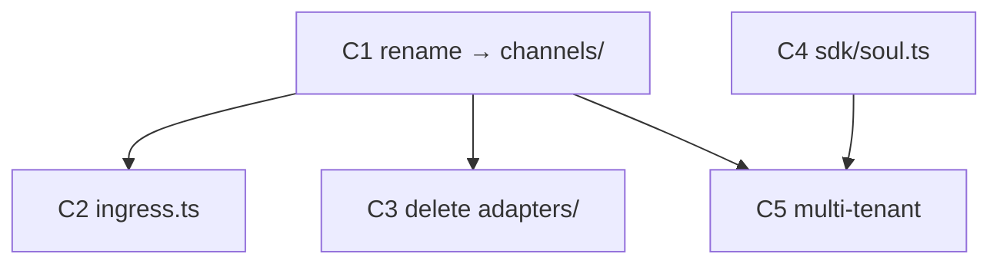
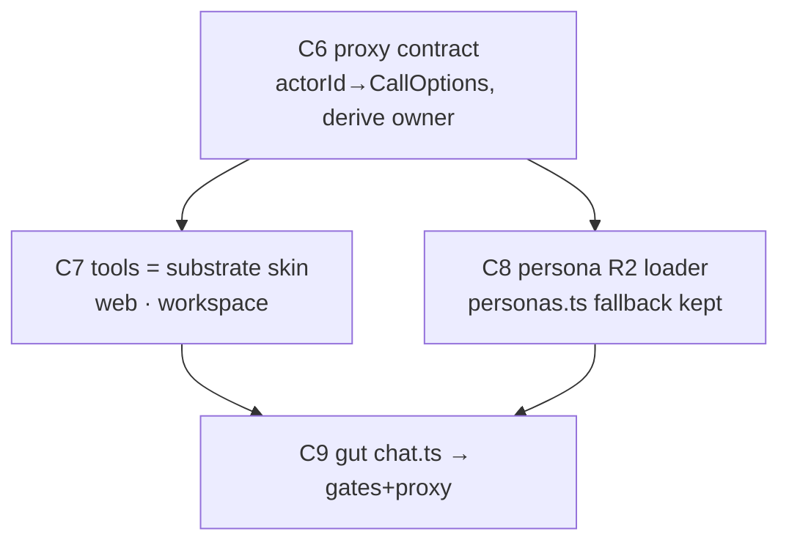

# Clean Architecture — One Agent Runtime

> Architecture reference: **`plans/clean.md`**. C1-C5 (rename, dead-code, soul, multi-tenant) shipped. The back half was **re-planned 2026-05-29** against the real `chat.ts` (1226 lines of gates + agent-turn + ~15 tools): C6-C9 below define one rich **proxy contract**, dissolve tools into **substrate calls**, keep **request-gates in web**, and **unify** (not delete) personas. The seam: web gates → proxies; channels runs the whole turn.

---

## ▶ START HERE (cold `/do` — read this whole block before W1)

**Done + committed** — C1-C5. Do not redo. Commits: `channels eb8c593` · `packages 9ccc080` · `root 663f6a7`. **Begin at Batch 4 (C6).**

**The runtime topology you cannot cheaply rediscover — take these as given:**

1. **`channels/` is a STANDALONE nested git repo** (remote `github.com/one-ie/agents`, gitignored at monorepo root like `packages/`, `api/`). It deploys on its own. → It has **no `@oneie/sdk` dependency and no workspace link** — do NOT add one. Port small pure functions inline instead. Verify a tool with `cd channels && bunx tsc --noEmit` (NOT `bun run verify` — no such script). Tests run on **`bun test`** (native, zero-dep) — NOT vitest; channels has no vitest.
2. **channels already speaks the web client's wire protocol** — `/message` returns `createAgentUIStreamResponse` (UIMessage SSE). The web proxy (C9) is a **transparent passthrough**, not a translation.
3. **channels bindings (post-C5):** `DB` (d1 claw), `ONE_DB` (d1 one-owners), `KV`, `CONTENT` (r2 one-content). It reaches the substrate via `GATEWAY_URL` (`src/substrate.ts`: signal/mark/warn/highways/recall) and can fan out via `src/orchestrate.ts`.
4. **`claw:` data prefix stays literal** (decoupled from the worker name; not a migration). **`personas.ts` stays** (the `one`/`concierge` defaults have no `.md`).

**THE ONE PRINCIPLE that makes this elegant — enforce it in every cycle:**
> **`channels` never fetches `web`.** Every agent tool resolves against the substrate `channels` already owns — D1, CONTENT R2, or a `signal()`/`ask()` on the receiver namespace. There is **no `WEB_URL`, no callback, no web→channels→web cycle.** The tool surface is a thin skin over the substrate. If a cycle has you adding an HTTP call from channels back to one.ie, you took the wrong path — it's a D1/R2 write or a signal.

**The route→primitive map (recon-verified 2026-05-29 — pin for C7 W2, don't re-derive):**

| chat.ts tool | line | dissolves to (channels-native) |
|---|---|---|
| `patch_agent` | ~573 | D1 `agents.frontmatter` UPDATE (`one.ie/web/src/lib/db/agents.ts:patchAgentFrontmatter`); `roster:changed` → `signal()`, not the DO broadcast |
| `patch_theme` | ~645 | D1 `themes.tokens` UPDATE (`lib/db/themes.ts:patchTheme`) |
| `delegate_to` | ~599 | `signal()` via `GATEWAY_URL` (it already POSTs `/api/signal`; same receiver grammar) — consider `orchestrate.ts` |
| `field-service` book | ~729 | D1 `field_service_bookings` INSERT (`api/field-service/[slug]/book.ts`) |
| `emit_card/chips/section/boq/event` | 668/711/721/763/821 | pure output envelopes; **`emit_card` already exists in `channels/src/aitools.ts` — reuse** |
| `skill/compile/import_skill` | 450/554/499 | R2 read/parse via `CONTENT` + port the tiny pure `lib/compile` + agent-md parse |
| `draft_social_post` | ~911 | D1 write — **already exists in `channels/src/aitools.ts` — reuse** |
| `eval` | ~391 | heavy (`lib/eval/runner+grader+aggregate`) → `signal('skill:eval')`/`ask()`, do NOT port the libs |
| `action` tools | ~896 | surface-scoped substrate ops; gate on `viewer.owner` + `surface` |

**Decisions already pinned (C6-C9 W2 — do not re-litigate):** standalone (no sdk dep) · no WEB_URL/callbacks · keep personas.ts · `claw:` literal · `bun test` · outcome revised (no `≤40 lines`) · channels derives `owner` from ONE_DB (identity in, capability derived) · heavy/cross-worker → `signal()`.

---

## Goal, outcome, deliverables, UX

### Goal

There is exactly one LLM runtime (`channels/`); `one.ie/web` is a UI shell that proxies every agent turn to it.

### Outcome (the kill-switch)

```bash
# REVISED 2026-05-29 (elegance pass). The agent turn is gone; the request-gates stay.
# Discriminator: no streamText|tool(|makeAgent in chat.ts AND a CHANNELS_URL fetch exists.
# (The old `≤40 lines` clause was wrong — billing/x402/CRO gates legitimately remain ~80-120 lines.)
! grep -qE 'streamText|tool\(|makeAgent|ToolLoopAgent' one.ie/web/src/pages/api/chat.ts \
  && grep -q CHANNELS_URL one.ie/web/src/pages/api/chat.ts
```

**What passing proves:** No LLM/tool/soul logic remains in `one.ie/web`; `chat.ts` is auth+billing+CRO gates wrapping a one-directional proxy to `channels`.

**Contract:** runs after every batch's W4. Plan does not close until it exits 0. The moment it passes, remaining cycles enter justify-or-drop.

### Deliverables (what actually ships)

| Kind | Path / name | What the user sees or can do | Cycle |
|---|---|---|---|
| dir | `channels/` (was `agents/`) | runtime dir name matches the worker concept | C1 |
| file | `channels/src/ingress.ts` (was `channels.ts`) | Telegram/Discord normalize+send, unambiguous name | C2 |
| delete | `channels/src/adapters/` | 602 lines of dead adapters gone | C3 |
| file | `packages/sdk/src/soul.ts` | `readWorkspaceSoul()` — one soul primitive | C4 |
| feature | channels multi-tenant | `slug` from body, `WORKSPACE_SLUG` fallback, `CONTENT` R2 | C5 |
| feature | proxy contract (`CallOptions` + `/message`) | channels gets identity (`actorId`)+location, derives capability | C6 |
| file | `channels/src/tools/{web,workspace}.ts` | every web tool runs in channels (D1/R2/signal — no web fetch), gated `channel='web'`+owner | C7 |
| feature | per-slug agent `.md` from `CONTENT` R2 | workspace agents drive the turn; `personas.ts` kept as fallback | C8 |
| api | `one.ie/web/src/pages/api/chat.ts` | gates (auth/billing/x402/CRO) wrapping a one-directional proxy to channels | C9 |

### User experience: before → after

| | Today (ux_before) | After this plan (ux_after) |
|---|---|---|
| **Who** | end user chatting with an agent | same |
| **Goal** | get a consistent agent answer on any surface | same |
| **Steps** | web hits `chat.ts` runtime; Telegram hits `agents/` runtime | every surface hits `channels` |
| **Friction** | two runtimes drift → different behavior, no visible reason | one runtime → identical behavior |
| **Feedback** | a tool/persona fix lands on one surface only | a fix lands everywhere at once |

**The improvement (ux_delta):** One source of agent behavior instead of two drifting copies.

**Proof artifact:**

```
# same slug, two surfaces, identical agent identity:
$ curl -s $CHANNELS_URL/message      -d '{"slug":"claw","messages":[...]}' | jq .agent
$ curl -s https://one.ie/api/chat    -d '{"slug":"claw","messages":[...]}' | jq .agent
# → identical
```

---

## Reuse contract

This is a **deletion-and-consolidation** plan — `delta_loc_net` must be strongly negative (1,719 lines of parallel runtime → ~900). No cycle introduces a new abstraction; every cycle either renames, deletes, extracts, or moves existing code. The only net-new file is `packages/sdk/src/soul.ts` (C4), and it *removes* two duplicated copies (`readSoulSuffix` + `buildCompanyContextSuffix`).

Anti-patterns rejected on sight:
- ❌ Any new tool/persona/runtime helper in `one.ie/web` — it goes in `channels`
- ❌ Teaching `channels` about Astro/React — it emits JSON
- ❌ CRO/variant logic in the agent loop — request-level, handle in web middleware

---

## Parallel execution plan

### Cycle-level DAG

**Done (C1-C5):**


**Re-planned back half (C6-C9):**


C6 is the keystone — the contract every later cycle reads. C7 (tool layers) and C8 (persona loader) are disjoint files under that contract → **batch 5 parallel**. C9 composes both.

**Arrow justifications (the only valid kind — file one writes, next reads):**
- `C6 → C7` — C7's tool layers read `viewer`/`surface` from the `CallOptions` that C6 adds to `makeAgent.prepareCall`.
- `C6 → C8` — C8's persona resolver reads the `agentId`/`slug` that C6 threads into the `/message` body + context.
- `C7 → C9` — C9 deletes the tool defs from `chat.ts`; they must exist as layers in channels (C7) first.
- `C8 → C9` — C9's proxied turn relies on channels resolving the persona (C8); otherwise web still owns persona selection.
- **No `C7 → C8` edge** — different files (`tools/*.ts` vs `context.ts`/persona loader); they only share C6's contract, which is a read, not a write-dependency.

### Batches

| Batch | Cycles | Parallel work |
|-------|--------|---------------|
| 1-3 | C1-C5 | **DONE** — committed (channels eb8c593 · packages 9ccc080 · root 663f6a7) |
| 4 | C6 | the proxy contract (keystone) — viewer/surface/agentId through CallOptions |
| 5 | C7, C8 | tool layers ∥ persona R2 loader — disjoint files, one spawn message |
| 6 | C9 | gut chat.ts to gates+proxy — composes C7+C8; closes the outcome (deploy-gated) |

---

## Status

> **Session note (2026-05-29):** C1-C5 SHIPPED + committed (channels eb8c593 · packages 9ccc080 · root 663f6a7). Back half **RE-PLANNED** after recon exposed the original C6/C7/C8 as under-scoped: `chat.ts` is 1226 lines = request-gates + agent-turn + ~15 tools across 3 dependency classes; channels already emits the exact UIMessage-SSE protocol web expects (proxy is transparent). New C6-C9: contract → layers → unify → gut. Outcome revised (dropped the false ≤40-line clause). Next session starts at Batch 4 (C6, the keystone). Deploys for C5 + C9 remain deferred to the user.

```
Batch 0 (shared)
  - [x] W0 baseline (plan-level)
  - [x] W1 shared recon (plan-level) — verified 2026-05-28: name="claw", channels.ts 1 importer,
        adapters/ 602 LOC + 0 imports, readSoulSuffix@prompt.ts:15, buildCompanyContextSuffix@workspace-settings.ts:46,
        chat.ts 1226 lines, personas.ts 93 lines, builder.ts@agents/src/agents/, CONTENT R2 absent

Batch 1
  - [x] C1 — rename agents/ → channels/                state: DONE (full rename: dir+worker name=channels; nested repo intact, remote still one-ie/agents — repo rename deferred to push; tsc delta 0)
    - [x] W1 · [x] W2 · [x] W3 · [x] W4
  - [x] C4 — packages/sdk/src/soul.ts                  state: DONE (readWorkspaceSoul + buildSoulSuffix + SoulDb exported, in dist/; sdk build green after fixing pre-existing auth.ts TS2742)
    - [x] W1 · [x] W2 · [x] W3 · [x] W4
    - NOTE: channels/ has NO @oneie/sdk dependency yet + nothing imports it. C5/C8's "import from @oneie/sdk" premise requires adding the dep first — decide in C5 W2.

Batch 2  (DONE)
  - [x] C2 — channels.ts → ingress.ts                  state: DONE (git mv; index.ts import + header comment updated; tsc 0)
    - [x] W1 · [x] W2 · [x] W3 · [x] W4
  - [x] C3 — delete adapters/                          state: DONE (602 LOC removed; tsc still 0 → confirmed dead)
    - [x] W1 · [x] W2 · [x] W3 · [x] W4

Batch 3
  - [~] C5 — channels multi-tenant                     state: CODE DONE · deploy+HTTP-parity DEFERRED (production)
    - [x] W1 · [x] W2 · [x] W3 · [~] W4 (tsc 0, 6/6 bun tests pass; deploy parity check pending user)
    - DECISION: channels stays standalone — NO @oneie/sdk dep. Kept readSoulSuffix (identical to sdk's readWorkspaceSoul). slug threaded via resolveWorkspaceSlug (body > WORKSPACE_SLUG > 'claw') into loadContext + /message. CONTENT R2 (one-content) bound. claw: data prefix kept literal per W2.

Batch 4  (re-planned — the keystone)
  - [ ] C6 — proxy contract                            state: READY  ← START HERE
    - [ ] W1 · W2 · W3 · W4
    - Enrich /message body + CallOptions with viewer{id,role,owner} + surface + agentId; thread through
      makeAgent.prepareCall. No tool moves, no behavior change — just the data spine later cycles read.

Batch 5  (re-planned — parallel, disjoint files)
  - [ ] C7 — tools = a thin skin over the substrate    state: blocked-on-C6
    - [ ] W1 · W2 · W3 · W4
    - TWO layers: tools/web.ts (emit_* — REUSE existing emit_card) + tools/workspace.ts (patch_agent→D1
      agents, patch_theme→D1 themes, field-service→D1 insert, delegate→gateway signal(), skill/compile/
      import→CONTENT R2 + ported pure libs, eval→signal('skill:eval'), draft_social→REUSE). Wire into
      makeAgent behind channel='web' + viewer.owner. NO WEB_URL — channels never fetches web (no-cycle gate).
  - [ ] C8 — persona R2 loader (unify, don't delete)   state: blocked-on-C6
    - [ ] W1 · W2 · W3 · W4
    - Move findAgent/parseAgentMd/buildPersonaSystem into channels; per-slug agent .md from CONTENT R2;
      personas.ts KEPT as typed worker-default fallback (one/concierge have no .md → no data loss).

Batch 6  (re-planned — closes the outcome)
  - [ ] C9 — gut chat.ts → gates+proxy                 state: blocked-on-C7,C8 · deploy-gated
    - [ ] W1 · W2 · W3 · W4
    - Keep request-gates (auth, billing pool, rate-limit, x402 receipt, CRO variant+cookie); replace the
      entire LLM/tool/soul block with fetch(CHANNELS_URL/message, {slug,group,messages,channel:'web',
      actorId,agentId,surface}) + SSE passthrough. Add CHANNELS_URL to web wrangler (NO WEB_URL — one-
      directional). Deploy + parity check = user.

Plan close
  - [ ] Plan outcome command exits 0
  - [ ] Every deliverables: row shipped and reachable
  - [ ] ux_after parity proof recorded (curl both surfaces, identical agent)
  - [ ] Final compress sweep (ts-prune + noUnusedLocals)
  - [ ] docs/learnings.md append
  - [ ] Plan rubric ≥ 0.65
```

---

## C1 — rename `agents/` → `channels/`  [tier: simple · batch: 1]

**Goal delta:** the runtime directory name matches the worker concept; `agents/` now unambiguously means definitions (`one.ie/agents/`).

**Deliverable:** `channels/` dir + worker `name = "channels"`.

**UX delta:** internal-only — justified: every other cycle targets paths under `channels/`, so this must land first.

**Cycle outcome:** `bun run verify` green AND `ls channels/src/index.ts` exists AND `grep -q 'name = "channels"' channels/wrangler.toml` AND `grep -rl 'agents/src' one.ie/ .claude/ plans/ README.md` returns only intentional refs to `one.ie/agents`.

**Contributes to plan outcome:** partial (foundation).

```yaml
demo:
  command: "test -f channels/src/index.ts && grep -q 'name = \"channels\"' channels/wrangler.toml && bun run verify"
  asserts: "the worker dir+name is channels and the build is green after rename"
  budget:  "<60s wall"
```

### W1 — Recon  [Haiku · parallel]

1. **Existing-code recon**
   - [ ] `agents/wrangler.toml` — confirm `name = "claw"` (line 2), `database_name` refs, R2/D1 bindings to preserve
   - [ ] `agents/package.json` — package name + scripts
   - [ ] every cross-repo reference to `agents/src` or the `agents/` worker: grep `one.ie/`, `.claude/`, `plans/`, root `README.md`, root `CLAUDE.md`, any CI
2. **Primitive-inventory recon**
   - [ ] confirm `one.ie/agents/` (definitions) is a *separate* tree that must NOT move

### W2 — Decide  [Sonnet]

- [ ] **Worker name** — clean.md says `name = "channels"`; current is `claw`. Decide: rename to `channels` (matches dir) — confirm no deploy/route depends on `claw` name.
- [ ] **Reference sweep list** — enumerate every file with `agents/src` or worker-name refs that C1's W3 must edit (root `CLAUDE.md` describes `agents/` as the worker — must update).
- [ ] **Doc-plan** — root `CLAUDE.md` (package map + repo structure), root `README.md`, `agents/CLAUDE.md`.

### W3 — Edit  [Sonnet · parallel]

**W3a:**
- [ ] `git mv agents channels` (preserve history) — via Bash
- [ ] `channels/wrangler.toml` — `name = "channels"`
- [ ] `channels/package.json` — name field
- [ ] root `CLAUDE.md` — repo structure + package map: `agents/` → `channels/`
- [ ] root `README.md` — any `agents/` worker refs
- [ ] `channels/CLAUDE.md` — self-reference update

**W3b:** *(empty)*

### W4 — Verify  [inline composite]

- [ ] `bun run verify` green
- [ ] `delta_tsc_errors ≤ 0`
- [ ] demo command exits 0
- [ ] **doc-sync gate** — 0 stale `agents/src` refs in `**/*.md` except intentional `one.ie/agents`
- [ ] goal-fit ≥ 0.50 · composite ≥ 0.65

---

## C4 — `packages/sdk/src/soul.ts`  [tier: simple · batch: 1]

**Goal delta:** one soul function exists in `@oneie/sdk`, ready to replace two duplicated copies.

**Deliverable:** `packages/sdk/src/soul.ts` exporting `readWorkspaceSoul(db, slug)`, re-exported from sdk index.

**UX delta:** internal-only — justified: C5 imports it; extracting now lets C5/C6 delete the copies.

**Cycle outcome:** `bun --filter @oneie/sdk run build` green AND `grep -q 'readWorkspaceSoul' packages/sdk/src/index.ts`.

```yaml
demo:
  command: "grep -q 'export.*readWorkspaceSoul' packages/sdk/src/soul.ts && grep -q 'soul' packages/sdk/src/index.ts && cd packages && bun run build"
  asserts: "readWorkspaceSoul is exported from @oneie/sdk and the package builds"
  budget:  "<60s wall"
```

### W1 — Recon  [Haiku · parallel]

1. **Existing-code recon**
   - [ ] `agents/src/prompt.ts` — `readSoulSuffix(db, slug)` body + return shape (lines ~12–80)
   - [ ] `one.ie/web/src/lib/in/workspace-settings.ts` — `buildCompanyContextSuffix` (line ~46): does it share logic with readSoulSuffix? note the delta
   - [ ] `packages/sdk/src/index.ts` — export surface + how D1Database type is referenced in sdk
2. **Primitive-inventory recon**
   - [ ] `packages/sdk/src/` — list files; confirm no existing soul/workspace module

### W2 — Decide  [Opus · high]

- [ ] **Compose-or-construct** — soul.ts is net-new but consolidates two copies. Confirm `readSoulSuffix` and `buildCompanyContextSuffix` reduce to ONE function (or one fn + thin adapter). Record the signature.
- [ ] **D1 type in sdk** — how does `@oneie/sdk` reference `D1Database` without a CF Workers dep? (decide: `@cloudflare/workers-types` devDep or a structural type)
- [ ] **Does C4 also delete the originals?** Decide: C4 creates+exports only; C5 swaps `agents` import; the web copy is deleted in C7 (when chat.ts is gutted). Record so W4 doesn't flag the still-present duplicates.

### W3 — Edit  [Sonnet · parallel]

**W3a:**
- [ ] `packages/sdk/src/soul.ts` — create, export `readWorkspaceSoul`
- [ ] `packages/sdk/src/index.ts` — re-export
- [ ] `packages/sdk/CLAUDE.md` — note the new primitive (doc parallel)

**W3b:** *(empty)*

### W4 — Verify  [inline composite]

- [ ] `cd packages && bun run build` green
- [ ] `delta_tsc_errors ≤ 0`
- [ ] demo exits 0
- [ ] goal-fit ≥ 0.50 · composite ≥ 0.65

---

## C2 — `channels.ts` → `ingress.ts`  [tier: trivial · batch: 2]

**Goal delta:** the inbound-normalizer file name no longer collides with the worker name `channels`.

**Deliverable:** `channels/src/ingress.ts` + updated import in `index.ts`.

**UX delta:** internal-only — naming clarity.

**Cycle outcome:** `test -f channels/src/ingress.ts && ! test -f channels/src/channels.ts && bun run verify`.

```yaml
demo:
  command: "test -f channels/src/ingress.ts && bun run verify"
  asserts: "the ingress file is renamed and the build is green"
  budget:  "<60s wall"
```

### W1 — Recon  [inline — ≤2 files]
- [ ] `channels/src/index.ts` — the single import of `./channels`
- [ ] `channels/src/channels.ts` — exported symbols (confirm only index.ts imports it; recon showed 1 importer)

### W2 — Decide  [inline · trivial]
- [ ] confirm zero other importers (grep) → pure rename, no API change.

### W3 — Edit  [Sonnet]
**W3a:**
- [ ] `git mv channels/src/channels.ts channels/src/ingress.ts`
- [ ] `channels/src/index.ts` — update import path

**W3b:** *(empty)*

### W4 — Verify  [inline]
- [ ] `bun run verify` green · `delta_tsc ≤ 0` · demo exits 0 · composite ≥ 0.65

---

## C3 — delete `channels/src/adapters/`  [tier: trivial · batch: 2]

**Goal delta:** 602 lines of unreferenced adapter code removed; runtime surface shrinks.

**Deliverable:** `channels/src/adapters/` gone.

**UX delta:** internal-only — dead-code removal.

**Cycle outcome:** `! test -d channels/src/adapters && bun run verify` (proves nothing imported it).

```yaml
demo:
  command: "! test -d channels/src/adapters && bun run verify"
  asserts: "adapters/ is deleted and the build still passes — confirming it was dead"
  budget:  "<60s wall"
```

### W1 — Recon  [inline]
- [ ] grep the whole `channels/src` tree for `adapters` imports (recon: only a comment in `channels.ts`/`ingress.ts` references the word) — confirm zero `import ... adapters` statements
- [ ] check `channels/src/index.ts`, `integrations`-style files for any dynamic ref

### W2 — Decide  [inline · trivial]
- [ ] verdict: delete. If W1 surfaces ANY real import, halt and re-scope.

### W3 — Edit  [Sonnet]
**W3a:**
- [ ] `rm -rf channels/src/adapters/`
- [ ] `channels/src/ingress.ts` — fix the stale comment that references "Channel adapters" if it implies the dir

**W3b:** *(empty)*

### W4 — Verify  [inline]
- [ ] `bun run verify` green · `delta_loc` strongly negative (~−602) · demo exits 0 · composite ≥ 0.65

---

## C5 — channels multi-tenant  [tier: complex · batch: 3]

**Goal delta:** `channels` resolves the workspace from the request body, so one deployment serves every slug — the precondition for web to proxy in.

**Deliverable:** `loadContext` reads `slug` from body (falls back to `WORKSPACE_SLUG`); `CONTENT` R2 bound; `readWorkspaceSoul` imported from `@oneie/sdk`.

**UX delta:** a web request can specify its own workspace slug and get that workspace's soul/persona.

**Cycle outcome:** `bun run verify` green AND deployed `POST /message` with `{slug:"X"}` returns X's soul; AND a second slug returns a different soul (parity, not single-tenant).

**This is a deploy-surface cycle** (`wrangler.toml` + request handling) → W4 MUST include the post-deploy HTTP check.

```yaml
demo:
  command: "bun vitest run channels/test/multitenant.test.ts"
  asserts: "loadContext resolves soul from body slug, falls back to WORKSPACE_SLUG when absent"
  budget:  "<2s wall · <120 LOC test"
```

### W1 — Recon  [Haiku · parallel]
1. **Existing-code recon**
   - [ ] `channels/src/index.ts` — every `env.WORKSPACE_SLUG ?? 'claw'` site (recon found: index.ts:83, orchestrate.ts:43, substrate.ts:280, lib/emit-event.ts:24)
   - [ ] `channels/src/prompt.ts` — `readSoulSuffix` (to be swapped for sdk import)
   - [ ] `channels/wrangler.toml` — bindings present: DB(claw), ONE_DB(one-owners), KV. **CONTENT R2 NOT bound** (verified 2026-05-28 against agents/wrangler.toml — clean.md's "CONTENT missing" claim is correct; R2 binding work IS needed)
   - [ ] the `/message` handler body parsing — where slug would be read
2. **Primitive-inventory recon**
   - [ ] `@oneie/sdk` — confirm `readWorkspaceSoul` exported (C4 output)

### W2 — Decide  [Opus · high]
- [x] **Plan `outcome:` command** — see frontmatter (REVISED 2026-05-29: `! grep streamText|tool(|makeAgent chat.ts && grep CHANNELS_URL`; the old `≤40 lines` clause was dropped).
- [ ] **slug resolution order** — body.slug > WORKSPACE_SLUG env > 'claw'. Apply at ALL four `?? 'claw'` sites or centralize in `loadContext`/`context.ts`?
- [x] **Data prefix: KEEP `claw:` literal — DECIDED 2026-05-28.** The `claw:${group}` data namespace (9 sites: middleware.ts, tools.ts, substrate.ts, index.ts×4, aitools.ts) is the *data* prefix and is decoupled from the *directory* name. The goal is one runtime serving many slugs — NOT renaming the data namespace. So C5 does NOT rename the prefix and does NOT migrate D1/TypeDB rows. C5 W3 = read slug from body only. (This makes the escape condition's migration worry moot — softened below.)
- [ ] **CONTENT R2** — NOT bound (verified); add the `[[r2_buckets]]` binding to wrangler.toml in W3. (clean.md's "CONTENT missing" claim is correct.)
- [ ] **Compose-or-construct** — no new files expected; this is edits to existing index/context. Confirm.

### W3 — Edit  [Sonnet · parallel]
**W3a:**
- [ ] `channels/src/index.ts` — slug from body; import `readWorkspaceSoul` from `@oneie/sdk`
- [ ] `channels/src/orchestrate.ts` — slug resolution
- [ ] `channels/src/substrate.ts` — slug resolution
- [ ] `channels/src/lib/emit-event.ts` — slug resolution
- [ ] `channels/wrangler.toml` — add `CONTENT` R2 binding (verified absent)
- [ ] `channels/test/multitenant.test.ts` — demo test (new)
- [ ] `plans/clean.md` — mark Step 5 done

**W3b:**
- [ ] `channels/src/prompt.ts` — remove `readSoulSuffix` (now sourced from sdk) once all callers swapped

### W4 — Verify  [Haiku×5 · complex]
- [ ] `bun run verify` green · `delta_tsc ≤ 0`
- [ ] demo test exits 0
- [ ] **deploy + HTTP parity check** (deploy-surface, mandatory):
  ```bash
  for s in claw one; do
    code=$(curl -s -o /dev/null -w "%{http_code}" "$CHANNELS_URL/message?_t=$(date +%s)" -d "{\"slug\":\"$s\",\"messages\":[]}")
    [ "$code" = "200" ] || { echo "FAIL $s → $code"; exit 1; }
  done
  ```
- [ ] **plan outcome re-check** recorded
- [ ] goal-fit ≥ 0.50 · composite ≥ 0.65

---

## C6 — the proxy contract  [tier: complex · batch: 4 · KEYSTONE]

**Goal delta:** `channels` accepts everything an agent turn needs as a JSON payload — `viewer{id,role,owner}`, `surface`, `agentId`, `channel` — so the tool layers (C7) and persona loader (C8) can replace what `chat.ts` reads from Astro `locals`. **No tool moves, no behavior change** — this is the data spine the back half reads.

**Why first:** the original plan's hidden blocker was that chat.ts's tools read Astro `locals` (session, workspaceContext, viewer). channels has no `locals`. Until the contract carries that data, no tool can move. Build the spine once; C7/C8/C9 hang off it.

**Deliverable:** `/message` body schema extended; `CallOptions` gains `viewer`/`surface`; `makeAgent.prepareCall` threads them into `experimental_context`; `index.ts` parses+forwards them. The substrate `ctx()` helper exposes them to tool `execute`.

**UX delta:** internal-only — justified: it's the precondition for every later cycle.

**Cycle outcome:** `bunx tsc --noEmit` clean AND a turn invoked with `{channel:'web', viewer:{owner:true}}` exposes those fields to a tool's `execute` (asserted in test); absent → safe defaults (`channel:'api'`, `viewer:undefined`).

```yaml
demo:
  command: "bun test channels/test/contract.test.ts"
  asserts: "callOptionsSchema accepts viewer+surface; prepareCall forwards them; missing → defaults, never throws"
  budget:  "<2s wall · <100 LOC test"
```

### W1 — Recon  [inline — files already mapped this session]
- [ ] `channels/src/agents/builder.ts` — `callOptionsSchema`, `CallOptions`, `prepareCall` (where `experimental_context` is set)
- [ ] `channels/src/aitools.ts` — `ctx(options)` helper (line ~17) that tools call to read CallOptions
- [ ] `channels/src/types.ts` — `CallOptions` type
- [ ] `channels/src/index.ts` `/message` (now ~line 265) — body parse; `createAgentUIStreamResponse({ options })`

### W2 — Decide  [Opus · high]
- [ ] **Contract shape (identity + location ONLY)** — body carries `{ slug, group, messages, channel, actorId?, agentId?, surface? }`. channel defaults `'api'`. NO `owner`/`role` on the wire. Single source: `callOptionsSchema` + `CallOptions`.
- [ ] **Capability is DERIVED, not trusted** — channels resolves `viewer = { actorId, role, owner }` from `(actorId, slug)` against `ONE_DB` (the same workspace_settings/membership source web uses). Web proves identity (it ran the auth ceremony); channels owns authorization. Missing membership / no actorId → `owner=false` (safe default — never over-grants). Add a tiny `resolveViewer(env, actorId, slug)` (KV-cached) — this is the authz seam.
- [ ] **No Astro leakage** — the contract carries *data*, not Astro objects. channels must never import from `one.ie/web`.

### W3 — Edit  [Sonnet · parallel]
**W3a:**
- [ ] `channels/src/agents/builder.ts` — extend `callOptionsSchema` (`viewer`, `surface`) + `prepareCall` forwards them in `experimental_context`
- [ ] `channels/src/types.ts` — extend `CallOptions` (`viewer`, `surface`)
- [ ] `channels/src/context.ts` (or index.ts) — `resolveViewer(env, actorId, slug)` against ONE_DB, KV-cached
- [ ] `channels/src/index.ts` — `/message` parses `actorId`/`agentId`/`surface`; calls `resolveViewer`; passes derived `viewer` into `options`
- [ ] `channels/test/contract.test.ts` — demo (new): resolveViewer derives owner from a fake ONE_DB; absent → owner=false
**W3b:** *(empty — single-file additions, no same-file collision)*

### W4 — Verify  [inline composite]
- [ ] `bunx tsc --noEmit` delta ≤ 0
- [ ] demo test exits 0 (fields forwarded; defaults safe)
- [ ] goal-fit ≥ 0.50 · composite ≥ 0.65

---

## C7 — tools = a thin skin over the substrate  [tier: complex · batch: 5 · ∥ C8]

**Goal delta:** every chat.ts agent-tool exists in `channels`, resolving against the substrate channels already owns — D1, CONTENT R2, or a `signal()`/`ask()`. **No web fetch, no `WEB_URL`, no cycle.** chat.ts can then shed it all (C9).

**TWO layers (the third — "web-callbacks" — was deleted; those tools dissolve into substrate writes):**

| Layer file | Tools | Gate | Resolves via (channels-native) |
|---|---|---|---|
| `tools/web.ts` | emit_card·section·chips·boq·event | `channel='web'` | pure output envelopes — REUSE existing `emit_card`; rest are identity fns (no deps) |
| `tools/workspace.ts` | patch_agent·patch_theme·delegate·field-service·skill·compile·import_skill·draft_social·action | `channel='web'` + `viewer.owner` | **D1 directly** (patch_agent→`agents.frontmatter`, patch_theme→`themes.tokens`, field-service→`field_service_bookings`, draft_social→REUSE existing); **CONTENT R2** (skill/import + ported pure `compile`/agent-md parse); **gateway `signal()`** (delegate — reuse `substrate.ts`/`orchestrate.ts`); **`signal('skill:eval')`** for heavy `eval` (do NOT port `lib/eval/*`) |

**The rule (enforced):** if a tool's execute would `fetch` one.ie, you took the wrong path — it's a D1/R2 write or a `signal()`. Cross-worker side effects (e.g. `roster:changed` cache-bust) = emit a signal, not an HTTP call. See the route→primitive map in ▶ START HERE.

**Reuse contract:** `emit_card` + `draft_social_post` already exist in `channels/src/aitools.ts` — reference, don't recreate. Net-new = the missing emit_* envelopes + the D1 writers + R2 readers + ported pure `compile`/agent-md.

**Deliverable:** the two files + `makeAgent` wiring (`buildWebTools` when `channel='web'`, `buildWorkspaceTools` when `+ viewer.owner`), mirroring the existing skill/composio layer merge.

**Cycle outcome:** `bunx tsc --noEmit` clean AND a `channel='web' owner=true` turn exposes workspace tools; `channel='telegram'` → substrate-only; **`! grep -rn "WEB_URL\|fetch(.*one\.ie" channels/src/tools/`** (zero web callbacks).

```yaml
demo:
  command: "bun test channels/test/tool-layers.test.ts"
  asserts: "buildWebTools/buildWorkspaceTools return right sets per channel+owner; workspace tools write D1/R2 or signal — never fetch web"
  budget:  "<2s wall · <180 LOC test"
```

### W1 — Recon  [Haiku · parallel — route→primitive map already in ▶ START HERE]
1. **Existing-code recon**
   - [ ] `one.ie/web/src/pages/api/chat.ts` — copy each tool's `inputSchema` (lines in the START HERE map). For the dissolving four, copy the SHAPE, not the fetch — the persistence target is in the map.
   - [ ] `one.ie/web/src/lib/db/{agents,themes}.ts` — `patchAgentFrontmatter`/`patchTheme` D1 SQL to mirror; `api/field-service/[slug]/book.ts` — the INSERT columns
   - [ ] `channels/src/{aitools,substrate,orchestrate}.ts` — reuse `emit_card`/`draft_social_post`; `signal()` for delegate; the `ctx()` reader (exposes viewer/surface after C6)
2. **Primitive-inventory recon**
   - [ ] `one.ie/web/src/lib/{compile,agent-md}` — small pure libs to port (no Astro dep)
   - [ ] confirm `lib/eval/*` is multi-file/heavy → it becomes `signal('skill:eval')`, NOT a port

### W2 — Decide  [Opus · high — most verdicts pre-pinned in START HERE map]
- [ ] **Resolution per tool (confirm against the map)** — pure→inline; single D1/R2 write→channels binding directly; heavy/multi-lib or cross-worker→`signal()`/`ask()`. No tool may fetch web.
- [ ] **Layer assembly** — `buildWebTools(env, opts)` + `buildWorkspaceTools(env, opts)` in `builder.ts`, merged when `opts.channel==='web'` / `+ opts.viewer?.owner`. Mirror skill/composio merge.
- [ ] **allowlist** — carry chat.ts's `ownerAgentToolsAllowlist` (agent-frontmatter tool filter); reads from C8's resolved persona.
- [ ] **Compose-or-construct** — REUSE emit_card/draft_social. New code is writers/envelopes, not re-implementations.

### W3 — Edit  [Sonnet · parallel]
**W3a:** *(new files — no collision)*
- [ ] `channels/src/tools/web.ts` — emit_* envelopes (reuse emit_card)
- [ ] `channels/src/tools/workspace.ts` — D1 writers (patch_agent/patch_theme/field-service) + R2 (skill/compile/import) + `signal()` (delegate, eval) + reuse draft_social
- [ ] `channels/src/lib/compile.ts` (+ agent-md parse) — ported pure libs
- [ ] `channels/test/tool-layers.test.ts` — demo (new)
**W3b:** *(same-file — serial)*
- [ ] `channels/src/agents/builder.ts` — `buildWebTools` + `buildWorkspaceTools`, merged behind the guards

### W4 — Verify  [Haiku×5 · complex]
- [ ] `bunx tsc --noEmit` delta ≤ 0
- [ ] demo exits 0 (right tools per channel+owner)
- [ ] **no-cycle gate** — `! grep -rn "WEB_URL\|fetch(\`?https?://[^\`]*one\.ie" channels/src/tools/` returns nothing
- [ ] **reuse audit** — `emit_card`/`draft_social_post` not duplicated; dissolving tools write substrate, not HTTP
- [ ] goal-fit ≥ 0.50 · composite ≥ 0.65 · no adversarial > 0.5 (owner-gated tools must not leak to non-owner turns)

---

## C8 — persona R2 loader (unify, don't delete)  [tier: complex · batch: 5 · ∥ C7]

**Goal delta:** `channels` resolves a per-slug agent from its `.md` in `CONTENT` R2 (the web `findAgent`/`parseAgentMd`/`buildPersonaSystem` path), so a workspace's own agents drive the turn. `personas.ts` is **kept** as the typed worker-default fallback.

**Why not delete personas.ts:** `one` (the `/message` web default) and `concierge` have **no `.md`** in `one.ie/agents/`. Deleting personas.ts would lose the default agent. Reality-checked 2026-05-28. The elegant move is *unify the lookup*, not *delete the fallback*: per-slug `.md` (R2) → `personas[BOT_PERSONA]` → `personas.one`.

**Deliverable:** `channels/src/context.ts` (or extend `index.ts`) gains `resolvePersona(env, { slug, agentId, botPersona })` → reads `${slug}/agents/${agentId}.md` from `CONTENT` R2, `parseAgentMd` → `Persona`; falls back to `personas[...]` then `personas.one`. `parseAgentMd` + `buildPersonaSystem` ported into channels (small, no Astro dep).

**UX delta:** a workspace editing its agent `.md` changes its agent's behavior on every surface — without a code change.

**Cycle outcome:** `bunx tsc --noEmit` clean AND `resolvePersona` returns a parsed-`.md` persona when R2 has one, and `personas.one` when it doesn't (fallback proven, no crash).

```yaml
demo:
  command: "bun test channels/test/persona-resolve.test.ts"
  asserts: "resolvePersona reads agent .md from a fake CONTENT R2 → Persona; missing slug/agent → personas.one fallback"
  budget:  "<2s wall · <140 LOC test"
```

### W1 — Recon  [Haiku · parallel]
1. **Existing-code recon**
   - [ ] `one.ie/web/src/lib/{agents,agent-md,persona-prompts}` — `findAgent`, `parseAgentMd`, `buildPersonaSystem`, `isPersonaId` — signatures + what they read (R2? D1? frontmatter shape)
   - [ ] `channels/src/personas.ts` — `Persona` type + the 6 defaults (the fallback set)
   - [ ] `channels/src/index.ts` — persona resolution sites (line ~62 loadContext, ~319 /message)
2. **Primitive-inventory recon**
   - [ ] confirm `CONTENT` R2 layout for agents: `${slug}/agents/${name}.md`? (cross-check how web writes them)

### W2 — Decide  [Opus · high]
- [ ] **Resolution order** — `${slug}/agents/${agentId}.md` (R2) → `personas[botPersona]` → `personas.one`. Record it; this is the contract C9's proxy relies on.
- [ ] **Port surface** — copy `parseAgentMd` + `buildPersonaSystem` into `channels/src/lib/agent-md.ts` (pure, no Astro). Do NOT take an `@oneie/sdk` dep (standalone decision, C5). Note frontmatter → `Persona` field mapping + gaps.
- [ ] **Keep personas.ts** — explicitly: it stays as the fallback module. `Persona` type stays its home (or moves to types.ts — decide, but don't delete the data).
- [ ] **Cache** — R2 read per turn is slow; cache parsed persona in KV keyed `persona:${slug}:${agentId}` (TTL 300, like loadContext).

### W3 — Edit  [Sonnet · parallel]
**W3a:**
- [ ] `channels/src/lib/agent-md.ts` — ported `parseAgentMd` + `buildPersonaSystem`
- [ ] `channels/src/context.ts` — `resolvePersona(env, {slug, agentId, botPersona})` with R2→fallback chain + KV cache
- [ ] `channels/test/persona-resolve.test.ts` — demo (new)
**W3b:**
- [ ] `channels/src/index.ts` — `/message` + `loadContext` call `resolvePersona` (replaces the `personas[...] ?? personas.one` inline at ~319)

### W4 — Verify  [Haiku×5 · complex]
- [ ] `bunx tsc --noEmit` delta ≤ 0
- [ ] demo exits 0 (R2 hit → parsed; miss → personas.one)
- [ ] `test -f channels/src/personas.ts` (fallback KEPT — inverted from the old plan)
- [ ] goal-fit ≥ 0.50 · composite ≥ 0.65

---

## C9 — gut chat.ts → gates + proxy  [tier: complex · batch: 6 · CLOSES OUTCOME · deploy-gated]

**Goal delta:** the entire LLM/tool/soul block leaves `chat.ts`; what remains is the request-gates wrapping a `fetch` to `channels`. **This closes the plan outcome.**

**What STAYS in chat.ts (request-gates — NOT agent logic):** auth/viewer resolution, billing pool check (`currentBalance`/`debitPool`), rate-limit, x402 receipt verify, CRO variant pick + cookie header, idle-nudge. These are request-level and correctly live in web.

**What LEAVES (→ channels, already there after C7/C8):** `buildSystem`/persona, soul (`buildCompanyContextSuffix`), memory, every `tool(...)`, `streamText`, provider routing.

**Deliverable:** `chat.ts` = gates → build body `{slug, group, messages, channel:'web', actorId, agentId, surface}` (identity + location only; channels derives owner) → `fetch(env.CHANNELS_URL+'/message', {body})` → return the SSE response (passthrough — channels already emits UIMessage SSE) + CRO cookie headers. `CHANNELS_URL` added to web wrangler. **No `WEB_URL`** — the proxy is one-directional. Realistic size ~80-120 lines (gates), not 20.

**UX delta:** web and Telegram answers are now identical — one runtime.

**Cycle outcome:** the plan `outcome:` grep passes (no `streamText|tool(|makeAgent`, has `CHANNELS_URL`) AND deployed `/api/chat` streams a channels-proxied response.

**Deploy-surface cycle** → W4 HTTP check mandatory (DEFERRED to user).

```yaml
demo:
  command: "bun vitest run one.ie/web/test/chat-proxy.test.ts"
  asserts: "chat.ts forwards enriched body to CHANNELS_URL, passes gates, streams response; grep finds no LLM/tool logic"
  budget:  "<2s wall · <120 LOC test"
```

### W1 — Recon  [Haiku · parallel]
1. **Existing-code recon**
   - [ ] `one.ie/web/src/pages/api/chat.ts` — map the gate sequence precisely: auth (readCookieId/visitorHash/findAgent), billing (currentBalance/computeBurn/debitPool ~1059-1090,1178), rate-limit (rlKey), x402 (verifyReceipt), CRO (pickVariant/readVariantCookie/buildVariantCookieHeader/evaluateRules/shouldNudge). These are the KEEP-set.
   - [ ] `one.ie/web/src/lib/in/workspace-settings.ts` — `buildCompanyContextSuffix` (soul now in channels; delete here once no importer)
   - [ ] `one.ie/web/wrangler.toml` — where to add `CHANNELS_URL`
2. **Primitive-inventory recon**
   - [ ] confirm the SSE response from channels can be returned directly (same `Content-Type`/headers the web client's `useChat` expects)

### W2 — Decide  [Opus · high]
- [ ] **Keep-list (explicit)** — the five gate families above stay; everything else goes. Write the list; W4 greps to confirm nothing agent-shaped remains.
- [ ] **Body** — the C6 contract: `{slug, group, messages, channel:'web', actorId, agentId, surface}`. actorId = web's authenticated identity; channels derives owner. agentId = web's `findAgent` result. No owner/role boolean crosses the wire.
- [ ] **Passthrough** — return `new Response(channelsRes.body, { headers: {...sse, ...croCookie} })` — no re-buffer. Confirm CRO cookie header is set on the proxied response.
- [ ] **delete `buildCompanyContextSuffix`** — confirm no other web importer (it's the soul; soul lives in channels now).

### W3 — Edit  [Sonnet · parallel]
**W3a:**
- [ ] `one.ie/web/src/pages/api/chat.ts` — gates + proxy (the gut)
- [ ] `one.ie/web/wrangler.toml` — add `CHANNELS_URL`
- [ ] `one.ie/web/test/chat-proxy.test.ts` — demo (new)
- [ ] `plans/clean.md` — mark Steps 6-7 + Personas done
**W3b:**
- [ ] `one.ie/web/src/lib/in/workspace-settings.ts` — remove `buildCompanyContextSuffix` (after confirming no importer)

### W4 — Verify  [Haiku×5 · complex]
- [ ] `bun run verify` (web) green · `delta_tsc ≤ 0` · `delta_loc` strongly negative (~−1000 in chat.ts)
- [ ] demo exits 0 · **PLAN OUTCOME grep exits 0** (no streamText|tool(|makeAgent; has CHANNELS_URL)
- [ ] **[DEFERRED — user] deploy + HTTP check** on `https://one.ie/api/chat` (cache-busted) returns 200/stream
- [ ] **[DEFERRED — user] parity proof** — curl web + channels same slug, identical agent identity
- [ ] goal-fit ≥ 0.80 · composite ≥ 0.65

---

## See also

- `plans/clean.md` — the architecture doc this todo executes
- `plans/template-todo.md` — the contract this file follows
- `channels/src/index.ts` — the runtime entry (`/message` already emits UIMessage SSE)
- `channels/src/agents/builder.ts` — `makeAgent` + `CallOptions` (C6 enriches; C7 layers tools)
- `one.ie/web/src/pages/api/chat.ts` — web runtime (C9 guts to gates+proxy)
- `plans/dictionary.md` — canonical names
- `plans/rubrics.md` — scoring bands
