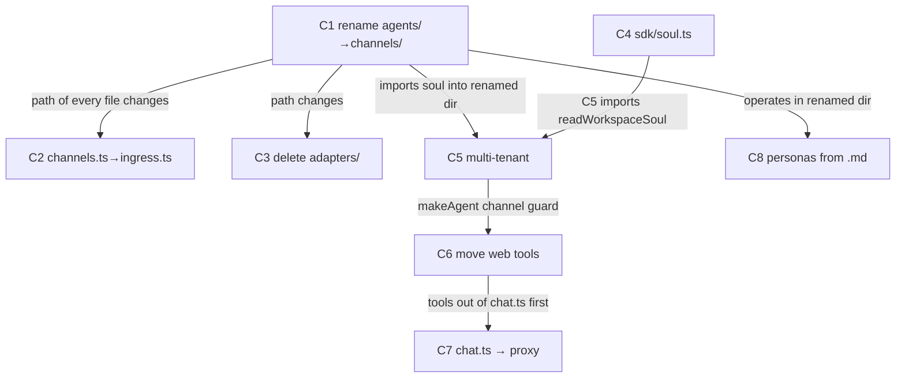

# Clean Architecture — One Agent Runtime

> Architecture reference: **`plans/clean.md`**. This todo executes its 7-step migration plus the personas-from-markdown endpoint as 8 `/do` cycles.

## Goal, outcome, deliverables, UX

### Goal

There is exactly one LLM runtime (`channels/`); `one.ie/web` is a UI shell that proxies every agent turn to it.

### Outcome (the kill-switch)

```bash
# Pinned 2026-05-28. Clause 1 greps streamText|tool( — the primitives chat.ts ACTUALLY uses.
# (Do NOT grep ToolLoopAgent|makeAgent in web: it returns 0 today, before any work — those names
#  live channels-side, so that clause never discriminates "done" from "not started".)
! grep -qE 'streamText|tool\(' one.ie/web/src/pages/api/chat.ts \
  && test "$(wc -l < one.ie/web/src/pages/api/chat.ts)" -le 40 \
  && grep -q CHANNELS_URL one.ie/web/src/pages/api/chat.ts
```

**What passing proves:** No LLM/tool/soul logic remains in `one.ie/web`; `chat.ts` is a thin auth+proxy to `channels`.

**Contract:** runs after every batch's W4. Plan does not close until it exits 0. The moment it passes, remaining cycles enter justify-or-drop.

### Deliverables (what actually ships)

| Kind | Path / name | What the user sees or can do | Cycle |
|---|---|---|---|
| dir | `channels/` (was `agents/`) | runtime dir name matches the worker concept | C1 |
| file | `channels/src/ingress.ts` (was `channels.ts`) | Telegram/Discord normalize+send, unambiguous name | C2 |
| delete | `channels/src/adapters/` | 602 lines of dead adapters gone | C3 |
| file | `packages/sdk/src/soul.ts` | `readWorkspaceSoul()` — one soul primitive | C4 |
| feature | channels multi-tenant | `slug` from body, `WORKSPACE_SLUG` fallback, `CONTENT` R2 | C5 |
| file | `channels/src/tools/{web,workspace}.ts` | web/owner tools live in channels, gated `channel='web'` | C6 |
| api | `one.ie/web/src/pages/api/chat.ts` | ~20-line auth+proxy to channels `/message` | C7 |
| delete | `channels/src/personas.ts` | personas loaded from `one.ie/agents/*.md` at startup | C8 |

### User experience: before → after

| | Today (ux_before) | After this plan (ux_after) |
|---|---|---|
| **Who** | end user chatting with an agent | same |
| **Goal** | get a consistent agent answer on any surface | same |
| **Steps** | web hits `chat.ts` runtime; Telegram hits `agents/` runtime | every surface hits `channels` |
| **Friction** | two runtimes drift → different behavior, no visible reason | one runtime → identical behavior |
| **Feedback** | a tool/persona fix lands on one surface only | a fix lands everywhere at once |

**The improvement (ux_delta):** One source of agent behavior instead of two drifting copies.

**Proof artifact:**

```
# same slug, two surfaces, identical agent identity:
$ curl -s $CHANNELS_URL/message      -d '{"slug":"claw","messages":[...]}' | jq .agent
$ curl -s https://one.ie/api/chat    -d '{"slug":"claw","messages":[...]}' | jq .agent
# → identical
```

---

## Reuse contract

This is a **deletion-and-consolidation** plan — `delta_loc_net` must be strongly negative (1,719 lines of parallel runtime → ~900). No cycle introduces a new abstraction; every cycle either renames, deletes, extracts, or moves existing code. The only net-new file is `packages/sdk/src/soul.ts` (C4), and it *removes* two duplicated copies (`readSoulSuffix` + `buildCompanyContextSuffix`).

Anti-patterns rejected on sight:
- ❌ Any new tool/persona/runtime helper in `one.ie/web` — it goes in `channels`
- ❌ Teaching `channels` about Astro/React — it emits JSON
- ❌ CRO/variant logic in the agent loop — request-level, handle in web middleware

---

## Parallel execution plan

### Cycle-level DAG



C1 and C4 have no edge → batch 1 parallel. C2·C3 independent siblings under C1 → batch 2. C7·C8 touch disjoint files (`chat.ts` vs `context.ts`/`personas.ts`) → batch 5 parallel.

**Arrow justifications:**
- `C1 → C2/C3/C5/C8` — C1 renames `agents/` to `channels/`; every downstream edit targets a path that does not exist until C1 lands on disk.
- `C4 → C5` — C5's `loadContext` imports `readWorkspaceSoul` from `@oneie/sdk`, which C4 creates.
- `C5 → C6` — C6 wires web/workspace tools into the `makeAgent` `channel='web'` guard that C5 introduces.
- `C6 → C7` — C7 deletes `chat.ts`; the tool defs must be moved into `channels` (C6) before they can be deleted from `chat.ts`.

### Batches

| Batch | Cycles | Parallel work |
|-------|--------|---------------|
| 0 | shared | W0 baseline + read of 5 `shared_recon:` files |
| 1 | C1, C4 | dir rename + soul.ts extraction (disjoint trees) |
| 2 | C2, C3 | ingress rename + adapters delete |
| 3 | C5 | multi-tenant |
| 4 | C6 | move web tools |
| 5 | C7, C8 | proxy + personas loader (disjoint files) |

---

## Status

> **Session note (2026-05-28):** Plan refined + recon verified against live code; no code edited yet (runtime is still `agents/`). Pre-pinned this session: plan `outcome:` command, C5 data-prefix decision (keep `claw:` literal), C5 CONTENT-R2 (NOT bound → bind in W3), C8 symbol name (`parseAgentMd`). Next session starts at Batch 1.

```
Batch 0 (shared)
  - [x] W0 baseline (plan-level)
  - [x] W1 shared recon (plan-level) — verified 2026-05-28: name="claw", channels.ts 1 importer,
        adapters/ 602 LOC + 0 imports, readSoulSuffix@prompt.ts:15, buildCompanyContextSuffix@workspace-settings.ts:46,
        chat.ts 1226 lines, personas.ts 93 lines, builder.ts@agents/src/agents/, CONTENT R2 absent

Batch 1
  - [ ] C1 — rename agents/ → channels/                state: ready  ← START HERE
    - [ ] W1 · W2 · W3 · W4
  - [ ] C4 — packages/sdk/src/soul.ts                  state: ready
    - [ ] W1 · W2 · W3 · W4   (W1 verified: readSoulSuffix + buildCompanyContextSuffix located; no sdk/soul.ts yet)

Batch 2  (fires when C1 closes)
  - [ ] C2 — channels.ts → ingress.ts                  state: blocked-on-C1
    - [ ] W1 · W2 · W3 · W4
  - [ ] C3 — delete adapters/                          state: blocked-on-C1
    - [ ] W1 · W2 · W3 · W4

Batch 3
  - [ ] C5 — channels multi-tenant                     state: blocked-on-C1,C4
    - [ ] W1 · W2(2 of 3 decisions pre-pinned: data-prefix + CONTENT-R2) · W3 · W4

Batch 4
  - [ ] C6 — move web tools into channels              state: blocked-on-C5
    - [ ] W1 · W2 · W3 · W4

Batch 5
  - [ ] C7 — chat.ts → proxy                           state: blocked-on-C6
    - [ ] W1 · W2 · W3 · W4
  - [ ] C8 — personas from .md                         state: blocked-on-C1
    - [ ] W1 · W2 · W3 · W4

Plan close
  - [ ] Plan outcome command exits 0
  - [ ] Every deliverables: row shipped and reachable
  - [ ] ux_after parity proof recorded (curl both surfaces, identical agent)
  - [ ] Final compress sweep (ts-prune + noUnusedLocals)
  - [ ] docs/learnings.md append
  - [ ] Plan rubric ≥ 0.65
```

---

## C1 — rename `agents/` → `channels/`  [tier: simple · batch: 1]

**Goal delta:** the runtime directory name matches the worker concept; `agents/` now unambiguously means definitions (`one.ie/agents/`).

**Deliverable:** `channels/` dir + worker `name = "channels"`.

**UX delta:** internal-only — justified: every other cycle targets paths under `channels/`, so this must land first.

**Cycle outcome:** `bun run verify` green AND `ls channels/src/index.ts` exists AND `grep -q 'name = "channels"' channels/wrangler.toml` AND `grep -rl 'agents/src' one.ie/ .claude/ plans/ README.md` returns only intentional refs to `one.ie/agents`.

**Contributes to plan outcome:** partial (foundation).

```yaml
demo:
  command: "test -f channels/src/index.ts && grep -q 'name = \"channels\"' channels/wrangler.toml && bun run verify"
  asserts: "the worker dir+name is channels and the build is green after rename"
  budget:  "<60s wall"
```

### W1 — Recon  [Haiku · parallel]

1. **Existing-code recon**
   - [ ] `agents/wrangler.toml` — confirm `name = "claw"` (line 2), `database_name` refs, R2/D1 bindings to preserve
   - [ ] `agents/package.json` — package name + scripts
   - [ ] every cross-repo reference to `agents/src` or the `agents/` worker: grep `one.ie/`, `.claude/`, `plans/`, root `README.md`, root `CLAUDE.md`, any CI
2. **Primitive-inventory recon**
   - [ ] confirm `one.ie/agents/` (definitions) is a *separate* tree that must NOT move

### W2 — Decide  [Sonnet]

- [ ] **Worker name** — clean.md says `name = "channels"`; current is `claw`. Decide: rename to `channels` (matches dir) — confirm no deploy/route depends on `claw` name.
- [ ] **Reference sweep list** — enumerate every file with `agents/src` or worker-name refs that C1's W3 must edit (root `CLAUDE.md` describes `agents/` as the worker — must update).
- [ ] **Doc-plan** — root `CLAUDE.md` (package map + repo structure), root `README.md`, `agents/CLAUDE.md`.

### W3 — Edit  [Sonnet · parallel]

**W3a:**
- [ ] `git mv agents channels` (preserve history) — via Bash
- [ ] `channels/wrangler.toml` — `name = "channels"`
- [ ] `channels/package.json` — name field
- [ ] root `CLAUDE.md` — repo structure + package map: `agents/` → `channels/`
- [ ] root `README.md` — any `agents/` worker refs
- [ ] `channels/CLAUDE.md` — self-reference update

**W3b:** *(empty)*

### W4 — Verify  [inline composite]

- [ ] `bun run verify` green
- [ ] `delta_tsc_errors ≤ 0`
- [ ] demo command exits 0
- [ ] **doc-sync gate** — 0 stale `agents/src` refs in `**/*.md` except intentional `one.ie/agents`
- [ ] goal-fit ≥ 0.50 · composite ≥ 0.65

---

## C4 — `packages/sdk/src/soul.ts`  [tier: simple · batch: 1]

**Goal delta:** one soul function exists in `@oneie/sdk`, ready to replace two duplicated copies.

**Deliverable:** `packages/sdk/src/soul.ts` exporting `readWorkspaceSoul(db, slug)`, re-exported from sdk index.

**UX delta:** internal-only — justified: C5 imports it; extracting now lets C5/C6 delete the copies.

**Cycle outcome:** `bun --filter @oneie/sdk run build` green AND `grep -q 'readWorkspaceSoul' packages/sdk/src/index.ts`.

```yaml
demo:
  command: "grep -q 'export.*readWorkspaceSoul' packages/sdk/src/soul.ts && grep -q 'soul' packages/sdk/src/index.ts && cd packages && bun run build"
  asserts: "readWorkspaceSoul is exported from @oneie/sdk and the package builds"
  budget:  "<60s wall"
```

### W1 — Recon  [Haiku · parallel]

1. **Existing-code recon**
   - [ ] `agents/src/prompt.ts` — `readSoulSuffix(db, slug)` body + return shape (lines ~12–80)
   - [ ] `one.ie/web/src/lib/in/workspace-settings.ts` — `buildCompanyContextSuffix` (line ~46): does it share logic with readSoulSuffix? note the delta
   - [ ] `packages/sdk/src/index.ts` — export surface + how D1Database type is referenced in sdk
2. **Primitive-inventory recon**
   - [ ] `packages/sdk/src/` — list files; confirm no existing soul/workspace module

### W2 — Decide  [Opus · high]

- [ ] **Compose-or-construct** — soul.ts is net-new but consolidates two copies. Confirm `readSoulSuffix` and `buildCompanyContextSuffix` reduce to ONE function (or one fn + thin adapter). Record the signature.
- [ ] **D1 type in sdk** — how does `@oneie/sdk` reference `D1Database` without a CF Workers dep? (decide: `@cloudflare/workers-types` devDep or a structural type)
- [ ] **Does C4 also delete the originals?** Decide: C4 creates+exports only; C5 swaps `agents` import; the web copy is deleted in C7 (when chat.ts is gutted). Record so W4 doesn't flag the still-present duplicates.

### W3 — Edit  [Sonnet · parallel]

**W3a:**
- [ ] `packages/sdk/src/soul.ts` — create, export `readWorkspaceSoul`
- [ ] `packages/sdk/src/index.ts` — re-export
- [ ] `packages/sdk/CLAUDE.md` — note the new primitive (doc parallel)

**W3b:** *(empty)*

### W4 — Verify  [inline composite]

- [ ] `cd packages && bun run build` green
- [ ] `delta_tsc_errors ≤ 0`
- [ ] demo exits 0
- [ ] goal-fit ≥ 0.50 · composite ≥ 0.65

---

## C2 — `channels.ts` → `ingress.ts`  [tier: trivial · batch: 2]

**Goal delta:** the inbound-normalizer file name no longer collides with the worker name `channels`.

**Deliverable:** `channels/src/ingress.ts` + updated import in `index.ts`.

**UX delta:** internal-only — naming clarity.

**Cycle outcome:** `test -f channels/src/ingress.ts && ! test -f channels/src/channels.ts && bun run verify`.

```yaml
demo:
  command: "test -f channels/src/ingress.ts && bun run verify"
  asserts: "the ingress file is renamed and the build is green"
  budget:  "<60s wall"
```

### W1 — Recon  [inline — ≤2 files]
- [ ] `channels/src/index.ts` — the single import of `./channels`
- [ ] `channels/src/channels.ts` — exported symbols (confirm only index.ts imports it; recon showed 1 importer)

### W2 — Decide  [inline · trivial]
- [ ] confirm zero other importers (grep) → pure rename, no API change.

### W3 — Edit  [Sonnet]
**W3a:**
- [ ] `git mv channels/src/channels.ts channels/src/ingress.ts`
- [ ] `channels/src/index.ts` — update import path

**W3b:** *(empty)*

### W4 — Verify  [inline]
- [ ] `bun run verify` green · `delta_tsc ≤ 0` · demo exits 0 · composite ≥ 0.65

---

## C3 — delete `channels/src/adapters/`  [tier: trivial · batch: 2]

**Goal delta:** 602 lines of unreferenced adapter code removed; runtime surface shrinks.

**Deliverable:** `channels/src/adapters/` gone.

**UX delta:** internal-only — dead-code removal.

**Cycle outcome:** `! test -d channels/src/adapters && bun run verify` (proves nothing imported it).

```yaml
demo:
  command: "! test -d channels/src/adapters && bun run verify"
  asserts: "adapters/ is deleted and the build still passes — confirming it was dead"
  budget:  "<60s wall"
```

### W1 — Recon  [inline]
- [ ] grep the whole `channels/src` tree for `adapters` imports (recon: only a comment in `channels.ts`/`ingress.ts` references the word) — confirm zero `import ... adapters` statements
- [ ] check `channels/src/index.ts`, `integrations`-style files for any dynamic ref

### W2 — Decide  [inline · trivial]
- [ ] verdict: delete. If W1 surfaces ANY real import, halt and re-scope.

### W3 — Edit  [Sonnet]
**W3a:**
- [ ] `rm -rf channels/src/adapters/`
- [ ] `channels/src/ingress.ts` — fix the stale comment that references "Channel adapters" if it implies the dir

**W3b:** *(empty)*

### W4 — Verify  [inline]
- [ ] `bun run verify` green · `delta_loc` strongly negative (~−602) · demo exits 0 · composite ≥ 0.65

---

## C5 — channels multi-tenant  [tier: complex · batch: 3]

**Goal delta:** `channels` resolves the workspace from the request body, so one deployment serves every slug — the precondition for web to proxy in.

**Deliverable:** `loadContext` reads `slug` from body (falls back to `WORKSPACE_SLUG`); `CONTENT` R2 bound; `readWorkspaceSoul` imported from `@oneie/sdk`.

**UX delta:** a web request can specify its own workspace slug and get that workspace's soul/persona.

**Cycle outcome:** `bun run verify` green AND deployed `POST /message` with `{slug:"X"}` returns X's soul; AND a second slug returns a different soul (parity, not single-tenant).

**This is a deploy-surface cycle** (`wrangler.toml` + request handling) → W4 MUST include the post-deploy HTTP check.

```yaml
demo:
  command: "bun vitest run channels/test/multitenant.test.ts"
  asserts: "loadContext resolves soul from body slug, falls back to WORKSPACE_SLUG when absent"
  budget:  "<2s wall · <120 LOC test"
```

### W1 — Recon  [Haiku · parallel]
1. **Existing-code recon**
   - [ ] `channels/src/index.ts` — every `env.WORKSPACE_SLUG ?? 'claw'` site (recon found: index.ts:83, orchestrate.ts:43, substrate.ts:280, lib/emit-event.ts:24)
   - [ ] `channels/src/prompt.ts` — `readSoulSuffix` (to be swapped for sdk import)
   - [ ] `channels/wrangler.toml` — bindings present: DB(claw), ONE_DB(one-owners), KV. **CONTENT R2 NOT bound** (verified 2026-05-28 against agents/wrangler.toml — clean.md's "CONTENT missing" claim is correct; R2 binding work IS needed)
   - [ ] the `/message` handler body parsing — where slug would be read
2. **Primitive-inventory recon**
   - [ ] `@oneie/sdk` — confirm `readWorkspaceSoul` exported (C4 output)

### W2 — Decide  [Opus · high]
- [x] **Plan `outcome:` command** — pinned in frontmatter 2026-05-28 (`! grep streamText|tool( chat.ts && ≤40 lines && CHANNELS_URL`).
- [ ] **slug resolution order** — body.slug > WORKSPACE_SLUG env > 'claw'. Apply at ALL four `?? 'claw'` sites or centralize in `loadContext`/`context.ts`?
- [x] **Data prefix: KEEP `claw:` literal — DECIDED 2026-05-28.** The `claw:${group}` data namespace (9 sites: middleware.ts, tools.ts, substrate.ts, index.ts×4, aitools.ts) is the *data* prefix and is decoupled from the *directory* name. The goal is one runtime serving many slugs — NOT renaming the data namespace. So C5 does NOT rename the prefix and does NOT migrate D1/TypeDB rows. C5 W3 = read slug from body only. (This makes the escape condition's migration worry moot — softened below.)
- [ ] **CONTENT R2** — NOT bound (verified); add the `[[r2_buckets]]` binding to wrangler.toml in W3. (clean.md's "CONTENT missing" claim is correct.)
- [ ] **Compose-or-construct** — no new files expected; this is edits to existing index/context. Confirm.

### W3 — Edit  [Sonnet · parallel]
**W3a:**
- [ ] `channels/src/index.ts` — slug from body; import `readWorkspaceSoul` from `@oneie/sdk`
- [ ] `channels/src/orchestrate.ts` — slug resolution
- [ ] `channels/src/substrate.ts` — slug resolution
- [ ] `channels/src/lib/emit-event.ts` — slug resolution
- [ ] `channels/wrangler.toml` — add `CONTENT` R2 binding (verified absent)
- [ ] `channels/test/multitenant.test.ts` — demo test (new)
- [ ] `plans/clean.md` — mark Step 5 done

**W3b:**
- [ ] `channels/src/prompt.ts` — remove `readSoulSuffix` (now sourced from sdk) once all callers swapped

### W4 — Verify  [Haiku×5 · complex]
- [ ] `bun run verify` green · `delta_tsc ≤ 0`
- [ ] demo test exits 0
- [ ] **deploy + HTTP parity check** (deploy-surface, mandatory):
  ```bash
  for s in claw one; do
    code=$(curl -s -o /dev/null -w "%{http_code}" "$CHANNELS_URL/message?_t=$(date +%s)" -d "{\"slug\":\"$s\",\"messages\":[]}")
    [ "$code" = "200" ] || { echo "FAIL $s → $code"; exit 1; }
  done
  ```
- [ ] **plan outcome re-check** recorded
- [ ] goal-fit ≥ 0.50 · composite ≥ 0.65

---

## C6 — move web tools into channels  [tier: complex · batch: 4]

**Goal delta:** web/owner tool definitions live in `channels`, gated by `channel='web'` — chat.ts no longer needs them.

**Deliverable:** `channels/src/tools/web.ts` (emit_card/section/chips, cro) + `channels/src/tools/workspace.ts` (compile/patch_agent/billing/eval), wired into `makeAgent` behind the channel guard.

**UX delta:** internal-only — but unblocks C7 (the user-visible proxy).

**Cycle outcome:** `bun run verify` green AND a `channel='web'` agent turn exposes emit_card; a non-web turn does not.

```yaml
demo:
  command: "bun vitest run channels/test/web-tools.test.ts"
  asserts: "makeAgent includes web tools only when channel='web' (+ workspace tools only for authed owner)"
  budget:  "<2s wall · <150 LOC test"
```

### W1 — Recon  [Haiku · parallel]
1. **Existing-code recon**
   - [ ] `one.ie/web/src/pages/api/chat.ts` — locate every tool def (emit_card, emit_section, emit_chips, cro, compile, patch_agent, billing, eval); note deps (imports, env, auth checks)
   - [ ] `channels/src/agents/` (makeAgent / ToolLoopAgent builder) — where tools are assembled, how layering works today
   - [ ] `channels/src/tools.ts`, `substrate.ts`, `skill-tools.ts` — existing tool-layering pattern to follow
2. **Primitive-inventory recon**
   - [ ] confirm substrate tools are already a layered set → mirror that shape for web/workspace

### W2 — Decide  [Opus · high]
- [ ] **channel + auth signal** — how does `makeAgent` learn `channel='web'` and "authenticated owner"? (body field, header, context object) — decide the contract.
- [ ] **tool deps that don't belong in channels** — any chat.ts tool that reaches into Astro/session? Decide how it gets its data via the request payload instead.
- [ ] **Compose-or-construct** — `tools/web.ts` + `tools/workspace.ts` are new files but are MOVES (cut from chat.ts), not new behavior. Record LOC budget = roughly the cut size.

### W3 — Edit  [Sonnet · parallel]
**W3a:**
- [ ] `channels/src/tools/web.ts` — emit_* + cro (moved)
- [ ] `channels/src/tools/workspace.ts` — compile/patch_agent/billing/eval (moved)
- [ ] `channels/test/web-tools.test.ts` — demo (new)
**W3b:**
- [ ] `channels/src/agents/builder.ts` (makeAgent) — wire layers behind `channel='web'` + owner guard
- [ ] `one.ie/web/src/pages/api/chat.ts` — delete the moved tool defs (chat.ts still runs until C7)

### W4 — Verify  [Haiku×5 · complex]
- [ ] `bun run verify` green · `delta_tsc ≤ 0`
- [ ] demo exits 0 (web tools present iff channel='web')
- [ ] **reuse audit** — no tool reimplemented; LOC moved ≈ LOC deleted from chat.ts (net ~0 for the move)
- [ ] plan outcome re-check · goal-fit ≥ 0.50 · composite ≥ 0.65

---

## C7 — `chat.ts` → proxy  [tier: complex · batch: 5]

**Goal delta:** every web agent turn routes through `channels`; `one.ie/web` holds zero LLM code. **This closes the plan outcome.**

**Deliverable:** `one.ie/web/src/pages/api/chat.ts` ~20 lines: auth → resolve `CHANNELS_URL` → fetch `/message` → stream back.

**UX delta:** web and Telegram answers are now identical (same runtime).

**Cycle outcome:** plan `outcome:` exits 0 AND deployed `/api/chat` returns a streamed agent response proxied from channels.

**Deploy-surface cycle** → W4 HTTP check mandatory.

```yaml
demo:
  command: "bun vitest run one.ie/web/test/chat-proxy.test.ts"
  asserts: "chat.ts forwards {slug,group,messages} to CHANNELS_URL and streams the response; no tool/soul logic remains"
  budget:  "<2s wall · <120 LOC test"
```

### W1 — Recon  [Haiku · parallel]
1. **Existing-code recon**
   - [ ] `one.ie/web/src/pages/api/chat.ts` — what remains after C6: auth path (`requireAuth`/visitor cookie), streaming setup, x402 verification, CRO/variant selection
   - [ ] `one.ie/web/src/lib/in/workspace-settings.ts` — `buildCompanyContextSuffix` (delete here; soul now in channels)
   - [ ] `one.ie/web/wrangler.toml` — env var setup for `CHANNELS_URL`
2. **Primitive-inventory recon**
   - [ ] confirm auth + streaming helpers exist to reuse in the slim proxy

### W2 — Decide  [Opus · high]
- [ ] **What stays in web** — auth, visitor cookie, x402 route-level verify, CRO (request-level, NOT in proxy body). Record the keep-list explicitly.
- [ ] **streaming passthrough** — how to pipe the channels SSE/stream response back through Astro without re-buffering.
- [ ] **delete `buildCompanyContextSuffix`** — confirm no other importer remains.

### W3 — Edit  [Sonnet · parallel]
**W3a:**
- [ ] `one.ie/web/src/pages/api/chat.ts` — replace with auth+proxy (~20 lines)
- [ ] `one.ie/web/wrangler.toml` — add `CHANNELS_URL`
- [ ] `one.ie/web/test/chat-proxy.test.ts` — demo (new)
- [ ] `plans/clean.md` — mark Steps 6–7 done
**W3b:**
- [ ] `one.ie/web/src/lib/in/workspace-settings.ts` — remove `buildCompanyContextSuffix` (after confirming no importer)

### W4 — Verify  [Haiku×5 · complex]
- [ ] `bun run verify` green · `delta_tsc ≤ 0` · `delta_loc` strongly negative (~−1200 in chat.ts)
- [ ] demo exits 0
- [ ] **deploy + HTTP check** on `https://one.ie/api/chat` (cache-busted) returns 200/stream
- [ ] **PLAN OUTCOME command exits 0** — record it; trigger justify-or-drop on any unstarted cycle
- [ ] **parity proof** — curl web + channels same slug, identical agent identity; paste into close note
- [ ] goal-fit ≥ 0.80 · composite ≥ 0.65

---

## C8 — personas from `.md`  [tier: complex · batch: 5]

**Goal delta:** `channels` has no embedded persona content; personas load from `one.ie/agents/*.md` at startup — "definitions are data, not code" becomes fully true.

**Deliverable:** `channels/src/personas.ts` deleted; `Persona` type moved to `types.ts`; `BOT_PERSONA` resolves to a parsed `.md` by `name:`.

**UX delta:** internal-only — but a persona edit now means editing one `.md`, not TS + `.md`.

**Cycle outcome:** `! test -f channels/src/personas.ts && bun run verify` AND a startup-load test resolves `one` persona from the parsed `.md` inventory.

```yaml
demo:
  command: "bun vitest run channels/test/personas-md.test.ts"
  asserts: "channels loads persona 'one' from one.ie/agents/*.md via parse(); BOT_PERSONA resolves by name"
  budget:  "<2s wall · <120 LOC test"
```

### W1 — Recon  [Haiku · parallel]
1. **Existing-code recon**
   - [ ] `channels/src/personas.ts` — the hardcoded map (one, concierge, cmo, strategist, copywriter, analyst) + `Persona` type
   - [ ] `channels/src/index.ts` — every `personas[...]` / `BOT_PERSONA` lookup (recon: index.ts:62, 316)
   - [ ] `one.ie/agents/*.md` — confirm the roles exist as `.md` with `name:` frontmatter
2. **Primitive-inventory recon**
   - [ ] `@oneie/sdk` `parseAgentMd()` (in `packages/sdk/src/compile.ts`, re-exported `as parse`) — signature + returned shape; does it run in a Worker (no fs)? how are `.md` files bundled or R2-fetched?

### W2 — Decide  [Opus · high]
- [ ] **startup load mechanism** — bundle `one.ie/agents/*.md` as imports, or fetch from `CONTENT` R2 at first request? (Workers have no fs — decide.)
- [ ] **frontmatter ↔ Persona mapping** — does `parse()` output cover every field `personas.ts` provided? Note gaps.
- [ ] **fallback** — if a `.md` is missing/malformed, what does `BOT_PERSONA` resolve to? (don't crash the worker)
- [ ] **Compose-or-construct** — no new file; move `Persona` type into existing `types.ts`, add loader to existing `context.ts`/`index.ts`.

### W3 — Edit  [Sonnet · parallel]
**W3a:**
- [ ] `channels/src/types.ts` — add `Persona` type (moved from personas.ts)
- [ ] `channels/test/personas-md.test.ts` — demo (new)
- [ ] `plans/clean.md` — mark "Personas from Markdown" done
**W3b:**
- [ ] `channels/src/index.ts` (or `context.ts`) — call `parse()` at startup, build inventory, resolve `BOT_PERSONA` by `name`
- [ ] `rm channels/src/personas.ts` (after callers swapped)

### W4 — Verify  [Haiku×5 · complex]
- [ ] `bun run verify` green · `delta_tsc ≤ 0`
- [ ] demo exits 0 (persona resolved from `.md`)
- [ ] `! test -f channels/src/personas.ts`
- [ ] reuse audit · goal-fit ≥ 0.50 · composite ≥ 0.65

---

## See also

- `plans/clean.md` — the architecture doc this todo executes
- `plans/template-todo.md` — the contract this file follows
- `agents/src/index.ts` — current runtime entry (becomes `channels/src/index.ts`)
- `one.ie/web/src/pages/api/chat.ts` — current web runtime (becomes a proxy)
- `plans/dictionary.md` — canonical names
- `plans/rubrics.md` — scoring bands
