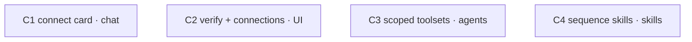

# Composio — Elegant Tool Availability (agents · skills · chat)

## Goal, outcome, deliverables, UX

### Goal

Every Composio toolkit a user has connected is callable in chat and by agents with **scoped, discoverable, verifiable** access.

### Outcome (the kill-switch)

```bash
test -f one.ie/web/src/pages/api/composio/verify.ts && \
test -f one.ie/web/src/pages/api/composio/connections.ts && \
grep -q '"connect"' one.ie/web/src/lib/cards.ts && \
grep -q "integrations" channels/src/personas.ts && \
(cd one.ie/web && bun run verify)
```

**What passing proves:** the two new endpoints exist, the `connect` card kind is defined, the Persona type carries `integrations`, and the web package typechecks + tests green.

**Contract:** runs after every batch's W4. Plan does not close until it exits 0.

### What was already built (corrected state — `plans/composio.md` is stale)

`plans/composio.md` lists the tool bridge as "Not built". It **is** built — verified 2026-05-29:

| Layer | `composio.md` claim | Actual |
|---|---|---|
| `agents/src/composio.ts` (execute bridge) | "new in C1" | **EXISTS** as `channels/src/composio.ts` — `makeComposio` + `composioFallback` |
| Tool bridge → AI SDK | "Not built" | **BUILT** — `composioFallback` returns AI SDK tools via `session.tools()` |
| Tool bridge → chat | "Not built" | **BUILT** — `channels/src/agents/builder.ts` `makeAgent` assembles fallback tools |
| Connect / callback / disconnect routes | partial | **ALL EXIST** — `connect.ts` handles OAuth2 / API_KEY / BASIC / BEARER |
| Skill→toolkit dedup | C4 | **EXISTS** — `SKILL_TOOLKIT_MAP` + `loadSkillTools` |

So this plan **drops** the original C1 (already done) and closes the *real* gaps below.

### The real gaps (this plan)

| Gap | Surface | Cycle |
|---|---|---|
| `makeAgent` loads **every** connected toolkit (unscoped → token bloat); `composioToolsForAgent` scoping exists in web but is unwired in channels | agents | C3 |
| No discoverability — a missing toolkit dead-ends in prose; no connect card kind | chat | C1 |
| `ACTIVE`-but-revoked tokens fail silently (dataforseo EXPIRED); no verify; no list endpoint for badges | chat / UI | C2 |
| Multi-step toolkits (Stripe, LinkedIn URN, Calendar) hallucinate call order | skills | C4 |

### Deliverables (what actually ships)

| Kind | Path / name | What the user sees or can do |
|---|---|---|
| api | `GET /api/composio/connections` | UI lists the user's ACTIVE toolkits |
| api | `GET /api/composio/verify?toolkit=<slug>` | green/red badge — proves the credential actually works |
| card | `CardData` kind `'connect'` | chat renders an inline Connect button when a needed toolkit isn't wired |
| lib | `channels/src/composio.ts` `composioScoped()` | agents get only their declared toolkits |
| frontmatter | `Persona.integrations` + agent `.md` `integrations:` | agents declare which toolkits they use |
| skill | `.claude/skills/composio/rules/sequences/*.md` | agent follows correct call order per toolkit |

### User experience: before → after

| | Today (ux_before) | After this plan (ux_after) |
|---|---|---|
| **Who** | workspace owner chatting / running an agent | same |
| **Goal** | "do X with my connected app" | same |
| **Steps** | connect → hope the agent finds it → silent failure on stale token | connect → verified badge → scoped agent calls it → connect card if missing |
| **Friction** | unscoped toolset, no connect path, silent stale-token failure | scoped, discoverable, verifiable |
| **Feedback** | prose dead-end | inline Connect button + verified badge |

**The improvement (ux_delta):** tools become scoped, discoverable, and verifiable instead of all-or-nothing, silent, and unscoped.

**The one log line a future-you would point at:**

```
chat → "post this to LinkedIn" (LinkedIn not connected)
  → assistant emits emit_card({ kind:'connect', toolkit:'linkedin', authType:'oauth',
      connectUrl:'/u/acme/tools/linkedin', label:'Connect LinkedIn to post' })
  → MessageRenderer renders a Connect button inline (no page nav)
```

---

## Reuse contract

**Power through simplicity.** Every cycle composes an existing primitive; no cycle invents a parallel system.

| Layer | Match | Verdict |
|---|---|---|
| Card system | `cards.ts` union + `MessageRenderer` switch | C1 adds one kind + one case — compose |
| Scoping glue | `composioToolsForAgent` (web/lib) | C3 mirrors the pattern into `channels/src/composio.ts` — extend |
| List/auth | `connect.ts` `connectedAccounts.list` + `locals.slug` | C2 reuses both — compose |
| Skill→toolkit | `SKILL_TOOLKIT_MAP` | C3/C4 reuse — never duplicate |
| Skill entry | `.claude/skills/composio/SKILL.md` | C4 adds sub-rules — extend |

**Anti-patterns rejected on sight:** a new card framework (cards.ts exists) · a second composio SDK wrapper (`makeComposio` exists) · a parallel skill→toolkit map · a bespoke fetch in the new endpoints when the SDK client covers it.

### Reuse audit (mandatory W4 line item — every cycle)

- [ ] new files in cycle total **< LOC budget** (set per cycle in W2)
- [ ] `delta_loc_net ≤ target`
- [ ] no reimplementation of a primitive on the table above (named grep per cycle)

---

## Testing — goal-based, Vitest-first

One demo gate per cycle, zero LLM tokens.

| Cycle | demo.command | asserts |
|---|---|---|
| C1 | `bun vitest run tests/e2e/composio-connect-card.test.ts` | a `connect` CardData renders a button with the connectUrl href |
| C2 | `bun vitest run tests/e2e/composio-verify.test.ts` | verify returns `{ok:false}` for a revoked toolkit, `{ok:true}` for a live one (msw-mocked SDK) |
| C3 | `bun vitest run tests/e2e/composio-scoped.test.ts` | `composioScoped` requesting `[gmail]` while `[gmail,slack]` are connected returns gmail tools only |
| C4 | `test -f .claude/skills/composio/rules/sequences/stripe.md && grep -q 'CREATE_PAYMENT_INTENT' .claude/skills/composio/rules/sequences/stripe.md` | sequence files exist with correct slugs |

C2 mocks the Composio SDK with msw (no live tokens in CI) — see `feedback_no_mocks`: integration tests against real data or skip; the SDK boundary is the accepted msw seam, TypeDB/Sui are never mocked. A live-token smoke test is documented but `skip`-gated behind `COMPOSIO_API_KEY`.

---

## Parallel execution plan

### Goal-proof ordering

C3 (agent scoping) most cheaply reveals the goal is reachable — it proves the "elegant for agents" claim. But all four cycles are file-disjoint, so they run together; C3 just gets first read in the report.

### Cycle-level DAG



**No edges.** Each cycle owns a disjoint file set:
- C1 → `cards.ts`, `MessageRenderer.tsx`, a card component, its test
- C2 → `api/composio/verify.ts`, `api/composio/connections.ts`, badge UI, its test
- C3 → `channels/src/composio.ts`, `personas.ts`, `agents/builder.ts`, agent `.md`, its test
- C4 → `.claude/skills/composio/rules/sequences/*.md`, `SKILL.md`

**Arrow test:** no cycle reads a file another cycle writes → no arrow. The `connect` card kind (C1) is *not* imported by C2's badge UI (separate concern); if W2 finds C2 wants to emit connect cards, it reads the already-shipped kind — but the kind ships in batch 1 alongside, so treat as a soft compose, not a blocker.

### Batches

| Batch | Cycles | What runs in parallel |
|-------|--------|----------------------|
| 0 | shared W0 + W1 | baseline + read of 5 `shared_recon:` files, one Haiku message |
| 1 | C1, C2, C3, C4 | four cycles W1→W4 in lockstep; all W3a edits merge into ONE Sonnet message (file-disjoint) |

Demo gates run in one invocation: `bun vitest run tests/e2e/composio-connect-card.test.ts tests/e2e/composio-verify.test.ts tests/e2e/composio-scoped.test.ts` (C4's gate is bash `test -f`).

---

## Status

```
Batch 0 (shared)
  - [x] W0 baseline (channels tsc=0; web verify deferred to plan close)
  - [x] W1 shared recon (5 files — read inline; earlier garbled renders re-read clean)

Batch 1  (all four parallel)
  - [x] C1 — connect card (chat)                  state: done
    - [x] W1 · W2 · W3 · W4   (cards.ts +connect kind · ConnectCard.tsx · MessageRenderer case · test green)
  - [x] C2 — verify + connections (UI)            state: done
    - [x] W1 · W2 · W3 · W4   (connections.ts · verify.ts + composio-probe.ts · test 5+ green)
  - [x] C3 — scoped toolsets (agents)             state: done
    - [x] W1 · W2 · W3 · W4   (composioScoped · Persona.integrations · builder branch · test 3 green)
  - [x] C4 — sequence skills (skills)             state: done
    - [x] W1 · W2 · W3 · W4   (5 sequence files + SKILL.md pointer · demo PASS)
  - [x] demo batch (vitest c1 c2 c3 + bash c4)

Plan close
  - [ ] Plan outcome command exits 0
  - [ ] Every deliverables: row shipped + reachable
  - [ ] ux_after walkable end-to-end (record the connect-card log line)
  - [ ] Final compress sweep
  - [ ] docs/learnings.md append
  - [ ] Plan rubric ≥ 0.65
```

---

## C1 — connect card (chat surface)  [tier: simple · batch: 1]

**Goal delta:** after this closes, an agent that lacks a toolkit can emit a `connect` card and the user gets an inline Connect button — discoverability replaces the prose dead-end.

**Deliverable:** `CardData` kind `'connect'` + `MessageRenderer` case.

**UX delta:** "post to LinkedIn" with LinkedIn unconnected now renders a Connect button instead of a paragraph telling the user to go find settings.

**Cycle outcome:** `bun vitest run tests/e2e/composio-connect-card.test.ts` passes — a `connect` CardData renders a button whose href is the `connectUrl`.

**Contributes to plan outcome:** yes (`grep '"connect"' cards.ts`).

```yaml
demo:
  command: "bun vitest run tests/e2e/composio-connect-card.test.ts"
  asserts: "a connect CardData renders a Connect button linking to connectUrl"
  budget:  "<2s wall · <80 LOC test"
```

### W1 — Recon  [Haiku · parallel]

1. **Existing-code recon**
   - [ ] `one.ie/web/src/lib/cards.ts` — exact shape of the discriminated union, how a kind is added, any shared base fields (id, etc.)
   - [ ] `one.ie/web/src/components/chat/MessageRenderer.tsx` — the `switch (data.kind)` block + `toolOutputToCard` mapper; how `emit_card` output flows to a card
2. **Primitive-inventory recon**
   - [ ] card component folder (find where `social-draft` / `verify` card components live) — name the closest simple card to clone the shape from
   - [ ] `one.ie/web/src/components/ui/` — confirm `Button`, `Icon`/`IconBadge` exist to compose
   - [ ] `connect.ts` / `callback.ts` — confirm the connect URL shape (`/u/{slug}/tools/{toolkit}`) the card links to

### W2 — Decide  [Sonnet]

- [ ] **Compose-or-construct:** the connect card component composes `ui/Button` + an icon — no new card framework. Verdict per file below.
- [ ] **Connect card shape** confirmed: `{ kind:'connect', toolkit, authType:'oauth'|'api_key'|'basic', connectUrl, label }`
- [ ] How does the agent learn a toolkit is missing? Decision: keep it LLM-driven — persona instruction ("if a requested capability's toolkit isn't in your tools, call emit_card with kind:'connect'") + the connectUrl pattern. No new status tool in C1.
- [ ] **Diff specs** for cards.ts (union add), MessageRenderer (case add), new ConnectCard component

| Proposed file | Closest primitive | Gap | Verdict |
|---|---|---|---|
| `components/chat/cards/ConnectCard.tsx` (or sibling) | existing card component (e.g. social-draft) | none structural — different content | **compose** (clone shape, slot Button+Icon) |

### W3 — Edit  [Sonnet · parallel]

**W3a — independent:**
- [ ] `one.ie/web/src/lib/cards.ts` — add `'connect'` member to `CardData`
- [ ] new `ConnectCard` component — compose `ui/Button` + icon, href = connectUrl
- [ ] `one.ie/web/src/components/chat/MessageRenderer.tsx` — add `case 'connect'`
- [ ] `tests/e2e/composio-connect-card.test.ts` — render-given-prop test
- [ ] `plans/composio.md` — mark C1 (bridge) DONE; point "connect card" here

**W3b:** *(empty — all independent)*

### W4 — Verify  [inline composite]

- [ ] `cd one.ie/web && bun run verify` green
- [ ] `delta_tsc_errors ≤ 0`
- [ ] demo test passes
- [ ] reuse audit: ConnectCard imports `ui/Button`; no new card framework grep clean; `wc -l` ≤ budget
- [ ] deliverable shipped: `grep "'connect'" cards.ts` non-empty
- [ ] goal-fit ≥ 0.50 · composite ≥ 0.65

---

## C2 — verify + connections endpoints (UI surface)  [tier: simple · batch: 1]

**Goal delta:** a connection can be *proven* working (not just `ACTIVE`), and the UI can list connections — killing the silent stale-token failure (dataforseo EXPIRED).

**Deliverable:** `GET /api/composio/connections` + `GET /api/composio/verify?toolkit=<slug>`.

**UX delta:** integrations page shows a green/red verified badge per toolkit.

**Cycle outcome:** `bun vitest run tests/e2e/composio-verify.test.ts` passes (msw-mocked SDK: revoked → `{ok:false}`, live → `{ok:true}`); both files exist.

**Contributes to plan outcome:** yes (both `test -f` checks).

```yaml
demo:
  command: "bun vitest run tests/e2e/composio-verify.test.ts"
  asserts: "verify returns ok:false for a revoked toolkit and ok:true for a live one"
  budget:  "<2s wall · <100 LOC test"
```

### W1 — Recon  [Haiku · parallel]

1. **Existing-code recon**
   - [ ] `one.ie/web/src/pages/api/composio/connect.ts` — `connectedAccounts.list({userIds,statuses})` call, `locals.slug` auth, `COMPOSIO_API_KEY` env, error/JSON response convention
   - [ ] `one.ie/web/src/pages/api/composio/disconnect.ts` — APIRoute shape + auth pattern to mirror
   - [ ] `.claude/rules/api.md` — handler shape contract
2. **Primitive-inventory recon**
   - [ ] verification call per auth type (the "lightest LIST tool" idea in `composio.md § Verification`) — confirm a per-toolkit dry-run slug map exists or must be authored
   - [ ] tools page UI (`/u/[slug]/tools/*`) — where a badge slots in

### W2 — Decide  [Sonnet]

- [ ] **Compose-or-construct:** both endpoints reuse `makeComposio` + `connectedAccounts.list` — no new SDK wrapper.
- [ ] **verify dry-run map:** which lightest read slug per toolkit (gmail→`GMAIL_FETCH_EMAILS {max_results:1}`, linkedin→`LINKEDIN_GET_MY_INFO`, api_key→toolkit LIST tool). Author a small `VERIFY_PROBE: Record<toolkit, {slug,args}>` map; reuse `SKILL_TOOLKIT_MAP` keys.
- [ ] **connections.ts** returns `[{toolkit, accountId, status}]` for `locals.slug`
- [ ] **verify.ts** returns `{ok:boolean, error?:string}` — runs the probe via `composio.tools.execute` (confirm exact SDK method in W1)
- [ ] Diff specs + msw fixture shape for the test

| Proposed file | Closest primitive | Gap | Verdict |
|---|---|---|---|
| `api/composio/connections.ts` | inline list in connect.ts | not a standalone GET | **new** (thin GET; closes "UI can't list") |
| `api/composio/verify.ts` | none | no dry-run prove path | **new** (closes silent stale-token) |
| `lib/composio-probe.ts` (probe map) | SKILL_TOOLKIT_MAP | maps skill→toolkit, not toolkit→probe | **new** (small const map) |

### W3 — Edit  [Sonnet · parallel]

**W3a — independent:**
- [ ] `one.ie/web/src/pages/api/composio/connections.ts` — GET, list ACTIVE for `locals.slug`
- [ ] `one.ie/web/src/pages/api/composio/verify.ts` — GET `?toolkit=`, run probe, `{ok,error?}`
- [ ] probe map module (toolkit → lightest read slug + args)
- [ ] badge UI slot in the tools page (compose, no new page)
- [ ] `tests/e2e/composio-verify.test.ts` — msw-mocked
- [ ] `plans/composio.md` — mark verify/connections shipped

**W3b:** *(empty)*

### W4 — Verify  [Haiku×5 if loops>1, else inline]

- [ ] `cd one.ie/web && bun run verify` green
- [ ] `delta_tsc_errors ≤ 0`
- [ ] demo test passes; `test -f verify.ts && test -f connections.ts`
- [ ] **Live verification (deploy-surface — new api routes):** post-deploy curl `GET /api/composio/connections` → 200/401 (auth), not 500
- [ ] reuse audit: endpoints import `makeComposio`; no bespoke fetch; ≤ LOC budget
- [ ] goal-fit ≥ 0.50 · composite ≥ 0.65

---

## C3 — scoped toolsets (agents surface)  [tier: complex · batch: 1]

**Goal delta:** an agent loads only the toolkits it declares — replacing the unscoped `composioFallback` (every connected toolkit, token bloat) with scoped resolution. This is the "elegant for agents" claim.

**Deliverable:** `channels/src/composio.ts` `composioScoped()` + `Persona.integrations` + agent `.md` `integrations:`.

**UX delta:** the CMO agent sees LinkedIn/Twitter/Mailchimp tools only — not Stripe/GitHub — keeping the LLM context tight and tool-call accuracy high.

**Cycle outcome:** `bun vitest run tests/e2e/composio-scoped.test.ts` passes — `composioScoped` requesting `[gmail]` while `[gmail,slack]` connected returns gmail tools only; `grep integrations channels/src/personas.ts` non-empty.

**Contributes to plan outcome:** yes (`grep integrations personas.ts`).

```yaml
demo:
  command: "bun vitest run tests/e2e/composio-scoped.test.ts"
  asserts: "composioScoped returns only the requested toolkit's tools"
  budget:  "<2s wall · <120 LOC test"
```

### W1 — Recon  [Haiku · parallel]

1. **Existing-code recon**
   - [ ] `channels/src/composio.ts` — `composioFallback` signature + `session.tools()` shape (the sibling to mirror)
   - [ ] `channels/src/agents/builder.ts` — `makeAgent` tool-assembly block (lines ~83-106): how `fallbackTools` is computed; the `loadUserTools` gate
   - [ ] `channels/src/personas.ts` — `Persona` interface (add `integrations?: string[]`)
   - [ ] **the .md → Persona loader** — find where `one.ie/agents/*.md` frontmatter becomes a channels `Persona` (this is the escape-hatch risk: if frontmatter `integrations:` never reaches channels, scoping can't work). grep for persona loading / frontmatter parse in channels + sdk.
   - [ ] `one.ie/web/src/lib/composio.ts` — `composioToolsForAgent` + `composioToolkitsFromAllowlist` (the exact pattern to mirror)
2. **Primitive-inventory recon**
   - [ ] `channels/src/composio-toolkits.ts` — `SKILL_TOOLKIT_MAP` (reuse for skill-covered dedup)
   - [ ] one.ie/agents/cmo.md — current frontmatter to know where `integrations:` slots

### W2 — Decide  [Opus · high]

- [ ] **Compose-or-construct:** `composioScoped` mirrors `composioToolsForAgent` (web/lib) into channels — channels can't import web/lib, so a sibling in `channels/src/composio.ts` is justified. Verdict: **new (small, justified)**.
- [ ] **Scoping vs fallback decision:** `makeAgent` uses `composioScoped(persona.integrations)` when `persona.integrations?.length`; falls back to `composioFallback` (unscoped) only when no integrations declared — backward compatible.
- [ ] **The loader question (load-bearing):** confirm `integrations:` flows from `.md` frontmatter → Persona. If the loader doesn't carry arbitrary frontmatter, the diff must extend it. This is the escape condition — answer it in W2, not W4.
- [ ] **Skill-covered dedup:** scoped toolkits still subtract `coveredToolkits` (skills win) — reuse the existing SKILL_TOOLKIT_MAP dedup.
- [ ] Diff specs for composio.ts, personas.ts, builder.ts, cmo.md (+ 1-2 others)

| Proposed file | Closest primitive | Gap | Verdict |
|---|---|---|---|
| `channels/src/composio.ts` `composioScoped` | `composioToolsForAgent` (web/lib) | wrong package — channels can't import web/lib | **new** (sibling; ~15 LOC) |
| `Persona.integrations` | Persona interface | no integrations field | **extend** |

### W3 — Edit  [Sonnet · parallel]

**W3a — independent:**
- [ ] `channels/src/composio.ts` — add `composioScoped(apiKey, userId, toolkits, covered)` (mirror of web `composioToolsForAgent`, with skill dedup)
- [ ] `channels/src/personas.ts` — add `integrations?: string[]` to `Persona`; add to `cmo` persona
- [ ] one.ie/agents/cmo.md (+ sdr/cs if present) — add `integrations:` frontmatter
- [ ] `tests/e2e/composio-scoped.test.ts` — msw-mocked scoping test
- [ ] `plans/composio.md` — mark C3 scoping shipped

**W3b — dependent (after W3a settles):**
- [ ] `channels/src/agents/builder.ts` — branch on `persona.integrations`: scoped vs fallback (reads the new `composioScoped` export from W3a)
- [ ] the .md→Persona loader (if W2 finds it drops `integrations:`) — carry the field through

### W4 — Verify  [Haiku×5 · complex]

- [ ] `cd channels && bun run verify` green
- [ ] `delta_tsc_errors ≤ 0`
- [ ] demo test passes; `grep integrations channels/src/personas.ts`
- [ ] **escape check:** a declared agent's `integrations:` reaches `makeAgent` (assert in test or trace) — if not, halt per escape
- [ ] reuse audit: `composioScoped` reuses `makeComposio` + `SKILL_TOOLKIT_MAP`; no second SDK wrapper
- [ ] goal-fit ≥ 0.50 · composite ≥ 0.65

---

## C4 — sequence skills (skills surface)  [tier: simple · batch: 1]

**Goal delta:** the agent follows correct multi-step call order for non-trivial toolkits instead of hallucinating it (LinkedIn author URN, Stripe invoice chain, Calendar free-slots-then-create).

**Deliverable:** `.claude/skills/composio/rules/sequences/{linkedin,gmail,stripe,calendar,quickbooks}.md` + a pointer from `SKILL.md`.

**UX delta:** "send an invoice for $200" runs create-customer → create-invoice → finalize → send in order, not a single hallucinated call.

**Cycle outcome:** sequence files exist with correct slugs (`grep CREATE_PAYMENT_INTENT stripe.md`); `SKILL.md` references them.

**Contributes to plan outcome:** partial (skills tier — not in the bash outcome, but completes the "skills" surface).

```yaml
demo:
  command: "test -f .claude/skills/composio/rules/sequences/stripe.md && grep -q 'CREATE_PAYMENT_INTENT' .claude/skills/composio/rules/sequences/stripe.md"
  asserts: "sequence files exist with the correct Composio slugs"
  budget:  "<1s wall · bash only"
```

### W1 — Recon  [Haiku · parallel]

1. **Existing-code recon**
   - [ ] `.claude/skills/composio/SKILL.md` — current structure + `rules/` layout, how sub-rules are referenced
   - [ ] `.claude/skills/composio/rules/` — existing `composio-cli.md` / `building-with-composio.md` shape to match
2. **Primitive-inventory recon**
   - [ ] `~/.composio/tool_definitions/` — confirm real slugs for stripe / linkedin / gmail / calendar / quickbooks (avoid hallucinated slug names)
   - [ ] `plans/composio.md § Skill layer` — the documented sequences to encode

### W2 — Decide  [inline (trivial-ish)]

- [ ] **Compose-or-construct:** these are new doc files under the existing skill — extend, no new skill. Verdict: **new docs (justified — the sequences don't exist)**.
- [ ] Confirm exact slugs from recon (no guessing); one file per toolkit; each: prerequisite → ordered steps → fallback
- [ ] Diff specs: 5 sequence files + a `SKILL.md` reference block

### W3 — Edit  [Sonnet · parallel]

**W3a — independent:**
- [ ] `.claude/skills/composio/rules/sequences/linkedin.md` — GET_MY_INFO (URN) → CREATE_LINKED_IN_POST → fallback
- [ ] `.claude/skills/composio/rules/sequences/gmail.md` — FETCH_EMAILS (thread) → REPLY_TO_THREAD (avoid dup send)
- [ ] `.claude/skills/composio/rules/sequences/stripe.md` — CREATE_CUSTOMER → CREATE_INVOICE → finalize → SEND_INVOICE (+ CREATE_PAYMENT_INTENT)
- [ ] `.claude/skills/composio/rules/sequences/calendar.md` — FIND_FREE_SLOTS → CREATE_EVENT
- [ ] `.claude/skills/composio/rules/sequences/quickbooks.md` — CREATE_CUSTOMER → CREATE_INVOICE
- [ ] `.claude/skills/composio/SKILL.md` — add a "Multi-step sequences" pointer block

**W3b:** *(empty)*

### W4 — Verify  [inline]

- [ ] all five files exist; demo bash passes
- [ ] slugs match real tool definitions (no hallucinated names — spot-grep against `~/.composio/tool_definitions/`)
- [ ] `SKILL.md` references the new sequences (link not broken)
- [ ] goal-fit ≥ 0.50 · composite ≥ 0.65

---

## See also

- `plans/composio.md` — the architecture doc (this todo corrects its stale "State today" and closes the real gaps)
- `channels/CLAUDE.md` — the agent runtime (`makeAgent`, tool layers)
- `plans/dictionary.md` — canonical names
- `plans/rubrics.md` — scoring bands (gate 0.65)
- `.claude/rules/documentation.md` — W2 doc-plan, W4 doc-sync gate
