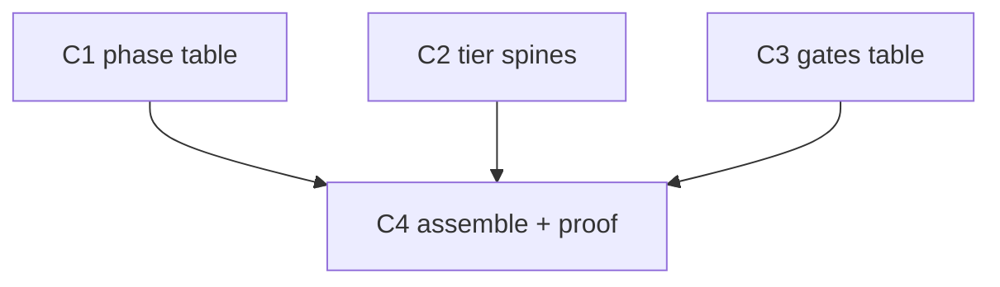

# /do cheat-sheet — plan

## Dependency graph (Mermaid)



C1·C2·C3 are siblings — no edge between them → their recon already ran in parallel (3 agents, one message). Only C4 waits, because it reads what C1–C3 produce.

## Status (ticked live as each lands)

```
Batch 0 (shared)
  - [x] W0 baseline (doc-only → no bun verify)
  - [x] W1 shared recon (3 agents, parallel, one message)

Batch 1  (C1·C2·C3 — fully parallel, disjoint sources)
  - [x] C1 — phase table        (from 000-do.md)        state: done
  - [x] C2 — tier spines        (from do-new.md)         state: done
  - [x] C3 — gates table        (from do-new.md)         state: done

Batch 2  (composes C1-C3)
  - [x] C4 — assemble docs/do-cheatsheet.md + proof      state: done
    - [x] W3 write the doc
    - [x] W4 outcome gate (test -f && grep)  → exit 0

Plan close
  - [x] outcome command exits 0
  - [x] learnings entry
```
