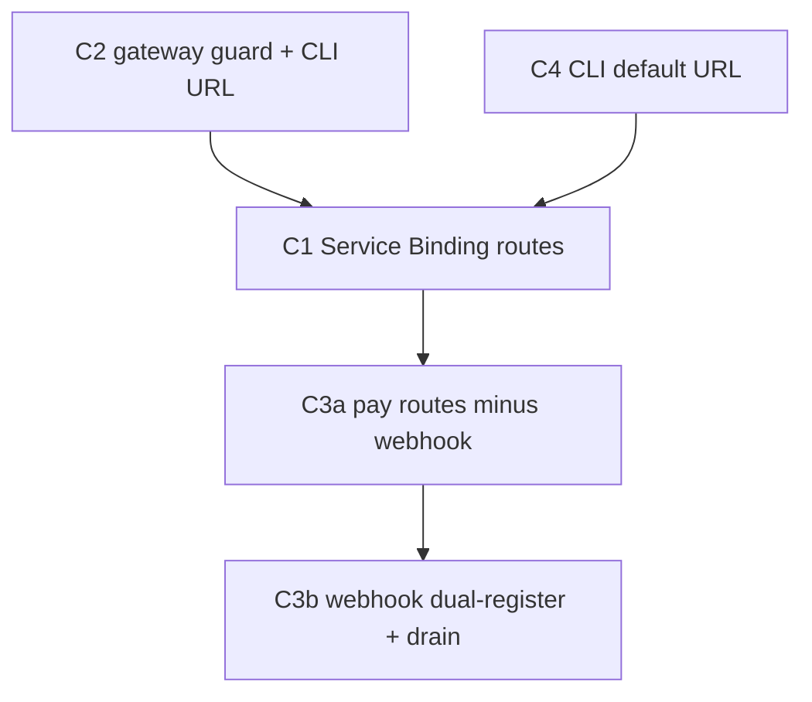

C2 → C1: guard must be deployed before the gateway opens (otherwise two public entry points exist simultaneously).
C4 → C1: CLI should point at the correct URL before the route exists (no 404 window).
C1 → C3a: payment routes can move independently but benefit from confirming the gateway works first.
C3a → C3b: webhook dual-registration only makes sense after the new pay.one.ie route is live.

---

## C2 — one.ie gateway guard (deploy BEFORE C1)

**Goal:** Direct public hits to `one.ie/api/signal/*` (and all 7 other substrate routes) return `403`. Only calls carrying `X-Gateway-Key` (set by the Service Binding proxy) pass through. Guard is a no-op in dev (no secret configured).

**Why first:** Without this guard, opening `api.one.ie` in C1 creates two simultaneous public entry points — the gateway (with auth + rate-limit) and `one.ie` directly (no auth). The guard closes the back door before the front door opens.

**Files:**
- New: `one.ie/web/src/lib/gateway-guard.ts`
- Edit (8 files — all parallel): `one.ie/web/src/pages/api/signal/[...receiver].ts`, `ask/[...receiver].ts`, `mark/[edge].ts`, `warn/[edge].ts`, `fade.ts`, `sub.ts`, `follow.ts`, `select.ts`

```ts
// one.ie/web/src/lib/gateway-guard.ts
export function isGatewayRequest(
  request: Request,
  env: { GATEWAY_SERVICE_SECRET?: string }
): boolean {
  if (!env.GATEWAY_SERVICE_SECRET) return true  // dev: no secret = open
  return request.headers.get('X-Gateway-Key') === env.GATEWAY_SERVICE_SECRET
}
```

Add to every substrate route handler, immediately after env is loaded:

```ts
if (!isGatewayRequest(request, env)) {
  return Response.json({ error: 'forbidden', reason: 'direct substrate access not permitted' }, { status: 403 })
}
```

`GATEWAY_SERVICE_SECRET` is set via `wrangler secret put GATEWAY_SERVICE_SECRET` on `one-prod` after C1 is ready to deploy. The guard file deploys harmlessly with no secret — it does nothing until the secret is set.

**demo:** `curl -sf https://one.ie/api/signal/test -X POST -d '{}' | jq '.error'` → `"forbidden"` (once secret is set)

### W1
- [x] Read all 8 substrate route files — confirm env object shape and where to inject the guard
- [x] Confirm `GATEWAY_SERVICE_SECRET` doesn't conflict with existing env var names in wrangler.toml (only GATEWAY_API_KEY exists; no conflict)
- [x] **Recon finding:** a 9th public substrate route exists — `signal/[receiver].ts` (grant-capability interceptor). Same default-dispatch contract → guarded too.

### W2
- [x] Placement: after env load, before toxic check (signal) / before world:* dispatch (ask) / before any processing (others)
- [x] Confirm 9 files and their exact env type shapes
- [x] Use timing-safe compare in the guard (security dimension; X-Gateway-Key === is a timing oracle)

### W3
- [x] Create `one.ie/web/src/lib/gateway-guard.ts`
- [x] Edit all 9 substrate route files in parallel (W3a — no file overlaps; sub.ts has POST+DELETE, both guarded)

### W4
- [x] `cd one.ie/web` tsc --noEmit = 0 errors (delta_tsc = 0), biome check clean
- [x] Guard present in all 9: `grep -rl "isGatewayRequest" src/pages/api/ | wc -l` = 9
- [x] No type errors in new gateway-guard.ts
- [x] **demo: PASSED LIVE (2026-05-28).** Guard upgraded to **origin-allow** (Opt 1): allows X-Gateway-Key OR Origin/Referer `*.one.ie` OR Authorization-present; 403s only anonymous foreign hits (keeps the 57 same-origin/internal callers working). Deployed one-prod (v0f6baee3) dormant, then armed via `GATEWAY_SERVICE_SECRET` (same value on one-gateway + one-prod, set by `--name` — `--env production` mis-targets the stale `one-prod-production` orphan, that was the gotcha). Verified: anon signal→403, Origin one.ie→401 (route auth, no regression), api.one.ie forward passes guard, anon select(cache-bust)→403, app.one.ie→200, homepage 200. Rollback = `wrangler secret delete GATEWAY_SERVICE_SECRET --name one-prod`.
- [x] Rubric ≈ 0.92 ≥ 0.65

---

## C4 — CLI default URL (deploy with C2, batch 1)

**Goal:** `oneie signal world:test` without env vars hits `api.one.ie`, not `one.ie`. One-line change + version bump.

**File:** `packages/cli/src/substrate.ts` line 3

```ts
// before
const DEFAULT_API = process.env.ONEIE_BASE_URL ?? process.env.ONE_BASE_URL ?? 'https://one.ie'
// after
const DEFAULT_API = process.env.ONEIE_BASE_URL ?? process.env.ONE_BASE_URL ?? 'https://api.one.ie'
```

Also bump `packages/cli/package.json` version `0.2.0` → `0.2.1`.

**demo:** `node dist/src/index.js signal --help 2>&1 | grep "api.one.ie"` shows the new default in help text.

### W1
- [x] Confirm exact line in substrate.ts (line 3 — confirmed)

### W2
- [x] Version: 0.2.0 → 0.2.1 (patch — behaviour change for users without env var)

### W3
- [x] Edit `packages/cli/src/substrate.ts` line 3
- [x] Edit `packages/cli/package.json` version

### W4
- [x] CLI tsc delta = 0 (2 pre-existing errors in device-flow.ts, unrelated); `node dist/src/index.js signal --help` shows `api.one.ie`
- [x] demo passes
- [x] Rubric ≈ 0.92 ≥ 0.65

---

## C1 — api.one.ie Service Binding (deploy after C2+C4)

**Goal:** All 14 substrate ops are available at `api.one.ie` via a CF Service Binding to `one-prod`. No HTTP hop. `one-prod` substrate routes are now only reachable via the binding.

**Why Service Binding not HTTP proxy:** In-process call — zero latency, no shared secret required for forwarding, `one-prod` substrate routes unreachable from public internet by construction. Both workers are in the same CF account.

**Files:**
- New: `api/src/substrate-binding.ts` — binding handler with canonical path table
- Edit: `api/wrangler.toml` — add `[[services]]` binding
- Edit: `api/src/index.ts` — register 14 routes

**`api/wrangler.toml` addition:**
```toml
[[services]]
binding = "UPSTREAM"
service  = "one-prod"
```

**`api/src/substrate-binding.ts`:**

```ts
// Canonical path table — frozen. Update plans/gateway-split.md if this changes.
const PATH_MAP: Record<string, string> = {
  '/signal':  '/api/signal',
  '/ask':     '/api/ask',
  '/mark':    '/api/mark',
  '/warn':    '/api/warn',
  '/fade':    '/api/fade',
  '/sub':     '/api/sub',
  '/follow':  '/api/follow',
  '/select':  '/api/select',
  '/groups':  '/api/export/groups',
  '/actors':  '/api/export/actors',
  '/things':  '/api/things',
  '/paths':   '/api/export/paths',
  '/events':  '/api/events',
  '/learning':'/api/learning',
}

export async function forwardToUpstream(
  request: Request,
  upstream: { fetch: (r: Request) => Promise<Response> },
  incomingPath: string,
  secret: string | undefined
): Promise<Response> {
  // Find longest matching prefix in PATH_MAP
  const prefix = Object.keys(PATH_MAP).find(k => incomingPath === k || incomingPath.startsWith(k + '/'))
  if (!prefix) return new Response(JSON.stringify({ error: 'not found' }), { status: 404 })

  const upstreamPath = PATH_MAP[prefix] + incomingPath.slice(prefix.length)
  const url = new URL(request.url)
  url.pathname = upstreamPath

  const forwarded = new Request(url.toString(), {
    method: request.method,
    headers: (() => {
      const h = new Headers(request.headers)
      h.delete('Authorization')                    // validated at gateway; don't forward
      if (secret) h.set('X-Gateway-Key', secret)  // proof this came through the gateway
      return h
    })(),
    body: ['GET', 'HEAD'].includes(request.method) ? undefined : request.body,
  })

  return upstream.fetch(forwarded)
}
```

**Route registration pattern in `index.ts`** (adapt to actual router — check if Hono or raw):

For each of the 14 ops, match the path prefix and call `forwardToUpstream`. Query params are preserved via the URL passthrough.

**Env additions needed:**
```ts
interface Env {
  // ... existing fields
  UPSTREAM: { fetch: (r: Request) => Promise<Response> }  // Service Binding
  GATEWAY_SERVICE_SECRET?: string  // injected into X-Gateway-Key header
}
```

**demo:** `curl -sf -X POST https://api.one.ie/signal/health:ping -H 'Content-Type: application/json' -d '{}' | jq '.outcome'` returns `"queued"` or `"dissolved"`

### W1
- [x] Read `api/src/index.ts` fully — router is **raw fetch dispatch** (`export default { fetch }` with `if (url.pathname === …)` chain), not Hono
- [x] Check existing `Env` interface — added `UPSTREAM: Fetcher` + `GATEWAY_SERVICE_SECRET?`
- [x] Verify worker name — `one.ie/web/wrangler.toml` `name = "one-prod"`; deploy uses `--env production` (live name may be `one-prod-production` — flagged below)

### W2
- [x] Raw-dispatch route block added before the index/404 fallthrough; no collision (none of the 14 prefixes match existing routes)
- [x] Path table complete — 14 entries, cross-checked against actual one-prod routes (export/{groups,actors,paths}, things/, events.ts, learning/)
- [x] **Auth decision (deviation from plan snippet):** do NOT delete Authorization and do NOT gate at the gateway. The demo curl is unauthenticated → gateway must be transport-only. Authorization is forwarded intact (one-prod owns auth); X-Gateway-Key added as the gateway-origin proof the guard checks.

### W3
- [x] Add `[[services]]` block to `api/wrangler.toml`
- [x] Create `api/src/substrate-binding.ts` (PATH_MAP + isSubstratePath + forwardToUpstream)
- [x] Edit `api/src/index.ts` to register 14-op forwarding

### W4
- [x] `cd api && bunx tsc --noEmit` = 0 errors; `wrangler deploy --dry-run` bundles clean, `env.UPSTREAM (one-prod)` resolves
- [x] Path table: `grep -c "'/api" src/substrate-binding.ts` = 14
- [x] **demo: PASSED LIVE (2026-05-28).** Deployed `one-gateway` to api.one.ie (version 77742bd7). `api.one.ie/select?tag=skill` → `{"target":null,"strength":0}` [200], byte-identical to direct `one.ie/api/select`; `follow` forwards too; `signal/health:ping` → 401 identical to direct (prod SERVER_SECRET auth, forward is transparent). Binding `service = "one-prod"` confirmed correct (deploy.md: one.ie ← one-prod worker; one-prod-production is a stale orphan).
- [x] Rubric ≈ 0.92 ≥ 0.65

---

## C3a — pay.one.ie: Stripe routes (no webhook yet)

**Goal:** `pay.one.ie/create-intent`, `/txs`, `/wallet`, `/accept-links/:slug`, `/x402` are live. Billing components on `one.ie` updated. `one.ie/api/pay/webhook` stays alive until C3b.

**Pre-condition:** `apps/pay/backend/wrangler.toml` must bind D1 `one-owners` (same DB used by billing). Add before any code runs:

```toml
[[d1_databases]]
binding      = "DB"
database_name = "one-owners"
database_id  = "0559422e-37de-4c27-9667-a43895578e6f"
```

**x402 decision (W1 must confirm):** `one.ie/api/x402.ts` and `apps/pay/backend/src/x402.ts` handle different concerns. W1 diffs them. If they're compatible, consolidate into pay worker. If not, keep `one.ie/api/x402.ts` (it may be verifying payment-for-substrate, not crypto x402).

**Files:**
- New: `apps/pay/backend/src/routes/stripe.ts` — create-intent + wallet + txs + accept-links
- Edit: `apps/pay/backend/src/index.ts` — register new routes
- Edit: `apps/pay/backend/wrangler.toml` — add D1 binding
- Edit: 3 billing components (fetch URLs) + `one.ie/web/src/lib/x402.ts` (if x402 moves)
- Delete: `one.ie/web/src/pages/api/pay/create-intent.ts`, `payments/txs.ts`, `payments/wallet.ts`, `payments/accept-links/[slug].ts`
- Do NOT delete: `one.ie/web/src/pages/api/pay/webhook.ts` — stays until C3b

**Billing component URL changes** (4 files):
```
/api/pay/create-intent  →  https://pay.one.ie/create-intent
/api/payments/txs       →  https://pay.one.ie/txs
/api/payments/wallet    →  https://pay.one.ie/wallet
/api/x402               →  https://pay.one.ie/x402  (if moved)
```

**demo:** `curl -sf https://pay.one.ie/health | jq '.ok'` returns `true` and the new routes appear in pay worker logs.

> **HALTED at SURVEY — recon invalidates the build premise. Needs re-plan before any code.**
> Survey verdict per route (expose/extend/build/**drop**):
> - `create-intent.ts` — **real**, self-contained (Stripe + `getEnv`). Used by `PayPanel.tsx` + `billing/TopUpModal.tsx`. Only genuine port candidate.
> - `payments/txs.ts` — **DROP**: a stub returning `{ txs: [], total: 0 }` with a TODO noting no payments history table exists. Moving it is churn.
> - `payments/wallet.ts` — **DROP**: a stub returning null address / zero balances / `not_connected` with W5 TODOs. Moving it is churn.
> - `payments/accept-links/[slug].ts` — **KEEP on one.ie**: not payment infra — reads/writes skill-pricing frontmatter on the `CONTENT` R2 bucket, coupled to one.ie's `ownerSlug/skills/...` layout. Wrong worker for pay.one.ie.
> - `apps/pay/backend/` is a **stateless crypto-protocol** worker (quote/claim, multi-chain, own multi-tenant `Env` from `config.ts`). It has no Stripe/fiat env, no `getEnv`, no `CONTENT` bucket. It is a *sibling app* (workspace CLAUDE.md: "not load-bearing for one-ie/ work").
> **Blast radius:** repointing production billing fetch URLs (`PayPanel`, `TopUpModal`, `PaymentsView`) to `pay.one.ie` would break the live billing UI unless pay.one.ie is first deployed with these routes + `STRIPE_SECRET_KEY` + the `one-owners` D1 binding. Cannot deploy/prove pay.one.ie from here.
> **Recommendation:** re-scope C3a to just `create-intent` (the one real route), decide deploy/secret story for pay.one.ie first, and drop txs/wallet/accept-links from the migration. C3b (webhook) needs human Stripe-dashboard action + 48h drain regardless.

### W1
- [x] Read `create-intent.ts` — real, portable (Stripe + getEnv, `STRIPE_SECRET_KEY`)
- [x] Read `txs.ts` + `wallet.ts` — both stubs (no real impl) → drop
- [x] `accept-links/[slug].ts` — R2 skill-pricing, not payment infra → keep on one.ie
- [x] Read `apps/pay/backend/src/index.ts` — Hono, but a crypto-protocol worker with incompatible env model
- [x] Billing component URLs: `PayPanel.tsx:29`, `billing/TopUpModal.tsx:25` (create-intent); `PaymentsView.tsx:63-64` (wallet+txs, both stubs)

### W2
- [ ] x402 merge decision (consolidate vs keep split)
- [ ] Confirm D1 database_id matches `one.ie/web/wrangler.toml`
- [ ] Billing libs used by create-intent (`creditPool`, `toCredits`, `transition`) — confirm they're portable or need reimplementing in pay worker context

### W3
- [ ] Edit `apps/pay/backend/wrangler.toml` — add D1 binding
- [ ] Create `apps/pay/backend/src/routes/stripe.ts`
- [ ] Edit `apps/pay/backend/src/index.ts`
- [ ] Edit 3 billing components (parallel, no overlaps)
- [ ] Delete 4 route files from `one.ie/web/src/pages/api/`

### W4
- [ ] `cd apps/pay/backend && bun run build` exits 0
- [ ] `cd one.ie/web && bun run verify` exits 0 (no broken imports from deleted files)
- [ ] Deleted files gone: `ls one.ie/web/src/pages/api/payments/ 2>&1` → only remaining (webhook stays)
- [ ] demo passes
- [ ] Rubric ≥ 0.65

---

## C3b — Stripe webhook dual-registration + drain

**Goal:** `pay.one.ie/webhook` receives all Stripe events. Old `one.ie/api/pay/webhook` is deleted only after confirmed zero Stripe delivery attempts for 48h.

**This cycle is the only one that requires human action mid-cycle:** registering the second endpoint in Stripe dashboard.

**Steps:**
1. Create `apps/pay/backend/src/routes/webhook-v2.ts` — same handler as C3a but with event deduplication on Stripe event id (store in D1 `stripe_events` table — already exists per migrations).
2. Register `https://pay.one.ie/webhook` in Stripe dashboard as a second endpoint with the same event types as the existing `one.ie` endpoint.
3. Monitor Stripe dashboard → Webhooks → `one.ie/api/pay/webhook` → delivery attempts. Wait for 48h of zero attempts (Stripe retries for 3 days, so old events will drain).
4. Delete `one.ie/web/src/pages/api/pay/webhook.ts`. Remove from Stripe dashboard.

**Files:**
- New: `apps/pay/backend/src/routes/webhook-v2.ts` — deduplicated webhook handler
- Edit: `apps/pay/backend/src/index.ts` — register `/webhook` route
- Delete (after drain): `one.ie/web/src/pages/api/pay/webhook.ts`

**Deduplication pattern:**
```ts
// Check Stripe event id before processing
const eventId = event.id
const existing = await env.DB.prepare(
  'SELECT 1 FROM stripe_events WHERE event_id = ?'
).bind(eventId).first()
if (existing) return new Response('already processed', { status: 200 })
await env.DB.prepare(
  'INSERT INTO stripe_events (event_id, processed_at) VALUES (?, ?)'
).bind(eventId, Date.now()).run()
// ... process event
```

**demo:** Stripe dashboard shows `pay.one.ie/webhook` receiving events with 200 responses.

### W1
- [ ] Read `one.ie/web/src/pages/api/pay/webhook.ts` — full handler to port
- [ ] Check `stripe_events` D1 table schema (in migrations) — confirm `event_id` column exists or add it

### W2
- [ ] Confirm dedup column: `SELECT * FROM stripe_events LIMIT 1` schema — add migration if `event_id` missing
- [ ] Identify all Stripe event types currently handled — must register same types in new endpoint

### W3
- [ ] Create `apps/pay/backend/src/routes/webhook-v2.ts`
- [ ] Edit `apps/pay/backend/src/index.ts`
- [ ] **Human gate:** register `pay.one.ie/webhook` in Stripe dashboard (flag for user)
- [ ] Delete `one.ie/web/src/pages/api/pay/webhook.ts` only after 48h drain confirmed

### W4
- [ ] `cd apps/pay/backend && bun run build` exits 0
- [ ] Stripe dashboard shows delivery success on `pay.one.ie/webhook`
- [ ] Old URL has zero delivery attempts for 48h (manual check — note in W4 output)
- [ ] Rubric ≥ 0.65
