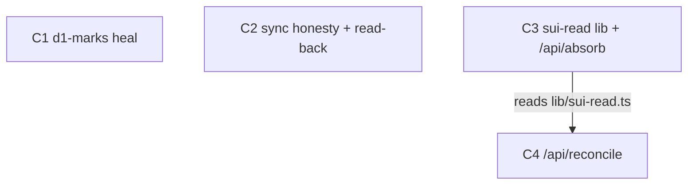

title: Reconciliation — make "truth reconciles" true
slug: reconcile
type: plan
tier: complex
mode: construction
tags: [sync, reconciliation, typedb, d1, sui, substrate]

# ─── GOAL CONTRACT ───────────────────────────────────────────────────

goal: "The sync worker's reconciliation jobs hit live endpoints that detect and heal store divergence, and the worker reports per-job health instead of stamping unconditional success."
outcome: "cd one.ie/web && bun vitest run tests/integration/reconcile.test.ts"
outcome_asserts: "All three reconciliation endpoints (/api/sync/d1-marks, /api/absorb, /api/reconcile) return non-404, the D1→TypeDB round-trip heals an injected drift against a live gateway (or skips cleanly when GATEWAY_API_KEY is absent — no mocks), and the sync status object distinguishes per-job success from failure."

deliverables:
  - api:    POST /api/sync/d1-marks — heals edges where D1 path totals are ahead of TypeDB (dropped-write repair) [C1]
  - worker: sync/index.ts — per-job status object + read-back verify on Job 1; `sync_status` KV key; `synced_at` only on full success [C2]
  - lib:    one.ie/web/src/lib/sui-read.ts — thin @mysten/sui/client wrapper: query events from cursor + read wallet balance [C3]
  - api:    POST /api/absorb — absorb Sui Marked/Warned/UnitCreated events into TypeDB, advance cursor idempotently [C3]
  - api:    POST /api/reconcile — per-wallet on-chain balance vs TypeDB signal ledger; mismatch writes a security hypothesis [C4]
  - doc:    sync/CLAUDE.md — corrected cadence, job table, and conflict-resolution reflecting real behaviour [C2]

ux_before: "The sync worker calls three endpoints that 404 every 5 minutes, swallows the errors, and stamps `synced_at` regardless — so a dashboard reads green while D1, Sui, and TypeDB silently drift."
ux_after: "The three jobs hit real endpoints that reconcile (or flag drift), and the worker publishes a `sync_status` object where any failed job is visibly failed — green means reconciled, not merely 'ran'."
ux_delta: "Silent drift behind a lying green light becomes per-job health that surfaces divergence the moment it happens."

# ─── PARALLELISM CONTRACT ────────────────────────────────────────────

parallel_budget:
  haiku:   20
  sonnet:  10
  opus:    2

batches:
  - [C1, C2, C3]
  - [C4]

shared_recon:
  - one.ie/web/src/lib/substrate.ts
  - sync/index.ts
  - sync/CLAUDE.md
  - one.ie/web/src/pages/api/sync/sweep-role-grants.ts
  - schema/one.tql

# ─────────────────────────────────────────────────────────────────────

source_of_truth:
  - one.ie/web/src/lib/substrate.ts
  - sync/index.ts
  - sync/CLAUDE.md
  - schema/one.tql
  - plans/dictionary.md
existing_primitives:
  - one.ie/web/src/lib/substrate.ts: "mark() / warn() / typedbQuery(env,tql,write) / d1Mark() — C1 reuses for every TypeDB + D1 path write; NEVER reimplement the path-upsert TQL"
  - one.ie/web/src/pages/api/sync/sweep-role-grants.ts: "the only working sync-route — its auth-header + JSON-response skeleton is the template C1/C3/C4 copy"
  - "@mysten/sui": "already a dependency (sui-wallet.ts uses @mysten/sui/verify) — C3 composes @mysten/sui/client SuiClient for RPC reads; do NOT add a new Sui SDK"
  - one.ie/web/src/lib/substrate.ts (hypothesis path): "verifyHypothesis()/forgetHypothesis() + signal('learning:*') — C4 composes this to write the security hypothesis on drift; do not invent a new learning write"
  - "KV version-tag pattern (sys-110)": "sync/index.ts already bumps `version:{key}`; C2 extends the same KV-status convention for `sync_status` — no new mechanism"
show: false
escape:
  condition: "C3 W4 fails twice because Sui RPC event-schema / cursor semantics don't match assumptions"
  action: "halt C3/C4; the @mysten/sui event shape is the unknown — verify against a live testnet object before retrying. C1+C2 still ship independently."
context_triggers:
  - pattern: "signal|amount|ledger|balance"
    inject: "schema/one.tql § signal relation (sender, receiver, payload, amount, success, latency, ts, scope)"
  - pattern: "hypothesis|security|drift"
    inject: "plans/dictionary.md § Learning dimension"
---

# Reconciliation — make "truth reconciles" true

## Goal, outcome, deliverables, UX

Everything below this section is *how*. This section is *what*.

### Goal

The sync worker's reconciliation jobs hit live endpoints that **detect and heal** store divergence, and the worker reports **per-job health** instead of stamping unconditional success.

### Outcome (the kill-switch)

```bash
cd one.ie/web && bun vitest run tests/integration/reconcile.test.ts
```

**What passing proves:** all three endpoints return non-404; the D1→TypeDB round-trip heals an injected drift against a live gateway (or skips cleanly when `GATEWAY_API_KEY` is absent — **no mocks**, per the repo rule); and the published `sync_status` distinguishes a failed job from a succeeded one.

**Contract:** runs after every batch's W4. Plan does not close until it exits 0. The moment it passes, remaining cycles enter justify-or-drop.

### Deliverables (what actually ships)

| Kind | Path / name | What the operator sees or can do | Cycle |
|---|---|---|---|
| api | `POST /api/sync/d1-marks` | Edges where D1 is ahead of TypeDB (dropped TypeDB writes) get healed; returns `{edges_synced, drift_healed, total_marks}` | C1 |
| worker | `sync/index.ts` + `sync_status` KV key | Per-job `{ok\|fail, detail}`; Job 1 read-back verified; `synced_at` only stamped when no critical job failed | C2 |
| lib | `one.ie/web/src/lib/sui-read.ts` | `queryEventsFrom(cursor)` + `walletBalance(addr)` over `@mysten/sui/client` | C3 |
| api | `POST /api/absorb` | Absorbs on-chain `Marked`/`Warned`/`UnitCreated` into TypeDB; advances `sui_event_cursor` idempotently | C3 |
| api | `POST /api/reconcile` | Per-wallet on-chain balance vs TypeDB signal-amount ledger; mismatch writes a security hypothesis; returns `{ok, mismatch, error}` | C4 |
| doc | `sync/CLAUDE.md` | Cadence (`*/5`, not "every minute"), corrected job numbering, conflict-resolution matching code | C2 |

### User experience: before → after

| | Today (ux_before) | After this plan (ux_after) |
|---|---|---|
| **Who** | Operator / future-you reading sync health | same |
| **Goal** | Trust that the stores agree | same |
| **Steps** | Read `synced_at` → assume green = reconciled | Read `sync_status` → see each job's verdict |
| **Friction** | 3 of 4 jobs 404 silently; drift is invisible | drift surfaces per-job the tick it happens |
| **Feedback** | A bare timestamp that's always fresh | a structured per-job health object |

**The improvement (ux_delta):** silent drift behind a lying green light becomes per-job health that surfaces divergence immediately.

**The one log line a future-you would point at:**

```json
// GET the sync_status KV key after a tick where Sui RPC was down:
{
  "ts": 1748500000000,
  "jobs": {
    "export":    { "ok": true,  "changed": ["paths.json"], "verified": true },
    "absorb":    { "ok": false, "detail": "sui rpc timeout", "cursor_held": true },
    "d1_marks":  { "ok": true,  "edges_synced": 3, "drift_healed": 1 },
    "reconcile": { "ok": true,  "mismatch": 0 },
    "sweep":     { "ok": true,  "swept": 0 }
  },
  "synced_at_stamped": false   // because a critical job failed
}
```

---

## Reuse contract

**Power through simplicity.** Every cycle answers compose-or-construct before W3 spawns an agent. The only justified new files in this plan are the three route handlers, one Sui-read wrapper, and one integration test — every TypeDB/D1 write composes `substrate.ts`; every route copies the `sweep-role-grants.ts` skeleton; the Sui client composes `@mysten/sui/client`.

**Rejected on sight:** re-implementing path-upsert TQL (use `mark`/`warn`), adding a second Sui SDK (`@mysten/sui` is already in), a new learning-write path (compose the hypothesis helpers), a bespoke KV-status mechanism (extend the `version:` convention).

Every W4 runs the reuse audit: new-file LOC under the cycle budget, `delta_loc_net` ≤ target, named grep proving no primitive was re-implemented.

---

## Testing — goal-based, Vitest-first, no mocks

**The rule.** One demo gate per cycle: a bash command that exits 0 = pass, zero LLM tokens.

**No-mocks (repo law).** Integration tests run against real TypeDB/Sui or **skip** — never `vi.mock` the gateway to make a red test green. The reconcile test skips its round-trip when `GATEWAY_API_KEY` is unset; the assertion that always runs is endpoint-existence (route returns non-404) and the pure status-shaping logic.

| Test type | Use for | Default |
|---|---|---|
| Vitest pure | status-object shaping, drift-delta math, cursor advance | default |
| Vitest + real gateway (skip if no key) | D1→TypeDB heal round-trip, absorb idempotency | network/DB |

---

## Parallel execution plan

### Goal-proof ordering

**C1 (d1-marks) is the cheapest proof the goal is reachable** — it reconciles two stores we already write to (D1 + TypeDB) with zero Sui dependency, against real TypeDB. If C1's heal round-trip passes, the reconciliation *pattern* is proven and the Sui cycles are "same shape, harder source." So C1 leads batch 1.

### Cycle-level DAG



C1, C2, C3 have **no edge between them** → fully parallel (file-disjoint: C1 writes a new route, C2 edits `sync/index.ts` + docs, C3 writes a new lib + new route). C4 is the only arrow: it imports `lib/sui-read.ts` that C3 creates.

**Arrow test:** `C4 → C3 because C4's /api/reconcile reads on-chain balance via one.ie/web/src/lib/sui-read.ts which C3 creates.` ✓ exact file named.

### Batches

| Batch | Cycles | Runs in parallel |
|---|---|---|
| 0 | shared W0 + W1 | baseline + read of all 5 `shared_recon:` files, one Haiku message |
| 1 | C1, C2, C3 | three cycles W1→W4 in lockstep; W3a edits merge into one Sonnet message (file-disjoint — verified below) |
| 2 | C4 | full W1→W4; fires the instant C3 closes |

**Batch-1 W3 merge eligibility:** target files are `api/sync/d1-marks.ts` (C1), `sync/index.ts` + `sync/CLAUDE.md` (C2), `lib/sui-read.ts` + `api/absorb.ts` (C3) — zero overlap → cross-cycle W3a merge is eligible.

---

## Status

```
Batch 0 (shared)
  - [ ] W0 baseline (bun run verify + .w0-baseline.json)
  - [ ] W1 shared recon (substrate.ts, sync/index.ts, sync/CLAUDE.md, sweep-role-grants.ts, one.tql)

Batch 1
  - [ ] C1 — d1-marks heal                          state: ready
    - [ ] W1 · W2 · W3 · W4
  - [ ] C2 — sync honesty + read-back               state: ready
    - [ ] W1 · W2 · W3 · W4
  - [ ] C3 — sui-read lib + /api/absorb             state: ready
    - [ ] W1 · W2 · W3 · W4
  - [ ] demo batch (vitest run c1 c2 c3)

Batch 2  (fires the instant C3 closes)
  - [ ] C4 — /api/reconcile                         state: blocked-on-C3
    - [ ] W1 · W2 · W3 · W4

Plan close
  - [ ] Plan outcome command exits 0
  - [ ] Every deliverables row reachable (route non-404, worker publishes sync_status)
  - [ ] ux_after walkable — paste a real sync_status object showing a failed job not stamping synced_at
  - [ ] Final compress sweep + docs/learnings.md append
  - [ ] Plan rubric ≥ 0.65 (goal-fit weight 0.35)
```

---

## C1 — d1-marks heal  [tier: complex · batch: 1]

**Goal delta:** after close, `POST /api/sync/d1-marks` exists and brings TypeDB path totals up to D1 for any edge where a TypeDB write was dropped (the swallowed `catch {}` case) — proving the reconciliation pattern against real TypeDB.

**Deliverable:** `api: POST /api/sync/d1-marks`.

**UX delta:** D1 marks that never reached TypeDB (partial-write failures) now heal on the next tick instead of drifting forever.

**Cycle outcome:** `bun run verify` passes AND, against a live gateway, inserting a `claw_paths` row ahead of TypeDB then calling the endpoint makes TypeDB's `strength` for that edge equal D1's (skips if no `GATEWAY_API_KEY`).

**Contributes to plan outcome:** yes.

```yaml
demo:
  command: "cd one.ie/web && bun vitest run tests/integration/d1-marks.test.ts"
  asserts: "an edge where D1.strength > TypeDB.strength is healed to equal after one POST /api/sync/d1-marks"
  budget:  "<2s wall (pure delta-math + skip-gated round-trip) · ≤120 LOC"
```

### W1 — Recon  [Haiku · parallel]

1. **Existing-code recon**
   - [ ] `one.ie/web/src/lib/substrate.ts` — `mark()`/`warn()`/`d1Mark()`/`d1Warn()`/`typedbQuery()` signatures; how path totals are read (is there a `pathTotals(edge)` read or only `pathExists`?)
   - [ ] `one.ie/web/migrations/` — exact `claw_paths` columns + whether a `ts` index exists for cursor scans
   - [ ] `sync/index.ts:111-127` — the Job 3 caller's expected response shape `{edges_synced, total_marks}`
2. **Primitive-inventory recon**
   - [ ] `one.ie/web/src/pages/api/sync/sweep-role-grants.ts` — auth-header check + JSON-response skeleton to copy
   - [ ] `one.ie/web/src/lib/substrate.ts` — confirm a batched/edge-scoped TypeDB read exists or must be added (read-only)

### W2 — Decide  [Opus · high — substrate write semantics]

- [ ] **Key decision: `claw_paths` is a rollup, not an append-only WAL.** Reconciliation = for each D1 edge with `ts > cursor`, read TypeDB's current `strength`/`resistance`, compute `delta = D1total − TypeDBtotal`, and apply the delta (D1 authoritative for in-flight per `sync/CLAUDE.md` conflict-resolution). Heal only positive drift (D1 ahead); log negative drift (TypeDB ahead — shouldn't happen, signals investigation) without correcting. **Confirm this is the right authority direction in W2.**
- [ ] Cursor: store `d1_marks_cursor` (last-scanned `ts`) in KV; advance only after a successful TypeDB apply (idempotent re-run on failure).
- [ ] Compose-or-construct: `api/sync/d1-marks.ts` is **new** — no route reconciles D1→TypeDB today; closest is `sweep-role-grants.ts` (skeleton only, different job). All writes compose `substrate.ts`. Verdict: new route, zero new TQL.
- [ ] Response shape must match the existing caller exactly: `{ edges_synced, total_marks, drift_healed }`.
- [ ] Doc-plan: update `sync/CLAUDE.md` Job 3 row from "promote WAL" to "heal D1→TypeDB drift" (filed; executed in C2's doc edit to avoid two cycles touching the same doc — **note cross-cycle doc ownership: C2 owns `sync/CLAUDE.md`**).

### W3 — Edit  [Sonnet · parallel]

**W3a:**
- [ ] `one.ie/web/src/pages/api/sync/d1-marks.ts` — new route: scan `claw_paths WHERE ts > cursor`, diff against TypeDB per edge, apply positive delta via `typedbQuery(write)`, advance cursor, return `{edges_synced, total_marks, drift_healed}`
- [ ] `one.ie/web/tests/integration/d1-marks.test.ts` — pure delta-math + skip-gated heal round-trip

**W3b:** *(empty)*

### W4 — Verify  [Haiku×5 · complex]

- [ ] `bun run verify` green · `delta_tsc ≤ 0`
- [ ] demo: `d1-marks.test.ts` exits 0
- [ ] Reuse audit: no new TQL outside `substrate.ts` (`grep "isa path" one.ie/web/src/pages/api/sync/d1-marks.ts` → 0 hits — all path writes go through `mark`/`warn`/`typedbQuery` helpers); new-file LOC ≤ 140
- [ ] Deliverable shipped: `POST /api/sync/d1-marks` returns 200 with the documented shape
- [ ] Plan outcome re-check recorded · goal-fit ≥ 0.50 · composite ≥ 0.65

---

## C2 — sync honesty + read-back  [tier: simple · batch: 1]

**Goal delta:** after close, the worker stops stamping `synced_at` when a critical job failed, verifies Job 1's KV writes by reading them back, and publishes a `sync_status` object — the green light stops lying.

**Deliverable:** `worker: sync/index.ts` + `sync_status` KV key; `doc: sync/CLAUDE.md`.

**UX delta:** operator reads per-job health instead of a bare always-fresh timestamp.

**Cycle outcome:** `bun run verify` passes AND a unit test proves: (a) when a job's fetch returns non-2xx, `sync_status.jobs.<job>.ok === false` and `synced_at` is NOT stamped; (b) Job 1 read-back compares the written hash to a re-`get` and flags mismatch.

**Contributes to plan outcome:** yes (the status-shape assertion is part of the plan outcome test).

```yaml
demo:
  command: "cd sync && bun vitest run tests/sync-status.test.ts"
  asserts: "a failed job sets jobs.<job>.ok=false and leaves synced_at unstamped; Job 1 read-back flags a hash mismatch"
  budget:  "<1s · ≤100 LOC"
```

### W1 — Recon  [Haiku · parallel]

1. **Existing-code recon**
   - [ ] `sync/index.ts` — all five job blocks; line 165 unconditional `synced_at`; the two mislabeled "Job 5" comments (line 129 is actually Job 4); `exportKeys` return shape
   - [ ] `sync/wrangler.toml` — confirm cron `*/5` and `APP_URL=app.one.ie` (both contradict comments/docs)
2. **Primitive-inventory recon**
   - [ ] `sync/index.ts:57` — existing `version:{key}` KV write pattern to mirror for `sync_status`
   - [ ] `sync/CLAUDE.md` — current job table + "Failure mode" section claiming idempotent success

### W2 — Decide  [Sonnet · medium]

- [ ] Define `sync_status` shape (see ux_after JSON). Which jobs are **critical** (failure blocks `synced_at`)? Decision: `export` + `d1_marks` are critical; `absorb`/`reconcile` are degraded-not-failed when Sui RPC is down (they hold cursor and report `ok:false` without blocking the stamp — Sui being unreachable shouldn't black out the whole tick). Confirm in W2.
- [ ] Read-back verify for Job 1: after `KV.put({key}.json)`, re-`get` and compare `hashStr` to the just-written hash; set `verified:false` on mismatch. Zero extra LLM, one extra KV read per changed key.
- [ ] Compose: extend `version:` KV convention — `sync_status` is one more KV key, no new mechanism.
- [ ] Doc-plan: rewrite `sync/CLAUDE.md` cadence (`*/5`), fix job numbering, rewrite "Failure mode" to describe `sync_status` + critical-job gating, correct `APP_URL`.

### W3 — Edit  [Sonnet · parallel]

**W3a:**
- [ ] `sync/index.ts` — collect per-job results into a `status` object; read-back verify Job 1; write `sync_status` to KV; stamp `synced_at` only if no critical job failed; fix the double "Job 5" comment + "every minute" header
- [ ] `sync/CLAUDE.md` — cadence, job table, conflict-resolution, failure-mode all reflecting real behaviour (incl. C1's Job 3 reframe)
- [ ] `sync/tests/sync-status.test.ts` — status-shaping + read-back unit test

**W3b:** *(empty)*

### W4 — Verify  [Haiku×5 · simple→inline]

- [ ] `bun run verify` green · `delta_tsc ≤ 0`
- [ ] demo: `sync-status.test.ts` exits 0
- [ ] Doc-sync hard gate: `grep -ri "every minute" sync/` → 0 hits; `sync/CLAUDE.md` mtime ≥ `sync/index.ts` mtime
- [ ] Deliverable: a forced-fail tick (point a job at a 404) leaves `synced_at` unchanged and `sync_status.jobs.<job>.ok=false`
- [ ] goal-fit ≥ 0.50 · composite ≥ 0.65

---

## C3 — sui-read lib + /api/absorb  [tier: complex · batch: 1]

**Goal delta:** after close, a thin Sui RPC read-client exists and `POST /api/absorb` pulls on-chain `Marked`/`Warned`/`UnitCreated` events into TypeDB, advancing the cursor idempotently — Job 2 stops 404ing.

**Deliverable:** `lib: one.ie/web/src/lib/sui-read.ts` + `api: POST /api/absorb`.

**UX delta:** on-chain substrate events become visible in TypeDB instead of being dropped on the floor every tick.

**Cycle outcome:** `bun run verify` passes AND `POST /api/absorb` returns `{count, cursor}` with non-404; against a live gateway+RPC, two consecutive calls with the same cursor are idempotent (second `count===0`). Skips RPC round-trip if `SUI_RPC_URL` unset.

**Contributes to plan outcome:** yes.

```yaml
demo:
  command: "cd one.ie/web && bun vitest run tests/integration/absorb.test.ts"
  asserts: "absorb maps a sample Marked event to a mark() call and advances cursor; re-running with same cursor is a no-op"
  budget:  "<2s · ≤140 LOC"
```

### W1 — Recon  [Haiku · parallel]

1. **Existing-code recon**
   - [ ] `one.ie/web/src/lib/auth-plugins/sui-wallet.ts` — confirms `@mysten/sui` is a dep (uses `/verify`); no RPC client present
   - [ ] `package.json` — confirm `@mysten/sui` version exposes `@mysten/sui/client` `SuiClient`
   - [ ] `sync/index.ts:90-109` — the absorb caller: sends `{cursor}`, expects `{count, cursor}`
   - [ ] `schema/one.tql` — the on-chain event → TypeDB mapping target (path for Marked/Warned, unit/actor for UnitCreated)
2. **Primitive-inventory recon**
   - [ ] `one.ie/web/src/lib/substrate.ts` — `mark`/`warn` to call per absorbed event (do NOT write TQL)
   - [ ] `one.ie/web/src/pages/api/sync/sweep-role-grants.ts` — route skeleton

### W2 — Decide  [Opus · high — external chain integration, highest unknown]

- [ ] **Compose-or-construct:** `lib/sui-read.ts` is **new** — `sui-wallet.ts` only does signature verify, no RPC reads. Compose `@mysten/sui/client` `SuiClient.queryEvents` + `getBalance`. Verdict: new thin wrapper (~2 functions), justified.
- [ ] **Cursor semantics:** Sui `queryEvents` returns an `EventId` cursor (`{txDigest, eventSeq}`). Store it serialized in KV `sui_event_cursor`. Advance only after the absorbed batch's `mark`/`warn` calls succeed (idempotent re-run).
- [ ] **Event → verb mapping:** `Marked → mark(source,target,strength)`, `Warned → warn(...)`, `UnitCreated → ensureUnit(...)`. Confirm field names against the deployed Move event struct in W2 — **this is the escape-hatch unknown**.
- [ ] `/api/absorb` is **new** route, composes `substrate.ts` + `sui-read.ts`.
- [ ] Doc-plan: `sync/CLAUDE.md` Job 2 row already owned by C2's doc edit — C3 supplies the corrected description text to C2 (cross-cycle doc note).

### W3 — Edit  [Sonnet · parallel]

**W3a:**
- [ ] `one.ie/web/src/lib/sui-read.ts` — `queryEventsFrom(cursor)` + `walletBalance(addr)` over `SuiClient`; pure, env-driven `SUI_RPC_URL`
- [ ] `one.ie/web/src/pages/api/absorb.ts` — read cursor → `queryEventsFrom` → map each event to `mark`/`warn`/unit-write → advance cursor → `{count, cursor}`
- [ ] `one.ie/web/tests/integration/absorb.test.ts` — event-mapping + idempotent-cursor test (RPC round-trip skip-gated)

**W3b:** *(empty)*

### W4 — Verify  [Haiku×5 · complex]

- [ ] `bun run verify` green · `delta_tsc ≤ 0`
- [ ] demo: `absorb.test.ts` exits 0
- [ ] Reuse audit: `grep "isa path" one.ie/web/src/pages/api/absorb.ts` → 0 (all writes via `substrate.ts`); no second Sui SDK in `package.json` diff; `sui-read.ts` ≤ 60 LOC
- [ ] Deliverable: `POST /api/absorb` non-404, returns `{count, cursor}`
- [ ] **escape check:** if event-schema mismatch fails this twice → halt per plan `escape:`
- [ ] goal-fit ≥ 0.50 · composite ≥ 0.65

---

## C4 — /api/reconcile  [tier: complex · batch: 2]

**Goal delta:** after close, `POST /api/reconcile` compares each agent wallet's on-chain balance against its TypeDB signal-amount ledger and writes a security hypothesis on mismatch — the dead `[reconcile] mismatches detected` branch becomes reachable.

**Deliverable:** `api: POST /api/reconcile`.

**UX delta:** wallet drift between chain and ledger is detected and flagged as a security hypothesis instead of being invisible forever.

**Cycle outcome:** `bun run verify` passes AND `POST /api/reconcile` returns `{ok, mismatch, error}` non-404; against a live gateway, an injected ledger/balance divergence yields `mismatch ≥ 1` and writes a hypothesis. Skips chain read if `SUI_RPC_URL` unset.

**Contributes to plan outcome:** yes (endpoint-existence is part of the plan outcome test).

```yaml
demo:
  command: "cd one.ie/web && bun vitest run tests/integration/reconcile-wallet.test.ts"
  asserts: "an injected balance≠ledger divergence produces mismatch≥1 and a security hypothesis write; matching balances produce mismatch=0"
  budget:  "<2s · ≤140 LOC"
```

### W1 — Recon  [Haiku · parallel]

1. **Existing-code recon**
   - [ ] `one.ie/web/src/lib/sui-read.ts` *(created by C3)* — `walletBalance(addr)` signature
   - [ ] `schema/one.tql` — `signal.amount` + how to sum per-wallet ledger (which actor field is the wallet)
   - [ ] `one.ie/web/src/lib/substrate.ts` — `verifyHypothesis`/`forgetHypothesis` + `signal('learning:*')` write path for the security hypothesis
   - [ ] `sync/index.ts:129-147` — caller expects `{ok, mismatch, error}`
2. **Primitive-inventory recon**
   - [ ] `one.ie/web/src/pages/api/learning/` — existing hypothesis-write endpoint to compose (don't inline TQL)

### W2 — Decide  [Opus · high]

- [ ] **Scope decision: detect + flag, NOT auto-pause (first cut).** `sync/CLAUDE.md` says mismatch "auto-pauses wallet" — auto-pause is an outward-facing, hard-to-reverse action. Ship detect + security-hypothesis-write now; put auto-pause behind a `RECONCILE_AUTOPAUSE` flag defaulting off, with a human gate. Confirm in W2.
- [ ] Ledger definition: per wallet, sum `signal.amount` over the period; compare to on-chain balance delta. Define tolerance (exact vs epsilon for gas). 
- [ ] Compose: hypothesis write reuses the learning path; balance read reuses C3's `sui-read.ts`. `/api/reconcile` is **new** route, zero new primitives.
- [ ] Doc-plan: `sync/CLAUDE.md` Job 4 row — supply corrected text to C2's doc edit (or, since C2 closed in batch 1, this is a small direct doc edit in C4's W3a — **decide at W2 based on batch-1 close state**).

### W3 — Edit  [Sonnet · parallel]

**W3a:**
- [ ] `one.ie/web/src/pages/api/reconcile.ts` — per-wallet balance vs ledger; `mismatch++` + hypothesis write on divergence; optional flag-gated pause; return `{ok, mismatch, error}`
- [ ] `one.ie/web/tests/integration/reconcile-wallet.test.ts` — divergence→mismatch+hypothesis; match→mismatch=0

**W3b:** *(empty)*

### W4 — Verify  [Haiku×5 · complex]

- [ ] `bun run verify` green · `delta_tsc ≤ 0`
- [ ] demo: `reconcile-wallet.test.ts` exits 0
- [ ] Reuse audit: hypothesis write composes the learning path (`grep` proves no inline `isa hypothesis` TQL); no auto-pause unless flag set; new-file LOC ≤ 140
- [ ] Deliverable: `POST /api/reconcile` non-404, returns documented shape
- [ ] **Plan outcome command** `cd one.ie/web && bun vitest run tests/integration/reconcile.test.ts` exits 0 → trigger justify-or-drop
- [ ] goal-fit ≥ 0.50 · composite ≥ 0.65

---

## See also

- `sync/index.ts` + `sync/CLAUDE.md` — the worker whose 3 dead jobs this plan revives
- `one.ie/web/src/lib/substrate.ts` — the write primitives every cycle composes
- `schema/one.tql` — `path` + `signal` relations (the truth being reconciled)
- `plans/dictionary.md` · `plans/rubrics.md` — names + scoring bands
- Audit that produced this plan: traced a signal through TypeDB→KV→D1→Sui; found Jobs 2/3/4 call endpoints that don't exist and `synced_at` stamps unconditionally (2026-05-29)
