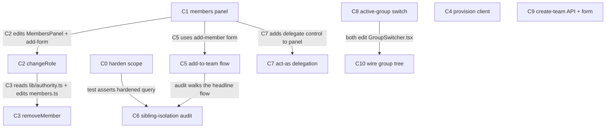

# Permissions & Roles Optimisation

## Goal, outcome, deliverables, UX

Design assessment: `plans/roles-optimisation.md` (read first — this todo executes its cycle sketch with the deep-analysis corrections baked in).

The six roles are **locked and unchanged**: `owner | admin | member | viewer | agent | auditor`. This plan does not touch the vocabulary — it hardens enforcement, adds the missing write paths, and surfaces an operator UI. Client-facing UI shows friendly labels (`member`→"Editor") via a single map; substrate values never change.

### Goal

An owner/agency can provision a client and manage team roles in two clicks, and a sub-group viewer **provably** sees only their sub-group — never a sibling.

### Outcome (the kill-switch)

```bash
bun vitest run tests/e2e/permissions/
```

**What passing proves:** a marketing viewer reads 0 rows from sibling sub-groups across every route (enforced at TypeDB, not via a gateway comment); an admin can change a teammate's role and provision a client in one call; act-as delegation is capability-gated and non-nesting.

**Contract:** runs after every batch's W4. Plan does not close until it exits 0. C6 is the test that makes it honest — and C6 cannot pass unless C0 has hardened the filter.

### Deliverables (what actually ships)

| Kind | Path / name | What the user sees or can do | Cycle |
|---|---|---|---|
| api | `export/actors.ts`, `export/people.ts`, `frontiers.ts` | scope filter embedded in the TypeQL `match`, not a comment | C0 |
| migration | `schema/one.tql` `descendants-of()` | multi-level sub-group rollup for agency views | C0 |
| component | `web/src/components/groups/MembersPanel.tsx` | one table per group: actor · friendly role · scope; add-member form + inline role picker | C1 |
| lib | `web/src/lib/role-labels.ts` | 1:1 substrate→friendly label map (`member`→"Editor") | C1 |
| api | `PUT /api/groups/members` | change a member's role (escalation-guarded) | C2 |
| lib | `web/src/lib/authority.ts` | extracted `hasAuthorityOver()` reused by write paths | C2 |
| api | `DELETE /api/groups/members` | remove a member + revoke capability | C3 |
| api / sdk | client provisioning (wrapper over `POST /api/groups`) | one call → child group + parent edge + seeded admin + invite link | C4 |
| sdk | `createGroup({parent_gid})`, `changeRole()`, `removeMember()` | sub-group + role ops from SDK | C2/C3/C5 |
| flow | add-member-to-team | add a viewer to `acme/marketing` in one operator action | C5 |
| test | `tests/e2e/permissions/sibling-isolation.test.ts` | the proof gate — 0 cross-sibling rows | C6 |
| component | act-as delegation control in `MembersPanel` | owner grants scoped, expiring `act_as` to an admin | C7 |

### User experience: before → after

| | Today (ux_before) | After this plan (ux_after) |
|---|---|---|
| **Who** | agency owner / client admin | agency owner / client admin |
| **Goal** | set up a client; add a teammate to marketing | same |
| **Steps** | manual TypeDB writes / multi-call API; trust gateway comment for isolation | open members panel → pick role → add (or "Add client") |
| **Friction** | no change-role API, no remove, frontiers leaks cross-tenant | one action; isolation enforced at DB |
| **Time** | minutes + developer | seconds, self-serve |
| **Feedback** | none until a query leaks | panel shows who-can-see-what; audit proves isolation |

**The improvement (ux_delta):** multi-step + unsafe becomes two clicks + provably isolated.

**The one proof a future-you points at:**

```
$ bun vitest run tests/e2e/permissions/sibling-isolation.test.ts
 ✓ marketing viewer reads 0 rows from acme/sales across export/actors
 ✓ marketing viewer reads 0 rows from acme/finance across export/people
 ✓ frontiers returns public + own-group hypotheses; 0 from another tenant's private
 ✓ agency viewer sees grandchild rollup via descendants-of
 Test Files  1 passed (1)
```

---

## Reuse contract

This plan is **almost entirely composition**. Deep analysis (recorded in the design doc) confirms: `scopeToGroup` already returns the right filter (C0 just uses it), `POST /api/groups` already does client provisioning (C4 wraps it), the act-as matrix already reads capabilities (C7 surfaces it), and `members.ts` already serves GET (C1 renders it; C2/C3 extend it). The only genuinely new files are `role-labels.ts`, `authority.ts` (extracted, not invented), `MembersPanel.tsx`, and the audit test. Every W2 must file the compose-or-construct verdict before any W3 spawns.

**Hotspot eliminated by design — presentational panel.** `MembersPanel.tsx` is shipped **complete** in C1 as a presentational component: it renders every control (role picker, remove button, add-form, delegate toggle) and exposes optional handler props (`onRoleChange?`, `onRemove?`, `onAdd?`, `onDelegateActAs?`) — a control is disabled/hidden when its handler is absent. C1 also scaffolds the **mount page** that passes handlers. Later cycles then **never restructure the panel**: each owns its backend (API + SDK method) and appends **one handler-wire line** at the mount site (W3b, disjoint lines). So C2/C3/C5/C7 are backend-only + a one-line wire, not component edits.

`GroupSwitcher.tsx` is touched by C8 (one-line: `navigate()` also re-scopes) and C10 (renders the tree) — small, separable, C10 anchored after C8. `members.ts` is edited by C2 (PUT) then C3 (DELETE) — C3 sequenced after C2. C9 owns the `group-type` fix in `POST /api/groups`; C4 is SDK sugar (no `index.ts` edit) so they don't collide.

**Ontology framing (why these cycles are small):** the substrate already expresses the Discord/enterprise model with two relations — `membership` (channel visibility / per-group role) + `hierarchy` (server→channel). C8/C9/C10 wire what the schema already supports: switching re-scopes (C8), a team is a group with a parent (C9), the tree is already returned by `/api/groups/tree` (C10). See the design doc's "Navigation & group-switching" section.

---

## Parallel execution plan

### Goal-proof ordering

**C0 goes first** — it is a live cross-tenant leak (`/api/frontiers`) and the plan's headline invariant (sibling isolation) is unprovable without it. If C0 can't embed the filter, the whole plan's safety claim is void — fail fast here. C1 (members panel) ships the operator surface the write cycles hang off. C6 is the destination; it can't pass until C0+C5 land.

### Cycle-level DAG



C4, C8, C9 have no incoming arrow — fully independent (batch 1). Only C8→C10 (shared `GroupSwitcher.tsx`) and the C1/C2/C5 chain are real file arrows. Every arrow names the file that justifies it.

### Batches

| Batch | Cycles | What runs in parallel |
|-------|--------|----------------------|
| 0 | shared W0 + W1 | baseline + read of every `shared_recon:` file, one Haiku message |
| 1 | C0, C1, C4, C8, C9 | five cycles W1→W4; disjoint files (schema/routes · panel/lib · sdk-sugar · switcher/active-endpoint · create-team API) |
| 2 | C2, C5, C10 | C2 = members.ts/authority/panel-picker · C5 = SDK/add-form · C10 = GroupSwitcher tree (after C8) |
| 3 | C3, C7 | C3 = members.ts DELETE · C7 = act-as UI; both touch panel → W3b anchored |
| 4 | C6 | the proof — runs after C0 + C5 |

### Imaginary blockers rejected

- ❌ "C2 and C3 both touch members.ts so sequence everything" — only C3→after-C2 is real; C5/C7 are disjoint from members.ts.
- ❌ "C6 should wait for all cycles" — C6 only reads C0's hardened queries + C5's flow. C2/C3/C4/C7 don't block it.
- ❌ "C4 depends on C1" — C4 wraps `POST /api/groups`, reads nothing C1 writes. No arrow.

---

## Status (DAG-derived kanban)

```
Batch 0 (shared)
  - [x] W0 baseline (plan-level)  — tsc=0 clean; verify=bun run typecheck && test (one.ie/web)
  - [x] W1 shared recon (plan-level)  — 5 cycles reconned (C0/C1/C4/C8/C9)

Batch 1
  - [x] C0 — harden scope enforcement              state: CLOSED ✓
    - [x] W1 · [x] W2 · [x] W3 · [x] W4  (tsc Δ0 · c0-scope 6/6 · tenancy 54/54 no regression)
  - [x] C1 — members panel + friendly labels        state: CLOSED ✓
    - [x] W1 · [x] W2 · [x] W3 · [x] W4  (MembersPanel presentational + MembersPanelClient wire-site + members.astro + role-labels + CLAUDE.md · c1-panel 4/4 · tsc Δ0)
  - [x] C4 — provision client in one call           state: CLOSED ✓
    - [x] W1 · [x] W2 · [x] W3 · [x] W4  (provisionClient SDK sugar · 2/2 · sdk tsc Δ0 · test in packages/sdk/__tests__ — web has no @oneie/sdk dep)
  - [x] C8 — active-group switch (re-scope on switch) state: CLOSED ✓
    - [x] W1 · [x] W2 · [x] W3 · [x] W4  (POST /api/groups/active membership-gated + GroupSwitcher.navigate wire · c8 6/6 · tsc Δ0)
  - [x] C9 — create team sub-group (API + form)       state: CLOSED ✓
    - [x] W1 · [x] W2 · [x] W3(API+form) · [x] W4  (group-type honoured + team_requires_parent + CreateOrgDrawer team variant · c9 3/3 · tsc Δ0)

Batch 2  (C1 + C8 closed)
  - [x] C2 — changeRole write path                  state: CLOSED ✓
    - [x] W1 · [x] W2 · [x] W3 · [x] W4  (PUT members.ts + authority.ts extract + SDK changeRole + onRoleChange wire · ROLE_ORDER/canGrantRole shared · c2 6/6)
  - [x] C5 — add-to-team flow + SDK parent_gid       state: CLOSED ✓
    - [x] W1 · [x] W2 · [x] W3 · [x] W4  (createGroup parentGid pass-through + onAdd→invite wire, default viewer · sdk group-ops 6/6)
  - [~] C10 — wire group tree (org›dept drill-down)   state: REVERTED → superseded by C11+C12
    - [x] Kept: GroupSwitcherTree double-render bug FIXED + tested; dead DivisionSwitcher deleted; C8 re-scope-on-switch in navigate()
    - [x] Reverted: switcher body rewrite (categories→tree) — it nested clients under agencies, hiding the Clients view.

Batch 5  (top × bottom navigation/impersonation — roles-optimisation.md § Navigation model)
  - [x] C11 — bottom act-as = current group's members  state: CLOSED ✓
    - [x] W1 · [x] W2 · [x] W3 · [x] W4  (AuthButton → /api/export/actors?group=<active slug>; re-scopes on switch via full nav · c11 1/1)
  - [x] C12 — top hierarchy drill (agencies→clients→teams) state: CLOSED ✓
    - [x] W1 · [x] W2 · [x] W3 · [x] W4  (GroupSwitcher parent→child drill: body=switch (C8 re-scope), chevron=drill, per-level search; act-as removed from top · c12 1/1 · switcher regression 9/9 green)

Batch 3  (C2 closed)
  - [x] C3 — removeMember + revoke capability        state: CLOSED ✓
    - [x] W1 · [x] W2 · [x] W3 · [x] W4  (DELETE members.ts + last-owner guard + SDK removeMember + onRemove wire; revoke composes capability-grant · c3 3/3)
  - [x] C7 — act-as delegation UX                    state: CLOSED ✓
    - [x] W1 · [x] W2 · [x] W3 · [x] W4  (onDelegateActAs → grant-capability receiver, scoped+expiring; active-group caveat doc'd · c7 1/1)

Batch 4  (C0 + C5 closed)
  - [x] C6 — sibling-isolation audit (the proof)     state: CLOSED ✓
    - [x] W1 · [x] W2 · [x] W3 · [x] W4  (sibling-isolation matrix: 0 cross-sibling rows, grandchild rollup, frontiers deny; +live skipIf block · 6/6)

Plan close
  - [x] **Plan outcome command exits 0** (bun vitest run tests/e2e/permissions/ → 37 passed/1 skipped)
  - [x] Every `deliverables:` row shipped and reachable
  - [x] ux_after journey walkable end-to-end (members panel → add/role/remove/delegate; provisionClient; create-team; switch re-scopes)
  - [x] Justify-or-drop — all cycles shipped, none dropped
  - [x] Final compress sweep (DivisionSwitcher deleted; GroupSwitcher unused imports removed; ROLE_ORDER de-duplicated)
  - [x] Final docs sync — plans/roles.md (§16b write paths) · groups.md (§6 hierarchy + scope) · auth.md (§4c active-group) · groups/CLAUDE.md · sidebar/CLAUDE.md
  - [x] Full verify: web 847 passed/4 skipped · sdk 21 · tsc Δ0 across both
```

---

## C0 — Harden scope enforcement  [tier: complex · batch: 1]  ⚠️ critical

**Goal delta:** after C0, sibling isolation is enforced at TypeDB (not a gateway comment) and `/api/frontiers` no longer leaks across tenants — making the plan's headline invariant provable.

**Deliverable:** scope-hardened `export/actors.ts`, `export/people.ts`, `frontiers.ts` + `descendants-of()` in `schema/one.tql`.

**UX delta:** no visible UI change; closes a live cross-tenant data leak. Internal-only cycle, justified: every downstream isolation claim depends on it.

**Cycle outcome:** `bun run verify` passes AND a `client` viewer for `group:acme/marketing` returns 0 rows from `acme/sales` on `export/actors`+`export/people`; `frontiers` returns **public hypotheses + own-group hypotheses only** (0 rows from another tenant's private/group hypotheses); `descendants-of(group:acme)` returns grandchildren.

**Frontiers is global+local, not per-tenant** (confirmed 2026-05-29). `/api/frontiers` is an intended discovery feed. The fix is NOT a blanket `scopeToGroup` (that would break global discovery) — it is a **scope-attribute filter**: show `$h has scope "public"` **OR** `$h`'s group ∈ the viewer's groups. The stale `// PUBLIC — anonymous` comment is wrong (the `end_user` deny-check already 403s anonymous); fix the comment too.

**Contributes to plan outcome:** yes (C6 cannot pass without it).

**Demo gate:**
```yaml
demo:
  command: "bun vitest run tests/e2e/permissions/c0-scope.test.ts"
  asserts: "computed scope.pattern is embedded in the match clause; frontiers filters by group; descendants-of returns >1 level"
  budget:  "<2s wall · <150 LOC test"
```

### W1 — Recon  [Haiku · parallel]

1. **Existing-code recon**
   - [ ] `one.ie/web/src/lib/in/scope.ts` — confirm `scope.pattern` (typeql) + `scope.sql` shapes returned; what `descendants` field expects
   - [ ] `one.ie/web/src/pages/api/export/actors.ts` — current query string; where the `/* scope */` comment is injected; how to splice `scope.pattern` into `match`
   - [ ] `one.ie/web/src/pages/api/export/people.ts` — same
   - [ ] `one.ie/web/src/pages/api/frontiers.ts` — the unscoped hypothesis query; how hypotheses tie to a group (tag? membership? scope attr)
   - [ ] `one.ie/web/src/middleware.ts` — how `descendants` is currently resolved (D1 `parent_slug = ?`, one level) and passed to routes
2. **Primitive-inventory recon**
   - [ ] `schema/one.tql` — `ancestors-of()` definition to mirror for `descendants-of()`; `hierarchy` relation roles

### W2 — Decide  [Opus · xhigh — touches schema + query enforcement]

- [ ] **Compose-or-construct:** `descendants-of()` is new but is a mirror of `ancestors-of()` — verdict: extend schema (justified, no existing fn). All route changes are edits, not new files.
- [ ] **Frontiers filter = global+local union** (decided): `{ $h has scope "public"; } or { $h's group ∈ viewer's groups; }`. Confirm how a `hypothesis` binds to a group (its own `scope` attribute + a path/membership to the owning group) and write the exact `match` constraint. Do NOT apply blanket `scopeToGroup` here — frontiers stays a discovery feed.
- [ ] Embed strategy for `export/actors`+`export/people`: splice `scope.pattern` into the `match` clause; keep the deny-check. Confirm the gateway accepts the combined query shape (escape condition watches this).
- [ ] Multi-level descendants: switch agency rollup from D1 one-level to `descendants-of()` — or recursive D1 CTE? Decide (prefer TypeDB fn for single source of truth).
- [ ] Diff specs for all four files.
- [ ] **Doc-plan:** `descendants-of()` → update `schema/` notes + `plans/groups.md` §6 (hierarchy inheritance).

### W3 — Edit  [Sonnet · parallel]

**W3a — independent:**
- [ ] `schema/one.tql` — add `descendants-of($g)` recursive fn (mirror of `ancestors-of`)
- [ ] `one.ie/web/src/pages/api/export/actors.ts` — embed `scope.pattern` in `match`; keep deny
- [ ] `one.ie/web/src/pages/api/export/people.ts` — embed `scope.pattern` in `match`
- [ ] `one.ie/web/src/pages/api/frontiers.ts` — add `scope:"public" OR group∈viewer-groups` filter (global+local, NOT blanket scope); fix stale `// PUBLIC — anonymous` comment
- [ ] `plans/groups.md` — update §6 hierarchy inheritance to cite `descendants-of()`

**W3b — dependent:**
- [ ] `one.ie/web/src/middleware.ts` — swap one-level D1 descendant resolution for `descendants-of()` (reads schema fn from W3a)

### W4 — Verify  [Haiku×5 — complex]

- [ ] `bun run verify` green · `delta_tsc_errors ≤ 0`
- [ ] As `client` viewer for `acme/marketing`: `export/actors`, `export/people`, `frontiers` each return 0 rows from sibling `acme/sales`/`acme/finance`
- [ ] `descendants-of(group:acme)` returns a grandchild group
- [ ] **Live verification** (deploy-surface: middleware + api routes) — post-deploy curl on the three routes returns 200/302
- [ ] Reuse audit: no new helper duplicates `scopeToGroup`; `scope.pattern` now imported/used in all three routes (`grep`)
- [ ] Plan outcome re-check recorded · goal-fit ≥ 0.50 · composite ≥ 0.65

---

## C1 — Members panel + friendly labels  [tier: complex · batch: 1]

**Goal delta:** operators get one screen per group showing actor · role · scope, with **every control present** (role picker, remove, add-form, delegate toggle) — wired to optional handler props so later cycles supply backends without touching the component.

**Deliverable:** `MembersPanel.tsx` (presentational, complete) + its mount page + `lib/role-labels.ts`.

**UX delta:** operator sees who-is-in-this-group-and-at-what-role for the first time; controls render (disabled until their backend cycle wires the handler).

**Cycle outcome:** `MembersPanel` renders members from `GET /api/groups/members` with friendly labels; add-form role picker defaults to "Viewer"; controls with no handler are disabled (not absent).

**Presentational contract (why this kills the hotspot):** the panel owns layout + the six friendly labels and emits intent via props — `onRoleChange?(aid,role)`, `onRemove?(aid)`, `onAdd?(email,role)`, `onDelegateActAs?(aid)`. C2/C3/C5/C7 implement the backends and pass the handler at the **mount site** (one appended line each), never re-editing this file.

**Demo gate:**
```yaml
demo:
  command: "bun vitest run tests/e2e/permissions/c1-panel.test.ts"
  asserts: "panel renders members with friendly labels; add-form defaults to Viewer; raw substrate role unchanged in payload"
  budget:  "<1s wall · <100 LOC test"
```

### W1 — Recon  [Haiku · parallel]
1. **Existing-code:** `api/groups/members.ts` (GET shape, two view modes); `lib/role-check.ts` (the 6 roles to map)
2. **Primitive-inventory:**
   - [ ] `web/src/components/groups/` — list files; is there a panel to extend? mark ✓/✗
   - [ ] `web/src/components/ui/` — `Card`, `Table`, `Select`, `Drawer`, `Button` for the panel + picker
   - [ ] `web/src/components/ai-elements/` — any list/row primitive in scope

### W2 — Decide  [Opus · high]
- [ ] **Compose-or-construct:** `MembersPanel.tsx` — no existing per-group members table; closest is `members.ts` (data only). Verdict: new presentational component composing `ui/Table` + `ui/Select` + `ui/Button` + `ui/Switch`. `role-labels.ts` — new (tiny map), no existing label source.
- [ ] **Handler-prop API** (the hotspot-killer): finalize the four optional props (`onRoleChange`, `onRemove`, `onAdd`, `onDelegateActAs`) + disabled-when-absent rule. This is the contract C2/C3/C5/C7 wire against — lock it now so they never edit the panel.
- [ ] Slot map: `Table` rows = members; `Select` = role picker (friendly labels, value=substrate role); `Button` = remove; `Switch` = delegate.
- [ ] Mount site: which group settings route hosts it (the page C1 scaffolds; later cycles append handler wires here).
- [ ] Diff specs; doc-plan (new component family → `web/src/components/groups/CLAUDE.md` if absent).

### W3 — Edit  [Sonnet · parallel]
**W3a:**
- [ ] `web/src/lib/role-labels.ts` — `{owner:"Owner", admin:"Admin", member:"Editor", viewer:"Viewer", agent:"Agent", auditor:"Auditor"}`
- [ ] `web/src/components/groups/MembersPanel.tsx` — full presentational panel: table + add-form (default Viewer) + role picker + remove + delegate toggle; all controls disabled when their handler prop is absent
- [ ] `web/src/pages/.../members.astro` (mount page) — fetches members, renders `MembersPanel`; handler props left unwired (later cycles append)
- [ ] `web/src/components/groups/CLAUDE.md` — component family contract + handler-prop API
**W3b:** *(empty)*

### W4 — Verify  [inline composite]
- [ ] `bun run verify` green · `delta_tsc ≤ 0`
- [ ] Render test: members shown with friendly labels; add-form default = Viewer; underlying value = `viewer`
- [ ] Reuse audit: `Table`/`Select` from `ui/` imported (grep); no bespoke table; new-file LOC ≤ budget
- [ ] goal-fit ≥ 0.50 · composite ≥ 0.65

---

## C2 — changeRole write path  [tier: simple · batch: 2]

**Goal delta:** an admin can promote/demote a teammate inline from the panel; escalation (raising ≥ own rank) is blocked.
**Deliverable:** `PUT /api/groups/members` + `lib/authority.ts` (extracted) + SDK `changeRole()`.
**UX delta:** the role picker in the panel now persists changes.
**Cycle outcome:** `PUT /api/groups/members {gid,aid,role}` flips `membership.member-role`; same-workspace caller raising to ≥ own rank gets 403.

**Demo gate:**
```yaml
demo:
  command: "bun vitest run tests/e2e/permissions/c2-changerole.test.ts"
  asserts: "role changes via delete+reinsert TypeQL; ROLE_ORDER escalation guard blocks raise-to-own-rank"
  budget:  "<2s wall · <80 LOC test"
```

### W1 — Recon  [Haiku]
- `api/groups/members.ts` (add PUT) · `api/groups/index.ts` `hasAuthorityOver` (to extract) · `api/invites/create.ts` `ROLE_ORDER` guard · `schema/migrations/0029-tony-chairman-to-owner.tql` (delete+reinsert pattern) · `api/groups/join.ts` (membership write shape) · `packages/sdk/src/client.ts`

### W2 — Decide  [Sonnet · medium]
- [ ] **Compose-or-construct:** `lib/authority.ts` — extract existing `hasAuthorityOver` verbatim (not new logic). PUT handler — extend `members.ts`. Reuse `ROLE_ORDER` from invites; do not redefine.
- [ ] changeRole TypeQL = `delete $r of $m; insert $m has member-role "<new>"` (pattern from 0029, adapted to `actor/aid`).
- [ ] Escalation rule for changeRole = same-workspace ceiling (`new rank < caller rank`) + `hasAuthorityOver(caller, gid)`.

### W3 — Edit  [Sonnet · parallel]
**W3a:**
- [ ] `web/src/lib/authority.ts` — extract `hasAuthorityOver` (copy TypeQL verbatim)
- [ ] `packages/sdk/src/client.ts` — add `changeRole(gid, aid, role)`
- [ ] `docs`/`plans/roles.md` — document the change-role path
**W3b:**
- [ ] `web/src/pages/api/groups/members.ts` — add PUT (imports `authority.ts` from W3a)
- [ ] mount page (C1) — append one line: pass `onRoleChange={(aid,role)=>client.changeRole(gid,aid,role)}` (no panel edit)

### W4 — Verify  [inline]
- [ ] `bun run verify` · `delta_tsc ≤ 0`
- [ ] PUT flips role in TypeDB; raise-to-own-rank → 403; non-authority caller → 403
- [ ] **Live verification** (api route): post-deploy curl
- [ ] Reuse audit: `ROLE_ORDER` imported not redefined; `authority.ts` is extraction (no new authority logic)
- [ ] goal-fit ≥ 0.50 · composite ≥ 0.65

---

## C3 — removeMember + revoke capability  [tier: simple · batch: 3]

**Goal delta:** an admin can remove a member and revoke a capability grant from the panel.
**Deliverable:** `DELETE /api/groups/members` + SDK `removeMember()` + revoke UI.
**UX delta:** panel rows get a remove action; capability grants are revocable.
**Cycle outcome:** `DELETE /api/groups/members {gid,aid}` deletes the membership; a revoked capability denies its action within the 60s cache TTL.

**Demo gate:**
```yaml
demo:
  command: "bun vitest run tests/e2e/permissions/c3-remove.test.ts"
  asserts: "membership deleted; revoked capability action denied after cache invalidation"
  budget:  "<2s wall · <80 LOC test"
```

### W1 — Recon  [Haiku]
- `api/groups/members.ts` (add DELETE; C2 added PUT) · `lib/authority.ts` (from C2) · `lib/capability-grant.ts` (revoke + cache) · `lib/role-cache.ts` (TTL)

### W2 — Decide  [Sonnet · medium]
- [ ] **Compose-or-construct:** DELETE extends `members.ts`; revoke composes `capability-grant.ts` soft-delete — no new files.
- [ ] removeMember TypeQL = `match … $m isa membership …; delete $m;` Guard with `hasAuthorityOver` + cannot-remove-last-owner check.

### W3 — Edit  [Sonnet · parallel]
**W3a:**
- [ ] `packages/sdk/src/client.ts` — `removeMember(gid, aid)`
- [ ] `plans/roles.md` — document removal + revoke
**W3b:**
- [ ] `web/src/pages/api/groups/members.ts` — add DELETE (after C2's PUT; same file)
- [ ] mount page (C1) — append: pass `onRemove={(aid)=>client.removeMember(gid,aid)}` + revoke wire (no panel edit)

### W4 — Verify  [inline]
- [ ] `bun run verify` · `delta_tsc ≤ 0`
- [ ] DELETE removes membership; last-owner removal blocked; revoked capability denied within TTL
- [ ] **Live verification** (api route)
- [ ] Reuse audit: revoke composes `capability-grant.ts` (no parallel impl)
- [ ] goal-fit ≥ 0.50 · composite ≥ 0.65

---

## C4 — Provision client in one call  [tier: simple · batch: 1]

**Goal delta:** an agency provisions a client (child group + parent edge + seeded admin + invite) in one call.
**Deliverable:** client-provision path (thin wrapper or SDK sugar over `POST /api/groups` `{parent_gid, invite_email}`).
**UX delta:** "Add client" → returns an invite link, no multi-step setup.
**Cycle outcome:** one call with `{name, parent_gid: agencyGid, invite_email}` yields a child group under the agency, an `admin` seed, and an invite credential.

**Demo gate:**
```yaml
demo:
  command: "bun vitest run tests/e2e/permissions/c4-provision.test.ts"
  asserts: "one call creates child group + hierarchy edge + admin membership + invite token; cross-workspace escalation guard satisfied"
  budget:  "<2s wall · <80 LOC test"
```

### W1 — Recon  [Haiku]
- `api/groups/index.ts` (parent_gid + invite_email branch, lines ~131,163-169,210-291) · `api/invites/create.ts` (cross-workspace `parent_slug` guard) · `packages/sdk/src/client.ts` (`createGroup`)

### W2 — Decide  [Sonnet · medium]
- [ ] **Compose-or-construct:** verify `POST /api/groups {parent_gid, invite_email}` already does all four steps. If yes → **no new endpoint**; deliverable is SDK sugar `provisionClient()` + thin validation. If a gap exists, minimal wrapper route. Record the verdict.
- [ ] Confirm cross-workspace escalation guard (`owners.parent_slug === principal.slug`) is satisfied by the agency→child call.

### W3 — Edit  [Sonnet · parallel]
**W3a:**
- [ ] `packages/sdk/src/client.ts` — `provisionClient({name, parentGid, inviteEmail})` wrapping createGroup
- [ ] `plans/groups.md` / `plans/invitations.md` — document the one-call provision
- [ ] (only if W2 found a gap) `web/src/pages/api/clients/index.ts` — thin wrapper
**W3b:** *(empty)*

### W4 — Verify  [inline]
- [ ] `bun run verify` · `delta_tsc ≤ 0`
- [ ] One call → child group + hierarchy edge + admin membership + invite token (assert all four)
- [ ] **Live verification** (api route if new)
- [ ] Reuse audit: composes `POST /api/groups`; no duplicate group-create logic
- [ ] goal-fit ≥ 0.50 · composite ≥ 0.65

---

## C5 — Add-to-team flow + SDK parent_gid  [tier: simple · batch: 2]

**Goal delta:** a client admin adds someone to a marketing sub-group in one action (default Viewer); SDK can create sub-groups.
**Deliverable:** add-member-to-team flow + SDK `createGroup({parent_gid})`.
**UX delta:** "Add to Marketing" writes membership in the sub-group; person lands scoped to marketing only.
**Cycle outcome:** add-member action writes `membership(group: acme/marketing, member, role)`; `createGroup({parent_gid})` creates a child group (zero server change).

**Demo gate:**
```yaml
demo:
  command: "bun vitest run tests/e2e/permissions/c5-addteam.test.ts"
  asserts: "add-to-team writes sub-group membership default viewer; SDK createGroup passes parent_gid to existing endpoint"
  budget:  "<2s wall · <80 LOC test"
```

### W1 — Recon  [Haiku]
- `api/groups/join.ts` (membership insert shape) · `api/groups/index.ts` (parent_gid) · `packages/sdk/src/client.ts` (`createGroup` opts) · `MembersPanel.tsx` (C1 add-form to reuse)

### W2 — Decide  [Sonnet · medium]
- [ ] **Compose-or-construct:** SDK `createGroup` — add `parent_gid?` to opts (server already handles). Add-member flow reuses C1's add-form + `members.ts` write (or invite). No new files.
- [ ] Default role = `viewer`; picker allows override at add time.

### W3 — Edit  [Sonnet · parallel]
**W3a:**
- [ ] `packages/sdk/src/client.ts` — `createGroup({..., parent_gid})` pass-through
- [ ] mount page (C1) — append: pass `onAdd={(email,role)=>...membership write (default viewer)}` (no panel edit)
- [ ] `plans/groups.md` — document sub-group add flow
**W3b:** *(empty)*

### W4 — Verify  [inline]
- [ ] `bun run verify` · `delta_tsc ≤ 0`
- [ ] Add-to-team writes sub-group membership (default viewer); SDK createGroup with parent_gid creates child
- [ ] Reuse audit: SDK change is param-only; flow reuses join/invite write shape
- [ ] goal-fit ≥ 0.50 · composite ≥ 0.65

---

## C6 — Sibling-isolation audit (the proof)  [tier: complex · batch: 4]

**Goal delta:** proves the plan's headline invariant — a marketing viewer reads 0 rows from sibling sub-groups across every route. This is the kill-switch test.

**Deliverable:** `tests/e2e/permissions/sibling-isolation.test.ts` (+ folds the per-cycle demos under `tests/e2e/permissions/`).

**UX delta:** none (verification cycle); it is the evidence the UX is safe.

**Cycle outcome:** the audit test passes — 0 cross-sibling rows on `export/actors`, `export/people`, `frontiers`; agency sees grandchild rollup; multi-group actor scoped to active group only.

**Contributes to plan outcome:** yes — IS the outcome command's core.

**Demo gate:**
```yaml
demo:
  command: "bun vitest run tests/e2e/permissions/"
  asserts: "every permissions cycle demo + the sibling-isolation matrix passes"
  budget:  "<5s wall · <150 LOC test"
```

### W1 — Recon  [Haiku]
- `plans/tenancy-todo.md` audit matrix (extend pattern) · C0's hardened routes · C5's add-to-team flow · existing `tests/e2e/` harness + TypeDB fixture setup (per memory: real TypeDB or skip — no mocks)

### W2 — Decide  [Opus · high]
- [ ] **Compose-or-construct:** extend the tenancy audit matrix; one new test file. No mocks (real TypeDB fixture or skip — `feedback_no_mocks`).
- [ ] Fixture: `acme` with `acme/marketing`, `acme/sales`, `acme/finance`; a viewer in marketing only; an agency over a grandchild.
- [ ] Matrix: {3 routes} × {marketing-viewer, sales-viewer, agency} × assert row counts.

### W3 — Edit  [Sonnet · parallel]
**W3a:**
- [ ] `tests/e2e/permissions/sibling-isolation.test.ts` — the matrix
- [ ] `tests/e2e/permissions/` — ensure c0–c5/c7 demo files colocated so the folder command is the plan outcome
**W3b:** *(empty)*

### W4 — Verify  [Haiku×5 — complex]
- [ ] `bun run verify` green
- [ ] `bun vitest run tests/e2e/permissions/` exits 0 (the plan outcome)
- [ ] Audit asserts: 0 cross-sibling rows on export routes; frontiers = public + own-group only (0 from another tenant's private); agency grandchild rollup non-empty; multi-group actor sees only active group
- [ ] Reuse audit: extends tenancy matrix, no mocks of TypeDB
- [ ] **Plan outcome re-check** — exit 0 → trigger justify-or-drop on any unstarted cycle
- [ ] goal-fit ≥ 0.80 (this cycle IS the goal) · composite ≥ 0.65

---

## C7 — Act-as delegation UX  [tier: simple · batch: 3]

**Goal delta:** an agency owner grants scoped, expiring `act_as` to an admin from the panel — the admin can then support clients without being full owner.
**Deliverable:** delegation control in `MembersPanel` (composes `grantCapability(…, ["act_as"], agencyScope)`).
**UX delta:** owner toggles "can act-as clients" on an admin; the grant is scoped + expiring.
**Cycle outcome:** granted admin (scoped to agency) passes the act-as allow-matrix and can start a client session; ungranted admin gets 403; no nesting.

**Demo gate:**
```yaml
demo:
  command: "bun vitest run tests/e2e/permissions/c7-delegate.test.ts"
  asserts: "act_as capability grant lets a scoped admin pass both gates; ungranted admin 403; nesting 409"
  budget:  "<2s wall · <80 LOC test"
```

### W1 — Recon  [Haiku]
- `lib/act-as.ts` (`checkAllowMatrix`) · `lib/api-auth.ts` (`foldCapabilities`, the activeGroupId caveat) · `lib/capability-grant.ts` (`grantCapability`) · `MembersPanel.tsx` (C1)

### W2 — Decide  [Sonnet · medium]
- [ ] **Compose-or-construct:** no matrix change — grant `act_as` via `grantCapability`. UI control composes into `MembersPanel`. Document the **active-group caveat** (admin must be scoped to `agencyScope` for the grant to fold). Decide: surface a hint, or (stretch) make `foldCapabilities` group-agnostic — default: hint only, defer the api-auth change.
- [ ] Only `owner`/`manage_clients` may grant `act_as` (guard the grant endpoint).

### W3 — Edit  [Sonnet · parallel]
**W3a:**
- [ ] mount page (C1) — append: pass `onDelegateActAs={(aid)=>grantCapability(aid,["act_as"],agencyScope,...)}` (no panel edit)
- [ ] `plans/auth.md` / `plans/roles.md` — document delegation + active-group caveat
**W3b:** *(empty unless api-auth change chosen)*

### W4 — Verify  [inline]
- [ ] `bun run verify` · `delta_tsc ≤ 0`
- [ ] Granted+scoped admin starts client act-as; ungranted → 403; second act-as → 409 nesting
- [ ] **Live verification** (act-as api)
- [ ] Reuse audit: composes `grantCapability` + existing matrix; no new auth path
- [ ] goal-fit ≥ 0.50 · composite ≥ 0.65

---

## C8 — Active-group switch  [tier: complex · batch: 1]  ⚠️ keystone

**Goal delta:** switching group re-scopes auth (not just the URL) — a write after "switch to Marketing" authorizes in Marketing, closing the read(URL)/write(activeGroupId) split.

**Deliverable:** `POST /api/groups/active` (or `settings?scope=active-group`) + `GroupSwitcher` calls it on select.

**UX delta:** the group switcher actually changes who-you-are-acting-as-a-group, so reads and writes agree.

**Cycle outcome:** selecting a group in `GroupSwitcher` persists `active_group_id`; `requireAuth` then resolves the role in the selected group; reading and writing target the same group.

**Demo gate:**
```yaml
demo:
  command: "bun vitest run tests/e2e/permissions/c8-activegroup.test.ts"
  asserts: "POST /api/groups/active writes active_group_id; subsequent requireAuth resolves role in the new group; membership-gated (cannot switch to a group you're not in)"
  budget:  "<2s wall · <80 LOC test"
```

### W1 — Recon  [Haiku]
- `lib/api-auth.ts` (`Principal.group` from `activeGroupId`; `foldCapabilities` scope) · `middleware.ts` (activeGroupId hydration ~194-198) · `components/sidebar/GroupSwitcher.tsx` (`navigate()` does `window.location` only) · `migrations/0050_user_slug.sql` (`active_group_id` column) · `lib/auth.ts` (Better Auth `activeGroupId` field, updateUser path) · `api/settings` (scope pattern, to decide endpoint shape)

### W2 — Decide  [Opus · high — touches auth context]
- [ ] **Compose-or-construct:** prefer `settings?scope=active-group` (api.md: add a scope, not a route) vs a dedicated `POST /api/groups/active`. Decide. Write must be **membership-gated** (cannot switch to a group you're not a member of) — reuse `hasAuthorityOver`/membership check.
- [ ] **Reconcile read/write context:** decide the rule — does the URL drive `activeGroupId` (switching URL implies setting active group), or is the switcher the only writer? Recommended: `GroupSwitcher.navigate()` writes active group AND navigates, so URL and `activeGroupId` always agree.
- [ ] Does Better Auth `updateUser` allow writing `activeGroupId`, or write D1 directly + bust session cache?

### W3 — Edit  [Sonnet · parallel]
**W3a:**
- [ ] `web/src/pages/api/settings/...` or `api/groups/active.ts` — write `active_group_id` (membership-gated)
- [ ] `web/src/components/sidebar/GroupSwitcher.tsx` — `navigate()` calls the endpoint before/with the URL change
- [ ] `plans/auth.md` — document active-group write path + read/write reconciliation
**W3b:** *(empty)*

### W4 — Verify  [Haiku×5 — complex]
- [ ] `bun run verify` · `delta_tsc ≤ 0`
- [ ] Switch persists `active_group_id`; `requireAuth` resolves role in new group; switch to non-member group → 403
- [ ] **Live verification** (middleware + api): post-deploy curl
- [ ] Reuse audit: membership check reused, not reinvented; settings-scope preferred over new route if chosen
- [ ] goal-fit ≥ 0.50 · composite ≥ 0.65

---

## C9 — Create team sub-group  [tier: simple · batch: 1]

**Goal delta:** an operator adds a named team (Marketing) under the org in one action, created as a `team` group — not silently coerced to `org`.

**Deliverable:** create-team form (passes `parent_gid` + `type:team`) + `POST /api/groups` honours `group-type`.

**UX delta:** "Add team › Marketing" creates a child team; it renders with the team icon.

**Cycle outcome:** `POST /api/groups {type:"team", parent_gid}` creates a group with `group-type "team"` (not hardcoded `org`); the form is reachable from the org.

**Demo gate:**
```yaml
demo:
  command: "bun vitest run tests/e2e/permissions/c9-createteam.test.ts"
  asserts: "POST /api/groups with type:team yields group-type team under parent_gid; default starter plan allowed; hierarchy edge written"
  budget:  "<2s wall · <80 LOC test"
```

### W1 — Recon  [Haiku]
- `api/groups/index.ts` (line ~218 hardcodes `group-type "org"`; parent_gid handling) · `components/org/CreateOrgDrawer.tsx` (passes parent_gid + type) · `lib/enrollment.ts` `provisionTeams()` (how auto-teams are made — reuse the team-gid shape) · `components/sidebar/GroupSwitcherTree.tsx` (type icon map)

### W2 — Decide  [Sonnet · medium]
- [ ] **Compose-or-construct:** extend `CreateOrgDrawer` with a `team` type (or a thin `CreateTeamDrawer` reusing it) — no new tree. The API change is removing the `group-type "org"` hardcode to honour the `type` input (validate against allowed types).
- [ ] Team gid convention — match `provisionTeams()` (`{org}-marketing` style) for consistency.
- [ ] Authority: who can create a team? `hasAuthorityOver(parent)` — owner/admin of the org.

### W3 — Edit  [Sonnet · parallel]
**W3a:**
- [ ] `web/src/pages/api/groups/index.ts` — honour `group-type` from `type` input (validated); keep `org` default
- [ ] `web/src/components/org/CreateOrgDrawer.tsx` — support `team` type (parent_gid required)
- [ ] `plans/groups.md` — document team creation + group-type honouring
**W3b:** *(empty)*

### W4 — Verify  [inline]
- [ ] `bun run verify` · `delta_tsc ≤ 0`
- [ ] `type:team` → `group-type "team"` under parent; hierarchy edge written; non-authority caller → 403
- [ ] **Live verification** (api route)
- [ ] Reuse audit: extends `CreateOrgDrawer`; team-gid matches `provisionTeams()` convention
- [ ] goal-fit ≥ 0.50 · composite ≥ 0.65

---

## C10 — Wire the group tree  [tier: simple · batch: 2]

**Goal delta:** the switcher shows org → Marketing/Sales/Service as a drill-down tree, so "switch yourcompany › marketing" is a visible path.

**Deliverable:** `GroupSwitcherTree` wired into `GroupSwitcher`; dead `DivisionSwitcher` deleted.

**UX delta:** group switcher renders the parent→child hierarchy (type-aware icons) instead of flat category buckets.

**Cycle outcome:** `GroupSwitcher` renders `GroupSwitcherTree` from `/api/groups/tree` data; selecting a child navigates + (via C8) re-scopes; `DivisionSwitcher` removed; net LOC negative.

**Demo gate:**
```yaml
demo:
  command: "bun vitest run tests/e2e/permissions/c10-tree.test.ts"
  asserts: "switcher renders org with indented children from tree API; selecting a child calls navigate; membership-scoped (only groups you're in + descendants)"
  budget:  "<1s wall · <80 LOC test"
```

### W1 — Recon  [Haiku]
- `components/sidebar/GroupSwitcher.tsx` (current flat category buckets; `navigate()` — C8 updates this) · `components/sidebar/GroupSwitcherTree.tsx` (built, unimported; recursive renderer) · `components/dashboard/DivisionSwitcher.tsx` (dead — delete) · `api/groups/tree.ts` (returns parent_gid + role tags)

### W2 — Decide  [Sonnet · medium]
- [ ] **Compose-or-construct:** wire the existing `GroupSwitcherTree` (no new tree component). Decide: replace the Level-2 flat list with the tree, or add a tree view toggle. Keep ⌘G + act-as drill intact.
- [ ] Confirm membership-scoping holds (tree only shows your groups + depth-expanded descendants — already in `tree.ts`).

### W3 — Edit  [Sonnet · parallel]
**W3a:**
- [ ] `web/src/components/sidebar/GroupSwitcher.tsx` — import + render `GroupSwitcherTree` (W3b vs C8: anchor to the group-list region, after C8's `navigate()` change)
- [ ] delete `web/src/components/dashboard/DivisionSwitcher.tsx`
- [ ] `plans/groups.md` / `web/src/components/sidebar/CLAUDE.md` — document the wired tree
**W3b:** *(empty)*

### W4 — Verify  [inline]
- [ ] `bun run verify` · `delta_tsc ≤ 0`
- [ ] Switcher renders indented children; select → navigate (+re-scope via C8); only member groups shown
- [ ] Reuse audit: no new tree component; `DivisionSwitcher` deleted (`delta_loc_net` negative)
- [ ] goal-fit ≥ 0.50 · composite ≥ 0.65

---

## See also

- `plans/roles-optimisation.md` — the assessment + design (read first)
- `plans/roles.md` — 6 roles, 4 viewer tiers, permission matrix (source of truth)
- `plans/groups.md` — multi-tenancy via hierarchy, RBAC+ABAC+ReBAC
- `plans/auth.md` — Principal, requireAuth, act-as + capability grants
- `plans/tenancy-todo.md` — shipped scope-isolation; C6 extends its audit matrix
- `schema/one.tql` — membership, hierarchy, ancestors-of (C0 adds descendants-of)
- `plans/dictionary.md` · `plans/rubrics.md` — canonical names + scoring bands
