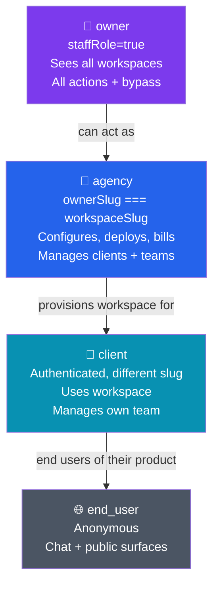
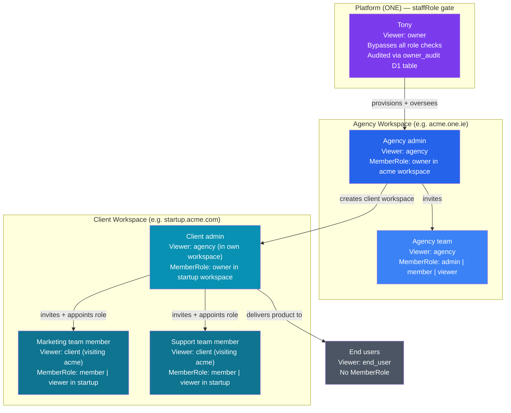
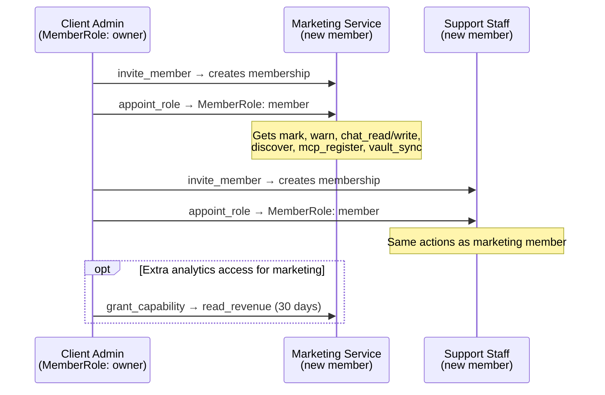
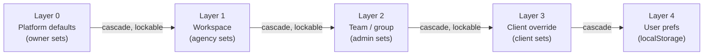

# roles.md — Role Architecture, Single Source of Truth

Every surface in ONE is audience-aware. Roles are not feature flags — they are
the first dimension of the 6-dimension ontology rendered in UI.

---

## 1. Two Dimensions of Role

The system has **two orthogonal role dimensions**. Confusing them is the root
cause of most auth errors.

| Dimension | Type | Where defined | What it controls |
|-----------|------|---------------|-----------------|
| **Viewer tier** | `Viewer` | `src/lib/viewer.ts` | UI surfaces, nav, what a session can *see* |
| **Member role** | `MemberRole` | `src/lib/role-check.ts` | Substrate actions, what a session can *do* |

A third concept — agent org-chart tiers (`chairman / ceo / director / specialist`) —
is declared in `src/lib/role-types.ts` and is **entirely separate** from both.
It describes agent reporting structure, not human access. Do not mix it with the
auth models below.

---

## 2. Viewer Tiers

Four tiers. Derived per-request in `src/lib/viewer.ts` from session + slug.
Never stored — always computed.

```ts
// src/lib/viewer.ts
export type Viewer = 'owner' | 'agency' | 'client' | 'end_user'
```

| Tier | Who | Trust origin | Derives from |
|------|-----|--------------|-------------|
| `owner` | Platform admin (Tony) | `staffRole = true` in D1 `user` table | `session.staffRole === true` |
| `agency` | Workspace owner viewing their own workspace | `ownerSlug === workspaceSlug` | slug match OR `hasManageClients` capability |
| `client` | Authenticated user visiting another's workspace | Logged in, different slug | authenticated + non-owner |
| `end_user` | Anonymous visitor | No session | no cookie |

Tiers are **additive downward** — each tier inherits everything the tier below
can see, plus more:

```
owner ⊃ agency ⊃ client ⊃ end_user
```

### Viewer tier cascade (Mermaid)



---

## 3. Member Roles

Six roles. Stored in TypeDB `membership` relation + seeded via
`schema/migrations/seed-roles.tql`. Fallback matrix in `src/lib/role-check.ts`.

```ts
// src/lib/role-check.ts
export type MemberRole = 'owner' | 'admin' | 'member' | 'viewer' | 'agent' | 'auditor'
```

| Role | Who holds it | Scope |
|------|-------------|-------|
| `owner` | Workspace creator | All 31 actions; apex of the role lattice |
| `admin` | Trusted operator | Workspace ops, member mgmt, signal verbs |
| `member` | Regular team member | Read + write, signal verbs, chat |
| `viewer` | Read-only participant | Chat read, highways, onchain view |
| `agent` | AI actor | Signal verbs (mark, warn, discover), chat |
| `auditor` | Compliance / finance | All read actions, onchain, revenue |

> **Naming note:** `MemberRole: 'owner'` (workspace apex) is NOT the same as
> `Viewer: 'owner'` (platform admin). A workspace owner has `MemberRole = 'owner'`
> in their own workspace and `Viewer = 'agency'` in the UI tier. Tony has
> `Viewer = 'owner'` (staffRole) which bypasses the matrix entirely.

### Permission matrix

31 actions total. `✓` = granted by default; `—` = denied (can be granted via `mint_capability`).

| Action | owner | admin | member | viewer | agent | auditor |
|--------|:-----:|:-----:|:------:|:------:|:-----:|:-------:|
| `add_unit` | ✓ | ✓ | — | — | — | — |
| `remove_unit` | ✓ | ✓ | — | — | — | — |
| `mark` | ✓ | ✓ | ✓ | — | ✓ | — |
| `warn` | ✓ | ✓ | ✓ | — | ✓ | — |
| `tune_sensitivity` | ✓ | ✓ | — | — | — | — |
| `read_highways` | ✓ | ✓ | ✓ | ✓ | — | ✓ |
| `read_revenue` | ✓ | ✓ | — | — | — | ✓ |
| `read_toxic` | ✓ | ✓ | — | — | — | ✓ |
| `appoint_role` | ✓ | ✓ | — | — | — | — |
| `read_memory` | ✓ | ✓ | ✓ | — | — | ✓ |
| `delete_memory` | ✓ | — | — | — | — | — |
| `discover` | ✓ | ✓ | ✓ | — | ✓ | ✓ |
| `create_group` | ✓ | — | — | — | — | — |
| `update_group` | ✓ | ✓ | — | — | — | — |
| `delete_group` | ✓ | — | — | — | — | — |
| `invite_member` | ✓ | ✓ | — | — | — | — |
| `change_role` | ✓ | — | — | — | — | — |
| `customize_vocabulary` | ✓ | — | — | — | — | — |
| `edit_schema` | ✓ | — | — | — | — | — |
| `mint_capability` | ✓ | — | — | — | — | — |
| `add_attribute` | ✓ | ✓ | ✓ | — | — | — |
| `view_onchain` | ✓ | ✓ | ✓ | ✓ | ✓ | ✓ |
| `chat_read` | ✓ | ✓ | ✓ | ✓ | ✓ | — |
| `chat_write` | ✓ | ✓ | ✓ | — | ✓ | — |
| `vault_sync` | ✓ | ✓ | ✓ | — | — | — |
| `mcp_register` | ✓ | ✓ | ✓ | — | — | — |
| `verify_domain` | ✓ | ✓ | — | — | — | — |
| `grant_capability` | ✓ | — | — | — | — | — |
| `read_self` ¹ | ✓ | ✓ | ✓ | ✓ | ✓ | ✓ |
| `delete_self` ¹ | ✓ | ✓ | ✓ | ✓ | ✓ | ✓ |
| `act_as` ² | ✓ | — | — | — | — | — |

¹ Self-actions are implicit-grant: every authenticated principal gets them,
  short-circuited before matrix lookup in `api-auth.requireAuth`.

² `act_as` is in `OWNER_ACTIONS` only — owner can impersonate any actor
  in their hierarchy. Not in `ROLE_ACTIONS` array; never seed-able.

### Who can appoint whom

`appoint_role` lets you change another member's role. The rule: you can only
appoint roles **equal to or below** your own role.

| Who | Can appoint to |
|-----|---------------|
| `owner` | `admin`, `member`, `viewer`, `agent`, `auditor` |
| `admin` | `member`, `viewer`, `agent`, `auditor` |
| `member` | — (cannot appoint) |
| `viewer` | — |
| `agent` | — |
| `auditor` | — |

---

## 4. The Full Cascade

How the two dimensions compose: viewer tier determines the UI shell;
member role determines what substrate actions are permitted inside that shell.



---

## 5. Client Role Delegation

A client workspace owner (Viewer: `agency`, MemberRole: `owner` in their own
workspace) can invite team members and assign them roles. This is how a company
gives different access to a marketing service provider, a support team, etc.

### How it works

1. **Invite** — client admin calls `invite_member` (requires `admin`+ role)
2. **Appoint** — client admin calls `appoint_role` (requires `owner` role) to
   set the new member's role
3. **Capability grant** (optional) — client admin calls `grant_capability` to
   give time-scoped access to specific actions beyond the base role

### Recommended role mapping

| Team member type | Recommended MemberRole | Can do |
|-----------------|----------------------|--------|
| **Marketing service** | `member` | `mark`, `warn`, `chat_read/write`, `discover`, `mcp_register`, `vault_sync` |
| **Support team** | `member` | Same as above — full chat + signal verbs |
| **Analytics / reporting** | `auditor` | `read_revenue`, `read_toxic`, `read_highways`, `discover`, `view_onchain` |
| **External agent / bot** | `agent` | `mark`, `warn`, `discover`, `chat_read/write`, `view_onchain` |
| **Read-only stakeholder** | `viewer` | `chat_read`, `read_highways`, `view_onchain` |

### Delegation rules

- A client (MemberRole `owner` in their workspace) can appoint anyone up to
  and including `admin`. They **cannot** promote someone to `owner` — that role
  is reserved for the workspace creator.
- An `admin` they appointed can then invite and appoint up to `auditor` level.
- Role grants propagate downward only — no member can appoint above their own role.
- Capability grants (`mint_capability`, `grant_capability`) let a client owner
  grant scoped, time-limited actions outside the base role. Useful for one-off
  elevations without permanent role change.



---

## 6. Five Org Patterns

The same 4 viewer tiers compose into any shape. Patterns differ in how groups
nest, not in what the tiers mean.

### Pattern A — Solo

```
world: ONE
  └── workspace: alice (group: org)
        ├── actor: alice         → Viewer: agency, MemberRole: owner
        └── actors: public       → Viewer: end_user
```

Alice gets Skills, Tools, Payments, Settings. Public gets Chat.

### Pattern B — Agency

```
world: ONE
  └── workspace: acme (group: org)
        ├── actor: acme-admin    → Viewer: agency, MemberRole: owner
        ├── actor: startup-1     → Viewer: client
        └── actors: public       → Viewer: end_user

  └── workspace: startup-1 (group: org)   ← ACME provisions this
        ├── actor: startup-1     → Viewer: agency, MemberRole: owner
        ├── actor: mkt-service   → Viewer: client, MemberRole: member
        └── actors: startup's users → Viewer: end_user
```

ACME owns `acme.one.ie` or `acme.com`. Each client gets `client.acme.com`.

### Pattern C — Team

```
workspace: bigco (group: org)
  ├── team: marketing (group: team)
  │     ├── actors: marketers   → Viewer: client, MemberRole: member
  │     └── things: content-skills, social-agents
  ├── team: engineering (group: team)
  │     ├── actors: engineers   → Viewer: client, MemberRole: admin
  │     └── things: all-skills, deploy-tools
  └── team: support (group: team)
        ├── actors: support-staff → Viewer: client, MemberRole: member
        └── things: chat-only
```

### Pattern D — Enterprise

```
workspace: enterprise (group: org)
  ├── division: eu-ops (group: org)
  │     ├── domain: eu.enterprise.com
  │     └── teams: sales-eu, support-eu
  └── division: us-ops (group: org)
        ├── domain: us.enterprise.com
        └── teams: sales-us, support-us
```

Enterprise admin = MemberRole `owner` of the parent workspace, Viewer `owner`
if staffRole, else Viewer `agency`. Division admins = MemberRole `admin` or
`owner` in their sub-workspace. Division members = MemberRole `member`.

### Pattern E — Network

```
world: ONE
  ├── workspace: agency-a       → independent agency
  │     ├── clients of A        → Viewer: client
  │     └── their end users     → Viewer: end_user
  └── workspace: agency-b       → independent agency
        ├── clients of B        → Viewer: client
        └── their end users     → Viewer: end_user

shared catalog: agent-marketplace, skill-marketplace
```

---

## 7. Config Cascade

Every display property participates in a 6-layer cascade driven by the group
tree. Full spec: [`groups.md §4`](groups.md#4-config-cascade-full-model).

Summary: platform defaults → parent workspace → workspace → team → client → localStorage.
Each layer can set, override, or lock a property. A locked property cannot be
changed by any layer below it.



A layer can only lock properties it has set. A lower layer cannot lock a
property set by an upper layer — that is a tier violation.

---

## 8. SiteConfig — Extended

Current `src/lib/site.ts` supports `name`, `tagline`, `tokens`, `font`.
The cascade model extends this into a full `WorkspaceConfig`:

```ts
interface WorkspaceConfig {
  name?: string
  tagline?: string
  logo?: string
  favicon?: string
  tokens: Partial<Record<SiteToken, string>>
  locked?: Partial<Record<SiteToken | 'logo' | 'favicon', boolean>>
  font?: string
  features?: {
    chat?: boolean
    agents?: boolean
    skills?: boolean       // agency+ only by default
    tools?: boolean
    payments?: boolean
    design?: boolean       // owner only by default
    settings?: boolean
  }
  nav?: {
    items?: NavItem[]
    footer?: NavItem[]
  }
  chat?: {
    welcome?: string
    placeholder?: string
    agentId?: string
    starterOverrides?: Chip[]
  }
  roles?: Partial<Record<Viewer, Partial<WorkspaceConfig>>>
}
```

Stored as `{slug}/site.md` in R2. Per-client overrides: `{slug}/client-{clientSlug}.md`.

---

## 9. Nav Customisation

### Default nav per viewer tier (`/u/[slug]/...`)

| Route | owner | agency | client | end_user |
|-------|:-----:|:------:|:------:|:--------:|
| `@slug` (profile) | ✓ | ✓ | ✓ | ✓ |
| `/chat` | ✓ | ✓ | ✓ | ✓ |
| `/dashboard` | ✓ | ✓ | ✓ | — |
| `/agents` | ✓ | ✓ | ✓ | — |
| `/skills` | ✓ | ✓ | — | — |
| `/tools` | ✓ | ✓ | ✓ | — |
| `/payments` | ✓ | ✓ | — | — |
| `/settings` | ✓ | ✓ | ✓ | — |

Agency can add custom nav items via `site.md`:

```yaml
nav:
  items:
    - href: /u/acme/onboarding
      label: Get Started
      icon: Rocket
      viewer: [client, end_user]
```

---

## 10. Surface Matrix

### Chrome (global frame)

| Property | owner | agency | client | end_user |
|----------|-------|--------|--------|---------|
| Logo | set + lock | set | override (if unlocked) | — |
| Color tokens | set all 6 | set all 6 | override (if unlocked) | — |
| Font | set | set | override (if unlocked) | — |
| Custom domain | set any | set (own workspace) | — | — |
| Sidebar mode | set default | set default | — | pin/unpin |
| Dark/light mode | set default | set default | set default | toggle |

### Chat surface

| Property | owner | agency | client | end_user |
|----------|-------|--------|--------|---------|
| Welcome message | set | set | override | read |
| Starter chips | override all | override all | override | read |
| Agent persona | set any | set | — | — |
| Message history | full | full | own history | session only |

### Agents surface

| Property | owner | agency | client | end_user |
|----------|-------|--------|--------|---------|
| View agents | all | workspace agents | visible agents | public only |
| Create agent | yes | yes | — | — |
| Edit agent | any | own | — | — |

### Skills surface

| Property | owner | agency | client | end_user |
|----------|-------|--------|--------|---------|
| View skills | all | workspace skills | — | — |
| Import skill | yes | yes | — | — |
| Edit skill | any | own | — | — |

### Payments surface

| Property | owner | agency | client | end_user |
|----------|-------|--------|--------|---------|
| Revenue dashboard | platform-wide | own workspace | own billing only | — |
| Invoices | all | own | received | — |
| Price editor | any | own | — | — |
| Wallet | all | own | — | — |

### Settings surface

| Property | owner | agency | client | end_user |
|----------|-------|--------|--------|---------|
| Platform settings | yes | — | — | — |
| Workspace branding | yes | yes | — | — |
| Domain management | yes | yes | — | — |
| Team management | yes | yes | — | — |
| Client management | yes | yes | — | — |
| Passkey / devices | own | own | own | — |
| Notifications | yes | yes | yes | — |
| Theme preference | yes | yes | yes | yes |

---

## 11. White-Label Delivery

```
Tony (Viewer: owner)
  ├── Configures: platform defaults, global feature flags
  ├── Sees: all workspaces, all tokens, all revenue
  └── Delivers to →

Agency (Viewer: agency, MemberRole: owner in workspace)
  ├── Configures: brand (logo, tokens, domain)
  ├── Sees: own workspace, own clients, own revenue
  ├── Can lock: primary color, logo
  ├── Invites/appoints: admin, member, viewer, agent, auditor
  └── Delivers to →

Client (Viewer: agency in own workspace, MemberRole: owner)
  ├── Configures: sub-brand (within agency's locks)
  ├── Sees: their agents, their billing, their users
  ├── Invites/appoints: marketing (member), support (member), analytics (auditor)
  └── Delivers to →

End user (Viewer: end_user)
  ├── Sees: client brand (or agency brand if client didn't override)
  └── Accesses: chat + features their client enabled
```

### Guarantees

1. End users never see raw ONE branding on a white-label workspace
2. Clients never expose agency internals (skills, other clients, revenue)
3. Agencies never expose platform internals (owner tools, /design, all workspaces)
4. Every layer can only reduce permissions downward, never elevate them

---

## 12. Locking Grammar

```yaml
# ACME's site.md
primary: hsl(142 70% 35%)
primary-locked: true        # clients cannot change brand green
logo-locked: true
features: [chat,agents,tools,settings]
features-locked: true       # clients cannot add skills or payments
```

A layer can only lock properties it has set. Lock without set is a tier
violation and must be rejected at merge time.

---

## 13. Implementation Sequence

```
Step 1 (done)   4-tier viewer type + menu filtering + hover sidebar
Step 2          resolveConfig() + Layer 2/3 cascade in middleware
Step 3          Locked properties in parseSite() + merge()
Step 4          client.md per-client override (R2: {slug}/clients/{clientSlug}.md)
Step 5          team.md group config (R2: {slug}/teams/{gid}.md)
Step 6          Settings UI: client manager (agency creates/edits clients)
Step 7          Settings UI: team manager (agency creates/edits teams)
Step 8          Role delegation UI: client invites + appoints marketing/support
Step 9          Nav override UI (drag-reorder items, add custom links)
Step 10         Chat config UI (welcome message, starters, persona)
```

---

## 14. Viewer Propagation

Viewer flows from middleware → Layout → every component.

```
middleware.ts
  → ctx.locals.workspaceContext.viewer
  → Layout.astro
    → <Sidebar viewer={viewer} />
    → <ChatHost viewer={viewer} />
    → <AgentsGrid viewer={viewer} />
    → <SkillsGallery viewer={viewer} />
```

Components never fetch viewer — they receive it as a prop.

---

## 15. Common Errors and Fixes

| Error | Cause | Fix |
|-------|-------|-----|
| Treating `Viewer: 'owner'` as `MemberRole: 'owner'` | Name collision | `Viewer` = UI tier; `MemberRole` = permission scope. Check which type the code expects. |
| `client` viewer can't see Settings | Correct by design | `/settings` is `agency`+ only. If client needs team mgmt, they need their own workspace (they become `agency` in it). |
| `viewer` MemberRole confused with `Viewer` type | Name collision | `MemberRole: 'viewer'` = read-only substrate; `Viewer` type has no `viewer` value. |
| Trying to `appoint_role` as `member` | `member` lacks `appoint_role` | Only `owner` and `admin` can appoint. Check PERMISSIONS matrix. |
| Agent org chart tiers mixed into auth | Wrong type | `chairman/ceo/director/specialist` are from `role-types.ts` — agent org chart only, not auth. |
| `getPlanLimits('starter')` returns undefined | `Plan` type was missing `starter` | Fixed: `plan.ts` now includes `starter`. |
| Pro plan users get no sub-teams | `enrollment.ts` used orphaned plan names `growth`/`scale` | Fixed: renamed to `free/starter/pro/agency/enterprise`. |

---

## 16. Billing × Roles

Billing and roles form a **2D permission space**: the plan controls which
features exist; the member role controls who can trigger them.

```
canAct(memberRole, action)        — role-check.ts PERMISSIONS matrix
  AND
isAvailable(plan, feature, gate)  — billing-config.ts gate resolution

Both must be true for an action to succeed.
```

### Plans (source of truth: `billing-config.ts`)

Four active plans. `Plan` type defined in `src/lib/plan.ts`.

| Plan | Grant (credits/mo) | Key gates | Max seats | Client workspaces |
|------|--------------------|-----------|:---------:|:-----------------:|
| `free` | 1,000 | brand_removal: off, premium: off | unlimited | 0 |
| `starter` | 50,000 | brand_removal: on, premium: metered | 5 | 0 |
| `pro` | 500,000 | all on, team_create: on (3) | 25 | 0 |
| `agency` | 5,000,000 | all on, sub_workspace_create: on | unlimited | 50 |
| `enterprise` | negotiated | all on | unlimited | 999 |

### The `manage_clients` bridge

The most important billing→roles connection. Chain:

```
Plan = 'agency'
  → enrollment.ts enrollPlanTeams()
    → grantManageClients() writes TypeDB role-grant: role-action "manage_clients"
      → viewer.ts hasManageClients = true
        → deriveViewer() returns 'agency' (not 'client')
```

`manage_clients` is a TypeDB `role-action` string but is NOT in the TypeScript
`ROLE_ACTIONS` array — it's a capability that gates viewer-tier elevation, not
a substrate verb. Only the `owner` role can `grant_capability` to confer it.

Effect: an agency-plan member who has been granted `manage_clients` sees the
full `agency` viewer tier (team management, client management, billing
allocations, gate editor) even when visiting as a client-tier visitor.

### Plan → sub-team provisioning

`enrollment.ts provisionTeams()` creates canonical sub-teams on workspace creation.
Called again on `invite_member` (deferred enrollment).

| Plan | Sub-teams provisioned | Member role in team |
|------|-----------------------|:-------------------:|
| `free` | none | — |
| `starter` | none | — |
| `pro` | marketing, sales, service | `member` |
| `agency` | marketing, sales, service, community | `member` |
| `enterprise` | marketing, sales, service, community | `member` |

On **downgrade**: `demoteOnDowngrade()` demotes all sub-team memberships to `viewer`.
On **upgrade**: `restoreOnUpgrade()` restores sub-team memberships to `member`.

### Billing state → role access

Billing lifecycle: `live → recovering → over_limit → floored → suspended → archived`.

| Billing state | `owner` | `admin` | `member` | `viewer` | `agent` | `auditor` |
|---------------|:-------:|:-------:|:--------:|:--------:|:-------:|:---------:|
| `live` | full access | full access | full access | reads only | signal verbs | reads only |
| `recovering` | full access | full access | full access | reads only | signal verbs | reads only |
| `over_limit` | full + billing mgmt | full + billing mgmt | reads only; chat gated | reads only | `mark`/`warn` only | reads only |
| `floored` | billing mgmt only; inference 402 | billing mgmt only | reads only | reads only | blocked | reads only |
| `suspended` | read archive + contact support | blocked | blocked | blocked | blocked | blocked |
| `archived` | none (workspace deleted) | none | none | none | none | none |

> Rule: reads always work (`billing.md §9`) — the substrate requires continuous
> signal. Only writes and inference are gated. `auditor` reads are always preserved.

### Feature gate × member role

Which member roles can trigger metered burns. Gate must be `on` or `metered`
on the workspace's plan for the burn to proceed.

| Feature / gate | `owner` | `admin` | `member` | `viewer` | `agent` | `auditor` |
|---------------|:-------:|:-------:|:--------:|:--------:|:-------:|:---------:|
| `chat_write` (inference) | ✓ | ✓ | ✓ | — | ✓ | — |
| `voice_input` / `output` | ✓ | ✓ | ✓ | — | — | — |
| `premium_models` | ✓ | ✓ | ✓ | — | ✓ | — |
| `agent_create` | ✓ | ✓ | — | — | — | — |
| `skill_publish` | ✓ | ✓ | — | — | — | — |
| `api_access` | ✓ | ✓ | ✓ | — | ✓ | — |
| `webhooks` | ✓ | ✓ | — | — | — | — |
| `export` | ✓ | ✓ | ✓ | — | — | ✓ |
| `file_storage` | ✓ | ✓ | ✓ | — | — | — |
| `public_chat` | ✓ | ✓ | ✓ | ✓ | ✓ | — |

> When a gate is `off`, the action returns 402 regardless of member role.
> When a gate is `metered`, the burn is charged to the **workspace pool**
> (not the individual member). Per-member spend tracking is attribution
> only — see `Burn.recipient` in `types.ts`.

### Billing visibility by member role

`/billing` route sections gated by **both** viewer tier and member role.

| `/billing` section | Viewer tier required | MemberRole required | What it shows |
|--------------------|:-------------------:|:-------------------:|---------------|
| Pool + balance bar | `client`+ | any | Credits used / remaining, reset date |
| Ledger (burn history) | `client`+ | `member`+ | Burns by reason/model; auditor sees all |
| Allocations | `agency` | `admin`+ | Per-client/team grant + cap + lock toggles |
| Plans editor | `agency` | `owner` | Define plans for clients |
| Gates editor | `agency` | `owner` | Feature on/off/metered per client |
| Margins | `agency` | `owner` | markup_pct, projected revenue |
| Platform dashboard | `owner` (staffRole) | n/a | Rate, all workspaces, model catalogue |

> `auditor` MemberRole: can see Pool + full Ledger (including revenue line)
> even without `agency` viewer tier. `read_revenue` action gates this view.

### Per-member burn attribution

Every `Burn` record carries `actor` (the member slug who triggered it).
This enables per-member usage views without per-member pools.

Current state: `Burn` type in `types.ts` does not yet have an `actor` field — gap.
Until it ships, attribution is workspace-level only.

---

## 17. Known Gaps

These are architectural holes, not bugs. Tracked here until resolved.

| Gap | Impact | Status |
|-----|--------|--------|
| No `actor` field on `Burn` record | Can't attribute spend to individual members | `billing-todo.md GA1` — migration + billing.ts + Ledger.tsx |
| No `demoteOnSuspend` | Suspended workspace doesn't restrict member roles | `billing-todo.md GA2` — enrollment.ts + LC4 cron |
| `read_revenue` has no workspace scope check | `auditor` could see cross-workspace revenue | `billing-todo.md GA4` — route handler scope guard |
| No `maxSeats` enforcement at invite time | `invite_member` doesn't check `getPlanLimits(plan).maxSeats` | `billing-todo.md GA3` — invite API route |
| No billing-state write gate by role | Over-limit workspace doesn't block `member` writes | `billing-todo.md GA5` — middleware / api-auth.ts |
| `manage_clients` not in `ROLE_ACTIONS` TypeScript type | Stored as untyped string in TypeDB | Future: typed capability system (post Wave 7) |
| No per-member spending cap | A `member` can exhaust the workspace pool | Future: `allocation` field on membership relation (post Wave 7) |
| `cap_locked` / `brand_lock` billing config edits not in PERMISSIONS | No `MemberRole` action gates billing-config changes | Currently guarded by viewer tier — acceptable for now |

---

*Substrate at `schema/one.tql`. Viewer logic at `src/lib/viewer.ts`. Permission matrix at `src/lib/role-check.ts`. Plan limits at `src/lib/plan.ts`. Billing cascade at `src/lib/billing-config.ts`.*
