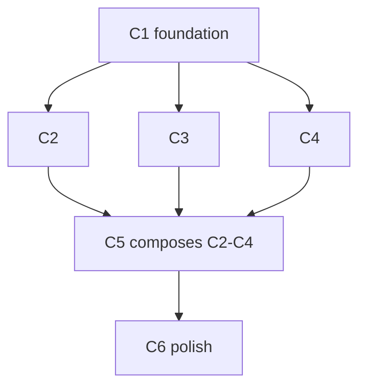

# {Title}

## Goal, outcome, deliverables, UX (the only thing that matters)

Everything below this section is *how*. This section is *what* and *for whom*. Every cycle, wave, and gate exists to make the four blocks below true. If a cycle doesn't visibly move one of these, it doesn't belong in this plan.

### Goal

{ONE sentence — what becomes true that wasn't before. Mirrors `goal:` in frontmatter.}

### Outcome (the kill-switch)

```bash
{outcome command — exits 0 = goal achieved. Mirrors `outcome:` in frontmatter.}
```

**What passing proves:** {mirrors `outcome_asserts:` — the observable behaviour the command verifies}

**Contract:** this command runs after every batch's W4. The plan does not close until it exits 0. The moment it passes, all remaining cycles enter `justify-or-drop` review — default verdict: drop.

### Deliverables (what actually ships)

Concrete artifacts the user / agent / operator can touch. If it isn't on this list, it isn't in scope.

| Kind | Path / name | What the user sees or can do |
|---|---|---|
| route | `/foo` | {observable behaviour} |
| component | `web/src/components/foo/Bar.tsx` | {where it appears, what it does} |
| api | `POST /api/foo` | {request → response shape, who calls it} |
| cli verb | `one foo <args>` | {what operator can now do from terminal} |
| migration | `0042_foo.sql` | {schema change + what it unlocks} |
| doc | `plans/foo.md` | {who reads it and when} |

Mirror this table into `deliverables:` frontmatter. Every row is owned by exactly one cycle (note the cycle ID).

### User experience: before → after

| | Today (ux_before) | After this plan (ux_after) |
|---|---|---|
| **Who** | {persona} | {persona — same or new} |
| **Goal** | {what they're trying to do} | {what they're trying to do — same goal, hopefully} |
| **Steps** | {1. … 2. … 3. …} | {1. … 2. …} |
| **Friction** | {what's painful / impossible today} | {what's removed / made trivial} |
| **Time** | {seconds / minutes / hours} | {seconds / minutes} |
| **Feedback** | {what they see along the way — or don't} | {what they see now} |

**The improvement (ux_delta):** {ONE sentence — the specific delta. "Three clicks become one." "A workflow that needed a developer now runs from the terminal." "Errors that were silent now surface with a fix path." If you can't name the delta, the plan is goldplating — drop it.}

**The one screenshot / log line / API response a future-you would point at to say "see, this is what we shipped":**

```
{paste the after-state observable here — a JSON response shape, a UI flow snippet, a CLI session, whatever proves the UX is real}
```

---

## Reuse contract (read before drafting any cycle)

**Power through simplicity.** The smallest amount of new code that closes the
loop wins. Every cycle in this plan must answer the **compose-or-construct**
question before W3 spawns any agent.

### The compose-or-construct test

For every new file a cycle proposes, W2 must record one line:

> **`{file}`** — no existing primitive covers `{specific behaviour}`. Closest
> match: `{path}` does `{what}` but lacks `{gap}`. Composition would require
> `{≥N hacks}` and lose `{what}`.

If you can't fill that in, **delete the new file from the W3 list** and slot
the behaviour into the closest existing primitive instead.

### Compose-first taxonomy

Before drafting any cycle, walk these registries top-to-bottom. The first
match wins; only fall through to "new file" if every layer fails.

| Layer | Where to look | Default verdict |
|---|---|---|
| 1. **Domain composition** | the surface's own folder (`web/src/components/{surface}/`) | extend the file that already renders this surface |
| 2. **Cross-surface composition** | sibling component folders (`chat/`, `crm/`, `cards/`, `in/`, `settings/`) | import + slot — do not copy |
| 3. **Design primitives** | `web/src/components/ai-elements/`, `web/src/components/ui/` | compose the primitive into a parent; never reimplement |
| 4. **Library primitives** | `@/lib/`, `@/engine/`, existing hooks | reuse the helper; do not parallel-write |
| 5. **Skill / rule packs** | `.claude/skills/`, `.claude/rules/` | invoke the existing skill; do not inline its knowledge |
| 6. **New file** | only if 1-5 all fail | requires the W2 justification line above |

**Anti-patterns rejected on sight:**

- ❌ New `<Composer>` / `<Toolbar>` / `<Picker>` tree when `PromptInput*` already covers it
- ❌ New `<ThreadView>` / `<MessageBubble>` when `Conversation` + `Message` + `MessageList` cover it
- ❌ New `<Modal>` / `<Drawer>` / `<Sheet>` when `Drawer.tsx` is in `ui/`
- ❌ Inline `<svg>` when `lucide-react` + `<Icon>` + `<IconBadge>` exist
- ❌ Bespoke `<textarea>` when `PromptInputTextarea` is one import away
- ❌ A new test file per component when one test file per surface is the norm
- ❌ Re-implementing a debounce / fetch / SSE helper that already lives in `@/lib/`

If your plan trips any of these, rewrite the cycle to compose instead.

### Reuse audit (mandatory W4 line item — every cycle, no exceptions)

Every W4 includes these greps; the cycle does not close if any fail:

- [ ] `wc -l` for all new files in this cycle totals **<{budget} LOC** (set in W2)
- [ ] `delta_loc_net ≤ {target}` (negative deltas preferred — deletion is a win)
- [ ] No reimplementation of a primitive on the taxonomy table (named grep per cycle)

---

## Testing — goal-based, Vitest-first, autonomous

**The rule.** Every cycle has **one demo gate**: a bash command that exits 0 = pass. The command runs zero LLM tokens. If the command can't decide the cycle, it's the wrong command.

### Goal-based, not implementation-based

| Bad (implementation) | Good (goal) |
|---|---|
| `expect(getByText('Mark')).toHaveClass('bg-primary')` | `await run('mark', e); expect(getStrength(edge)).toBe(1)` |
| "the button is visible and styled correctly" | "the action deposits pheromone on the edge" |
| asserts the path | asserts the destination |

A test that breaks when the styling changes is testing the wrong thing.

### Vitest-first; Playwright only when justified

| Test type | Use for | Time | Tokens (fail debug) | Default |
|---|---|---|---|---|
| **Vitest pure** | classifier, dispatcher, hooks, parsers | <100ms | ~200 | **default** |
| **Vitest + msw** | API contract, fetch dispatch, SSE protocol | <500ms | ~400 | **default for network** |
| **Vitest + @testing-library/react** | component render given prop, role-gated visibility | <1s | ~500 | **default for UI** |
| **Lighthouse CLI** (Vitest wrapper) | perf budgets only | 30s | ~600 | when cycle ships perf |
| **Playwright** | visual regression · real multi-context SSE · pixel-drag | 5-30s | 2k-10k | only if cycle declares `requires_playwright: true` in frontmatter |

**Default to the cheapest tool that can express the goal.** A Playwright test where Vitest + msw would suffice is a token-waste and a flake risk.

### One demo gate per cycle

```yaml
# In cycle frontmatter or cycle header:
demo:
  command: "bun vitest run tests/e2e/{cycle}.test.ts"
  asserts:  "{single goal sentence — what passing means}"
  budget:   "<2s wall · <500 LOC test"
```

W4's "cycle demo passes" line resolves to `$(command) && echo pass`. The test file should be ≤ 100 LOC. Three `expect()` calls in one test beats three test files. Five `expect()` is a sign the goal is too broad — split the cycle.

### Test-file LOC budget

| Tier | Budget per cycle's demo |
|---|---|
| trivial | ≤ 30 LOC (one `expect()`) |
| simple | ≤ 80 LOC |
| complex | ≤ 150 LOC (still one file) |

If a cycle needs more than 150 LOC of test, it's actually two cycles.

### Model × effort × wave × token math

Two dials, set per agent. **Model** = cheapest that can decide. **Effort** = lowest that holds.
Full per-stage routing in `plans/templates.md`.

```
W1 recon      bash · none      cache check       0 tokens on hit (saves ~12k vs live call); 14-day TTL
              Haiku · low      SDK on miss       ~5,400-token prefix cached; saves ~4,900/call vs no-cache (40%)
              (inline)         ≤5 files          no agent spawn — read inline
W2 decide     Opus · high      architectural     Opus · xhigh if substrate/schema
              Sonnet · medium  mechanical         inline if trivial
W3 edit       Sonnet · low     mechanical edit   × N parallel, single message
              Sonnet · medium  genuine restructure
W4 verify     bash · none      `bun vitest run`  0 LLM tokens
              Haiku · medium   × 6 rubric        SDK: ~10,900-token block cached; saves ~46k tokens/run (70%)
demo gate     bash · none      test exit code    0 tokens
```

Every check that can be a bash command is a bash command. Tests are bash commands. **The cycle closes when the test exits 0** — no LLM judges the outcome. Progressive disclosure applies at every wave: a Haiku gets the last few turns and top paths, never the full history; a context doc loads only when a `context_triggers:` pattern matches.

### Autonomy gates

Cycle closes autonomously when:
- `bun run verify` exits 0
- `delta_tsc_errors ≤ 0`
- Cycle's `demo.command` exits 0
- Rubric composite ≥ 0.65 (W4 — inline for simple/trivial, 6-Haiku SDK script for complex with spec block cached)

Any one fails → cycle stops, root cause filed, **no user prompt unless trust=cautious or W4 loops > 3**.

### Live verification (cycles that touch deploy surfaces)

Cycles that modify `web/src/middleware.ts`, `web/astro.config.mjs`, `wrangler.toml`,
`web/src/pages/api/**`, or any `.tql`/D1 migration are required to add a post-deploy
HTTP check to W4. Local `bun run verify` is necessary but **not sufficient** — D1
schema drift and CF adapter changes only surface against the deployed runtime.

```bash
# W4 step for deploy-surface cycles (zero LLM tokens):
for path in / /chat /agents; do
  code=$(curl -s -o /dev/null -w "%{http_code}" "https://<deploy-url>$path?_t=$(date +%s)")
  [ "$code" = "200" ] || [ "$code" = "302" ] || { echo "FAIL: $path → $code"; exit 1; }
done
```

The cache buster (`?_t=...`) is mandatory — Astro's Layout sets long-cache headers
on error responses too, so a stale 500 can mask a successful redeploy for up to 24h.

---

## Parallel execution plan

The most important section in this file. Everything else is detail.

### Goal-proof ordering (do this before drawing the DAG)

Before drawing dependency arrows, ask: **which cycle, if it passes, most cheaply reveals whether the plan goal is achievable?** That cycle goes in batch 1 — even out of strict dependency order if you can stub the missing pieces. The point is to fail fast on a misconceived plan, not to satisfy a build order.

| Heuristic | Why |
|---|---|
| Cycle whose `Goal delta:` is closest to plan outcome | Earliest signal the goal is reachable |
| Cycle that ships a user-visible deliverable (route, UI, CLI) | The user can react before you've finished — feedback within the plan, not after |
| Cycle that can run with stubs for later work | Don't wait for foundations to validate the destination |
| Cycle you'd demo first if all else failed | If you'd show this one to a user, it should ship first |

### Cycle-level DAG (what blocks what) — Mermaid, required

Every plan ships this graph. `/do` reads it to compute batches and fire the maximum parallel fan-out. Siblings (no edge between them) run their waves concurrently.



C2·C3·C4 have no edge between them → fully parallel. Label every edge with the file that justifies it (`C1 -->|writes lib/foo.ts| C2`) when it isn't obvious.

**The only valid arrow:** C_m reads a file that C_n **writes** (the file is absent or wrong until C_n completes on disk). **No other reason justifies an arrow.**

**Arrow test — before drawing any arrow, fill this in:**
```
C_m → C_n because C_n imports/reads `{exact file path}` which C_m creates/rewrites.
```
Cannot name the exact file → delete the arrow.

| Real blocker | Imaginary blocker — delete the arrow |
|---|---|
| C_n imports a type C_m defines in a new file | "same feature area" |
| C_n's API route reads a DB schema C_m migrates | "might have merge conflicts" |
| C_n's W2 needs C_m's output shape to make decisions | C_n creates a NEW file (no blocker — just create it) |
| C_n calls an endpoint C_m adds | "better to do in order" |
| | "logically should come first" |
| | "we don't want too much in flight" |
| | "I want to review C_m before starting C_n" — that's review policy, not a blocker |

**Single-cycle plan → skip the DAG, list only the parallel agent map below.**

### Batches (DAG flattened — what fires together)

Mirrors `batches:` frontmatter. Each batch fires the moment the previous batch's W4 closes.

| Batch | Cycles | What runs in parallel |
|-------|--------|----------------------|
| 0 | (shared W0 + W1) | baseline + read of every `shared_recon:` file, ONE message of N Haikus |
| 1 | C1 | full W1→W4 |
| 2 | C2, C3, C4 | THREE cycles run W1→W4 in lockstep; their W3a's merge into ONE Sonnet message |
| 3 | C5 | full W1→W4 |
| 4 | C6 | full W1→W4 |

**The fan-out rule.** When batch N contains cycles C_a, C_b, C_c:

- **Shared W0:** never re-run. Baseline captured in batch 0; W4 diffs against the same `.w0-baseline.json` for every cycle.
- **W1 (recon):** every cycle's W1 file list is union'd, deduped against `shared_recon:`, and the remaining unique files are read in ONE message of `min(unique_files, parallel_budget.haiku)` agents.
- **W2 (decide):** ONE Opus call per cycle (can't merge — each cycle is its own architectural decision). These N Opus calls fire in parallel in ONE message (subject to `parallel_budget.opus`).
- **W3a (edit):** ALL independent edits from ALL cycles in the batch merge into ONE Sonnet spawn message. If C2 has 8 edits and C3 has 6 edits and C4 has 4 edits, that's 18 Sonnet agents in one message (subject to `parallel_budget.sonnet`).
- **W3b (edit, dependent):** runs the moment its W3a counterpart settles, regardless of which cycle it belongs to.
- **Demo gates:** all cycles' `demo.command` test files run in ONE `vitest run` invocation: `bun vitest run tests/e2e/c2.test.ts tests/e2e/c3.test.ts tests/e2e/c4.test.ts`. Single bash, zero LLM tokens, one ratchet check.
- **W4 rubric (if COMPLEX):** rubric agents are PER-CYCLE — 5 Haikus × N cycles = 5N Haikus in ONE message (subject to `parallel_budget.haiku`).

### Plan-level shared steps (run once per plan, never per cycle)

| Step | When | What |
|------|------|------|
| Shared W0 baseline | At plan start | `bun run verify` + `.w0-baseline.json` — every cycle's W4 ratchet reads this |
| Shared W1 recon | At plan start, after W0 | All `shared_recon:` files read in one Haiku spawn; results cached for cycle consumption |
| Final compress sweep | At plan end | `ts-prune` + `noUnusedLocals` once, after the last batch |
| Final docs/improvements append | At plan end | One write, not N |

### Cross-cycle W3 batch (the big win)

When batch N has 3 cycles each with 8 independent edits, the naive path is 3 sequential W3a's (3 round-trips). The batch path is **ONE** W3a — 24 Sonnet agents in one message.

**Pre-condition check (`/do` runs at batch start):**
```bash
# All target files unique across cycles in this batch?
sort .batch-{N}-targets.txt | uniq -d
# Empty → cross-cycle W3 merge eligible.
# Non-empty → split: shared files go to W3b after the unique ones land.
```

**Anti-pattern reject (W3 must NOT merge if):**
- Two cycles' W3a's edit the same file with different anchors (race; even if anchors don't collide on disk, the W4 agent gets confused which cycle authored which)
- One cycle's W3a creates a file another cycle's W3a edits in the same batch (W3b territory)

### Per-cycle W3a/W3b template

Fill in at each cycle's W2. The cross-cycle merge happens automatically when batch eligibility passes.

```
C_n W3a — independent edits (file-disjoint, spawned in one message):
  agent-1  →  src/pages/api/foo.ts        # new endpoint
  agent-2  →  src/lib/foo.ts              # helper module
  agent-3  →  docs/foo.md                 # doc update — always parallel to its code file

C_n W3b — dependent edits (run after W3a settles):
  agent-4  →  src/pages/api/foo.ts        # adds import that agent-2 just defined
```

Empty W3b = preferred. If W3b is non-empty, prefer to flip the dependency by having W3a define the symbol first.

### Imaginary blockers — the explicit reject list

Reject any of these as reasons to add an arrow or move cycles to later batches:

- ❌ "Should test C1 before starting C2" — that's W4's job, not a dependency
- ❌ "Same feature area" / "same folder"
- ❌ "Both touch the database" — only blocks if they touch the same schema entity
- ❌ "Logical reading order matters for the doc" — write order, not build order
- ❌ "Don't want too many agents at once" — `parallel_budget:` already caps this
- ❌ "C2 depends on what we learn in C1" — that's W2 learning, not file dependency; if no file is read, no arrow
- ❌ "Cycles in the same plan should be sequential by default" — they should not
- ❌ "Need to see C1 results before scoping C2" — scope at plan time; if you can't, the plan is unready

---

## Checkbox auto-tick contract

Every actionable item in this plan is a checkbox. `/do` ticks them **the
moment the action finishes** — never at the end of the run, never on
"I'll do it next time." This is how a user reading the file mid-run can
tell at a glance what's done.

### The rule

| When | Action | Who marks it |
|------|--------|--------------|
| A W1 recon agent returns findings for a file | `- [ ] {file}` → `- [x] {file}` | `/do` after the agent settles |
| A W2 decision item resolves (verdict filed, slot map populated, diff spec output) | item → `[x]` | `/do` inline |
| A W3 edit agent reports success on a file | `- [ ] {file}` → `- [x] {file}` | `/do` after the agent settles |
| A W4 check passes (`bun run verify`, demo command, rubric, doc-sync) | item → `[x]` | `/do` after the bash exits 0 |
| A wave's items are all `[x]` | the wave header (`W1 recon`, `W2 decide`, etc.) → `[x]` | `/do` derives |
| A cycle's four waves are all `[x]` | the cycle header (`C1 — name`) → `[x]` | `/do` derives |
| A batch's cycles are all `[x]` | the batch header (`Batch 2`) → `[x]` | `/do` derives |
| All batches `[x]` + plan rubric ≥ 0.65 | `Plan close` items → `[x]` | `/do` derives |

### What this means in practice

- **No silent progress.** Every Bash exit and every agent return triggers a checkbox edit. The file IS the progress bar.
- **Mid-run readability.** A user can `cat dashboard-todo.md` while `/do --auto` is running and see exactly where the wave fan-out is.
- **Forward-only.** A `[x]` is never un-ticked except by an explicit `/do --wave N --redo`.
- **Derivation, not duplication.** When `/do` sees all four waves of C2 are `[x]`, it ticks the `C2 —` header. The user doesn't tick anything manually unless they're overriding.
- **Auto-advance.** When a batch closes, the next batch's blocker chain unblocks and its cycles flip from `state: blocked` to `state: ready`. `/do --auto` fires the next batch's W1 immediately — no prompt.

### Granularity (one checkbox per atomic action)

| Layer | What gets a checkbox |
|-------|---------------------|
| Plan | Shared W0, shared W1, final compress sweep, final docs append, plan rubric, plan close |
| Batch | The batch header (auto-derived) |
| Cycle | The cycle header (auto-derived) + the four wave headers |
| Wave | Every sub-item (file, decision, check) |
| W1 | One checkbox per file recon'd |
| W2 | One per compose verdict, one per diff spec, one per doc-plan trigger |
| W3a | One per file edited (parallel) |
| W3b | One per file edited (sequential, after W3a) |
| W4 | One per verify check (verify · demo · doc-sync · rubric · ratchet) |

If an action has no checkbox, it isn't tracked — and untracked work is the loudest possible code smell.

---

## Status (DAG-derived kanban, not flat checkboxes)

`/do` reads this section and the `batches:` frontmatter together. A cycle's state is **derived**, not declared:

- `ready` — all blockers in the DAG are `[x]` AND the batch is active
- `blocked` — at least one blocker is `[ ]`
- `in_flight` — at least one wave `[~]`
- `done` — all four waves `[x]`

```
Batch 0 (shared)
  - [ ] W0 baseline (plan-level)
  - [ ] W1 shared recon (plan-level)

Batch 1
  - [ ] C1 — {name}                                state: ready
    - [ ] W1 recon
    - [ ] W2 decide
    - [ ] W3 edit
    - [ ] W4 verify

Batch 2  (fires the instant C1 closes)
  - [ ] C2 — {name}                                state: blocked-on-C1
    - [ ] W1 · W2 · W3 · W4
  - [ ] C3 — {name}                                state: blocked-on-C1
    - [ ] W1 · W2 · W3 · W4
  - [ ] C4 — {name}                                state: blocked-on-C1
    - [ ] W1 · W2 · W3 · W4
  - [ ] demo batch (vitest run c2.test c3.test c4.test)

Batch 3
  - [ ] C5 — {name}                                state: blocked-on-C2,C3,C4
    - [ ] W1 · W2 · W3 · W4

Batch 4
  - [ ] C6 — {name}                                state: blocked-on-C5
    - [ ] W1 · W2 · W3 · W4

Plan close
  - [ ] **Plan outcome command exits 0** (the ONLY definition of "plan shipped")
  - [ ] **Every row in `deliverables:` table is shipped and reachable** (route returns 2xx, component renders, CLI verb runs, api responds)
  - [ ] **ux_after journey is walkable end-to-end** — record the screenshot / log / CLI session that proves it
  - [ ] Justify-or-drop review on any cycles unstarted after outcome passed
  - [ ] Final compress sweep
  - [ ] Final docs/improvements.md append
  - [ ] Plan rubric ≥ 0.65 across all cycles (goal-fit weight 0.35)
```

---

## C1 — {name}  [tier: {trivial|simple|complex}  ·  batch: 1]

**Goal delta:** {ONE sentence — after this cycle closes, plan outcome is closer because `{observable}` is now true. If you can't write this, drop the cycle.}

**Deliverable:** {ONE row from the plan `deliverables:` table — the artifact this cycle owns. e.g. `route: /chat/memory — operator can view + edit company memory`}

**UX delta:** {ONE sentence — what the user can do after this cycle that they couldn't before. "Operator now sees company memory in the chat sidebar." If "no user-visible change," say so explicitly — internal-only cycles must justify why they ship before a user-visible one.}

**Cycle outcome:** {verifiable — bash command / test name / API shape / Lighthouse score}

✓ valid: "`bun run verify` passes AND `GET /api/foo` returns `{id, name}`"
✗ invalid: "implementation complete" · "looks good" · "done" · anything needing human judgment

**Contributes to plan outcome:** yes / partial / no — if `no`, drop this cycle.

**Demo gate (the only test that decides this cycle):**
```yaml
demo:
  command: "bun vitest run tests/e2e/c1.test.ts"
  asserts: "{one goal sentence}"
  budget:  "<2s wall · <80 LOC test"
```

### W1 — Recon  [Haiku · parallel · merged across batch]

/do spawns recon agents for ALL files in this batch's W1 list in a **single message**, deduped against `shared_recon:` cache. List only cycle-specific files that exist now (shared files are already cached at plan start).

**Two mandatory recon tracks** — every cycle, no exceptions. Every file is a checkbox; `/do` ticks each as its Haiku settles.

1. **Existing-code recon** (what currently does this job)
   - [ ] `src/pages/api/chat.ts` — {what to find: current handler shape, streaming approach}
   - [ ] `src/lib/agents.ts` — {what to find: agent registry structure}

2. **Primitive-inventory recon** (what we will compose, not rewrite)
   - [ ] `web/src/components/{nearest-folder}/` — list files; mark each `✓ shipped` or `✗ missing`
   - [ ] `web/src/components/ai-elements/` — name the primitives in scope (e.g. `PromptInput*`, `Conversation`, `Message`, `MessageList`)
   - [ ] `web/src/components/ui/` — name the primitives (`Card`, `Drawer`, `Button`, `Icon`, `IconBadge`)
   - [ ] `@/lib/` — name any helpers (`emitClick`, `cn`, `fetchSSE`, etc.) this cycle will reuse

Recon agents return the **public API** (exported names + key prop signatures)
of every primitive they find. W2 cannot decide compose-vs-construct without
this — make it explicit, not implicit.

### W2 — Decide  [Opus if complex · Sonnet if simple · inline if trivial]

/do resolves these from W1 findings. Write the real questions now — W2 answers them.

Every item below is a checkbox; `/do` ticks each as it resolves.

- [ ] **Goal-delta verified** — the cycle's `Goal delta:` sentence holds against the proposed diff. If the diff doesn't move plan outcome closer, drop the cycle.
- [ ] **Deliverable confirmed** — this cycle owns exactly one `deliverables:` row and the diff produces it
- [ ] **UX delta articulated** — the after-state observable is named (route reachable, component visible, CLI verb returns, etc.)
- [ ] **Compose-or-construct verdict** filed for every proposed new file
- [ ] **Slot map** populated (when composing — before any W3 file is listed)
- [ ] **Architectural questions** answered
- [ ] **Diff specs output** for every W3 target
- [ ] **Doc-plan** filed (`.w2-doc-plan.json`) if any trigger applies (new primitive · rename · public surface · directory contract)

**Compose-or-construct verdict (mandatory — top of W2, before any other decision):**

For each proposed new file in this cycle:

| Proposed file | Closest existing primitive | Gap | Verdict |
|---|---|---|---|
| `{new-file-path}` | `{primitive path}` does `{X}` | `{lacks Y}` | **compose** (slot into primitive) / **extend** (PR to primitive) / **new** (justified — closes which behaviour) |

If the verdict column reads "new" for more than one file, justify each
separately. Default to "compose"; "new" is the exception, not the default.

**Slot map** (when composing — fill this in before any W3 file is listed):

| Primitive | Slot used | What this cycle puts in it |
|---|---|---|
| `PromptInputHeader` | header slot | `{this cycle's content}` |
| `PromptInputFooter` | footer slot | `{this cycle's content}` |
| `{other primitive}` | `{slot}` | `{this cycle's content}` |

**Then the architectural questions:**

- [ ] Does `{file}` need a new function or can the existing one extend?
- [ ] {specific architectural question this cycle must settle}

### W3 — Edit  [Sonnet · parallel]

W2 fills in the anchors. Mark which edits are independent vs dependent.

**W3a — independent (spawned in one message):**
- [ ] `src/pages/api/chat.ts` — {what changes}
- [ ] `docs/chat.md` — {doc update parallel to code change}

**W3b — dependent (single message, after W3a completes):**
- [ ] `src/lib/agents.ts` — {depends on W3a output in chat.ts}

If all edits are independent, leave W3b empty — empty W3b = one fewer round-trip.

### W4 — Verify  [Haiku×6 SDK-cached if complex · inline composite if simple/trivial]

- [ ] `bun run verify` green (biome + tsc + vitest)
- [ ] `delta_tsc_errors ≤ 0` (hard gate — no new type errors introduced)
- [ ] {specific functional check — curl / test name / route}
- [ ] **Reuse audit** (hard gate — block if any line fails):
  - [ ] Every primitive in the W2 slot map appears as an import in the new code (`grep -l "from '@/components/{primitive}'" {new files}`)
  - [ ] No reimplementation: greps from W2 anti-patterns table return zero hits in this cycle's new files
  - [ ] `wc -l {new files}` total ≤ W2-declared LOC budget
  - [ ] `delta_loc_net` matches or beats W2 target (negative preferred when this cycle replaces a bespoke widget)
- [ ] **Deliverable shipped** — the `Deliverable:` row is live: route returns 2xx, component renders, CLI verb runs, api responds. Verified by bash, not vibes.
- [ ] **UX delta observable** — record the after-state proof (curl output, screenshot path, log line) and paste it into the cycle close note.
- [ ] **Plan outcome re-check** — `$(plan.outcome)` exit code recorded; if 0, trigger justify-or-drop on remaining cycles.
- [ ] **Goal-fit ≥ 0.50** (hard gate — cycle that didn't measurably move plan outcome cannot pass).
- [ ] Rubric composite ≥ 0.65 — `0.35·goal-fit + 0.20·security + 0.20·stability + 0.15·simplicity + 0.10·speed`

Targets: **goal-fit ≥ 0.80** · security ≥ 0.90 · stability ≥ 0.85 · simplicity ≥ 0.85 · speed ≥ 0.80

**Simplicity scoring penalty:** any new file the reuse audit flags as
"could compose instead" drops simplicity by 0.10 per file. Two flagged files
fail the rubric on simplicity alone.

Report: `delta_tsc=±N  delta_loc=±N  compress_orphans=N  new_files=N  primitives_composed=N`

---

## C2 — {name}  [tier: {trivial|simple|complex}]

**Goal delta:** {one sentence}
**Deliverable:** {one row from `deliverables:` table}
**UX delta:** {one sentence — or "internal-only, justified by X"}
**Cycle outcome:** {verifiable}

### W1 — Recon  [Haiku · parallel]

- `{file}` — {what to find}

### W2 — Decide  [Opus if complex · Sonnet if simple · inline if trivial]

- {question}

### W3 — Edit  [Sonnet · parallel]

**W3a:**
- [ ] `{file}` — {what changes}

**W3b:**
*(empty — all edits independent)*

### W4 — Verify  [Haiku×6 SDK-cached if complex · inline if simple/trivial]

- [ ] `bun run verify` green
- [ ] {specific check}
- [ ] deliverable shipped + ux delta observable
- [ ] plan outcome re-check recorded
- [ ] goal-fit ≥ 0.50 (hard) · composite ≥ 0.65

---

## See also

- `plans/templates.md` — per-stage template/skill/agent registry + model·effort routing
- `plans/template-spec.md` — the SPEC template this todo is planned from (P3)
- `text/template-frame.md` — the FRAME promise template (P1)
- `docs/relevant-spec.md` — {why relevant to this plan}
- `src/relevant/file.ts` — {why relevant}
- `one/dictionary.md` — canonical names (always)
- `one/rubrics.md` — scoring bands (always)

---

## Authoring rules (strip this section before committing the file)

**Goal first, deliverables second, reuse third.** Before scaffolding any cycle:

1. Fill in `goal:`, `outcome:`, `ux_before:`, `ux_after:`, `ux_delta:` in the frontmatter. If `outcome:` isn't a bash command that can exit 0, the plan is unready — go back to the goal.
2. Fill in `deliverables:` — concrete artifacts (route, component, api, cli, migration, doc). Every row maps to exactly one cycle. If you can't name what ships, you can't plan it.
3. For every cycle, write `Goal delta:`, `Deliverable:`, `UX delta:`. If you can't fill in any one of them, the cycle doesn't belong in this plan.
4. Fill in `existing_primitives:` in the frontmatter (≥3 entries). If you can't
   name 3, your recon is incomplete — go back to the codebase.
5. Walk the compose-first taxonomy table above for every new file you imagine.
   The default verdict is "compose", not "new".
6. Every cycle's W1 has **two tracks** — existing-code AND primitive-inventory.
7. Every cycle's W2 begins with the **goal-delta + deliverable + UX-delta check**, THEN the **compose-or-construct verdict table**.
8. Every cycle's W4 runs the **reuse audit**, records the **deliverable proof** (curl/screenshot/log), and re-runs the **plan outcome command** as hard gates.

If a cycle proposes ≥3 new files, that is the loudest possible smell. Stop,
re-recon, and ask: *which of these is actually a slot-fill into something we
already ship?*

**Tiers:**
- `trivial` — ≤3 files, ≤20 LOC, no new types/routes/schema → /do skips all agent spawns
- `simple` — ≤6 files, clear scope, no new primitives → W2 Sonnet, W4 inline
- `complex` — multi-file architecture, new primitives, schema/API changes → full W1→W4

A `complex` plan with **no `existing_primitives:` entries** is malformed —
nothing in this codebase is built on bare ground.

**Blockers (cycle-level):**
- An arrow is valid only when you can name the exact file: `"C_n reads {file} that C_m writes"`
- Default is parallel — omit the arrow and let cycles run simultaneously unless the file test passes
- Never block on: "feels related", "same feature", "might conflict", "better to do in order"
- Only reference cycle IDs from THIS file or verified task IDs from other todo files

**Exit criteria:**
- Must be checkable with a command, test name, or API call
- Write it as: "`{command}` returns `{exact output}` OR `{test name}` passes"

**W1 files:**
- List only files that exist right now — /do validates paths before spawning
- If a file doesn't exist yet, note it as "create new" in the W3a list, not W1

**W3 split:**
- Default is W3a — all agents in one message
- Move an edit to W3b ONLY when: `"this edit targets {file} which W3a agent-N already touches"`
- If you can't name the W3a agent and file, it stays in W3a
- Empty W3b = one fewer round-trip — preferred outcome

**source_of_truth:**
- These files are injected into W2 context on every cycle
- Keep to ≤5; more = token waste; pick the most load-bearing spec files

**escape:**
- Write a verifiable condition, not a judgment ("C2 W4 delta_tsc > 0 twice" not "if it gets too hard")
- Action must say what the human should do next — re-scope / re-read spec / escalate
- Leave both fields empty (`""`) for plans with no known failure modes; /do auto-halts at W4 max loops

**context_triggers:**
- Pattern is matched against W1 findings (file paths + excerpts) — regex, case-insensitive
- Inject only the *section* you need: `"one/signals.md § Six Verbs"` not the whole file
- If you don't know which patterns will fire, leave empty — do.md's built-in triggers still apply
