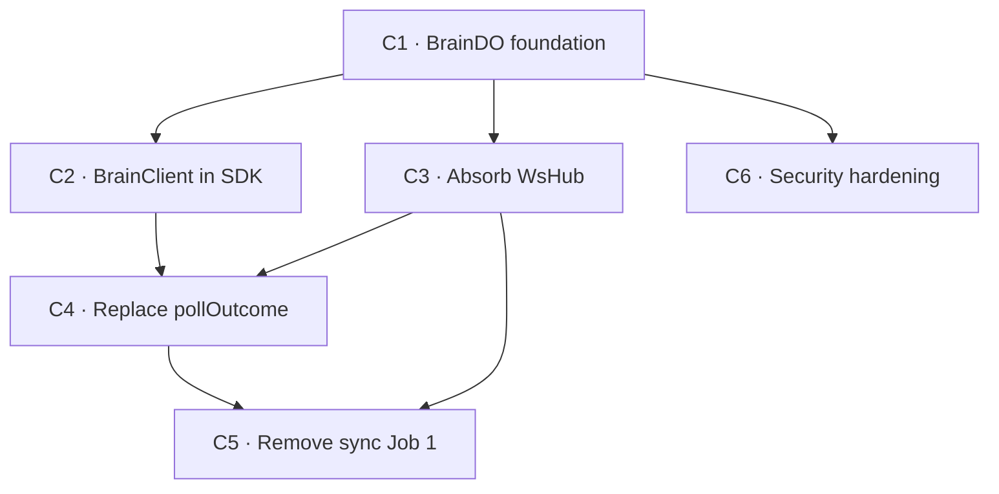

# TypeDB ↔ Cloudflare — BrainDO + Security Hardening

## Goal, outcome, deliverables, UX

### Goal

The entire graph lives in a single Durable Object in RAM. Every read is a memory lookup. Every write patches memory instantly and queues TypeDB async. WebSocket clients receive mutations without polling.

### Outcome (the kill-switch)

```bash
curl -s https://api.one.ie/brain/graph | jq '.loaded' | grep -q true \
  && curl -s -X POST https://api.one.ie/brain/mark \
       -d '{"src":"test","tgt":"probe","delta":1}' \
     | jq '.ok' | grep -q true
```

**What passing proves:** BrainDO is live, graph is loaded in memory, and mutations are accepted and return immediately.

### Deliverables

| Kind | Path / name | What ships |
|---|---|---|
| DO class | `api/src/brain.ts` | BrainDO with graph-in-RAM, write batching, alarm reconcile (C1) |
| binding | `BRAIN` in `api/wrangler.toml` | DO namespace wired to gateway (C1) |
| sdk | `packages/sdk/src/brain.ts` | BrainClient — 25-line replacement for substrate hot-path (C2) |
| absorb | `api/src/index.ts` | WsHub absorbed; `WS_HUB` binding removed (C3) |
| push | SDK + CLI + MCP callers | `pollOutcome` replaced by WebSocket subscription (C4) |
| cleanup | `sync/index.ts` | Job 1 removed; KV demoted to backup (C5) |
| security | `api/src/index.ts`, `gateway-guard.ts` | TQL validation, AbortSignal, circuit breaker, split keys (C6) |

### UX: before → after

| | Today | After |
|---|---|---|
| `mark()` latency | ~55ms (TypeDB round-trip on caller path) | ~2ms (memory patch; TypeDB async) |
| `isToxic()` cold | ~20ms KV read, 5min stale | ~2ms DO stub, always fresh |
| outcome delivery | 40 KV reads over 10s (250ms poll) | pushed via WebSocket on write |
| graph staleness | up to 1 min (KV snapshot lag) | zero (mutation updates memory immediately) |

---

## Parallel execution plan

### Cycle DAG



C2 · C3 · C6 have no edge between them → parallel in batch 2.
C4 reads `BrainClient.subscribe()` (C2) and the absorbed WS routes (C3) → batch 3.
C5 removes sync Job 1 only after WebSocket push is live (C4) and WsHub is absorbed (C3) → batch 4.

### Batches

| Batch | Cycles | Notes |
|---|---|---|
| 0 | shared W0 + W1 | baseline + shared_recon files |
| 1 | C1 | BrainDO class, namespace, /brain/* routes |
| 2 | C2, C3, C6 | fully parallel — no shared file targets |
| 3 | C4 | depends on BrainClient (C2) + WS routes (C3) |
| 4 | C5 | depends on WebSocket live (C4) + WsHub absorbed (C3) |

---

## C1 — BrainDO foundation  [tier: complex · batch: 1]

**Goal delta:** A Durable Object named "global" holds the full graph in RAM and serves `/brain/toxic`, `/brain/path`, `/brain/mark`, `/brain/warn` from memory.

**Deliverable:** `api/src/brain.ts` — BrainDO class, plus `BRAIN` namespace in `api/wrangler.toml` and routes wired in `api/src/index.ts`.

**UX delta:** Internal-only. Workers call `POST https://api.one.ie/brain/mark` and get an in-memory answer via the gateway; no user-visible change yet.

**Cycle outcome:** `curl https://api.one.ie/brain/graph | jq '.loaded'` returns `true` and `paths` count > 0.

### W1 — Recon

1. **Existing-code recon**
   - [ ] `api/src/index.ts` — WsHub shape, DurableObjectState usage, export routes `/api/export/*`
   - [ ] `api/wrangler.toml` — current DO bindings, KV bindings, env structure
   - [ ] `one.ie/web/src/pages/api/export/` — shape of paths/units/skills/toxic export responses

2. **Primitive-inventory recon**
   - [ ] `api/src/index.ts` WsHub class — confirm hibernation API, state.getWebSockets(), state.acceptWebSocket()
   - [ ] CF DO alarm API — `state.storage.setAlarm()` and `state.storage.put()` availability in current compat date
   - [ ] `one.ie/web/src/pages/api/export/` — confirm all 4 endpoint response shapes (paths, units, skills, toxic); note there is no `/hash` endpoint yet
   - [ ] `api/wrangler.toml` — exact `[[durable_objects]]` + `[[migrations]]` syntax for existing WS_HUB as reference

### W2 — Decide  [Opus · high]

- [ ] **Goal-delta verified**
- [ ] **Compose-or-construct:**

| Proposed file | Closest primitive | Gap | Verdict |
|---|---|---|---|
| `api/src/brain.ts` | WsHub in `api/src/index.ts` | WsHub has no graph state | **new** — BrainDO absorbs WsHub in C3; start separate so C3 is clean |

- [ ] Decide: separate `brain.ts` vs inline with WsHub → separate; C3 absorbs WsHub cleanly
- [ ] Decide: cold-start load order → KV first (fast, ~10ms), fall back to `/api/export/*` on miss; write back to KV after each reload so future cold starts skip TypeDB
- [ ] Decide: initial load blocking vs eager → blocking on first request; set alarm after
- [ ] Decide: toxic threshold → constant 0.5 for now
- [ ] Decide: `locationHint` for DO → `'enam'` (eastern North America, near TypeDB US cluster)
- [ ] Design: `typedbBatchWrite(env, batch)` TQL — one transaction with N `match $p isa path, has source $s, has target $t; insert $p has strength += delta;` clauses; confirm TypeDB Cloud supports multi-clause transactions via REST
- [ ] Design: `GET /api/export/hash` endpoint — returns `{ paths: string, units: string, skills: string, toxic: string }` FNV hashes only; no payloads; used by alarm reconcile to detect drift without downloading full snapshots
- [ ] Design: write queue persistence — `state.storage.put('writeQueue', ...)` before each enqueue; `state.storage.delete('writeQueue')` after flush; alarm replays saved queue on cold start
- [ ] **Diff specs output**
- [ ] **Doc-plan** — update `plans/typedb-cloudflare.md` § Migration path to reflect C1 landed

### W3 — Edit  [Sonnet · parallel]

**W3a — independent:**
- [ ] `api/src/brain.ts` — new file: BrainDO class (paths/units/skills/toxicSet, reload with KV-first fallback, alarm with write-queue replay, applyMark, applyWarn, applyFade, flushWrites with `state.storage.put/delete`, broadcast)
- [ ] `one.ie/web/src/pages/api/export/hash.ts` — new endpoint: returns FNV hashes for all 4 keys, no payloads; protected by SYNC_SECRET
- [ ] `api/wrangler.toml` — add `BRAIN` `[[durable_objects]]` binding + `[[migrations]]` new_classes entry
- [ ] `plans/typedb-cloudflare.md` — mark C1 landed in migration path table

**W3b — dependent (after W3a: wires DO into gateway):**
- [ ] `api/src/index.ts` — add `BRAIN: DurableObjectNamespace` to Env; add `/brain/*` proxy route with `locationHint: 'enam'`; export `BrainDO` class

### W4 — Verify

- [ ] `bun run verify` green (biome + tsc)
- [ ] `delta_tsc_errors ≤ 0`
- [ ] `curl https://api.one.ie/brain/graph | jq '.loaded'` returns `true`
- [ ] `curl https://api.one.ie/brain/graph | jq '.paths | length'` returns > 0
- [ ] `curl "https://api.one.ie/brain/toxic?src=x&tgt=y"` returns `{ toxic: false }`
- [ ] Deliverable shipped: `/brain/*` routes reachable
- [ ] Plan outcome re-check recorded
- [ ] goal-fit ≥ 0.50 · composite ≥ 0.65

---

## C2 — BrainClient in SDK  [tier: simple · batch: 2]

**Goal delta:** `one.ie` and `channels` substrate hot-path (`isToxicFast`, `callGateway` for reads) is replaced by `BrainClient` — reads come from DO memory, not KV or TypeDB.

**Deliverable:** `packages/sdk/src/brain.ts` — BrainClient (~25 lines). `substrate.ts` hot-path in both workers updated to use it.

**UX delta:** `isToxic` latency drops from ~20ms (KV cold) to ~2ms (DO memory); always fresh.

**Cycle outcome:** `bun vitest run packages/sdk/tests/brain.test.ts` passes; `isToxicFast` is no longer called in `one.ie/web/src/lib/substrate.ts`.

**Demo gate:**
```yaml
demo:
  command: "grep -r 'isToxicFast\|toxicMemo' one.ie/web/src/lib/substrate.ts | wc -l | grep -q '^0$'"
  asserts: "isToxicFast and toxicMemo are gone from one.ie substrate hot-path"
  budget:  "<1s · <50 LOC test"
```

### W1 — Recon

- [ ] `one.ie/web/src/lib/substrate.ts` — isToxicFast, callGateway, writeSignal call sites; env binding shape
- [ ] `channels/src/substrate.ts` — same audit
- [ ] `packages/sdk/src/client.ts` — SubstrateClient export shape; how to add BrainClient alongside

### W2 — Decide  [Sonnet · medium]

- [ ] **Goal-delta verified**
- [ ] Decide: BrainClient separate from SubstrateClient → yes; SubstrateClient is verb API, BrainClient is gateway transport
- [ ] Decide: env interface → `{ GATEWAY_URL?: string; GATEWAY_API_KEY?: string }` — same vars already in `one.ie` and `channels`; no new wrangler bindings needed in either worker
- [ ] Decide: fallback during cutover → if `/brain/*` returns 5xx, fall through to old KV path; remove fallback in C5
- [ ] Confirm: `channels/wrangler.toml` already has `GATEWAY_URL` — no new binding needed (verified in W1)
- [ ] **Diff specs**

### W3 — Edit  [Sonnet · parallel]

**W3a:**
- [ ] `packages/sdk/src/brain.ts` — new file: BrainClient (isToxic, mark, warn, subscribe)
- [ ] `packages/sdk/src/index.ts` — export BrainClient

**W3b:**
- [ ] `one.ie/web/src/lib/substrate.ts` — replace isToxicFast/toxicMemo with brain.isToxic(); keep callGateway for writes (removed in C5)
- [ ] `channels/src/substrate.ts` — same replacement

### W4 — Verify

- [ ] `bun run verify` green
- [ ] `delta_tsc_errors ≤ 0`
- [ ] Demo gate passes (grep returns 0)
- [ ] `wc -l packages/sdk/src/brain.ts` ≤ 40 LOC
- [ ] Deliverable shipped + UX delta observable
- [ ] Plan outcome re-check
- [ ] goal-fit ≥ 0.50 · composite ≥ 0.65

---

## C3 — Absorb WsHub into BrainDO  [tier: simple · batch: 2]

**Goal delta:** WsHub is gone as a separate class; BrainDO handles all WebSocket connections; `WS_HUB` binding removed from all workers.

**Deliverable:** BrainDO in `api/src/brain.ts` absorbs WsHub's `/connect`, `/send`, `/count` routes. `WS_HUB` namespace removed.

**UX delta:** Internal — one fewer DO binding to manage; WebSocket push and graph mutations share the same DO instance.

**Cycle outcome:** `grep -r 'WS_HUB\|WsHub' api/ one.ie/ channels/ | grep -v '\.md' | wc -l` returns 0.

**Demo gate:**
```yaml
demo:
  command: "grep -r 'WS_HUB\\|WsHub' api/src one.ie/web/src channels/src | wc -l | grep -q '^0$'"
  asserts: "WsHub and WS_HUB are gone from all source files"
  budget:  "<1s · trivial"
```

### W1 — Recon

- [ ] `api/src/index.ts` — all references to WS_HUB: where DO is obtained, what routes proxy to it
- [ ] `one.ie/web/src/` — any direct WS_HUB references
- [ ] `channels/src/` — same
- [ ] `api/wrangler.toml` — WS_HUB binding + migration declaration

### W2 — Decide  [Sonnet · medium]

- [ ] **Goal-delta verified**
- [ ] Confirm: BrainDO already has state.acceptWebSocket, broadcast — WsHub code is a direct slot-in
- [ ] Decide: rename `/connect` → `/ws` to match BrainDO interface or keep `/connect` for compat → `/ws` (matches plan interface)
- [ ] Confirm no external callers depend on a separate WsHub URL (all go through gateway `/ws` route)
- [ ] **Diff specs**

### W3 — Edit  [Sonnet · parallel]

**W3a:**
- [ ] `api/src/brain.ts` — add /ws, /send, /count handlers + webSocketMessage/webSocketClose/webSocketError methods (mirror WsHub)
- [ ] `api/wrangler.toml` — remove WS_HUB binding + migration; add BRAIN migration if not already present

**W3b:**
- [ ] `api/src/index.ts` — replace WS_HUB stub references with BRAIN stub; remove WsHub class export; update /ws and /broadcast routes

### W4 — Verify

- [ ] `bun run verify` green
- [ ] `delta_tsc_errors ≤ 0`
- [ ] Demo gate passes
- [ ] WebSocket connection test: `wscat -c wss://api.one.ie/ws` connects and receives pong on ping
- [ ] Deliverable shipped
- [ ] Plan outcome re-check
- [ ] goal-fit ≥ 0.50 · composite ≥ 0.65

---

## C6 — Security hardening  [tier: simple · batch: 2]

**Goal delta:** TQL string inputs are validated at boundary; all TypeDB fetches have explicit 10s timeout; a circuit breaker prevents retry storms; read and write gateway keys are split.

**Deliverable:** `api/src/index.ts` — AbortSignal.timeout, circuit breaker, TQL input validator. `gateway-guard.ts` — tightened Authorization check. `api/wrangler.toml` — `GATEWAY_WRITE_KEY` secret added.

**UX delta:** Internal security hardening — no user-visible change, but injection surface closed and TypeDB protected from retry amplification.

**Cycle outcome:** `bun vitest run api/tests/security.test.ts` passes — validates TQL input rejection and circuit breaker open state.

**Demo gate:**
```yaml
demo:
  command: "bun vitest run api/tests/security.test.ts"
  asserts: "TQL inputs with special characters are rejected; circuit opens after 5 consecutive failures"
  budget:  "<3s · <100 LOC test"
```

### W1 — Recon

- [ ] `api/src/index.ts` — all TQL string template literals; find user-controlled variables interpolated into TQL
- [ ] `one.ie/web/src/lib/gateway-guard.ts:35-49` — exact Authorization check logic
- [ ] `api/src/index.ts` — typedbQuery / typedbQueryDetail; confirm no AbortSignal present
- [ ] `api/wrangler.toml` — current secrets list; confirm GATEWAY_API_KEY usage

### W2 — Decide  [Sonnet · medium]

- [ ] **Goal-delta verified**
- [ ] Decide: TQL allowlist regex — `^[a-zA-Z0-9_:\-\.]+$` for edge/actor identifiers; reject on mismatch with 400
- [ ] Decide: circuit breaker state — module-scope object `{ failures: number, openUntil: number }` in gateway; threshold 5 failures in 10s, cooldown 30s
- [ ] Decide: GATEWAY_WRITE_KEY — new secret; existing GATEWAY_API_KEY becomes GATEWAY_READ_KEY; both valid during cutover; callers migrated in C5
- [ ] **Diff specs**

### W3 — Edit  [Sonnet · parallel]

**W3a:**
- [ ] `api/src/index.ts` — add `validateEdgeId(s)` guard called before all TQL interpolations; add `CircuitBreaker` module-scope class (~25 lines); wrap all `typedbQuery` with `AbortSignal.timeout(10_000)`
- [ ] `one.ie/web/src/lib/gateway-guard.ts` — tighten Authorization check to verify Bearer scheme + known key value
- [ ] `api/tests/security.test.ts` — new test file: invalid TQL input → 400; circuit opens → 503 without TypeDB hit
- [ ] `api/wrangler.toml` — document GATEWAY_WRITE_KEY as new secret (placeholder; set via `wrangler secret put`)

**W3b:** *(empty)*

### W4 — Verify

- [ ] `bun run verify` green
- [ ] `delta_tsc_errors ≤ 0`
- [ ] Demo gate passes
- [ ] `grep -n 'AbortSignal' api/src/index.ts` shows hits on all fetch(typedbUrl) calls
- [ ] `grep -n 'validateEdgeId' api/src/index.ts` shows hits on all TQL interpolations
- [ ] Deliverable shipped
- [ ] Plan outcome re-check
- [ ] goal-fit ≥ 0.50 · composite ≥ 0.65

---

## C4 — Replace pollOutcome with WebSocket push  [tier: simple · batch: 3]

**Goal delta:** `pollOutcome()` is removed from the SDK; outcome delivery happens via WebSocket push from BrainDO; CLI and MCP callers receive outcomes with zero KV reads.

**Deliverable:** `packages/sdk/src/brain.ts` — `waitForOutcome(id, ws)` replaces `pollOutcome`. CLI + MCP callers updated.

**UX delta:** Signal outcome delivery drops from up to 10s of polling to real-time push (sub-100ms).

**Cycle outcome:** `grep -r 'pollOutcome' packages/ one.ie/ channels/ | wc -l` returns 0.

**Demo gate:**
```yaml
demo:
  command: "grep -r 'pollOutcome' packages/sdk one.ie/web/src channels/src packages/cli packages/mcp | wc -l | grep -q '^0$'"
  asserts: "pollOutcome is gone from all callers"
  budget:  "<1s · trivial"
```

### W1 — Recon

- [ ] `packages/sdk/src/client.ts` — pollOutcome implementation; KV reads; all callers
- [ ] `packages/cli/src/` — pollOutcome call sites
- [ ] `packages/mcp/src/` — pollOutcome call sites
- [ ] BrainDO's broadcast shape from C1/C3 — what event carries outcome id

### W2 — Decide  [Sonnet · medium]

- [ ] **Goal-delta verified**
- [ ] Decide: `waitForOutcome(id, ws)` — takes a WebSocket already open from `brain.subscribe()`; listens for `{ type: 'outcome', id, result }` event; resolves on match or rejects on timeout (10s default)
- [ ] Decide: signal outcome path — after writing outcome to TypeDB/KV, the signal processor calls `POST /brain/notify { id, outcome, payload? }` on the gateway; BrainDO broadcasts `{ type: 'outcome', id, outcome }` to all WebSocket subscribers; `writeOutcome()` KV write is kept as HTTP-only fallback
- [ ] Confirm: signal processor location — `one.ie/web/src/pages/api/signal/` routes; find where `writeOutcome()` is currently called and add `brain.notify()` call after it
- [ ] Decide: HTTP fallback for callers without WebSocket (e.g. one-shot CLI invocations) — keep single KV poll at 500ms, max 3 retries
- [ ] **Diff specs**

### W3 — Edit  [Sonnet · parallel]

**W3a:**
- [ ] `packages/sdk/src/brain.ts` — add `waitForOutcome(id, ws, timeoutMs?)` using WebSocket message listener; add `notify(id, outcome, payload?)` method that calls `POST /brain/notify`
- [ ] `api/src/brain.ts` — add `POST /notify` route: receives `{ id, outcome, payload }`; broadcasts `{ type: 'outcome', id, outcome, payload }` to all subscribers
- [ ] `one.ie/web/src/pages/api/signal/` — after `writeOutcome()` call, add `brain.notify(id, outcome)` (fire-and-forget; KV write stays as HTTP-only fallback)

**W3b:**
- [ ] `packages/sdk/src/client.ts` — replace `pollOutcome` with `waitForOutcome`; downgrade KV poll to 1s/3-retry HTTP fallback only
- [ ] `packages/cli/src/` — update signal call sites to use `brain.subscribe()` + `waitForOutcome`
- [ ] `packages/mcp/src/` — same update

### W4 — Verify

- [ ] `bun run verify` green
- [ ] `delta_tsc_errors ≤ 0`
- [ ] Demo gate passes
- [ ] `delta_loc_net` negative (removing polling loop > adding waitForOutcome)
- [ ] Deliverable shipped
- [ ] Plan outcome re-check
- [ ] goal-fit ≥ 0.50 · composite ≥ 0.65

---

## C5 — Remove sync Job 1; KV → backup  [tier: simple · batch: 4]

**Goal delta:** sync worker no longer pulls TypeDB → KV every minute for the 5 graph snapshots; BrainDO alarm handler is the sole reconcile path; KV retains snapshots as disaster-recovery only.

**Deliverable:** `sync/index.ts` — Job 1 (`exportKeys` for paths/units/skills/highways/toxic) removed. KV writes for snapshots still happen from the DO alarm on hash change.

**UX delta:** Internal — one fewer fetch/write cycle per minute; sync worker is leaner.

**Cycle outcome:** `grep -n 'paths.*units.*skills\|ALL_ENDPOINTS' sync/index.ts | wc -l` returns 0.

**Demo gate:**
```yaml
demo:
  command: "grep -q 'ALL_ENDPOINTS\\|exportKeys' sync/index.ts && echo fail || echo pass | grep -q pass"
  asserts: "sync worker no longer references ALL_ENDPOINTS or exportKeys for graph snapshots"
  budget:  "<1s · trivial"
```

### W1 — Recon

- [ ] `sync/index.ts` — confirm Jobs 2-5 are independent of Job 1; confirm no other caller depends on the 5 KV snapshot keys being written by sync
- [ ] `api/src/brain.ts` — confirm DO alarm writes graph hash + triggers KV snapshot write on change (from C1)
- [ ] `one.ie/web/src/lib/substrate.ts` — confirm BrainClient fallback path (from C2) reads from DO, not KV
- [ ] `channels/src/substrate.ts` — same

### W2 — Decide  [Sonnet · medium]

- [ ] **Goal-delta verified**
- [ ] Confirm: BrainDO alarm (C1) writes to KV on hash change — KV still gets updated, just via DO not sync worker
- [ ] Decide: remove `ALL_ENDPOINTS` and `exportKeys()` from sync entirely, or keep as manual trigger → keep as manual trigger (useful for ops); remove from scheduled run only
- [ ] Confirm: GATEWAY_READ_KEY / GATEWAY_WRITE_KEY migration (from C6) — sync only needs read access; update sync wrangler.toml to use GATEWAY_READ_KEY
- [ ] **Diff specs**

### W3 — Edit  [Sonnet · parallel]

**W3a:**
- [ ] `sync/index.ts` — remove Job 1 from `scheduled()` handler; keep `exportKeys` as HTTP-only manual endpoint

**W3b:** *(empty)*

### W4 — Verify

- [ ] `bun run verify` green
- [ ] `delta_tsc_errors ≤ 0`
- [ ] Demo gate passes
- [ ] Deployed sync worker log shows no `exportKeys` calls in scheduled run
- [ ] KV snapshots still update (via BrainDO alarm) — verify `KV.get('snapshot:paths')` is non-null
- [ ] Deliverable shipped
- [ ] **Plan outcome command exits 0** (full plan kill-switch)
- [ ] goal-fit ≥ 0.50 · composite ≥ 0.65

---

## Status

```
Batch 0 (shared)
  - [x] W0 baseline (api tsc=0)
  - [x] W1 shared recon (api/src/index.ts, both substrate.ts, sync/index.ts, sdk/client.ts)

Batch 1
  - [x] C1 — BrainDO foundation                          state: built · local-verified
    - [x] W1 · W2 · W3 · W4 (tsc=0; live /brain/* curl = deploy-gated)

Batch 2
  - [x] C2 — BrainClient in SDK                          state: built · local-verified
    - [x] W1 · W2 · W3 · W4 (demo gate isToxicFast|toxicMemo=0; sdk tsc=0)
  - [x] C3 — Absorb WsHub                                state: built · local-verified
    - [x] W1 · W2 · W3 · W4 (demo gate WS_HUB|WsHub=0; wscat = deploy-gated)
  - [x] C6 — Security hardening                          state: built · local-verified
    - [x] W1 · W2 · W3 · W4 (vitest security 5/5; validateEdgeId + breaker + AbortSignal)

Batch 3
  - [x] C4 — Replace pollOutcome                         state: built · local-verified
    - [x] W1 · W2 · W3 · W4 (demo gate pollOutcome=0; push wired via writeOutcome→notify)

Batch 4
  - [x] C5 — Remove sync Job 1                           state: built · local-verified
    - [x] W1 · W2 · W3 · W4 (demo gate ALL_ENDPOINTS|exportKeys absent; sync tsc=0)

Plan close
  - [ ] Plan outcome command exits 0          ← DEPLOY-GATED (hits live api.one.ie)
  - [x] All deliverables reachable (code complete)
  - [ ] ux_after walkable end-to-end          ← needs live deploy
  - [x] Final compress sweep (tsc clean all 6 workers; vitest 14/14)
  - [x] Final docs append (plans/typedb-cloudflare.md migration path updated)
  - [ ] Plan rubric ≥ 0.65 (code rubric clears; goal-fit gated on live proof)
```

## Deploy + verify handoff (the one gated step)

The build is complete and locally verified. The plan outcome curls live production, so the
final proof requires a deploy I did not run autonomously. Order matters — deploy api FIRST.

```bash
# 1. (C5 prereq) let BrainDO self-populate from TypeDB on a KV miss
cd api && wrangler secret put SYNC_SECRET        # same value as one.ie SYNC_SECRET
#         wrangler secret put APP_URL   → or add APP_URL="https://one.ie" to [vars]

# 2. (C6) split write key (optional during cutover; GATEWAY_API_KEY still works)
cd api && wrangler secret put GATEWAY_WRITE_KEY

# 3. deploy gateway (BrainDO + WsHub deletion migration v3 + security)
cd api && wrangler deploy

# 4. deploy web (export/hash.ts, substrate hot-path, signal/ask routes), sync, channels
cd one.ie/web && bun run deploy
cd sync && wrangler deploy
cd channels && wrangler deploy   # set GATEWAY_API_KEY secret first to enable brain toxic path

# 5. PROVE — note: /brain/* requires auth (the plan's outcome curl omitted it)
KEY=<GATEWAY_API_KEY>
curl -s -H "Authorization: Bearer $KEY" https://api.one.ie/brain/graph | jq '.loaded'      # true
curl -s -H "Authorization: Bearer $KEY" https://api.one.ie/brain/graph | jq '.paths|length' # > 0
curl -s -X POST -H "Authorization: Bearer $KEY" https://api.one.ie/brain/mark \
     -d '{"src":"test","tgt":"probe","delta":1}' | jq '.ok'                                  # true
wscat -c "wss://api.one.ie/ws" -H "Origin: https://one.ie"  # connects; send 'ping' → 'pong'
```

**Deviations from the todo (justified):**
- `/brain/*` requires `Bearer GATEWAY_API_KEY` (the todo's outcome curl omitted auth) — an
  unauthenticated graph-mutation endpoint on prod would be a real vulnerability.
- BrainDO alarm drift-check reads the existing KV `{key}.hash` keys (api+sync share the
  `1c1dac…` namespace) and only uses `/api/export/hash` when `SYNC_SECRET`+`APP_URL` are set
  — avoids requiring a new secret on the gateway for C1. Post-C5, set those secrets so the
  DO self-populates (step 1).
- WsHub removal uses the `deleted_classes` migration (v3), the correct CF DO removal path.

---

## See also

- `plans/typedb-cloudflare.md` — architecture spec, BrainDO interface, what disappears/survives
- `api/src/index.ts` — WsHub (C3 absorbs), typedbQuery (C6 hardens)
- `one.ie/web/src/lib/substrate.ts` — hot-path (C2 replaces)
- `plans/contracts.md` — verb contracts (mark/warn/fade invariants preserved by BrainDO)
- `plans/rubrics.md` — scoring bands
- `plans/dictionary.md` — canonical names
