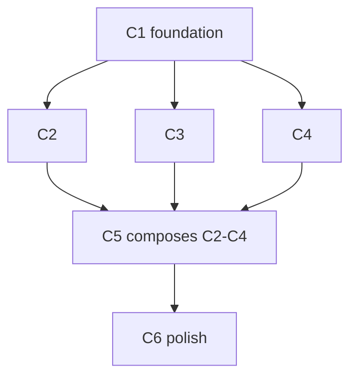

# {Title}

## Goal, outcome, deliverables, UX (the only thing that matters)

Everything below this section is *how*. This section is *what* and *for whom*. Every cycle, wave, and gate exists to make the four blocks below true. If a cycle doesn't visibly move one of these, it doesn't belong in this plan.

### Goal

{ONE sentence — what becomes true that wasn't before. Mirrors `goal:` in frontmatter.}

### Outcome (the kill-switch)

```bash
{outcome command — exits 0 = goal achieved. Mirrors `outcome:` in frontmatter.}
```

**What passing proves:** {mirrors `outcome_asserts:` — the observable behaviour the command verifies}

**Contract:** this command runs after every batch's W4. The plan does not close until it exits 0. The moment it passes, all remaining cycles enter `justify-or-drop` review — default verdict: drop.

### Deliverables (what actually ships)

Concrete artifacts the user / agent / operator can touch. If it isn't on this list, it isn't in scope.

| Kind | Path / name | What the user sees or can do |
|---|---|---|
| route | `/foo` | {observable behaviour} |
| component | `web/src/components/foo/Bar.tsx` | {where it appears, what it does} |
| api | `POST /api/foo` | {request → response shape, who calls it} |
| cli verb | `one foo <args>` | {what operator can now do from terminal} |
| migration | `0042_foo.sql` | {schema change + what it unlocks} |
| doc | `text/foo-plan.md` | {who reads it and when} |

Mirror this table into `deliverables:` frontmatter. Every row is owned by exactly one cycle (note the cycle ID).

### User experience: before → after

| | Today (ux_before) | After this plan (ux_after) |
|---|---|---|
| **Who** | {persona} | {persona — same or new} |
| **Goal** | {what they're trying to do} | {what they're trying to do — same goal, hopefully} |
| **Steps** | {1. … 2. … 3. …} | {1. … 2. …} |
| **Friction** | {what's painful / impossible today} | {what's removed / made trivial} |
| **Time** | {seconds / minutes / hours} | {seconds / minutes} |
| **Feedback** | {what they see along the way — or don't} | {what they see now} |

**The improvement (ux_delta):** {ONE sentence — the specific delta. "Three clicks become one." "A workflow that needed a developer now runs from the terminal." "Errors that were silent now surface with a fix path." If you can't name the delta, the plan is goldplating — drop it.}

**The one screenshot / log line / API response a future-you would point at to say "see, this is what we shipped":**

```
{paste the after-state observable here — a JSON response shape, a UI flow snippet, a CLI session, whatever proves the UX is real}
```

---

## Doctrine (pointed at, never copied)

The static rules — canon table, category table, naming law, compose-first taxonomy, anti-pattern reject list, testing tool ladder, live-verification block, checkbox tick rules — live in exactly two places:

- `.claude/commands/do.md` — the engine: waves, gates, ratchet, parallelism, arrow test
- `text/templates-plan.md` § Todo doctrine — taxonomy, anti-patterns, testing ladder, live verification

**Do not copy those tables into this file when filling it.** A todo instance carries only what is plan-specific. Copied doctrine = three-way drift + tokens paid at every W2 read in every fresh cycle subprocess.

## Reuse contract (the one fill-in: compose-or-construct)

**Power through simplicity.** The smallest amount of new code that closes the
loop wins. For every new file a cycle proposes, W2 must record one line:

> **`{file}`** — no existing primitive covers `{specific behaviour}`. Closest
> match: `{path}` does `{what}` but lacks `{gap}`. Composition would require
> `{≥N hacks}` and lose `{what}`.

If you can't fill that in, **delete the new file from the W3 list** and slot
the behaviour into the closest existing primitive instead. Walk the
compose-first taxonomy (`text/templates-plan.md` § Todo doctrine) top-to-bottom
first; the anti-pattern list there rejects on sight.

### Reuse audit (mandatory W4 line item — every cycle, no exceptions)

Every W4 includes these greps; the cycle does not close if any fail:

- [ ] `wc -l` for all new files in this cycle totals **<{budget} LOC** (set in W2)
- [ ] `delta_loc_net ≤ {target}` (negative deltas preferred — deletion is a win)
- [ ] No reimplementation of a primitive on the taxonomy table (named grep per cycle)

---

## Testing — goal-based, Vitest-first, autonomous

**The rule.** Every cycle has **one demo gate**: a bash command that exits 0 = pass. The command runs zero LLM tokens. If the command can't decide the cycle, it's the wrong command.

Assert the destination, not the path. Tool selection (Vitest-first ladder, Playwright only with `requires_playwright: true`) and the live-verification block for deploy-surface cycles: `text/templates-plan.md` § Todo doctrine.

### One demo gate per cycle

```yaml
# In cycle frontmatter or cycle header:
demo:
  command: "bun vitest run tests/e2e/{cycle}.test.ts"
  asserts:  "{single goal sentence — what passing means}"
  budget:   "<2s wall · <500 LOC test"
```

W4's "cycle demo passes" line resolves to `$(command) && echo pass`. The test file should be ≤ 100 LOC. Three `expect()` calls in one test beats three test files. Five `expect()` is a sign the goal is too broad — split the cycle.

### Test-file LOC budget

| Tier | Budget per cycle's demo |
|---|---|
| trivial | ≤ 30 LOC (one `expect()`) |
| simple | ≤ 80 LOC |
| complex | ≤ 150 LOC (still one file) |

If a cycle needs more than 150 LOC of test, it's actually two cycles.

### Test file location — avoid the `generated/**` permission trap

`.claude/settings.json` denies both `Read` and `Edit` on `**/generated/**` for the conductor and every spawned agent. A cycle that plans its demo test into `tests/unit/generated/<slug>.test.ts` will pass W2 planning and then dissolve mid-W3 when the edit is blocked. Default new tests to a sibling path — `tests/unit/<feature>.test.ts` — unless the plan is deliberately extending an existing file already inside `generated/` from before this deny was added.

### Model × effort routing

Model = cheapest that can decide; effort = lowest that holds. The full per-wave ladder and cache math live in `text/templates-plan.md` (registry) and `.claude/commands/do.md` (engine). Every check that can be a bash command is a bash command; **the cycle closes when the test exits 0** — no LLM judges the outcome.

### Autonomy gates

Cycle closes autonomously when:
- `bun run verify` exits 0
- `delta_tsc_errors ≤ 0`
- Cycle's `demo.command` exits 0
- Rubric composite ≥ 0.65 (W4 — inline for simple/trivial, 6-Haiku SDK script for complex with spec block cached)

Any one fails → cycle stops, root cause filed, **no user prompt unless trust=cautious or W4 loops > 3**.

---

## Parallel execution plan

The most important section in this file. Everything else is detail.

### Goal-proof ordering (do this before drawing the DAG)

Before drawing dependency arrows, ask: **which cycle, if it passes, most cheaply reveals whether the plan goal is achievable?** That cycle goes in batch 1 — even out of strict dependency order if you can stub the missing pieces. The point is to fail fast on a misconceived plan, not to satisfy a build order.

| Heuristic | Why |
|---|---|
| Cycle whose `Goal delta:` is closest to plan outcome | Earliest signal the goal is reachable |
| Cycle that ships a user-visible deliverable (route, UI, CLI) | The user can react before you've finished — feedback within the plan, not after |
| Cycle that can run with stubs for later work | Don't wait for foundations to validate the destination |
| Cycle you'd demo first if all else failed | If you'd show this one to a user, it should ship first |

### Interface Contract (pin before drawing the DAG)

Pin shared names, CLI signatures, and design decisions **here**, before drawing any arrow. Every Batch-1 cycle codes against these frozen decisions — no cycle waits on another's output file.

**What to pin:**

| # | What | Example |
|---|---|---|
| 1 | CLI signatures | `do-reconcile.sh <canon> [<file>… \| --self-test]` — exit 0 = reconciles |
| 2 | Canon / type names | `substrate · dictionary · authority · sdk · design · navigation · types` |
| 3 | Collapse decisions | `design canon owns promise-check (was in do-prove.sh)` |
| 4 | Self-test protocol | `do-reconcile.sh navigation --self-test` exits 0 |
| 5 | Agent invocation strings | `do-reconcile.sh <canon> <file>` per category |
| 6 | Shadow → live rename map | `do2-reconcile.sh → do-reconcile.sh` |
| 7 | Template names | `template-feature · plan · todo · agent · tests · teach` (six, one per artifact-writing stop) |
| 8 | W2 delegation | W2 = spawned single Opus agent (Fable when the cycle is Fable-pinned); conductor stays Sonnet |

**Contract test:** could every cycle's W2 fill in its diff specs right now, without waiting for another cycle? If yes → contract complete. If no → pin the missing decision before drawing any arrow.

### Cycle-level DAG (what blocks what) — Mermaid, required

Every plan ships this graph. `/do` reads it to compute batches and fire the maximum parallel fan-out. Siblings (no edge between them) run their waves concurrently.



C2·C3·C4 have no edge between them → fully parallel. Label every edge with the file that justifies it (`C1 -->|writes lib/foo.ts| C2`) when it isn't obvious.

**The only valid arrow:** C_m reads a file that C_n **writes** (the file is absent or wrong until C_n completes on disk). **No other reason justifies an arrow.**

**Arrow test — before drawing any arrow, fill this in:**
```
C_m → C_n because C_n imports/reads `{exact file path}` which C_m creates/rewrites.
```
Cannot name the exact file → delete the arrow.

| Real blocker | Imaginary blocker — delete the arrow |
|---|---|
| C_n imports a type C_m defines in a new file | "same feature area" |
| C_n's API route reads a DB schema C_m migrates | "might have merge conflicts" |
| C_n's W2 needs C_m's output shape to make decisions | C_n creates a NEW file (no blocker — just create it) |
| C_n calls an endpoint C_m adds | "better to do in order" |
| | "logically should come first" |
| | "we don't want too much in flight" |
| | "I want to review C_m before starting C_n" — that's review policy, not a blocker |

**Single-cycle plan → skip the DAG, list only the parallel agent map below.**

### Batches (DAG flattened — what fires together)

Mirrors `batches:` frontmatter. Each batch fires the moment the previous batch's W4 closes.

| Batch | Cycles | What runs in parallel |
|-------|--------|----------------------|
| 0 | (shared W0 + W1) | baseline + read of every `shared_recon:` file, ONE message of N Haikus |
| 1 | C1 | full W1→W4 |
| 2 | C2, C3, C4 | THREE cycles run W1→W4 in lockstep; their W3a's merge into ONE Sonnet message |
| 3 | C5 | full W1→W4 |
| 4 | C6 | full W1→W4 |

**The fan-out rule.** When batch N contains cycles C_a, C_b, C_c:

- **Shared W0:** never re-run. The verify gate runs ONCE in batch 0; its numbers ARE the plan's pre-existing reds and are quoted in the close note. **There is no baseline FILE.** The gitignored plan-start baseline artifact, and every reader of it, were deleted at rung A5 (`fe8dfdace` — it is named there, deliberately not here, so this file cannot seed the string back into a plan). It held `{"tscErrors":999999}`, was tested as `now <= base`, and the `bunx tsc --noEmit` it derived from ran from a directory with no `tsconfig.json` — 0.184s, exit 1, tsc's usage text, zero `error TS` lines matched. It was a gate that could not say no; and when the file was absent — the normal case in any worktree — the gate emitted `unrun`, and `deterministic_pass` requires zero unruns, so every W4 pack was structurally false. **W4 diffs against nothing. Do not re-add it.** A plan seeded from this template seeds whatever this line says into every cycle it spawns — which is how the dead reader survived A5.
- **W1 (recon):** every cycle's W1 file list is union'd, deduped against `shared_recon:`, and the remaining unique files are read in ONE message of `min(unique_files, parallel_budget.haiku)` agents.
- **W2 (decide):** ONE apex call per cycle (can't merge — each cycle is its own architectural decision). These N calls fire in parallel in ONE message (subject to `parallel_budget.opus`). A Fable-pinned cycle's W2 runs as the single `parallel_budget.fable` slot — if two Fable-pinned cycles land in one batch, the second queues (or downgrades to Opus only if the plan explicitly allows it); Sonnet pre-builds each Fable call's context pack from the batch's W1 facts before the spawn.
- **W3a (edit):** ALL independent edits from ALL cycles in the batch merge into ONE Sonnet spawn message. If C2 has 8 edits and C3 has 6 edits and C4 has 4 edits, that's 18 Sonnet agents in one message (subject to `parallel_budget.sonnet`).
- **W3b (edit, dependent):** runs the moment its W3a counterpart settles, regardless of which cycle it belongs to.
- **Demo gates:** all cycles' `demo.command` test files run in ONE `vitest run` invocation: `bun vitest run tests/e2e/c2.test.ts tests/e2e/c3.test.ts tests/e2e/c4.test.ts`. Single bash, zero LLM tokens, one ratchet check.
- **W4 rubric (if COMPLEX):** rubric agents are PER-CYCLE — 5 Haikus × N cycles = 5N Haikus in ONE message (subject to `parallel_budget.haiku`).

### Plan-level shared steps (run once per plan, never per cycle)

| Step | When | What |
|------|------|------|
| Shared W0 baseline | At plan start | `bun run verify` ONCE — record the numbers in the close note. **No baseline file and no downstream diff**: rung A5 (`fe8dfdace`) deleted the artifact and every reader |
| Shared W1 recon | At plan start, after W0 | All `shared_recon:` files read in one Haiku spawn; results cached for cycle consumption |
| Final compress sweep | At plan end | `ts-prune` + `noUnusedLocals` once, after the last batch |
| Final docs/improvements append | At plan end | One write, not N |

### Cross-cycle W3 batch (the big win)

When batch N has 3 cycles each with 8 independent edits, the naive path is 3 sequential W3a's (3 round-trips). The batch path is **ONE** W3a — 24 Sonnet agents in one message.

**Pre-condition check (`/do` runs at batch start):**
```bash
# All target files unique across cycles in this batch?
sort .batch-{N}-targets.txt | uniq -d
# Empty → cross-cycle W3 merge eligible.
# Non-empty → split: shared files go to W3b after the unique ones land.
```

**Anti-pattern reject (W3 must NOT merge if):**
- Two cycles' W3a's edit the same file with different anchors (race; even if anchors don't collide on disk, the W4 agent gets confused which cycle authored which)
- One cycle's W3a creates a file another cycle's W3a edits in the same batch (W3b territory)

### Per-cycle W3a/W3b template

Fill in at each cycle's W2. The cross-cycle merge happens automatically when batch eligibility passes.

```
C_n W3a — independent edits (file-disjoint, spawned in one message):
  agent-1  →  src/pages/api/foo.ts        # new endpoint
  agent-2  →  src/lib/foo.ts              # helper module
  agent-3  →  docs/foo.md                 # doc update — always parallel to its code file

C_n W3b — dependent edits (run after W3a settles):
  agent-4  →  src/pages/api/foo.ts        # adds import that agent-2 just defined
```

Empty W3b = preferred. If W3b is non-empty, prefer to flip the dependency by having W3a define the symbol first.

### Imaginary blockers — the explicit reject list

Reject any of these as reasons to add an arrow or move cycles to later batches:

- ❌ "Should test C1 before starting C2" — that's W4's job, not a dependency
- ❌ "Same feature area" / "same folder"
- ❌ "Both touch the database" — only blocks if they touch the same schema entity
- ❌ "Logical reading order matters for the doc" — write order, not build order
- ❌ "Don't want too many agents at once" — `parallel_budget:` already caps this
- ❌ "C2 depends on what we learn in C1" — that's W2 learning, not file dependency; if no file is read, no arrow
- ❌ "Cycles in the same plan should be sequential by default" — they should not
- ❌ "Need to see C1 results before scoping C2" — scope at plan time; if you can't, the plan is unready

---

## Surface checklist contract (W2 output)

`.w2-surface-checklist.json` is **mandatory every cycle** — not just cycles that add routes. Either it lists the surface layers (routes, components, nav, inbound links, states) or it explicitly declares `{"surface": "none", "reason": "<why this cycle ships nothing user-visible>"}`. A missing file = W2 incomplete. For every new route/page/component the entry looks like:

```json
{
  "surfaces": [
    {
      "name": "memory",
      "routes": ["/u/[slug]/chat/memory"],
      "components": ["MemoryCard", "MemoryEditor"],
      "nav_entry": {
        "parent_page": "src/pages/u/[slug]/chat/index.astro",
        "parent_section": "Chat sidebar",
        "link_text": "Memory",
        "link_target": "/u/[slug]/chat/memory"
      },
      "inbound_links": [
        {
          "from_page": "src/pages/u/[slug]/chat/index.astro",
          "anchor_text": "View memory"
        },
        {
          "from_page": "src/pages/u/[slug]/settings/index.astro",
          "anchor_text": "Manage memory"
        }
      ],
      "sdk_export": "packages/sdk/src/types/memory.ts",
      "mcp_tool": null,
      "cli_verb": null,
      "ui_states": ["empty (no memory yet)", "loading (fetching memory)", "error (fetch failed)", "edit (user editing memory)"]
    }
  ]
}
```

**Every surface must have:**
- `nav_entry` (required if route is user-visible; null if internal-only)
- `inbound_links` (required if user-visible; at least one link from a related page)
- `sdk_export` (required if cycle adds new public types; null if only internal changes)
- `ui_states` (required if component rendered; describe each state the component can be in)

W4 will verify every entry above. Missing fields = W4 fails.

---

## Checkbox contract

Every actionable item is a checkbox; `/do` flips it the moment the action settles. The full tick table and invariants live in `.claude/commands/do.md` § Step 2 — the file IS the progress bar, forward-only, headers derived. What stays here is the instance-shaped granularity:

### Granularity (one checkbox per atomic action)

| Layer | What gets a checkbox |
|-------|---------------------|
| Plan | Shared W0, shared W1, final compress sweep, final docs append, plan rubric, plan close |
| Batch | The batch header (auto-derived) |
| Cycle | The cycle header (auto-derived) + the four wave headers |
| Wave | Every sub-item (file, decision, check) |
| W1 | One checkbox per file recon'd |
| W2 | One per compose verdict, one per diff spec, one per doc-plan trigger |
| W3a | One per file edited (parallel) |
| W3b | One per file edited (sequential, after W3a) |
| W4 | One per verify check (verify · demo · doc-sync · rubric · ratchet) |

If an action has no checkbox, it isn't tracked — and untracked work is the loudest possible code smell.

---

## Status (DAG-derived kanban, not flat checkboxes)

`/do` reads this section and the `batches:` frontmatter together. A cycle's state is **derived**, not declared:

- `ready` — all blockers in the DAG are `[x]` AND the batch is active
- `blocked` — at least one blocker is `[ ]`
- `in_flight` — at least one wave `[~]`
- `done` — all four waves `[x]`

```
Batch 0 (shared)
  - [ ] W0 baseline (plan-level)          # one `bun run verify`, numbers to the close note — no baseline file (A5)
  - [ ] W1 shared recon (plan-level)

Batch 1
  - [ ] C1 — {name}                                state: ready
    - [ ] W1 recon
    - [ ] W2 decide
    - [ ] W3 edit
    - [ ] W4 verify

Batch 2  (fires the instant C1 closes)
  - [ ] C2 — {name}                                state: blocked-on-C1
    - [ ] W1 · W2 · W3 · W4
  - [ ] C3 — {name}                                state: blocked-on-C1
    - [ ] W1 · W2 · W3 · W4
  - [ ] C4 — {name}                                state: blocked-on-C1
    - [ ] W1 · W2 · W3 · W4
  - [ ] demo batch (vitest run c2.test c3.test c4.test)

Batch 3
  - [ ] C5 — {name}                                state: blocked-on-C2,C3,C4
    - [ ] W1 · W2 · W3 · W4

Batch 4
  - [ ] C6 — {name}                                state: blocked-on-C5
    - [ ] W1 · W2 · W3 · W4

Plan close
  - [ ] **Plan outcome command exits 0** (the ONLY definition of "plan shipped")
  - [ ] **Every row in `deliverables:` table is shipped and reachable** (route returns 2xx, component renders, CLI verb runs, api responds)
  - [ ] **ux_after journey is walkable end-to-end** — record the screenshot / log / CLI session that proves it
  - [ ] Justify-or-drop review on any cycles unstarted after outcome passed
  - [ ] **`text/<slug>-docs.md` is true** — authored first at DOCS (the spec); every documented observable now proven against the shipped thing, any drift reconciled (no plan closes with a doc that lies)
  - [ ] Final compress sweep
  - [ ] Final docs/improvements.md append
  - [ ] Plan rubric ≥ 0.65 across all cycles (goal-fit weight 0.35)
```

---

## C1 — {name}  [tier: {trivial|simple|complex}  ·  batch: 1]

**Goal delta:** {ONE sentence — after this cycle closes, plan outcome is closer because `{observable}` is now true. If you can't write this, drop the cycle.}

**Deliverable:** {ONE row from the plan `deliverables:` table — the artifact this cycle owns. e.g. `route: /chat/memory — operator can view + edit company memory`}

**UX delta:** {ONE sentence — what the user can do after this cycle that they couldn't before. "Operator now sees company memory in the chat sidebar." If "no user-visible change," say so explicitly — internal-only cycles must justify why they ship before a user-visible one.}

**Surface:** {`/route` | `component:<Name>` | `none({reason})` — the user-visible surface this cycle ships; W2 copies this verbatim into `.w2-surface-checklist.json` (none requires the reason)}

**Cycle outcome:** {verifiable — bash command / test name / API shape / Lighthouse score}

✓ valid: "`bun run verify` passes AND `GET /api/foo` returns `{id, name}`"
✗ invalid: "implementation complete" · "looks good" · "done" · anything needing human judgment

**Contributes to plan outcome:** yes / partial / no — if `no`, drop this cycle.

**Demo gate (the only test that decides this cycle):**
```yaml
demo:
  command: "bun vitest run tests/e2e/c1.test.ts"
  asserts: "{one goal sentence}"
  budget:  "<2s wall · <80 LOC test"
```

**Wave tracking** (mandatory — `do-auto.sh`'s `_sync_status` scans THIS `## C<n>` section for
`- [ ] W` lines to auto-derive the Status kanban's header tick; the kanban's own nested
`- [ ] W1 recon` lines are a summary view, not what the script reads. Omitting this block
means the section never has an open `- [ ] W` line, so `_sync_status` false-ticks the cycle
complete on the very first pass, before any work happens — verified failure, `live-edit` C1–C6,
2026-07-23. One line per wave, updated to `[x]` as each completes):
- [ ] W1 recon — {one line: what was found}
- [ ] W2 decide — {one line: what was decided}
- [ ] W3 edit — {one line: what landed}
- [ ] W4 verify — {one line: what passed}

### W1 — Recon  [Haiku · parallel · merged across batch]

/do spawns recon agents for ALL files in this batch's W1 list in a **single message**, deduped against `shared_recon:` cache. List only cycle-specific files that exist now (shared files are already cached at plan start).

**Two mandatory recon tracks** — every cycle, no exceptions. Every file is a checkbox; `/do` ticks each as its Haiku settles.

1. **Existing-code recon** (what currently does this job)
   - [ ] `src/pages/api/chat.ts` — {what to find: current handler shape, streaming approach}
   - [ ] `src/lib/agents.ts` — {what to find: agent registry structure}

2. **Primitive-inventory recon** (what we will compose, not rewrite)
   - [ ] `web/src/components/{nearest-folder}/` — list files; mark each `✓ shipped` or `✗ missing`
   - [ ] `web/src/components/ai-elements/` — name the primitives in scope (e.g. `PromptInput*`, `Conversation`, `Message`, `MessageList`)
   - [ ] `web/src/components/ui/` — name the primitives (`Card`, `Drawer`, `Button`, `Icon`, `IconBadge`)
   - [ ] `@/lib/` — name any helpers (`emitClick`, `cn`, `fetchSSE`, etc.) this cycle will reuse

Recon agents return the **public API** (exported names + key prop signatures)
of every primitive they find. W2 cannot decide compose-vs-construct without
this — make it explicit, not implicit.

### W2 — Decide  [Fable if verdict compounds plan-wide · Opus if complex · Sonnet if simple · inline if trivial]

/do resolves these from W1 findings. Write the real questions now — W2 answers them.

Every item below is a checkbox; `/do` ticks each as it resolves.

- [ ] **Goal-delta verified** — the cycle's `Goal delta:` sentence holds against the proposed diff. If the diff doesn't move plan outcome closer, drop the cycle.
- [ ] **Deliverable confirmed** — this cycle owns exactly one `deliverables:` row and the diff produces it
- [ ] **UX delta articulated** — the after-state observable is named (route reachable, component visible, CLI verb returns, etc.)
- [ ] **Compose-or-construct verdict** filed for every proposed new file
- [ ] **Slot map** populated (when composing — before any W3 file is listed)
- [ ] **Architectural questions** answered
- [ ] **Diff specs output** for every W3 target
- [ ] **Doc-plan** filed (`.w2-doc-plan.json`) if any trigger applies (new primitive · rename · public surface · directory contract)
- [ ] **Surface checklist** (`.w2-surface-checklist.json`) — MANDATORY every cycle: for every new route/page/component document nav parent, inbound links + source pages, SDK/MCP/CLI exports, UI states — or write an explicit `{"surface": "none", "reason": "…"}`

**Compose-or-construct verdict (mandatory — top of W2, before any other decision):**

For each proposed new file in this cycle:

| Proposed file | Closest existing primitive | Gap | Verdict |
|---|---|---|---|
| `{new-file-path}` | `{primitive path}` does `{X}` | `{lacks Y}` | **compose** (slot into primitive) / **extend** (PR to primitive) / **new** (justified — closes which behaviour) |

If the verdict column reads "new" for more than one file, justify each
separately. Default to "compose"; "new" is the exception, not the default.

**Slot map** (when composing — fill this in before any W3 file is listed):

| Primitive | Slot used | What this cycle puts in it |
|---|---|---|
| `PromptInputHeader` | header slot | `{this cycle's content}` |
| `PromptInputFooter` | footer slot | `{this cycle's content}` |
| `{other primitive}` | `{slot}` | `{this cycle's content}` |

**Then the architectural questions:**

- [ ] Does `{file}` need a new function or can the existing one extend?
- [ ] {specific architectural question this cycle must settle}

### W3 — Edit  [Sonnet · parallel]

W2 fills in the anchors AND the surface checklist. Mark which edits are independent vs dependent.

**UI cycles (surface ≠ none):** name `text/<slug>-ui.md` as source_of_truth and load the `shadcn` / `puck` / `frontend-design` skills before editing; W4 then verifies each component-state row of the -ui.md renders, `do-prove.sh --route` passes, and light+dark screenshots are attached to the cycle close note.

**Surface build order (every cycle, in this order — driven by the mandatory `.w2-surface-checklist.json`; a cycle with `{"surface": "none"}` skips 5–8 but still files the checklist):**
1. Schema (migration if needed)
2. Types (TypeScript interfaces)
3. Receiver/SDK (if new public method)
4. API route (if new endpoint)
5. Component (React/Astro component)
6. Page (Astro page that uses component)
7. **Navigation (route registered in nav system + parent link)**
8. **Inbound links (links from related pages)**
9. **Docs (dictionary updates, feature doc sections, plan updates)**
10. **UI states (empty, loading, error, edge cases)**

**W3a — independent (spawned in one message):**
- [ ] `migrations/0042_{feature}.sql` — {schema changes, if any}
- [ ] `src/types/{feature}.ts` — {type definitions}
- [ ] `src/pages/api/{feature}.ts` — {new endpoint, if any}
- [ ] `src/components/{surface}/{Feature}.tsx` — {React component}
- [ ] `src/pages/u/[slug]/{feature}/index.astro` — {Astro page}
- [ ] `src/lib/navigation.ts` — {add route + link to parent nav section}
- [ ] `src/pages/u/[slug]/{related-page}.astro` — {add inbound link to new feature}
- [ ] `text/dictionary.md` — {add new terms + type definitions}
- [ ] `text/{feature}-plan.md` — {add new section documenting the feature}
- [ ] `packages/sdk/src/index.ts` — {export new types, if any}
- [ ] `packages/sdk/src/client.ts` — {add new public method, if any}
- [ ] `packages/mcp/src/tools/{feature}.ts` — {add MCP tool, if agent-facing}

**UI states (inline with component, not separate edits):**
- Empty state component (when no data exists)
- Loading state (skeleton / spinner)
- Error state (with fix link)
- Edit mode (if applicable)

**W3b — dependent (single message, after W3a completes):**
- [ ] `src/lib/index.ts` — {add exports from new modules W3a created}
- [ ] `src/components/{surface}/index.ts` — {export new component if W3a created it}

If all edits are independent, leave W3b empty — empty W3b = one fewer round-trip. **Docs and navigation are NEVER W3b** — they are always in W3a.

### W4 — Verify  [Haiku×6 SDK-cached if complex · inline composite if simple/trivial]

- [ ] `bun run verify` green (biome + tsc + vitest)
- [ ] `delta_tsc_errors ≤ 0` (hard gate — no new type errors introduced)
- [ ] {specific functional check — curl / test name / route}
- [ ] **Reuse audit** (hard gate — block if any line fails):
  - [ ] Every primitive in the W2 slot map appears as an import in the new code (`grep -l "from '@/components/{primitive}'" {new files}`)
  - [ ] No reimplementation: greps from W2 anti-patterns table return zero hits in this cycle's new files
  - [ ] `wc -l {new files}` total ≤ W2-declared LOC budget
  - [ ] `delta_loc_net` matches or beats W2 target (negative preferred when this cycle replaces a bespoke widget)
- [ ] **Surface layer verification** (hard gate — from `.w2-surface-checklist.json`):
  - [ ] Route registered in navigation system (grep `path: ".*{route}"` in `src/lib/navigation.ts`)
  - [ ] Nav entry created (parent link exists in parent page + sidebar)
  - [ ] Inbound links wired (each link in checklist appears in source pages)
  - [ ] SDK exports completed (new types in `packages/sdk/src/index.ts`)
  - [ ] MCP tool defined (if agent-facing; in `packages/mcp/src/tools/`)
  - [ ] CLI verb added (if operator-facing; in `packages/cli/src/commands/`)
  - [ ] All UI states rendered (empty, loading, error, edit modes exist in component)
  - [ ] Page-load proof (surface ≠ none): `bash .claude/scripts/do-prove.sh --route {route}` exits 0 + each component-state row of `text/<slug>-ui.md` renders + light+dark screenshots attached to the close note
- [ ] **Docs synchronized** (hard gate):
  - [ ] New terms added to `text/dictionary.md`
  - [ ] Feature doc section exists (`text/{feature}-plan.md` or appended to existing)
  - [ ] No broken links (`markdown-link-check text/**/*.md`)
  - [ ] No dead names from W3 edits (`grep -r "{old-name}" text/ | grep -v "^text/learnings.md"` returns nothing)
- [ ] **Promise check** (hard gate — cycle's observable matches `text/{feature}.md`):
  - [ ] Feature promise in `text/{feature}.md` states what the user gets
  - [ ] Cycle's demo proves that promise is live (observable in UI, API, or CLI)
  - [ ] Screenshot / curl output / CLI session pasted into cycle close note
- [ ] **Deliverable shipped** — the `Deliverable:` row is live: route returns 2xx, component renders, CLI verb runs, api responds. Verified by bash, not vibes.
- [ ] **UX delta observable** — record the after-state proof (curl output, screenshot path, log line) and paste it into the cycle close note.
- [ ] **Plan outcome re-check** — `$(plan.outcome)` exit code recorded; if 0, trigger justify-or-drop on remaining cycles.
- [ ] **Goal-fit ≥ 0.50** (hard gate — cycle that didn't measurably move plan outcome cannot pass).
- [ ] Rubric composite ≥ 0.65 — `0.35·goal-fit + 0.20·security + 0.20·stability + 0.15·simplicity + 0.10·speed`

Targets: **goal-fit ≥ 0.80** · security ≥ 0.90 · stability ≥ 0.85 · simplicity ≥ 0.85 · speed ≥ 0.80

**Simplicity scoring penalty:** any new file the reuse audit flags as
"could compose instead" drops simplicity by 0.10 per file. Two flagged files
fail the rubric on simplicity alone.

Report: `delta_tsc=±N  delta_loc=±N  compress_orphans=N  new_files=N  primitives_composed=N`

---

## C2 — {name}  [tier: {trivial|simple|complex}]

**Goal delta:** {one sentence}
**Deliverable:** {one row from `deliverables:` table}
**UX delta:** {one sentence — or "internal-only, justified by X"}
**Surface:** {`/route` | `component:<Name>` | `none({reason})` — W2 copies into `.w2-surface-checklist.json`}
**Cycle outcome:** {verifiable}

**Wave tracking** (mandatory — see C1's note above for why):
- [ ] W1 recon — {one line}
- [ ] W2 decide — {one line}
- [ ] W3 edit — {one line}
- [ ] W4 verify — {one line}

### W1 — Recon  [Haiku · parallel]

- `{file}` — {what to find}

### W2 — Decide  [Fable if verdict compounds plan-wide · Opus if complex · Sonnet if simple · inline if trivial]

- {question}

### W3 — Edit  [Sonnet · parallel]

**W3a:**
- [ ] `{file}` — {what changes}

**W3b:**
*(empty — all edits independent)*

### W4 — Verify  [Haiku×6 SDK-cached if complex · inline if simple/trivial]

- [ ] `bun run verify` green
- [ ] {specific check}
- [ ] deliverable shipped + ux delta observable
- [ ] plan outcome re-check recorded
- [ ] goal-fit ≥ 0.50 (hard) · composite ≥ 0.65

---

## See also

- `text/templates-plan.md` — per-stage template/skill/agent registry + model·effort routing
- `text/template-plan.md` — the DESIGN template this todo is planned from (DESIGN phase)
- `text/template-feature.md` — the PROMISE template (PROMISE phase)
- `docs/relevant-spec.md` — {why relevant to this plan}
- `src/relevant/file.ts` — {why relevant}
- `text/dictionary.md` — canonical names (always)
- `text/rubrics.md` — scoring bands (always)

---

## Authoring rules (strip this section before committing the file)

**Goal first, deliverables second, reuse third.** Before scaffolding any cycle:

1. Fill in `goal:`, `outcome:`, `ux_before:`, `ux_after:`, `ux_delta:` in the frontmatter. If `outcome:` isn't a bash command that can exit 0, the plan is unready — go back to the goal.
2. Fill in `deliverables:` — concrete artifacts (route, component, api, cli, migration, doc). Every row maps to exactly one cycle. If you can't name what ships, you can't plan it.
3. For every cycle, write `Goal delta:`, `Deliverable:`, `UX delta:`. If you can't fill in any one of them, the cycle doesn't belong in this plan.
4. Fill in `existing_primitives:` in the frontmatter (≥3 entries). If you can't
   name 3, your recon is incomplete — go back to the codebase.
5. Walk the compose-first taxonomy table above for every new file you imagine.
   The default verdict is "compose", not "new".
6. Every cycle's W1 has **two tracks** — existing-code AND primitive-inventory.
7. Every cycle's W2 begins with the **goal-delta + deliverable + UX-delta check**, THEN the **compose-or-construct verdict table**.
8. Every cycle's W4 runs the **reuse audit**, records the **deliverable proof** (curl/screenshot/log), and re-runs the **plan outcome command** as hard gates.

If a cycle proposes ≥3 new files, that is the loudest possible smell. Stop,
re-recon, and ask: *which of these is actually a slot-fill into something we
already ship?*

**Tiers:**
- `trivial` — ≤3 files, ≤20 LOC, no new types/routes/schema → /do skips all agent spawns
- `simple` — ≤6 files, clear scope, no new primitives → W2 Sonnet, W4 inline
- `complex` — multi-file architecture, new primitives, schema/API changes → full W1→W4

A `complex` plan with **no `existing_primitives:` entries** is malformed —
nothing in this codebase is built on bare ground.

**Blockers (cycle-level):**
- An arrow is valid only when you can name the exact file: `"C_n reads {file} that C_m writes"`
- Default is parallel — omit the arrow and let cycles run simultaneously unless the file test passes
- Never block on: "feels related", "same feature", "might conflict", "better to do in order"
- Only reference cycle IDs from THIS file or verified task IDs from other todo files

**Exit criteria:**
- Must be checkable with a command, test name, or API call
- Write it as: "`{command}` returns `{exact output}` OR `{test name}` passes"

**W1 files:**
- List only files that exist right now — /do validates paths before spawning
- If a file doesn't exist yet, note it as "create new" in the W3a list, not W1

**W3 split:**
- Default is W3a — all agents in one message
- Move an edit to W3b ONLY when: `"this edit targets {file} which W3a agent-N already touches"`
- If you can't name the W3a agent and file, it stays in W3a
- Empty W3b = one fewer round-trip — preferred outcome

**source_of_truth:**
- These files are injected into W2 context on every cycle
- Keep to ≤5; more = token waste; pick the most load-bearing spec files

**escape:**
- Write a verifiable condition, not a judgment ("C2 W4 delta_tsc > 0 twice" not "if it gets too hard")
- Action must say what the human should do next — re-scope / re-read spec / escalate
- Leave both fields empty (`""`) for plans with no known failure modes; /do auto-halts at W4 max loops

**context_triggers:**
- Pattern is matched against W1 findings (file paths + excerpts) — regex, case-insensitive
- Inject only the *section* you need: `"text/dsl.md § Six Verbs"` not the whole file
- If you don't know which patterns will fire, leave empty — do.md's built-in triggers still apply
