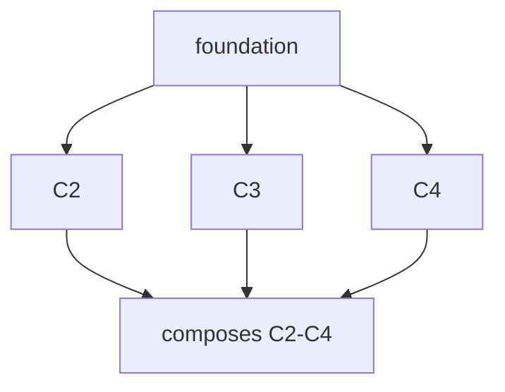

# /do: The Complete Build Workflow

> "Every other AI coding tool stops at 'here's some code.' That's the easy 20%. The other 80% — the spec nobody wrote, the test nobody added, the doc that's already a lie, the proof that it actually works — is where software goes to die. We built a machine that does the whole 80%, and only commits to the trunk once it's proven."
>
> — Anthony O'Connell, Founder of ONE

This is the full workflow `/do` walks, from a sentence to shipped, proven software. It is one command:

```
/do "your idea here"
```

Below is every phase that command runs, the questions it asks at each one, the concrete actions it takes, and the gate it has to clear before moving on. You confirm the goal once. Everything below the goal, `/do` owns.

A phase whose artifact already exists is **skipped**. Point `/do` at a blank idea and it runs every phase. Point it at code that's missing tests and docs and it runs only those. The workflow is a spine of artifacts on disk; an artifact that exists is a phase that's done.

```
IDEA → GOAL → FRAME → SURVEY → [INVESTIGATE] → SPEC → PLAN → BUILD → TEST → VERIFY → PROVE → TEACH → SHIP → LEARN
```

INVESTIGATE runs only when the work touches code we don't already understand — a bug fix, a change to a legacy area. Greenfield work skips it.

### Two principles that run underneath every phase

**Progressive disclosure.** Each phase loads only what it needs, when it needs it. Recon reads the last few turns and the most relevant code, not the whole history. A reference doc is pulled only when the work actually touches it. Skills are invoked, not inlined. The default is the smallest context that lets the phase decide — it widens only on a miss. This is why the workflow stays cheap even when it's doing a lot.

**Parallel agents at the right effort.** Every phase reaches for the cheapest tool that can answer — a plain text search before a small model, a small model before a large one — then runs as many of them at once as the work allows. Model and effort are two separate dials: a *small* model on a *low* effort for a lookup, a *large* model on *high* effort for an architecture decision. Recon and review fan out wide (many small agents in one shot); edits run one-per-file in parallel; only the design decision stays single, because understanding can't be split.

### Who runs each phase

A workflow this size needs no team of people, because each phase has an owner already built into ONE. The roles are templates, skills, and agents — not job titles. Full routing in `plans/templates.md`.

| Phase | Template | Skills + agents | Model · effort | Parallel |
|---|---|---|---|---|
| FRAME | `template-frame.md` | `writer` + product-marketing voice | sonnet · medium | no |
| SURVEY | — | `w1-recon`, `Explore` | haiku · low | yes (×N) |
| INVESTIGATE | — | `w1-recon` forensic, `Explore` | haiku→sonnet · medium | yes (×N) |
| SPEC | `template-spec.md` | `w2-decide`, `Plan`, `typedb` | opus · high | no (single decider) |
| PLAN | `template-todo.md` | `/create todo` + ANALYZE gate | sonnet · medium | no |
| BUILD | `agent-template.md` | `w3-edit` + surface skills (`astro`, `react19`, `shadcn`, `ai-ui`…) | sonnet · low–medium | yes (×N per file) |
| TEST | — | `vitest`, `playwright-best-practices` | sonnet · low + bash | yes |
| VERIFY | — | `w4-verify` + `pr-review-toolkit`, `accessibility`, `find-bugs` | haiku · medium | yes (×5+) |
| PROVE | — | `/browser`, curl, `webapp-testing`, `accessibility` | sonnet · low | by surface |
| TEACH | — | `tutorial` + `writer` | sonnet · medium | with code |
| SHIP | — | `/release`, `/deploy` | sonnet · low | no |
| LEARN | — | `/do --improve`, `/close` | haiku · low / bash | no |

One person owns the goal sentence. Everything below it has a non-human owner that runs the same way every time — at the cheapest model and lowest effort that still clears the bar.

---

## P0 — Idea → Goal → Desired outcome

**Purpose:** turn a vague sentence into a goal you can hold someone to.

**The questions:**
- What is the idea, in one sentence?
- Who is it for, and what can they do *after* that they couldn't *before*?
- What is the single observable outcome that proves it worked?

**What /do does:**
1. Restates your idea as a goal in one shape: *"a {person} can {outcome} they couldn't before."*
2. Sizes the job from a cheap probe (your sentence + a one-line look at what changed) into a tier: a typo, a fix, a feature, or a schema change. The tier decides how many of the phases below actually run.
3. Defines the **desired outcome** as something machine-checkable — a command that exits 0, a screen that renders, a number that appears.
4. Asks you to confirm the goal and tier **once**. This is the only gate that needs you.

**Gate:** you agree to the goal sentence and the tier. A pre-agreed backlog item skips even this.

**Artifact:** the goal statement + tier. Everything downstream is checked against it.

---

## P1 — FRAME: the promise (marketing documentation)

**Purpose:** say what the user gets, in their words, before a line of code exists. If you can't sell it, don't build it.

**The questions:**
- What's the headline benefit, in plain English?
- What are the features, and what does each one *do for the user* (not how it works)?
- How will a user actually use this — the real steps, start to finish?
- What should the experience *feel* like? Fast? Obvious? Quiet?
- Where's the friction today, and how does this remove it?

**What /do does:**
1. Writes the feature's marketing page — features and benefits, the audience, the before/after.
2. Describes the **user journey**: the exact path a person takes to get the value.
3. Names the **UX intent**: what the screen or command should feel like to use, and which existing patterns it should match so it feels native, not bolted on.
4. States the **friction it removes** — the clicks, the waits, the steps that disappear.

**Gate:** the promise is concrete enough that the finished work can be checked against it. Vague promise → can't prove it later → rewrite now.

**Artifact:** `text/<feature>.md` — the promise. This is what PROVE (P8) holds the shipped feature against.

---

## P2 — SURVEY: what do we have now?

**Purpose:** the highest-leverage phase. Most "new features" already exist and were never surfaced.

**The questions:**
- Does this capability already exist somewhere?
- Is there an API route, a component, an SDK method, or an agent that already does most of this?
- Should we **expose** what exists, **extend** it, **build** new, or **drop** the idea because it's already shipped?

**What /do does:**
1. Searches the four surfaces — API routes, UI components, the SDK, the agents — for matches above a similarity threshold.
2. Returns a verdict: **expose** · **extend** · **build** · **drop**, with the existing code it found.
3. Lists the real gaps — the parts that genuinely don't exist yet.

**Gate:** a duplicate-of-existing idea returns *expose* or *extend*, not *build*. We do not rebuild what we have.

**Artifact:** a reuse verdict + a gap list. The gap list, not the whole idea, is what gets built.

---

## P2b — INVESTIGATE: understand before you change (fix / legacy work only)

**Purpose:** when the change touches code we didn't just write, build a mental model of it *before* editing. Most bad fixes come from changing code the author didn't understand. Greenfield work skips this phase.

**The questions:**
- What does this code actually do today, path by path?
- For a bug: what is the real root cause, not the first symptom?
- What depends on this code — what breaks if we change it?
- What must not change while we fix what must?

**What /do does:**
1. Traces the code area forensically and reports findings graded by evidence — confirmed by reading the code, versus inferred, versus assumed.
2. For a bug, separates the symptom from the root cause and names the smallest change that fixes the cause.
3. Maps the blast radius: every caller and dependent that the change could touch.
4. Writes the `must_not_break` line that BUILD and VERIFY enforce.

**Gate:** the root cause is identified (not just the symptom), and the blast radius is known.

**Artifact:** an evidence-graded understanding of the code + a `must_not_break` boundary.

---

## P3 — SPEC: design it, sharpen it, find the gaps

**Purpose:** the design, de-risked, reconciled with what the system already knows.

**The questions:**
- What's the data shape, the API, the UI, the edge cases?
- Can it be more elegant — fewer moving parts, fewer new concepts?
- Are there gaps the idea glossed over — error states, empty states, limits, permissions?
- Are we using names and shapes the system already has, or inventing parallel ones?
- **What are we assuming that could be wrong? How would this fail?**
- For each real choice — why this option and not the obvious alternative?

**What /do does:**
1. Designs the feature against the gap list from SURVEY.
2. **Reconciles with the substrate**: reuses existing names, types, and shapes; rejects anything that needs a brand-new core concept without a one-sentence justification; auto-fails dead names.
3. **CLARIFY** (features and schema changes only): scans the spec for ambiguity and asks up to five high-impact questions — scope, data model, edge cases, naming — one at a time, writing your answers back into the spec. Not an interrogation. Just the handful of decisions that detonate in week two if left fuzzy.
4. **Pre-mortem:** before any code, assume the feature shipped and failed — then ask why. Red-team the design, walk every boundary condition, name the assumptions that, if wrong, sink it. Catching a wrong assumption here is ten times cheaper than catching it in VERIFY after the code exists. The failure modes found become test cases in P6.
5. **Trade-off capture:** for every non-obvious choice, record one line — *this, not that, because.* Favour boring, proven shapes over clever ones. A decision nobody wrote down is a decision the next person re-litigates.
6. **Elegance pass:** for every part of the design, "is this doing one thing?" Names the simplest shape that works.

**Gate:** the spec is unambiguous, reuses existing primitives, breaks no locked rule, and its top failure modes have a planned answer.

**Artifact:** `plans/<feature>.md` — the design, with a `## Clarifications` section capturing the answers and a `## Decisions` section capturing the trade-offs.

---

## P4 — PLAN: write the todo, prove it covers the goal

**Purpose:** break the spec into tasks, then verify the plan itself before spending a cent building it.

**The questions:**
- Does every promised deliverable map to a task?
- Is any task orphaned — work that serves no deliverable?
- Did anything the goal needs get left out — a gap in the plan?
- Does any task drift from the agreed names, or break a locked rule?

**What /do does:**
1. Writes the task plan from the spec, using the standard plan template (so every plan carries the same contract).
2. **ANALYZE** — a read-only coverage gate that runs *before any build*:
   - every deliverable → at least one task (bidirectional, no orphans);
   - every shippable deliverable has a planned test;
   - no terminology drift across promise ↔ spec ↔ plan;
   - no locked-rule break.
3. Flags findings by severity. A **critical** gap (uncovered deliverable, a task that breaks a rule) blocks the build until it's fixed.

**Gate:** coverage is complete and there are no critical findings. Misalignment is caught here, where it's cheapest, not after a build.

**Artifact:** `plans/<feature>-todo.md` — the plan, coverage-proven.

---

## P5 — BUILD: schema → types → API → UI, reusing what we have

**Purpose:** write the code, in the right order, on top of the shapes that already exist.

**The questions:**
- Can we do this with *less* code?
- Before adding any new endpoint, method, component, or type — do three existing things already cover it?
- Are we extending the existing schema, or inventing a parallel one?
- Do the types flow from the schema, or are we hand-maintaining a second copy?
- Does the new API route join the existing family, or start a new convention?
- Is the UI built from components we already have, on pages and navigation that already exist?

**What /do does, in order:**
1. **Compress check** — before every new primitive: name three existing primitives that compose to cover it. If they do, the addition is deleted and we compose. A genuinely new primitive justifies itself in one sentence against the canonical docs, and ships with its doc edit in the same change.
2. **Schema** — extend the existing data model; add the minimum field, reuse the existing relations.
3. **Types** — flow from the schema; no parallel hand-maintained copy.
4. **API** — the new route joins the existing route family and its conventions.
5. **UI** — built from existing components; new screens land on existing pages and navigation so the feature looks like it was always there. Components, pages, and nav are reused before anything new is drawn.
6. **Every state, not just the happy one** — empty, loading, error, and the edge cases the pre-mortem found are built as first-class, not afterthoughts. A screen that only handles the success path isn't finished.

**Gate:** every new primitive passed the compress check; the build extends rather than duplicates; every UI state is handled; net code added is justified by the tier (a fix should remove as much as it adds).

**Artifact:** the code — schema, types, API, UI — and the doc edits that any new primitive required.

---

## P6 — TEST: write the tests with the code

**Purpose:** prove each piece does the job. The assertion is written *first* — red, then green, then refactor — so the test proves the code, not the code's author.

**The questions:**
- Does every shippable deliverable have a test that asserts *the goal*, not the implementation path?
- Was the assertion written before the implementation, and did it fail before it passed?
- Do the tests hit real data where the rule demands it (no mocking the things that must be real)?
- Do the outcome assertions match what P0 said success looks like, and cover the failure modes the pre-mortem found?

**What /do does:**
1. Writes one goal-asserting test per deliverable *before* the implementation — checks the outcome, not the internal route. The test is expected to fail first (red); the code in P5 makes it pass (green); then both get cleaned up (refactor).
2. Turns the pre-mortem's failure modes into explicit edge-case tests.
3. Uses the repo's real test runner in the right folder; integration tests hit real data or skip, never mock the core.
4. Runs the tests. A pass is a real exit code.

**Gate:** every shippable deliverable has a green test asserting it.

**Artifact:** the tests, passing.

---

## P7 — VERIFY: is it good? (the rubric)

**Purpose:** score the work on the dimensions that matter, find the gaps, and make it more elegant before it ships.

**The rubric — every change is scored:**

| Dimension | The question it answers |
|---|---|
| **Security** | Any vulnerability? Boundaries validated? Any secret leaked? |
| **Stability** | Tests green? Zero new type errors? Nothing left half-open? |
| **Simplicity** | Is every line earning its place? Could this be shorter? |
| **Speed** | Fast page, lean bundle, few tokens? |
| **Goal-fit** | Did this actually move the goal from P0? |

**The questions VERIFY also asks:**
- Can it be more elegant — now that it works, what can be removed?
- Is there code we *should* have reused and didn't?
- Are there gaps — untested edges, unhandled states, orphaned exports?

**What /do does:**
1. Scores the five dimensions into a composite. **Goal-fit is a hard gate** — clean, fast, safe code that misses the point does not ship.
2. Runs the ratchet: no new type errors allowed, ever; negative net lines are good.
3. **Compress sweep** — finds orphaned exports and dead code introduced by the change and removes them. Elegance is enforced, not hoped for.
4. Re-checks reuse: anything that should have extended existing code gets flagged.

**Gate:** composite clears the bar, goal-fit clears its higher bar, zero new type errors, no serious adversarial finding.

**Artifact:** a scored result with verified numbers — not a vibe.

---

## P8 — PROVE: is it live, and is it beautiful?

**Purpose:** "it builds" is theatre. Prove the feature is real and matches the promise.

**The questions:**
- Is it actually live on its surface?
- Does the shipped thing match the promise from P1?
- Is it beautiful, elegant, simple, delightful to use — or does it technically work and feel like homework?
- Can everyone use it — keyboard, screen reader, contrast?

**What /do does:**
1. Detects the surface from the change — frontend, backend, API, or data — and proves it the right way: a browser screenshot for a screen, a real request for an endpoint, a contract test for the API, a query for the data.
2. **Promise-check:** re-reads the P1 promise and compares it to what shipped. An over-promise fails.
3. For UI, captures the real rendered experience and checks it against the UX intent from P1, then runs an accessibility pass — keyboard navigation, screen-reader labels, contrast. A screen only some people can use isn't done.
4. For anything that ships, the work was built on an isolated branch and **merges to the trunk only when PROVE passes.** A failed proof leaves the trunk untouched. Every commit on the main branch is a kept promise.

**Gate:** proven live, matches the promise, merges only on pass.

**Artifact:** the proof — a screenshot path, a request log, a passing contract test.

---

## P9 — TEACH: write the documentation

**Purpose:** docs written in the same pass as the code, so they're never a lie.

**The questions:**
- Did the feature doc and the runbook get written?
- Are the canonical docs in sync — names, examples, counts?
- Do any links 404? Any stale name left in any markdown file?

**What /do does:**
1. Writes the feature doc and runbook alongside the code.
2. Runs the doc-sync gate: zero stale names, zero broken links, every touched directory's contract doc newer than the code it describes.
3. Propagates renames across every markdown file automatically.

**Gate:** docs match code — stale-name count 0, links ok, contracts current.

**Artifact:** the feature doc, the runbook, and synced canonical docs.

---

## P10 — SHIP: surface it so people can find it

**Purpose:** a feature nobody can find is a feature nobody has.

**The questions:**
- How do users discover this feature?
- Is it in the navigation, the changelog, the README?
- Is the adoption signal wired so we'll know if anyone uses it?

**What /do does:**
1. Updates the changelog, the README, and the relevant feature surface.
2. Adds the feature to navigation and the right pages so it's reachable.
3. Emits the adoption signal so usage is measurable.

**Gate:** the feature is reachable and its release is recorded.

**Artifact:** the release — changelog entry, surfaced navigation, live adoption signal.

---

## P11 — LEARN: close the loop

**Purpose:** every job teaches the next one.

**What /do does:**
1. Writes one learning entry — what shipped, the score, the proof.
2. Records the cost of the cycle as a signal, so cheap-and-effective paths get favored next time.
3. If results drift weak three times running, it stops and tells you the *plan* is wrong, not the code — the failure most teams find six weeks too late.

**Gate:** the loop is closed — a recorded result, a written learning, nothing dangling.

---

## How the loop runs — fast, parallel, durable

The phases above are *what* happens. This is *how* the loop does all of it while staying cheap and quick.

### Tier-sized — the spine prunes itself

A cheap probe at the start sizes the work into a tier, and the tier decides which phases even run:

| Tier | Walks | Build |
|---|---|---|
| **PATCH** (a typo) | code → verify | 0 agents |
| **FIX** | survey → [investigate] → code → tests → prove | 2–3 agents |
| **FEATURE** | promise → survey → spec ▸clarify → todo ▸analyze → code → tests → proof → docs → release | full fan-out |
| **SCHEMA** | FEATURE + substrate reconcile at max | full fan-out |

A gate never runs above the phases it guards. You never pick the tier — the probe does, and it defaults down when unsure.

### Fast & lean — the levers (all automatic, never a flag)

| Lever | Saves by |
|---|---|
| Tool ladder | cheapest tool first: bash → small model → large model; stop at the first that decides |
| TRIVIAL fast-path | a typo spawns 0 agents — read, edit, verify, done |
| Context reset | a multi-cycle `/do` runs each cycle in a fresh invocation automatically — prior-cycle conversation (~15–25k tokens per cycle) never accumulates; a 6-cycle plan saves **~90–150k tokens** |
| Recon cache | `do-recon-cache.sh check` — a hit costs **0 tokens**, skips every agent spawn, 14-day TTL keyed by content hash (saves the full ~12,000 tokens of a live recon call) |
| W1 SDK path | cache miss runs `w1-recon.ts` — **~5,400-token** static prefix (engine.md + documentation.md + agent prompt) cached above Haiku's 4,096-token floor; rule pruning removes **~5,400 further tokens** vs loading all rules; saves **~4,900 tokens per repeat call** (40%) |
| W4 rubric cache | `w4-rubric.ts` caches a **~10,900-token** block (rubric + spec + diff + file snippets) across 6 parallel Haiku calls — 1 write + 5 reads instead of 6 full sends; saves **~46,000 effective tokens per rubric run** (70% off input cost) |
| Verify-only-changed | only the dependency cone of the diff is re-checked mid-cycle; full verify at cycle close |
| Cross-cycle pre-warm | the next cycle's files are pre-read while this one closes |
| Recon cap | findings are capped and distilled, never the raw dump |
| Write-once state | the plan and the edit-log live in files, read by path — never re-derived |

A cycle that needs **zero AI calls** is a good cycle.

### Parallel — read the graph, reject imaginary blockers

Every multi-step plan ships a dependency graph in **Mermaid**. The loop reads it and runs everything that *can* run at once, at once:



C2, C3, C4 have no edge between them, so they run in parallel — their recon and their edits, all in one batch. An arrow exists **only** when one step reads a file another writes. "Same folder," "same feature," "feels related," "let's review first" are not dependencies, and the loop refuses to serialize on them. Independent edits across cycles merge into a single fan-out — eighteen edits in one message, not eighteen rounds.

### The file is the progress bar

Every task in a plan is a checkbox, and the loop flips `[ ]`→`[x]` the **moment** that task lands — never batched at the end. Open the plan mid-run and you see exactly where the work is. Ticks are forward-only.

### Durable & trust-aware

- **Survives interruption.** The plan, the per-edit log, and the trust record live in files. If a run is cut off mid-build, the next one resumes from the last edit, not from scratch.
- **Context never accumulates across cycles.** A multi-cycle `/do` gives each cycle a fresh session automatically — checked boxes in the todo file are all the state that carries forward. Prior-cycle conversation is never loaded again.
- **Earns autonomy.** Three strong cycles in a row and the loop stops pausing for permission (`trusted`); a weak streak makes it `cautious` again. The level is recorded, not guessed.
- **Knows when the plan is wrong.** After every cycle it re-runs the goal's outcome check. The moment that passes, remaining work is dropped — the goal's met. If the rubric stays green but the outcome keeps failing, it halts: the plan is wrong, not the code.
- **Learns across cycles.** Unresolved issues are logged; anything recurring three cycles running is flagged systemic and becomes a mandatory target for the next recon.

### The toolbox

Behind the phases: seven bash gates (`do-tier`, `do-folder`, `do-survey`, `do-reconcile`, `do-analyze`, `do-prove`, `do-smoke`), two SDK scripts that cache expensive calls (`w1-recon.ts` for prompt-cached recon, `w4-rubric.ts` for cached parallel rubric), four planning templates (`template-frame`, `template-spec`, `template-todo`, `agent-template`), the wave agents (`w1-recon`, `w2-decide`, `w3-edit`, `w4-verify`) plus the review agents, the per-stage skills (routing in `plans/templates.md`), and six write-once state files that make the whole loop compaction-proof.

---

## Definition of done

A change is done only when every row that applies to its tier passes. `/do` ticks them automatically.

| # | Done means | Enforced by |
|---|---|---|
| 1 | The agreed goal is actually met | Goal-fit gate (P7) |
| 2 | Every shippable deliverable has a test asserting it | ANALYZE (P4) + green tests (P6) |
| 3 | No regression — tests green, zero new type errors, nothing adjacent broken | verify + ratchet (P7) |
| 4 | Proven live and matches the promise | PROVE (P8) |
| 5 | Docs in sync — no stale names, no dead links, runbook current | doc-sync gate (P9) |
| 6 | Full coverage — every deliverable built, no orphan tasks | ANALYZE (P4) |
| 7 | Rubric clears the bar, goal-fit clears its higher bar | rubric (P7) |
| 8 | Loop closed — recorded result, written learning, adoption signal | LEARN (P11) |

A typo clears rows 1, 2, 3, 8. A feature clears all eight. Same bar, scaled to the work.

---

## Engineering best practices, enforced not hoped for

These aren't a checklist someone might remember. They're gates the workflow runs:

- **Understand before you change.** INVESTIGATE (P2b) builds a mental model of unfamiliar code and finds the root cause before any edit.
- **Reuse before build.** SURVEY (P2) and the compress check (P5) make rebuilding what exists the exception, not the default.
- **Do more with less code.** The compress sweep (P7) removes dead code and orphaned exports every cycle; net negative lines is a good outcome.
- **Extend, don't duplicate.** Schema, types, API, and UI all build on existing shapes; a new core concept must justify itself in one sentence.
- **Think adversarially before you build.** The pre-mortem (P3) red-teams the design and turns failure modes into tests, where fixing them is cheapest.
- **Write down the why.** Every non-obvious choice leaves a one-line decision record, so nobody re-litigates it later.
- **Test-first.** The assertion is written before the code — red, green, refactor. One assertion per deliverable, checking the goal, not the implementation.
- **Accessible by default.** Keyboard, screen reader, and contrast are proven in P8, not deferred.
- **Prove, don't claim.** Nothing merges to trunk on "it builds" — only on a live proof that matches the promise.
- **Docs are code.** Written in the same pass, gated for staleness and broken links.
- **No regressions, ever.** Zero new type errors is a hard gate, not a warning.
- **Closed loop.** Every job ends in a recorded result and a written learning. No silent returns.

---

## Why this wins

You run the same command for a typo and for a billing system; the tier sizes it, and you never pick the mode or set the spend (see *How the loop runs*). Most work is small, so most work is nearly free — and it speeds up as you trust it.

The thesis is the one that runs everything we build. Whoever is fastest wins. The way to be fast is to remove friction. And the deepest friction in software was never writing the code. It was everything around the code that nobody had time to do well — the spec, the reuse check, the tests, the proof, the docs, the question *is this actually good?*

`/do` does all of it, every time, for the price of one sentence.

```
/do "your idea here"
```
